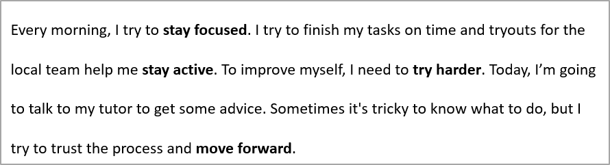

## **개요**

이 문서는 Java를 통해 PHP용 Aspose.Slides를 사용하여 PowerPoint 및 OpenDocument 프레젠테이션의 텍스트를 서식 지정하는 방법을 보여줍니다. 배경 색상, 투명도, 문자 간격, 글꼴 속성, 회전, 단락 간격, 자동 맞춤 동작, 텍스트 고정, 탭 정지 및 언어 설정을 다룹니다.

Unless stated otherwise, the examples use [sample.pptx](sample.pptx). 첫 번째 슬라이드의 첫 번째 도형은 텍스트 상자이며, 첫 번째 단락에 아래와 같은 텍스트가 포함됩니다. 슬라이드 및 도형 인덱스는 0부터 시작합니다. 굵게 표시된 부분을 선택하는 예제는 상속된 굵은 서식을 포함한 효과적인 서식을 사용합니다:


리터럴 텍스트나 정규식 매치를 찾고 강조하려면 [텍스트 검색 및 교체](/slides/ko/php-java/search-and-replace-text/)를 참조하세요.

## **텍스트 배경 색상 설정**

[ParagraphFormat::getDefaultPortionFormat](https://reference.aspose.com/slides/ko/php-java/aspose.slides/paragraphformat/#getDefaultPortionFormat) 을 사용하여 단락의 기본 강조 색을 설정하거나, 개별 텍스트 구간에 대해서는 [BasePortionFormat::getHighlightColor](https://reference.aspose.com/slides/ko/php-java/aspose.slides/baseportionformat/#getHighlightColor) 을 사용합니다.

다음 예제는 첫 번째 단락에 대해 밝은 회색 강조를 기본값으로 설정합니다. 개별 구간에 명시된 강조 색은 이 기본값보다 우선합니다:

```php
use aspose\slides\Presentation;
use aspose\slides\SaveFormat;

$presentation = new Presentation("sample.pptx");
try {
    $slide = $presentation->getSlides()->get_Item(0);

    $autoShape = $slide->getShapes()->get_Item(0);
    $paragraph = $autoShape->getTextFrame()->getParagraphs()->get_Item(0);
    $highlightColor = java("java.awt.Color")->LIGHT_GRAY;

    // 전체 단락에 대한 강조 색상을 설정합니다.
    $paragraph->getParagraphFormat()->getDefaultPortionFormat()->getHighlightColor()->setColor($highlightColor);

    $presentation->save("gray_paragraph.pptx", SaveFormat::Pptx);
} finally {
    $presentation->dispose();
}
```

결과:


아래 코드는 **굵은 글꼴이 적용된 텍스트 구간**의 배경 색을 설정하는 방법을 보여줍니다:

```php
use aspose\slides\Presentation;
use aspose\slides\SaveFormat;

$presentation = new Presentation("sample.pptx");
try {
    $slide = $presentation->getSlides()->get_Item(0);

    $autoShape = $slide->getShapes()->get_Item(0);
    $paragraph = $autoShape->getTextFrame()->getParagraphs()->get_Item(0);
    $highlightColor = java("java.awt.Color")->LIGHT_GRAY;

    $portionCount = java_values($paragraph->getPortions()->getCount());
    for ($portionIndex = 0; $portionIndex < $portionCount; $portionIndex++) {
        $portion = $paragraph->getPortions()->get_Item($portionIndex);
        if (java_values($portion->getPortionFormat()->getEffective()->getFontBold())) {
            // 텍스트 구간에 대한 강조 색상을 설정합니다.
            $portion->getPortionFormat()->getHighlightColor()->setColor($highlightColor);
        }
    }

    $presentation->save("gray_text_portions.pptx", SaveFormat::Pptx);
} finally {
    $presentation->dispose();
}
```

결과:


## **텍스트 단락 정렬**

[ParagraphFormat::setAlignment](https://reference.aspose.com/slides/ko/php-java/aspose.slides/paragraphformat/#setAlignment) 을 사용하여 텍스트 프레임 내 단락 정렬을 설정합니다. 값은 중앙, 왼쪽 정렬, 오른쪽 정렬, 양쪽 맞춤 등으로 지정할 수 있습니다.

다음 코드는 단락을 **중앙**에 정렬하는 방법을 보여줍니다:

```php
use aspose\slides\Presentation;
use aspose\slides\SaveFormat;
use aspose\slides\TextAlignment;

$presentation = new Presentation("sample.pptx");
try {
    $slide = $presentation->getSlides()->get_Item(0);

    $autoShape = $slide->getShapes()->get_Item(0);
    $paragraph = $autoShape->getTextFrame()->getParagraphs()->get_Item(0);

    // 단락의 정렬을 중앙으로 설정합니다.
    $paragraph->getParagraphFormat()->setAlignment(TextAlignment::Center);

    $presentation->save("aligned_paragraph.pptx", SaveFormat::Pptx);
} finally {
    $presentation->dispose();
}
```

결과:


## **텍스트 투명도 설정**

텍스트 투명도는 [BasePortionFormat::getFillFormat](https://reference.aspose.com/slides/ko/php-java/aspose.slides/baseportionformat/#getFillFormat) 에 할당된 색상의 알파 구성 요소를 통해 제어됩니다. 아래 예제에서 `alpha = 50` 은 0–255 범위의 ARGB 알파 채널 값이며, 투명도 퍼센트가 아닙니다.

다음 코드는 **전체 단락**에 투명도를 적용하는 방법을 보여줍니다:

```php
use aspose\slides\FillType;
use aspose\slides\Presentation;
use aspose\slides\SaveFormat;

$alpha = 50;

$presentation = new Presentation("sample.pptx");
try {
    $slide = $presentation->getSlides()->get_Item(0);

    $autoShape = $slide->getShapes()->get_Item(0);
    $paragraph = $autoShape->getTextFrame()->getParagraphs()->get_Item(0);
    $fillFormat = $paragraph->getParagraphFormat()->getDefaultPortionFormat()->getFillFormat();

    // 텍스트의 채우기 색상을 투명한 색상으로 설정합니다.
    $fillFormat->setFillType(FillType::Solid);
    $transparentColor = new Java("java.awt.Color", 0, 0, 0, $alpha);
    $fillFormat->getSolidFillColor()->setColor($transparentColor);

    $presentation->save("transparent_paragraph.pptx", SaveFormat::Pptx);
} finally {
    $presentation->dispose();
}
```

결과:


다음 코드는 **굵은 글꼴이 적용된 텍스트 구간**에 투명도를 적용하는 방법을 보여줍니다:

```php
use aspose\slides\FillType;
use aspose\slides\Presentation;
use aspose\slides\SaveFormat;

$alpha = 50;

$presentation = new Presentation("sample.pptx");
try {
    $slide = $presentation->getSlides()->get_Item(0);

    $autoShape = $slide->getShapes()->get_Item(0);
    $paragraph = $autoShape->getTextFrame()->getParagraphs()->get_Item(0);
    $transparentColor = new Java("java.awt.Color", 0, 0, 0, $alpha);

    $portionCount = java_values($paragraph->getPortions()->getCount());
    for ($portionIndex = 0; $portionIndex < $portionCount; $portionIndex++) {
        $portion = $paragraph->getPortions()->get_Item($portionIndex);
        if (java_values($portion->getPortionFormat()->getEffective()->getFontBold())) {
            // 텍스트 구간의 투명도를 설정합니다.
            $fillFormat = $portion->getPortionFormat()->getFillFormat();
            $fillFormat->setFillType(FillType::Solid);
            $fillFormat->getSolidFillColor()->setColor($transparentColor);
        }
    }

    $presentation->save("transparent_text_portions.pptx", SaveFormat::Pptx);
} finally {
    $presentation->dispose();
}
```

결과:


## **텍스트 문자 간격 설정**

[BasePortionFormat::setSpacing](https://reference.aspose.com/slides/ko/php-java/aspose.slides/baseportionformat/#setSpacing) 을 사용하여 텍스트 상자 내 문자 간격을 확장하거나 축소합니다. 예제는 3포인트 간격을 추가하며, 음수 값은 텍스트를 압축합니다.

다음 PHP 코드는 **전체 단락**의 문자 간격을 확장하는 방법을 보여줍니다:

```php
use aspose\slides\Presentation;
use aspose\slides\SaveFormat;

$presentation = new Presentation("sample.pptx");
try {
    $slide = $presentation->getSlides()->get_Item(0);

    $autoShape = $slide->getShapes()->get_Item(0);
    $paragraph = $autoShape->getTextFrame()->getParagraphs()->get_Item(0);

    // 참고: 문자 간격을 압축하려면 음수 값을 사용합니다.
    $paragraph->getParagraphFormat()->getDefaultPortionFormat()->setSpacing(3); // 문자 간격을 확장합니다.

    $presentation->save("character_spacing_in_paragraph.pptx", SaveFormat::Pptx);
} finally {
    $presentation->dispose();
}
```

결과:


다음 코드는 **굵은 글꼴이 적용된 텍스트 구간**의 문자 간격을 확장하는 방법을 보여줍니다:

```php
use aspose\slides\Presentation;
use aspose\slides\SaveFormat;

$presentation = new Presentation("sample.pptx");
try {
    $slide = $presentation->getSlides()->get_Item(0);

    $autoShape = $slide->getShapes()->get_Item(0);
    $paragraph = $autoShape->getTextFrame()->getParagraphs()->get_Item(0);

    $portionCount = java_values($paragraph->getPortions()->getCount());
    for ($portionIndex = 0; $portionIndex < $portionCount; $portionIndex++) {
        $portion = $paragraph->getPortions()->get_Item($portionIndex);
        if (java_values($portion->getPortionFormat()->getEffective()->getFontBold())) {
            // 참고: 문자 간격을 압축하려면 음수 값을 사용합니다.
            $portion->getPortionFormat()->setSpacing(3); // 문자 간격을 확장합니다.
        }
    }

    $presentation->save("character_spacing_in_text_portions.pptx", SaveFormat::Pptx);
} finally {
    $presentation->dispose();
}
```

결과:


### **특정 글꼴에 대한 커닝 비활성화**

일부 경우 Aspose.Slides가 렌더링한 텍스트가 PowerPoint에 표시되는 동일 텍스트보다 약간 더 촘촘하게 보일 수 있습니다. 이는 PowerPoint가 특정 글꼴에 대해 커닝 데이터를 무시할 수 있기 때문이며, 해당 글꼴에 유효한 커닝 정보가 있고 PowerPoint 설정에서 커닝이 활성화된 경우에도 발생합니다.

이러한 경우 렌더링 결과를 PowerPoint와 가깝게 만들려면 영향을 받는 글꼴을 사용하는 텍스트 구간에 대해 커닝을 비활성화할 수 있습니다. 실제 글꼴 크기보다 큰 값을 [BasePortionFormat::setKerningMinimalSize](https://reference.aspose.com/slides/ko/php-java/aspose.slides/baseportionformat/#setKerningMinimalSize) 에 설정하세요. 이 예제는 첫 번째 슬라이드의 첫 번째 도형이 텍스트 상자인 "presentation.pptx"가 필요합니다. 효과적인 글꼴 이름(상속된 글꼴 포함)을 확인하고 Roboto를 사용하는 구간에 대해 100포인트 임계값을 설정합니다. 이는 100포인트 미만의 글꼴 크기를 가진 일치 구간에 대한 커닝을 비활성화합니다:

```php
use aspose\slides\Presentation;
use aspose\slides\SaveFormat;

$presentation = new Presentation("presentation.pptx");
try {
    $slide = $presentation->getSlides()->get_Item(0);

    $autoShape = $slide->getShapes()->get_Item(0);
    $targetFont = "Roboto";

    $paragraphCount = java_values($autoShape->getTextFrame()->getParagraphs()->getCount());
    for ($paragraphIndex = 0; $paragraphIndex < $paragraphCount; $paragraphIndex++) {
        $paragraph = $autoShape->getTextFrame()->getParagraphs()->get_Item($paragraphIndex);
        $portionCount = java_values($paragraph->getPortions()->getCount());
        for ($portionIndex = 0; $portionIndex < $portionCount; $portionIndex++) {
            $portion = $paragraph->getPortions()->get_Item($portionIndex);
            $portionFormat = $portion->getPortionFormat()->getEffective();
            $latinFont = $portionFormat->getLatinFont();
            $eastAsianFont = $portionFormat->getEastAsianFont();
            $complexScriptFont = $portionFormat->getComplexScriptFont();

            if ((!java_is_null($latinFont) && $latinFont->getFontName() == $targetFont) ||
                (!java_is_null($eastAsianFont) && $eastAsianFont->getFontName() == $targetFont) ||
                (!java_is_null($complexScriptFont) && $complexScriptFont->getFontName() == $targetFont)) {
                $portion->getPortionFormat()->setKerningMinimalSize(100);
            }
        }
    }

    $presentation->save("output.pptx", SaveFormat::Pptx);
} finally {
    $presentation->dispose();
}
```

임계값 이하의 일치 텍스트에 대해 이 설정은 커닝을 방지하고, PowerPoint 특정 동작에 영향을 받는 글꼴에 대해 Aspose.Slides 렌더링을 PowerPoint 시각 출력과 더 가깝게 맞출 수 있습니다.

## **텍스트 글꼴 속성 관리**

글꼴 속성은 [ParagraphFormat::getDefaultPortionFormat](https://reference.aspose.com/slides/ko/php-java/aspose.slides/paragraphformat/#getDefaultPortionFormat) 을 통해 단락 수준에서 설정하거나, 개별 구간에 대해서는 [PortionFormat](https://reference.aspose.com/slides/ko/php-java/aspose.slides/portionformat/) 을 통해 설정할 수 있습니다.

다음 예제는 첫 번째 단락의 기본 글꼴을 12포인트 Times New Roman으로 설정하고 굵게, 기울임꼴 및 점선 밑줄 서식을 적용합니다. 개별 구간에 대한 명시적 서식은 이러한 기본값보다 우선합니다:

```php
use aspose\slides\FontData;
use aspose\slides\NullableBool;
use aspose\slides\Presentation;
use aspose\slides\SaveFormat;
use aspose\slides\TextUnderlineType;

$presentation = new Presentation("sample.pptx");
try {
    $slide = $presentation->getSlides()->get_Item(0);

    $autoShape = $slide->getShapes()->get_Item(0);
    $paragraph = $autoShape->getTextFrame()->getParagraphs()->get_Item(0);
    $defaultPortionFormat = $paragraph->getParagraphFormat()->getDefaultPortionFormat();
    $font = new FontData("Times New Roman");

    // 단락에 대한 글꼴 속성을 설정합니다.
    $defaultPortionFormat->setFontHeight(12);
    $defaultPortionFormat->setFontBold(NullableBool::True);
    $defaultPortionFormat->setFontItalic(NullableBool::True);
    $defaultPortionFormat->setFontUnderline(TextUnderlineType::Dotted);
    $defaultPortionFormat->setLatinFont($font);

    $presentation->save("font_properties_for_paragraph.pptx", SaveFormat::Pptx);
} finally {
    $presentation->dispose();
}
```

결과:


다음 예제는 효과적인 서식이 굵게인 구간에 대해 13포인트 Times New Roman, 기울임꼴 및 점선 밑줄을 적용합니다:

```php
use aspose\slides\FontData;
use aspose\slides\NullableBool;
use aspose\slides\Presentation;
use aspose\slides\SaveFormat;
use aspose\slides\TextUnderlineType;

$presentation = new Presentation("sample.pptx");
try {
    $slide = $presentation->getSlides()->get_Item(0);

    $autoShape = $slide->getShapes()->get_Item(0);
    $paragraph = $autoShape->getTextFrame()->getParagraphs()->get_Item(0);
    $font = new FontData("Times New Roman");

    $portionCount = java_values($paragraph->getPortions()->getCount());
    for ($portionIndex = 0; $portionIndex < $portionCount; $portionIndex++) {
        $portion = $paragraph->getPortions()->get_Item($portionIndex);
        if (java_values($portion->getPortionFormat()->getEffective()->getFontBold())) {
            // 텍스트 구간에 대한 글꼴 속성을 설정합니다.
            $portionFormat = $portion->getPortionFormat();
            $portionFormat->setFontHeight(13);
            $portionFormat->setFontItalic(NullableBool::True);
            $portionFormat->setFontUnderline(TextUnderlineType::Dotted);
            $portionFormat->setLatinFont($font);
        }
    }

    $presentation->save("font_properties_for_text_portions.pptx", SaveFormat::Pptx);
} finally {
    $presentation->dispose();
}
```

결과:


## **텍스트 회전 설정**

[TextFrameFormat::setTextVerticalType](https://reference.aspose.com/slides/ko/php-java/aspose.slides/textframeformat/#setTextVerticalType) 을 사용하여 도형 내 미리 정의된 텍스트 방향을 설정합니다.

다음 코드는 도형의 텍스트 방향을 [TextVerticalType::Vertical270](https://reference.aspose.com/slides/ko/php-java/aspose.slides/textverticaltype/) 으로 설정하는데, 이는 텍스트를 **시계 반대 방향으로 90도** 회전합니다:

```php
use aspose\slides\Presentation;
use aspose\slides\SaveFormat;
use aspose\slides\TextVerticalType;

$presentation = new Presentation("sample.pptx");
try {
    $slide = $presentation->getSlides()->get_Item(0);

    $autoShape = $slide->getShapes()->get_Item(0);
    $autoShape->getTextFrame()->getTextFrameFormat()->setTextVerticalType(TextVerticalType::Vertical270);

    $presentation->save("text_rotation.pptx", SaveFormat::Pptx);
} finally {
    $presentation->dispose();
}
```

결과:


## **텍스트 프레임 사용자 정의 회전 설정**

[TextFrameFormat::setRotationAngle](https://reference.aspose.com/slides/ko/php-java/aspose.slides/textframeformat/#setRotationAngle) 을 사용하여 [TextFrame](https://reference.aspose.com/slides/ko/php-java/aspose.slides/textframe/) 의 사용자 정의 회전 각도를 설정합니다.

다음 예제는 도형 내 텍스트 프레임을 **시계 방향으로 3도** 회전합니다:

```php
use aspose\slides\Presentation;
use aspose\slides\SaveFormat;

$presentation = new Presentation("sample.pptx");
try {
    $slide = $presentation->getSlides()->get_Item(0);

    $autoShape = $slide->getShapes()->get_Item(0);
    $autoShape->getTextFrame()->getTextFrameFormat()->setRotationAngle(3);

    $presentation->save("custom_text_rotation.pptx", SaveFormat::Pptx);
} finally {
    $presentation->dispose();
}
```

결과:


## **단락 줄 간격 설정**

Aspose.Slides는 [ParagraphFormat::setSpaceAfter](https://reference.aspose.com/slides/ko/php-java/aspose.slides/paragraphformat/#setSpaceAfter), [ParagraphFormat::setSpaceBefore](https://reference.aspose.com/slides/ko/php-java/aspose.slides/paragraphformat/#setSpaceBefore), 및 [ParagraphFormat::setSpaceWithin](https://reference.aspose.com/slides/ko/php-java/aspose.slides/paragraphformat/#setSpaceWithin) 을 제공하여 단락 간격을 제어합니다. 이러한 속성은 다음과 같이 사용됩니다:

* 양수 값을 사용하여 줄 높이의 백분율로 줄 간격을 지정합니다.
* 음수 값을 사용하여 포인트 단위로 줄 간격을 지정합니다.

다음 예제는 첫 번째 단락의 내부 간격을 줄 높이의 200% (두 배 간격) 로 설정합니다:

```php
use aspose\slides\Presentation;
use aspose\slides\SaveFormat;

$presentation = new Presentation("sample.pptx");
try {
    $slide = $presentation->getSlides()->get_Item(0);

    $autoShape = $slide->getShapes()->get_Item(0);

    $paragraph = $autoShape->getTextFrame()->getParagraphs()->get_Item(0);
    $paragraph->getParagraphFormat()->setSpaceWithin(200);

    $presentation->save("line_spacing.pptx", SaveFormat::Pptx);
} finally {
    $presentation->dispose();
}
```

결과:



## **줄 바꿈 제어**

단락 줄 바꿈 규칙은 좁은 텍스트 블록 및 라틴어와 동아시아 텍스트가 혼합된 프레젠테이션에서 유용합니다. 다음 메서드는 [ParagraphFormat](https://reference.aspose.com/slides/ko/php-java/aspose.slides/paragraphformat/) 에 속하므로 전체 단락에 적용됩니다:

- [setLatinLineBreak](https://reference.aspose.com/slides/ko/php-java/aspose.slides/paragraphformat/#setLatinLineBreak) 은 라틴어 줄 바꿈 규칙을 제어합니다. 혼합 텍스트에서는 이 설정을 변경하면 인접한 동아시아 텍스트와 구두점이 줄 바꿈되는 위치도 변경될 수 있습니다.
- [setEastAsianLineBreak](https://reference.aspose.com/slides/ko/php-java/aspose.slides/paragraphformat/#setEastAsianLineBreak) 은 동아시아 줄 바꿈 규칙을 제어하며, 줄 시작 및 끝에 허용되는 문자에 대한 제한을 포함합니다.

이 규칙들은 자동 줄 바꿈을 활성화하는 [TextFrameFormat::setWrapText](https://reference.aspose.com/slides/ko/php-java/aspose.slides/textframeformat/#setWrapText) 을 대체하지 않으며, 줄 바꿈이 발생할 때 레이아웃에 영향을 주지만 줄 바꿈 문자를 삽입하지는 않습니다. 명시적인 줄 바꿈은 가용 너비와 무관하게 단락 내에 새 줄을 강제합니다.

다음 자체 포함 예제는 중국어와 라틴어 텍스트가 포함된 좁은 텍스트 블록을 생성합니다. 두 줄 바꿈 옵션을 명시적으로 설정하고 "line_breaking.pptx" 로 저장합니다. 규칙 중 하나를 실험하려면 다른 설정은 그대로 두고 해당 값을 변경하십시오. 예제는 24포인트 Arial과 SimSun을 사용하고 프레임 너비를 160포인트, 가로 텍스트 프레임 여백을 0으로 설정합니다. [TextFrameFormat::setAutofitType](https://reference.aspose.com/slides/ko/php-java/aspose.slides/textframeformat/#setAutofitType) 은 [TextAutofitType::None](https://reference.aspose.com/slides/ko/php-java/aspose.slides/textautofittype/) 로 호출되어 텍스트 크기와 프레임 크기가 고정됩니다.

```php
use aspose\slides\FillType;
use aspose\slides\FontData;
use aspose\slides\NullableBool;
use aspose\slides\Presentation;
use aspose\slides\SaveFormat;
use aspose\slides\ShapeType;
use aspose\slides\TextAlignment;
use aspose\slides\TextAutofitType;

$presentation = new Presentation();
try {
    $slide = $presentation->getSlides()->get_Item(0);

    $shape = $slide->getShapes()->addAutoShape(ShapeType::Rectangle, 50, 50, 160, 300);
    $shape->getFillFormat()->setFillType(FillType::NoFill);

    $textFrame = $shape->getTextFrame();
    $textFrame->getTextFrameFormat()->setWrapText(NullableBool::True);
    $textFrame->getTextFrameFormat()->setAutofitType(TextAutofitType::None);
    $textFrame->getTextFrameFormat()->setMarginLeft(0);
    $textFrame->getTextFrameFormat()->setMarginRight(0);

    $paragraph = $textFrame->getParagraphs()->get_Item(0);
    $paragraph->setText("中文排版测试，PowerPoint 中文演示。");

    $format = $paragraph->getParagraphFormat();
    $format->setAlignment(TextAlignment::Left);
    $format->getDefaultPortionFormat()->setFontHeight(24);
    $latinFont = new FontData("Arial");
    $format->getDefaultPortionFormat()->setLatinFont($latinFont);
    $eastAsianFont = new FontData("SimSun");
    $format->getDefaultPortionFormat()->setEastAsianFont($eastAsianFont);
    $format->getDefaultPortionFormat()->getFillFormat()->setFillType(FillType::Solid);
    $blackColor = java("java.awt.Color")->BLACK;
    $format->getDefaultPortionFormat()->getFillFormat()->getSolidFillColor()->setColor($blackColor);
    $format->setLatinLineBreak(NullableBool::False);
    $format->setEastAsianLineBreak(NullableBool::True);

    $presentation->save("line_breaking.pptx", SaveFormat::Pptx);
} finally {
    $presentation->dispose();
}
```

## **걸려 있는 구두점 제어**

[ParagraphFormat::setHangingPunctuation](https://reference.aspose.com/slides/ko/php-java/aspose.slides/paragraphformat/#setHangingPunctuation) 은 적격 구두점이 다음 줄 대신 텍스트 라인의 오른쪽 가장자리를 넘어 확장되도록 합니다. 전체 단락에 적용되며, 걸려 있는 들여쓰기와는 다릅니다.

다음 자체 포함 예제는 100포인트 너비 텍스트 프레임에서 걸려 있는 구두점을 활성화하고 "hanging_punctuation.pptx" 로 저장합니다. 24포인트 Arial과 가로 텍스트 프레임 여백이 0인 경우, 마지막 마침표가 "sentence" 뒤에 남아 오른쪽 텍스트 가장자를 넘어갑니다. 속성을 [NullableBool::False](https://reference.aspose.com/slides/ko/php-java/aspose.slides/nullablebool/) 로 설정하면 마침표가 별도 라인에 배치됩니다. 가로 너비를 고정하기 위해 자동 줄 바꿈을 활성화하고 자동 맞춤을 비활성화했습니다.

```php
use aspose\slides\FillType;
use aspose\slides\FontData;
use aspose\slides\NullableBool;
use aspose\slides\Presentation;
use aspose\slides\SaveFormat;
use aspose\slides\ShapeType;
use aspose\slides\TextAlignment;
use aspose\slides\TextAutofitType;

$presentation = new Presentation();
try {
    $slide = $presentation->getSlides()->get_Item(0);

    $shape = $slide->getShapes()->addAutoShape(ShapeType::Rectangle, 50, 50, 100, 200);
    $shape->getFillFormat()->setFillType(FillType::NoFill);

    $textFrame = $shape->getTextFrame();
    $textFrame->getTextFrameFormat()->setWrapText(NullableBool::True);
    $textFrame->getTextFrameFormat()->setAutofitType(TextAutofitType::None);
    $textFrame->getTextFrameFormat()->setMarginLeft(0);
    $textFrame->getTextFrameFormat()->setMarginRight(0);

    $paragraph = $textFrame->getParagraphs()->get_Item(0);
    $paragraph->setText("Simple text, next sentence.");

    $format = $paragraph->getParagraphFormat();
    $format->setAlignment(TextAlignment::Left);
    $format->getDefaultPortionFormat()->setFontHeight(24);
    $latinFont = new FontData("Arial");
    $format->getDefaultPortionFormat()->setLatinFont($latinFont);
    $format->getDefaultPortionFormat()->getFillFormat()->setFillType(FillType::Solid);
    $blackColor = java("java.awt.Color")->BLACK;
    $format->getDefaultPortionFormat()->getFillFormat()->getSolidFillColor()->setColor($blackColor);
    $format->setHangingPunctuation(NullableBool::True);

    $presentation->save("hanging_punctuation.pptx", SaveFormat::Pptx);
} finally {
    $presentation->dispose();
}
```

모든 구두점이 걸릴 수 있는 것은 아닙니다. 표시 결과는 글꼴 가용성 및 레이아웃에 따라 달라집니다. 글꼴, 사용 가능한 너비, 여백 또는 자동 맞춤 설정을 변경하면 가시적인 차이가 사라질 수 있습니다.

## **텍스트 프레임 자동 맞춤 유형 설정**

[TextFrameFormat::setAutofitType](https://reference.aspose.com/slides/ko/php-java/aspose.slides/textframeformat/#setAutofitType) 은 텍스트가 컨테이너 경계를 초과할 때 동작 방식을 결정합니다. 텍스트가 축소, 넘침, 또는 도형이 자동으로 크기 조정되는지 제어할 수 있습니다. 다음 예제는 도형이 텍스트에 맞게 크기를 조정하도록 구성하고 결과를 "autofit_type.pptx" 로 저장합니다.

```php
use aspose\slides\Presentation;
use aspose\slides\SaveFormat;
use aspose\slides\TextAutofitType;

$presentation = new Presentation("sample.pptx");
try {
    $slide = $presentation->getSlides()->get_Item(0);

    $autoShape = $slide->getShapes()->get_Item(0);
    $autoShape->getTextFrame()->getTextFrameFormat()->setAutofitType(TextAutofitType::Shape);

    $presentation->save("autofit_type.pptx", SaveFormat::Pptx);
} finally {
    $presentation->dispose();
}
```

자동 줄 바꿈 후 라인 수를 계산하고 텍스트 또는 도형 너비 변경이 결과에 어떤 영향을 미치는지 확인하려면 [렌더링된 라인 수 계산](/slides/ko/php-java/manage-paragraph/)을 참조하세요. 라인 수만으로는 텍스트가 컨테이너를 초과했는지 여부를 판단할 수 없습니다.

## **텍스트 프레임 앵커 설정**

[TextFrameFormat::setAnchoringType](https://reference.aspose.com/slides/ko/php-java/aspose.slides/textframeformat/#setAnchoringType) 은 텍스트가 도형 내부에서 수직으로 어디에 배치될지를 정의합니다(예: 상단, 중간, 하단). 다음 예제는 텍스트를 첫 번째 도형의 하단에 고정하고 결과를 "text_anchor.pptx" 로 저장합니다.

```php
use aspose\slides\Presentation;
use aspose\slides\SaveFormat;
use aspose\slides\TextAnchorType;

$presentation = new Presentation("sample.pptx");
try {
    $slide = $presentation->getSlides()->get_Item(0);

    $autoShape = $slide->getShapes()->get_Item(0);
    $autoShape->getTextFrame()->getTextFrameFormat()->setAnchoringType(TextAnchorType::Bottom);

    $presentation->save("text_anchor.pptx", SaveFormat::Pptx);
} finally {
    $presentation->dispose();
}
```

## **텍스트 탭 설정**

[ParagraphFormat::setDefaultTabSize](https://reference.aspose.com/slides/ko/php-java/aspose.slides/paragraphformat/#setDefaultTabSize) 와 [ParagraphFormat::getTabs](https://reference.aspose.com/slides/ko/php-java/aspose.slides/paragraphformat/#getTabs) 을 사용하여 단락의 탭 정지를 구성합니다. 다음 예제는 기본 탭 간격을 100포인트로 설정하고 30포인트에 왼쪽 정렬 탭 정지를 추가합니다. 이러한 설정은 탭 문자를 포함하는 텍스트에 영향을 줍니다.

```php
use aspose\slides\Presentation;
use aspose\slides\SaveFormat;
use aspose\slides\TabAlignment;

$presentation = new Presentation("sample.pptx");
try {
    $slide = $presentation->getSlides()->get_Item(0);

    $autoShape = $slide->getShapes()->get_Item(0);

    $paragraph = $autoShape->getTextFrame()->getParagraphs()->get_Item(0);
    $paragraph->getParagraphFormat()->setDefaultTabSize(100);
    $paragraph->getParagraphFormat()->getTabs()->add(30, TabAlignment::Left);

    $presentation->save("paragraph_tabs.pptx", SaveFormat::Pptx);
} finally {
    $presentation->dispose();
}
```

결과:


## **맞춤법 검사 언어 설정**

Aspose.Slides는 [BasePortionFormat::setLanguageId](https://reference.aspose.com/slides/ko/php-java/aspose.slides/baseportionformat/#setLanguageId) 를 제공하여 텍스트 구간의 맞춤법 검사 언어를 설정할 수 있습니다. 맞춤법 검사 언어는 PowerPoint에서 맞춤법 및 문법 검사를 수행할 때 사용할 언어를 결정합니다.

다음 예제는 첫 번째 슬라이드의 첫 번째 도형에 텍스트 상자가 있는 "presentation.pptx" 가 필요합니다. 첫 번째 단락의 내용을 "1。" 로 교체하고, 글꼴을 SimSun 으로 설정한 뒤, 간체 중국어 맞춤법 검사 언어(`zh-CN`)를 지정합니다. 결과는 "proofing_language.pptx" 로 저장됩니다:

```php
use aspose\slides\FontData;
use aspose\slides\Portion;
use aspose\slides\Presentation;
use aspose\slides\SaveFormat;

$presentation = new Presentation("presentation.pptx");
try {
    $slide = $presentation->getSlides()->get_Item(0);

    $autoShape = $slide->getShapes()->get_Item(0);

    $paragraph = $autoShape->getTextFrame()->getParagraphs()->get_Item(0);
    $paragraph->getPortions()->clear();

    $font = new FontData("SimSun");

    $textPortion = new Portion();
    $textPortion->getPortionFormat()->setComplexScriptFont($font);
    $textPortion->getPortionFormat()->setEastAsianFont($font);
    $textPortion->getPortionFormat()->setLatinFont($font);

    // 교정 언어의 ID를 설정합니다.
    $textPortion->getPortionFormat()->setLanguageId("zh-CN");

    $textPortion->setText("1。");
    $paragraph->getPortions()->add($textPortion);

    $presentation->save("proofing_language.pptx", SaveFormat::Pptx);
} finally {
    $presentation->dispose();
}
```

## **기본 언어 설정**

[LoadOptions::setDefaultTextLanguage](https://reference.aspose.com/slides/ko/php-java/aspose.slides/loadoptions/#setDefaultTextLanguage) 을 사용하여 프레젠테이션을 로드하거나 생성할 때 텍스트의 기본 언어를 정의합니다. 다음 예제는 기본 텍스트 언어를 미국 영어로 설정한 프레젠테이션을 만든 뒤 텍스트 상자를 추가하고 첫 번째 텍스트 구간의 언어를 `en-US` 로 출력합니다.

```php
use aspose\slides\LoadOptions;
use aspose\slides\Presentation;
use aspose\slides\ShapeType;

$loadOptions = new LoadOptions();
$loadOptions->setDefaultTextLanguage("en-US");

$presentation = new Presentation($loadOptions);
try {
    $slide = $presentation->getSlides()->get_Item(0);

    // 새 사각형 도형을 텍스트와 함께 추가합니다.
    $shape = $slide->getShapes()->addAutoShape(ShapeType::Rectangle, 20, 20, 150, 50);
    $shape->getTextFrame()->setText("Sample text");

    // 첫 번째 구간의 언어를 확인합니다.
    $portion = $shape->getTextFrame()->getParagraphs()->get_Item(0)->getPortions()->get_Item(0);
    echo $portion->getPortionFormat()->getLanguageId();
} finally {
    $presentation->dispose();
}
```

## **기본 텍스트 스타일 설정**

프레젠테이션 수준에서 기본 텍스트 서식을 적용하려면 [Presentation::getDefaultTextStyle](https://reference.aspose.com/slides/ko/php-java/aspose.slides/presentation/#getDefaultTextStyle) 을 사용합니다.

다음 예제는 새 프레젠테이션의 최상위 단락에 대해 14포인트 굵은 글꼴을 기본값으로 설정하고 이를 "default_text_style.pptx" 로 저장합니다. 텍스트는 더 구체적인 서식이 없으면 이러한 기본값을 상속받습니다.

```php
use aspose\slides\NullableBool;
use aspose\slides\Presentation;
use aspose\slides\SaveFormat;

$presentation = new Presentation();
try {
    // 최상위 수준 단락 형식을 가져옵니다.
    $paragraphFormat = $presentation->getDefaultTextStyle()->getLevel(0);

    if (!java_is_null($paragraphFormat)) {
        $paragraphFormat->getDefaultPortionFormat()->setFontHeight(14);
        $paragraphFormat->getDefaultPortionFormat()->setFontBold(NullableBool::True);
    }

    $presentation->save("default_text_style.pptx", SaveFormat::Pptx);
} finally {
    $presentation->dispose();
}
```

## **All-Caps 효과가 적용된 텍스트 추출**

PowerPoint에서 **All Caps** 글꼴 효과를 적용하면 슬라이드에 표시될 때 텍스트가 대문자로 보이지만, Aspose.Slides 로 해당 텍스트 구간을 가져오면 입력된 그대로 반환됩니다. 표시된 텍스트와 일치시키려면 [TextCapType](https://reference.aspose.com/slides/ko/php-java/aspose.slides/textcaptype/) 을 확인하고 값이 `All` 인 경우 반환 문자열을 대문자로 변환하십시오.

이 예제는 첫 번째 슬라이드의 첫 번째 도형에 텍스트 상자가 있는 "sample2.pptx" 가 필요합니다. 첫 번째 단락의 첫 번째 구간에 All Caps 효과가 적용된 "Hello, Aspose!" 가 포함되어 있습니다.


아래 코드는 **All Caps** 효과가 적용된 텍스트를 추출하는 방법을 보여줍니다:

```php
use aspose\slides\Presentation;
use aspose\slides\TextCapType;

$presentation = new Presentation("sample2.pptx");
try {
    $slide = $presentation->getSlides()->get_Item(0);
    
    $autoShape = $slide->getShapes()->get_Item(0);
    $textPortion = $autoShape->getTextFrame()->getParagraphs()->get_Item(0)->getPortions()->get_Item(0);

    $originalText = $textPortion->getText();
    echo "Original text: ", $originalText, "\n";

    $textFormat = $textPortion->getPortionFormat()->getEffective();
    if (java_values($textFormat->getTextCapType()) === TextCapType::All) {
        $text = strtoupper($originalText);
        echo "All-Caps effect: ", $text, "\n";
    }
} finally {
    $presentation->dispose();
}
```

Output:

```text
Original text: Hello, Aspose!
All-Caps effect: HELLO, ASPOSE!
```

## **FAQ**

**슬라이드의 표에서 텍스트를 수정하려면 어떻게 해야 합니까?**

슬라이드의 표에서 텍스트를 수정하려면 [Table](https://reference.aspose.com/slides/ko/php-java/aspose.slides/table/) 을 사용하십시오. 셀을 반복하면서 각 셀을 [Cell::getTextFrame](https://reference.aspose.com/slides/ko/php-java/aspose.slides/cell/#getTextFrame) 로 업데이트하고, [Paragraph::getParagraphFormat](https://reference.aspose.com/slides/ko/php-java/aspose.slides/paragraph/#getParagraphFormat) 로 단락 서식을 업데이트합니다.

**PowerPoint 슬라이드의 텍스트에 그라데이션 색을 적용하려면 어떻게 해야 합니까?**

텍스트에 그라데이션 색을 적용하려면 [BasePortionFormat::getFillFormat](https://reference.aspose.com/slides/ko/php-java/aspose.slides/baseportionformat/#getFillFormat) 를 사용하십시오. [FillFormat::setFillType](https://reference.aspose.com/slides/ko/php-java/aspose.slides/fillformat/#setFillType) 을 [FillType::Gradient](https://reference.aspose.com/slides/ko/php-java/aspose.slides/filltype/) 로 설정하고 그라데이션 스톱, 방향 및 투명도를 구성합니다.