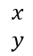

## **개요**

PowerPoint은 방정식을 Office Math Markup Language(OMML)로 저장합니다. Aspose.Slides for PHP via Java를 사용하면 프로그래밍 방식으로 동일한 종류의 수학 콘텐츠를 만들 수 있습니다: 분수, 근호, 함수, 극한, N-ary 연산자, 행렬, 배열 및 서식이 지정된 수학 블록.

PowerPoint에서 사용자는 일반적으로 **Insert > Equation**에서 수식을 추가합니다:


그 결과는 슬라이드에 편집 가능한 수학 텍스트가 됩니다:


Aspose.Slides는 세 개의 주요 객체를 통해 해당 수학 텍스트를 구축합니다:

- 수학 도형은 [addMathShape](https://reference.aspose.com/slides/ko/php-java/aspose.slides/shapecollection/#addMathShape)으로 생성되며, 방정식을 포함하는 도형입니다.
- [MathPortion](https://reference.aspose.com/slides/ko/php-java/aspose.slides/mathportion/)은 도형 텍스트 프레임 내부에 수학 콘텐츠를 저장합니다.
- [MathParagraph](https://reference.aspose.com/slides/ko/php-java/aspose.slides/mathparagraph/)은 하나 이상의 [MathBlock](https://reference.aspose.com/slides/ko/php-java/aspose.slides/mathblock/) 객체를 포함합니다.

아래 대부분의 예제는 [MathematicalText](https://reference.aspose.com/slides/ko/php-java/aspose.slides/mathematicaltext/)와 [MathElementBase](https://reference.aspose.com/slides/ko/php-java/aspose.slides/mathelementbase/)의 유창한 메서드를 사용하여 코드를 간결하고 읽기 쉽게 유지합니다.

MathML 내보내기 시나리오에 대해서는 [PHP via Java에서 프레젠테이션의 수식 내보내기](/slides/ko/php-java/exporting-math-equations/)를 참조하십시오.

## **방정식 만들기**

이 예제는 수학 도형을 만들고 피타고라스 정리를 추가합니다:


```php
$presentation = new Presentation();
try {
    $slide = $presentation->getSlides()->get_Item(0);

    $mathShape = $slide->getShapes()->addMathShape(20, 20, 700, 120);
    $mathParagraph = $mathShape->getTextFrame()->getParagraphs()
        - >get_Item(0)->getPortions()->get_Item(0)->getMathParagraph();

    $equation = (new MathematicalText("c"))
        - >setSuperscript("2")
        - >join("=")
        - >join((new MathematicalText("a"))->setSuperscript("2"))
        - >join("+")
        - >join((new MathematicalText("b"))->setSuperscript("2"));

    $mathParagraph->add($equation);

    $presentation->save("pythagorean-theorem.pptx", SaveFormat::Pptx);
} finally {
    if (!java_is_null($presentation)) {
        $presentation->dispose();
    }
}
```

{}
`addMathShape`는 이미 수학 단락을 포함하는 도형을 생성합니다. 첫 번째 `MathPortion`에 접근하고, 해당 `MathParagraph`를 가져온 다음 수학 블록이나 수학 요소를 추가합니다.
{}

## **분수 추가**

[`divide`](https://reference.aspose.com/slides/ko/php-java/aspose.slides/mathelementbase/)를 사용하여 분수를 만들 수 있습니다. [MathFractionTypes](https://reference.aspose.com/slides/ko/php-java/aspose.slides/mathfractiontypes/)를 사용하여 분수 스타일을 선택할 수 있습니다.


```php
$presentation = new Presentation();
try {
    $slide = $presentation->getSlides()->get_Item(0);

    $mathShape = $slide->getShapes()->addMathShape(20, 20, 700, 100);
    $mathParagraph = $mathShape->getTextFrame()->getParagraphs()
        - >get_Item(0)->getPortions()->get_Item(0)->getMathParagraph();

    $fraction = (new MathematicalText("1"))
        - >divide("x", MathFractionTypes::Skewed);

    $mathParagraph->add(new MathBlock($fraction));

    $presentation->save("fraction.pptx", SaveFormat::Pptx);
} finally {
    if (!java_is_null($presentation)) {
        $presentation->dispose();
    }
}
```

쌓인 분수를 위해서는 `MathFractionTypes::Bar`를 사용합니다:

```php
$stackedFraction = (new MathematicalText("x + 1"))->divide("y - 1", MathFractionTypes::Bar);
```

## **근호 추가**

[`radical`](https://reference.aspose.com/slides/ko/php-java/aspose.slides/mathelementbase/)를 사용하여 제곱근, 세제곱근 또는 기타 근을 만들 수 있습니다. 현재 요소가 밑이 되고, 인수가 차수가 됩니다.


```php
$presentation = new Presentation();
try {
    $slide = $presentation->getSlides()->get_Item(0);

    $mathShape = $slide->getShapes()->addMathShape(20, 20, 700, 100);
    $mathParagraph = $mathShape->getTextFrame()->getParagraphs()
        - >get_Item(0)->getPortions()->get_Item(0)->getMathParagraph();

    $radical = (new MathematicalText("x"))
        - >radical("n");

    $mathParagraph->add(new MathBlock($radical));

    $presentation->save("radical.pptx", SaveFormat::Pptx);
} finally {
    if (!java_is_null($presentation)) {
        $presentation->dispose();
    }
}
```

## **함수 및 극한 추가**

[`asArgumentOfFunction`](https://reference.aspose.com/slides/ko/php-java/aspose.slides/mathelementbase/) 또는 [`function`](https://reference.aspose.com/slides/ko/php-java/aspose.slides/mathelementbase/)를 사용하여 `sin(x)`, `log(x)`와 같은 함수 또는 사용자 정의 함수 이름을 지정합니다. 극한의 경우 `lim`을 [MathLimit](https://reference.aspose.com/slides/ko/php-java/aspose.slides/mathlimit/)에 넣거나 [`setLowerLimit`](https://reference.aspose.com/slides/ko/php-java/aspose.slides/mathelementbase/)를 사용합니다.


```php
$presentation = new Presentation();
try {
    $slide = $presentation->getSlides()->get_Item(0);

    $mathShape = $slide->getShapes()->addMathShape(20, 20, 700, 100);
    $mathParagraph = $mathShape->getTextFrame()->getParagraphs()
        - >get_Item(0)->getPortions()->get_Item(0)->getMathParagraph();

    $limit = (new MathematicalText("lim"))
        - >setLowerLimit("x\u{2192}\u{221E}")
        - >function("x");

    $mathParagraph->add(new MathBlock($limit));

    $presentation->save("functions-and-limits.pptx", SaveFormat::Pptx);
} finally {
    if (!java_is_null($presentation)) {
        $presentation->dispose();
    }
}
```

사용자 정의 함수 이름의 경우, 함수 이름을 현재 요소로 만듭니다:

```php
$customFunction = (new MathematicalText("f"))->function("x + 1");
```

## **N-ary 연산자 및 적분 추가**

[`nary`](https://reference.aspose.com/slides/ko/php-java/aspose.slides/mathelementbase/)를 사용하여 합계, 합집합, 교집합 및 기타 큰 연산자를 만들 수 있습니다. `[`integral`](https://reference.aspose.com/slides/ko/php-java/aspose.slides/mathelementbase/)`를 사용하여 적분을 만들 수 있습니다. 두 메서드 모두 하한 및 상한을 설정할 수 있습니다.


```php
$presentation = new Presentation();
try {
    $slide = $presentation->getSlides()->get_Item(0);

    $mathShape = $slide->getShapes()->addMathShape(20, 20, 700, 120);
    $mathParagraph = $mathShape->getTextFrame()->getParagraphs()
        - >get_Item(0)->getPortions()->get_Item(0)->getMathParagraph();

    $summationBase = (new MathematicalText("x"))
        - >setSuperscript("k")
        - >join((new MathematicalText("a"))->setSuperscript("n-k"));

    $summation = $summationBase->nary(MathNaryOperatorTypes::Summation, "k=0", "n");

    $mathParagraph->add(new MathBlock($summation));

    $presentation->save("nary-operators.pptx", SaveFormat::Pptx);
} finally {
    if (!java_is_null($presentation)) {
        $presentation->dispose();
    }
}
```

N-ary 연산자는 선택적 한계가 있는 큰 연산자를 위한 것입니다. `+`, `-`, `=`와 같은 간단한 연산자는 일반적으로 `MathematicalText`로 추가되고 식에 연결됩니다.

적분을 위해서는 `integral`을 사용합니다:

```php
$integralBase = (new MathematicalText("x"))->join((new MathematicalText("dx"))->toBox());
$integral = $integralBase->integral(MathIntegralTypes::Simple, "0", "1");
```

## **행렬 추가**

[MathMatrix](https://reference.aspose.com/slides/ko/php-java/aspose.slides/mathmatrix/)를 사용하여 행과 열을 만듭니다. 행렬은 기본적으로 괄호를 포함하지 않으므로 괄호, 대괄호 또는 중괄호가 필요할 때 행렬을 감싸야 합니다.


```php
$presentation = new Presentation();
try {
    $slide = $presentation->getSlides()->get_Item(0);

    $mathShape = $slide->getShapes()->addMathShape(20, 20, 700, 120);
    $mathParagraph = $mathShape->getTextFrame()->getParagraphs()
        - >get_Item(0)->getPortions()->get_Item(0)->getMathParagraph();

    $matrix = new MathMatrix(2, 3);
    $matrix->set_Item(0, 0, new MathematicalText("1"));
    $matrix->set_Item(0, 1, new MathematicalText("x"));
    $matrix->set_Item(1, 0, new MathematicalText("x"));
    $matrix->set_Item(1, 1, new MathematicalText("2"));
    $matrix->set_Item(1, 2, new MathematicalText("y"));

    $mathParagraph->add(new MathBlock($matrix));

    $presentation->save("matrix.pptx", SaveFormat::Pptx);
} finally {
    if (!java_is_null($presentation)) {
        $presentation->dispose();
    }
}
```

## **방정식 배열 추가**

[`toMathArray`](https://reference.aspose.com/slides/ko/php-java/aspose.slides/mathelementbase/)를 사용하여 정렬된 방정식이나 수식의 수직 스택이 필요할 때 사용합니다.



```php
$presentation = new Presentation();
try {
    $slide = $presentation->getSlides()->get_Item(0);

    $mathShape = $slide->getShapes()->addMathShape(20, 20, 700, 140);
    $mathParagraph = $mathShape->getTextFrame()->getParagraphs()
        - >get_Item(0)->getPortions()->get_Item(0)->getMathParagraph();

    $equationArray = (new MathematicalText("x"))
        - >join("y")
        - >toMathArray();

    $mathParagraph->add(new MathBlock($equationArray));

    $presentation->save("equation-array.pptx", SaveFormat::Pptx);
} finally {
    if (!java_is_null($presentation)) {
        $presentation->dispose();
    }
}
```

## **삼각 함수 추가**

[`asArgumentOfFunction`](https://reference.aspose.com/slides/ko/php-java/aspose.slides/mathelementbase/)를 사용하여 인수가 현재 요소이고 함수 이름이 알려진 경우에 사용합니다.


```php
$presentation = new Presentation();
try {
    $slide = $presentation->getSlides()->get_Item(0);

    $mathShape = $slide->getShapes()->addMathShape(20, 20, 700, 100);
    $mathParagraph = $mathShape->getTextFrame()->getParagraphs()
        - >get_Item(0)->getPortions()->get_Item(0)->getMathParagraph();

    $cosine = (new MathematicalText("2x"))
        - >asArgumentOfFunction(MathFunctionsOfOneArgument::Cos);

    $mathParagraph->add(new MathBlock($cosine));

    $presentation->save("trigonometric-function.pptx", SaveFormat::Pptx);
} finally {
    if (!java_is_null($presentation)) {
        $presentation->dispose();
    }
}
```

## **첨자와 위첨자 추가**

첨자와 위첨자 도우미를 사용하여 인덱스와 거듭 제곱을 지정합니다. 인덱스가 기준 요소의 왼쪽에 나타나야 할 경우 `[`setSubSuperscriptOnTheLeft`](https://reference.aspose.com/slides/ko/php-java/aspose.slides/mathelementbase/)`를 사용합니다.


```php
$presentation = new Presentation();
try {
    $slide = $presentation->getSlides()->get_Item(0);

    $mathShape = $slide->getShapes()->addMathShape(20, 20, 700, 100);
    $mathParagraph = $mathShape->getTextFrame()->getParagraphs()
        - >get_Item(0)->getPortions()->get_Item(0)->getMathParagraph();

    $scripts = (new MathematicalText("Y"))
        - >setSubSuperscriptOnTheLeft("1", "n");

    $mathParagraph->add(new MathBlock($scripts));

    $presentation->save("subscript-superscript.pptx", SaveFormat::Pptx);
} finally {
    if (!java_is_null($presentation)) {
        $presentation->dispose();
    }
}
```

## **구분자 추가**

[`enclose`](https://reference.aspose.com/slides/ko/php-java/aspose.slides/mathelementbase/)를 사용하여 구분자 안에 식을 넣습니다. 여러 요소를 포함하는 구분자 식에 대해 구분 문자도 설정할 수 있습니다.


```php
$presentation = new Presentation();
try {
    $slide = $presentation->getSlides()->get_Item(0);

    $mathShape = $slide->getShapes()->addMathShape(20, 20, 700, 100);
    $mathParagraph = $mathShape->getTextFrame()->getParagraphs()
        - >get_Item(0)->getPortions()->get_Item(0)->getMathParagraph();

    $delimiter = (new MathematicalText("x"))
        - >join("y")
        - >join("z")
        - >enclose(new Java("java.lang.Character", "<"), new Java("java.lang.Character", ">"));
    $delimiter->setSeparatorCharacter(new Java("java.lang.Character", "|"));

    $mathParagraph->add(new MathBlock($delimiter));

    $presentation->save("delimiters.pptx", SaveFormat::Pptx);
} finally {
    if (!java_is_null($presentation)) {
        $presentation->dispose();
    }
}
```

## **테두리 상자 추가**

[`toBorderBox`](https://reference.aspose.com/slides/ko/php-java/aspose.slides/mathelementbase/)를 사용하여 방정식 자체를 테두리로 둘러야 할 때 사용합니다.


```php
$presentation = new Presentation();
try {
    $slide = $presentation->getSlides()->get_Item(0);

    $mathShape = $slide->getShapes()->addMathShape(20, 20, 700, 100);
    $mathParagraph = $mathShape->getTextFrame()->getParagraphs()
        - >get_Item(0)->getPortions()->get_Item(0)->getMathParagraph();

    $boxedEquation = (new MathematicalText("a"))
        - >setSuperscript("2")
        - >join("=")
        - >join((new MathematicalText("b"))->setSuperscript("2"))
        - >join("+")
        - >join((new MathematicalText("c"))->setSuperscript("2"))
        - >toBorderBox();

    $mathParagraph->add(new MathBlock($boxedEquation));

    $presentation->save("border-box.pptx", SaveFormat::Pptx);
} finally {
    if (!java_is_null($presentation)) {
        $presentation->dispose();
    }
}
```

## **항목 그룹화**

[`group`](https://reference.aspose.com/slides/ko/php-java/aspose.slides/mathelementbase/)를 사용하여 식 위나 아래에 그룹화 문자를 배치합니다. 그룹화된 항목에 라벨을 붙이려면 한계를 추가합니다.


```php
$presentation = new Presentation();
try {
    $slide = $presentation->getSlides()->get_Item(0);

    $mathShape = $slide->getShapes()->addMathShape(20, 20, 700, 120);
    $mathParagraph = $mathShape->getTextFrame()->getParagraphs()
        - >get_Item(0)->getPortions()->get_Item(0)->getMathParagraph();

    $grouped = (new MathematicalText("x + y"))
        - >group(new Java("java.lang.Character", "\u{23DF}"), MathTopBotPositions::Bottom, MathTopBotPositions::Top)
        - >setLowerLimit("any text");

    $mathParagraph->add(new MathBlock($grouped));

    $presentation->save("grouped-terms.pptx", SaveFormat::Pptx);
} finally {
    if (!java_is_null($presentation)) {
        $presentation->dispose();
    }
}
```

## **수학 요소 서식 지정**

공식의 가독성을 높이는 경우에만 서식 도우미를 사용합니다. 예를 들어, [`overbar`](https://reference.aspose.com/slides/ko/php-java/aspose.slides/mathelementbase/)는 수학 요소 위에 막대를 표시합니다.


```php
$presentation = new Presentation();
try {
    $slide = $presentation->getSlides()->get_Item(0);

    $mathShape = $slide->getShapes()->addMathShape(20, 20, 700, 100);
    $mathParagraph = $mathShape->getTextFrame()->getParagraphs()
        - >get_Item(0)->getPortions()->get_Item(0)->getMathParagraph();

    $overbar = (new MathematicalText("ABC"))->overbar();

    $mathParagraph->add(new MathBlock($overbar));

    $presentation->save("overbar.pptx", SaveFormat::Pptx);
} finally {
    if (!java_is_null($presentation)) {
        $presentation->dispose();
    }
}
```

## **빠른 참조**

| 작업 | 주요 API |
| --- | --- |
| 수학 텍스트 만들기 | [MathematicalText](https://reference.aspose.com/slides/ko/php-java/aspose.slides/mathematicaltext/) |
| 요소 결합 | [join](https://reference.aspose.com/slides/ko/php-java/aspose.slides/mathelementbase/) |
| 분수 만들기 | [divide](https://reference.aspose.com/slides/ko/php-java/aspose.slides/mathelementbase/) |
| 위첨자 또는 첨자 추가 | [setSuperscript](https://reference.aspose.com/slides/ko/php-java/aspose.slides/mathelementbase/), [setSubscript](https://reference.aspose.com/slides/ko/php-java/aspose.slides/mathelementbase/) |
| 함수 추가 | [function](https://reference.aspose.com/slides/ko/php-java/aspose.slides/mathelementbase/), [asArgumentOfFunction](https://reference.aspose.com/slides/ko/php-java/aspose.slides/mathelementbase/) |
| 근호 추가 | [radical](https://reference.aspose.com/slides/ko/php-java/aspose.slides/mathelementbase/) |
| 극한 추가 | [setLowerLimit](https://reference.aspose.com/slides/ko/php-java/aspose.slides/mathelementbase/), [setUpperLimit](https://reference.aspose.com/slides/ko/php-java/aspose.slides/mathelementbase/) |
| 왼쪽 스크립트 추가 | [setSubSuperscriptOnTheLeft](https://reference.aspose.com/slides/ko/php-java/aspose.slides/mathelementbase/) |
| 합계와 적분 추가 | [nary](https://reference.aspose.com/slides/ko/php-java/aspose.slides/mathelementbase/), [integral](https://reference.aspose.com/slides/ko/php-java/aspose.slides/mathelementbase/) |
| 행렬 추가 | [MathMatrix](https://reference.aspose.com/slides/ko/php-java/aspose.slides/mathmatrix/) |
| 방정식 배열 추가 | [toMathArray](https://reference.aspose.com/slides/ko/php-java/aspose.slides/mathelementbase/) |
| 구분자 추가 | [enclose](https://reference.aspose.com/slides/ko/php-java/aspose.slides/mathelementbase/) |
| 막대와 테두리 추가 | [overbar](https://reference.aspose.com/slides/ko/php-java/aspose.slides/mathelementbase/), [toBorderBox](https://reference.aspose.com/slides/ko/php-java/aspose.slides/mathelementbase/) |
| 항목 그룹화 | [group](https://reference.aspose.com/slides/ko/php-java/aspose.slides/mathelementbase/) |

## **자주 묻는 질문**

**기존 PowerPoint 방정식을 편집할 수 있나요?**

예. 프레젠테이션을 열고 `MathPortion`을 포함하는 도형을 찾아 해당 `MathParagraph`를 얻은 다음, 그 단락의 수학 블록을 업데이트합니다.

**방정식이 편집 가능한 PowerPoint 수학으로 저장되나요?**

예. PPTX로 저장하면 Aspose.Slides는 방정식을 편집 가능한 Office 수학 콘텐츠로 기록합니다.

**방정식을 LaTeX로 내보낼 수 있나요?**

Aspose.Slides는 수학 방정식을 MathML로 내보냅니다. LaTeX가 필요하면 먼저 MathML로 내보낸 후, 원하는 LaTeX 방언을 지원하는 도구로 MathML을 변환하십시오.