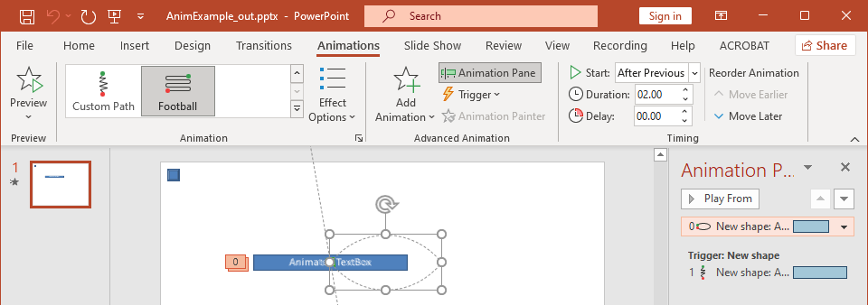

## **개요**

Aspose.Slides for PHP via Java 은 슬라이드 타임라인에서 슬라이드 애니메이션을 효과(Effect)로 나타냅니다. 효과는 대상 도형, 애니메이션 유형 및 하위 유형, 트리거, 타이밍 설정, 그리고 선택적으로 사운드나 애니메이션 후 동작과 같은 속성을 가집니다.

타임라인에는 두 가지 종류의 시퀀스가 있습니다:

- **메인 시퀀스**는 슬라이드가 진행될 때 재생됩니다.
- **인터랙티브 시퀀스**는 트리거 도형을 클릭하면 시작됩니다.

텍스트 상자, 그림, 차트, 표 및 기타 슬라이드 개체는 모두 도형이므로 대부분의 슬라이드 내용에 대해 동일한 [Sequence::addEffect](https://reference.aspose.com/slides/ko/php-java/aspose.slides/sequence/addeffect/) 메서드를 사용합니다. 사용 가능한 효과는 [EffectType](https://reference.aspose.com/slides/ko/php-java/aspose.slides/effecttype/) 클래스에 나열되어 있습니다.

## **도형 애니메이션 추가**

애니메이션을 추가하려면 슬라이드의 메인 시퀀스를 가져와 대상 도형, 효과 유형, 하위 유형 및 트리거와 함께 [Sequence::addEffect](https://reference.aspose.com/slides/ko/php-java/aspose.slides/sequence/addeffect/) 를 호출합니다. 다른 도형을 클릭했을 때 시작되는 효과를 만들려면 해당 도형을 트리거로 하는 인터랙티브 시퀀스를 생성합니다.

다음 예제는 두 종류의 애니메이션을 모두 만든 뒤 `shape-animations.pptx` 로 저장합니다.

```php
use aspose\slides\EffectSubtype;
use aspose\slides\EffectTriggerType;
use aspose\slides\EffectType;
use aspose\slides\Presentation;
use aspose\slides\SaveFormat;
use aspose\slides\ShapeType;

$presentation = new Presentation();
try {
    $slide = $presentation->getSlides()->get_Item(0);

    $targetShape = $slide->getShapes()->addAutoShape(ShapeType::RoundCornerRectangle, 120, 100, 320, 80);
    $targetShape->addTextFrame("Click to animate this shape");

    $mainSequence = $slide->getTimeline()->getMainSequence();
    $entranceEffect = $mainSequence->addEffect($targetShape, EffectType::Fade, EffectSubtype::None, EffectTriggerType::OnClick);
    $entranceEffect->getTiming()->setDuration(1.5);

    $triggerShape = $slide->getShapes()->addAutoShape(ShapeType::Bevel, 20, 20, 100, 40);
    $triggerShape->addTextFrame("Move");

    $interactiveSequence = $slide->getTimeline()->getInteractiveSequences()->add($triggerShape);
    $interactiveSequence->addEffect($targetShape, EffectType::PathFootball, EffectSubtype::None, EffectTriggerType::OnClick);

    $presentation->save("shape-animations.pptx", SaveFormat::Pptx);
} finally {
    $presentation->dispose();
}
```

트리거는 효과가 언제 시작되는지를 제어합니다:

- [EffectTriggerType::OnClick](https://reference.aspose.com/slides/ko/php-java/aspose.slides/effecttriggertype/) 은 메인 시퀀스에서는 클릭을 기다리고, 인터랙티브 시퀀스에서는 트리거 도형의 클릭을 기다립니다.
- [EffectTriggerType::WithPrevious](https://reference.aspose.com/slides/ko/php-java/aspose.slides/effecttriggertype/) 은 이전 효과와 동시에 시작합니다.
- [EffectTriggerType::AfterPrevious](https://reference.aspose.com/slides/ko/php-java/aspose.slides/effecttriggertype/) 은 이전 효과가 끝난 후 시작합니다.

그림, 차트 또는 다른 도형 유형에 애니메이션을 적용하려면 `$targetShape` 대신 해당 객체를 [Sequence::addEffect](https://reference.aspose.com/slides/ko/php-java/aspose.slides/sequence/addeffect/) 에 전달합니다. 차트 전용 그룹 옵션은 [Animated Charts](/slides/ko/php-java/animated-charts/) 를 참조하십시오.

## **도형 애니메이션 읽기**

대상 도형을 알고 있을 때는 [Sequence::getEffectsByShape](https://reference.aspose.com/slides/ko/php-java/aspose.slides/sequence/geteffectsbyshape/) 를 사용합니다. 모든 효과를 검사하려면 메인 시퀀스와 모든 인터랙티브 시퀀스를 열거합니다. 열거 방식은 시퀀스가 인덱스 `0` 에 효과를 가지고 있다고 가정하는 것을 방지합니다.

다음 예제는 메인 시퀀스와 인터랙티브 효과를 가진 도형을 만든 뒤, 해당 도형을 대상으로 하는 효과를 가져오고, 슬라이드의 모든 시퀀스를 열거합니다.

```php
use aspose\slides\EffectSubtype;
use aspose\slides\EffectTriggerType;
use aspose\slides\EffectType;
use aspose\slides\Presentation;
use aspose\slides\ShapeType;

function printSequence($label, $sequence)
{
    $effectCount = java_values($sequence->getCount());

    echo "  " . $label . ": " . $effectCount . " effect(s)" . PHP_EOL;

    for ($effectIndex = 0; $effectIndex < $effectCount; $effectIndex++) {
        $effect = $sequence->get_Item($effectIndex);
        $targetShape = $effect->getTargetShape();
        $targetName = java_is_null($targetShape) ? "unknown" : java_values($targetShape->getName());
        $effectType = java_values($effect->getType());
        $effectSubtype = java_values($effect->getSubtype());
        $triggerType = java_values($effect->getTiming()->getTriggerType());
        echo "    type: " . $effectType . "; subtype: " . $effectSubtype . "; target: " . $targetName . "; trigger: " . $triggerType . PHP_EOL;
    }
}

$presentation = new Presentation();
try {
    $slide = $presentation->getSlides()->get_Item(0);
    $targetShape = $slide->getShapes()->addAutoShape(ShapeType::Rectangle, 120, 100, 320, 80);
    $targetShape->addTextFrame("Animated shape");

    $mainSequence = $slide->getTimeline()->getMainSequence();
    $mainSequence->addEffect($targetShape, EffectType::Fade, EffectSubtype::None, EffectTriggerType::OnClick);

    $triggerShape = $slide->getShapes()->addAutoShape(ShapeType::Bevel, 20, 20, 100, 40);
    $triggerShape->addTextFrame("Move");

    $interactiveSequence = $slide->getTimeline()->getInteractiveSequences()->add($triggerShape);
    $interactiveSequence->addEffect($targetShape, EffectType::PathFootball, EffectSubtype::None, EffectTriggerType::OnClick);

    $targetEffects = $mainSequence->getEffectsByShape($targetShape);
    $Array = new JavaClass("java.lang.reflect.Array");
    echo "The main sequence contains " . java_values($Array->getLength($targetEffects)) . " effect(s) for " . java_values($targetShape->getName()) . "." . PHP_EOL;

    printSequence("Main sequence", $mainSequence);

    $interactiveSequences = $slide->getTimeline()->getInteractiveSequences();
    $interactiveCount = java_values($interactiveSequences->getCount());
    for ($interactiveIndex = 0; $interactiveIndex < $interactiveCount; $interactiveIndex++) {
        $sequence = $interactiveSequences->get_Item($interactiveIndex);
        $sequenceTrigger = $sequence->getTriggerShape();
        $triggerName = java_is_null($sequenceTrigger) ? "unknown" : java_values($sequenceTrigger->getName());
        printSequence("Interactive sequence " . ($interactiveIndex + 1) . ", trigger: " . $triggerName, $sequence);
    }
} finally {
    $presentation->dispose();
}
```

하나의 도형에 대한 효과만 필요하다면 먼저 이름, 플레이스홀더 유형 또는 다른 안정적인 속성으로 도형을 식별한 뒤 [Sequence::getEffectsByShape](https://reference.aspose.com/slides/ko/php-java/aspose.slides/sequence/geteffectsbyshape/) 를 호출하십시오. 인덱스 `0` 에 있는 [ShapeCollection::get_Item](https://reference.aspose.com/slides/ko/php-java/aspose.slides/shapecollection/get_item/) 가 항상 원하는 객체라고 가정하지 마세요.

## **상속된 플레이스홀더 효과 작업**

일반 슬라이드의 플레이스홀더는 레이아웃 슬라이드와 마스터 슬라이드에 있는 해당 플레이스홀더로부터 애니메이션 동작을 상속받을 수 있습니다. [Shape::getBasePlaceholder](https://reference.aspose.com/slides/ko/php-java/aspose.slides/shape/getbaseplaceholder/) 은 상위 플레이스홀더를 반환하거나, 상위가 없을 경우 `null` 을 반환합니다.

다음 예제 프레젠테이션에서 푸터는 일반 슬라이드에서는 **Random Bars**, 레이아웃 슬라이드에서는 **Split**, 마스터 슬라이드에서는 **Fly In** 효과를 가지고 있습니다.


다음 예제는 새 프레젠테이션의 플레이스홀더 계층을 사용합니다. 마스터 플레이스홀더, 레이아웃 플레이스홀더 및 일반 슬라이드의 해당 플레이스홀더에 효과를 추가합니다. 모든 [Shape::getBasePlaceholder](https://reference.aspose.com/slides/ko/php-java/aspose.slides/shape/getbaseplaceholder/) 호출은 반환된 도형을 사용하기 전에 검사됩니다.

```php
use aspose\slides\EffectSubtype;
use aspose\slides\EffectTriggerType;
use aspose\slides\EffectType;
use aspose\slides\Presentation;
use aspose\slides\SaveFormat;
use aspose\slides\SlideLayoutType;

function findLayoutPlaceholderWithBase($layoutSlide)
{
    $shapes = $layoutSlide->getShapes();
    $shapeCount = java_values($shapes->size());
    for ($shapeIndex = 0; $shapeIndex < $shapeCount; $shapeIndex++) {
        $shape = $shapes->get_Item($shapeIndex);
        if (!java_is_null($shape->getBasePlaceholder())) {
            return $shape;
        }
    }

    return null;
}

function findSlidePlaceholderWithBase($slide, $expectedBase)
{
    $shapes = $slide->getShapes();
    $shapeCount = java_values($shapes->size());
    for ($shapeIndex = 0; $shapeIndex < $shapeCount; $shapeIndex++) {
        $shape = $shapes->get_Item($shapeIndex);
        $basePlaceholder = $shape->getBasePlaceholder();
        if (!java_is_null($basePlaceholder) && java_values($basePlaceholder->equals($expectedBase))) {
            return $shape;
        }
    }

    return null;
}

function printEffects($source, $effects)
{
    $Array = new JavaClass("java.lang.reflect.Array");
    echo $source . ": " . java_values($Array->getLength($effects)) . " effect(s)" . PHP_EOL;

    foreach ($effects as $effect) {
        echo "  type: " . java_values($effect->getType()) . "; subtype: " . java_values($effect->getSubtype()) . PHP_EOL;
    }
}

$presentation = new Presentation();
try {
    $layoutSlide = $presentation->getLayoutSlides()->getByType(SlideLayoutType::TitleAndObject);
    $layoutPlaceholder = findLayoutPlaceholderWithBase($layoutSlide);

    if ($layoutPlaceholder === null) {
        throw new RuntimeException("The layout slide does not contain a placeholder linked to its master slide.");
    }

    $masterPlaceholder = $layoutPlaceholder->getBasePlaceholder();
    $layoutSlide->getMasterSlide()->getTimeline()->getMainSequence()->addEffect($masterPlaceholder, EffectType::Fly, EffectSubtype::Bottom, EffectTriggerType::OnClick);
    $layoutSlide->getTimeline()->getMainSequence()->addEffect($layoutPlaceholder, EffectType::Split, EffectSubtype::VerticalIn, EffectTriggerType::OnClick);

    $slide = $presentation->getSlides()->addEmptySlide($layoutSlide);
    $slidePlaceholder = findSlidePlaceholderWithBase($slide, $layoutPlaceholder);

    if ($slidePlaceholder === null) {
        throw new RuntimeException("The slide does not contain a placeholder linked to its layout slide.");
    }

    $slide->getTimeline()->getMainSequence()->addEffect($slidePlaceholder, EffectType::RandomBars, EffectSubtype::Horizontal, EffectTriggerType::OnClick);
    printEffects("Normal slide", $slide->getTimeline()->getMainSequence()->getEffectsByShape($slidePlaceholder));

    $baseLayoutPlaceholder = $slidePlaceholder->getBasePlaceholder();
    if (!java_is_null($baseLayoutPlaceholder)) {
        printEffects("Layout slide", $layoutSlide->getTimeline()->getMainSequence()->getEffectsByShape($baseLayoutPlaceholder));

        $baseMasterPlaceholder = $baseLayoutPlaceholder->getBasePlaceholder();
        if (!java_is_null($baseMasterPlaceholder)) {
            printEffects("Master slide", $layoutSlide->getMasterSlide()->getTimeline()->getMainSequence()->getEffectsByShape($baseMasterPlaceholder));
        }
    }

    $presentation->save("placeholder-animations.pptx", SaveFormat::Pptx);
} finally {
    $presentation->dispose();
}
```

## **애니메이션 타이밍 변경**

PowerPoint **Timing** 대화 상자는 [Timing](https://reference.aspose.com/slides/ko/php-java/aspose.slides/timing/) 의 속성과 매핑됩니다.



- **Start** 은 [Timing::getTriggerType](https://reference.aspose.com/slides/ko/php-java/aspose.slides/timing/gettriggertype/) 에 매핑됩니다.
- **Duration** 은 초 단위로 [Timing::getDuration](https://reference.aspose.com/slides/ko/php-java/aspose.slides/timing/getduration/) 에 매핑됩니다.
- **Delay** 은 초 단위로 [Timing::getTriggerDelayTime](https://reference.aspose.com/slides/ko/php-java/aspose.slides/timing/gettriggerdelaytime/) 에 매핑됩니다.
- **Repeat** 은 [Timing::getRepeatCount](https://reference.aspose.com/slides/ko/php-java/aspose.slides/timing/getrepeatcount/), [Timing::getRepeatUntilNextClick](https://reference.aspose.com/slides/ko/php-java/aspose.slides/timing/getrepeatuntilnextclick/) 또는 [Timing::getRepeatUntilEndSlide](https://reference.aspose.com/slides/ko/php-java/aspose.slides/timing/getrepeatuntilendslide/) 에 매핑됩니다.
- **Rewind when done playing** 은 [Timing::getRewind](https://reference.aspose.com/slides/ko/php-java/aspose.slides/timing/getrewind/) 에 매핑됩니다.

이 독립 예제는 효과를 추가하고, [Sequence::addEffect](https://reference.aspose.com/slides/ko/php-java/aspose.slides/sequence/addeffect/) 가 반환한 객체를 통해 타이밍을 변경한 뒤 결과를 저장합니다. 반환된 [Effect](https://reference.aspose.com/slides/ko/php-java/aspose.slides/effect/) 참조를 유지하면 불필요한 컬렉션 인덱스를 피할 수 있습니다.

```php
use aspose\slides\EffectSubtype;
use aspose\slides\EffectTriggerType;
use aspose\slides\EffectType;
use aspose\slides\Presentation;
use aspose\slides\SaveFormat;
use aspose\slides\ShapeType;

$presentation = new Presentation();
try {
    $slide = $presentation->getSlides()->get_Item(0);
    $shape = $slide->getShapes()->addAutoShape(ShapeType::Rectangle, 120, 100, 320, 80);
    $shape->addTextFrame("Timed animation");

    $effect = $slide->getTimeline()->getMainSequence()->addEffect($shape, EffectType::Fade, EffectSubtype::None, EffectTriggerType::OnClick);
    $effect->getTiming()->setTriggerType(EffectTriggerType::OnClick);
    $effect->getTiming()->setDuration(2.0);
    $effect->getTiming()->setTriggerDelayTime(0.5);
    $effect->getTiming()->setRepeatUntilNextClick(false);
    $effect->getTiming()->setRepeatUntilEndSlide(false);
    $effect->getTiming()->setRepeatCount(2.0);
    $effect->getTiming()->setRewind(true);

    $presentation->save("shape-animation-timing.pptx", SaveFormat::Pptx);
} finally {
    $presentation->dispose();
}
```

반복 모드는 하나만 사용하십시오. 반복 횟수와 “until” 플래그를 함께 사용하면 다양한 뷰어에서 혼란스러운 결과가 나타날 수 있습니다. 반복 모드를 변경할 때는 [Timing::setRepeatUntilNextClick](https://reference.aspose.com/slides/ko/php-java/aspose.slides/timing/setrepeatuntilnextclick/) 와 [Timing::setRepeatUntilEndSlide](https://reference.aspose.com/slides/ko/php-java/aspose.slides/timing/setrepeatuntilendslide/) 를 [Timing::setRepeatCount](https://reference.aspose.com/slides/ko/php-java/aspose.slides/timing/setrepeatcount/) 보다 먼저 호출하세요. 두 플래그 중 하나를 설정하면 활성 반복 모드도 변경됩니다.

## **애니메이션 사운드 추가 및 추출**

애니메이션 효과는 [Effect::getSound](https://reference.aspose.com/slides/ko/php-java/aspose.slides/effect/getsound/) 를 통해 삽입된 오디오를 참조할 수 있습니다. [Effect::setStopPreviousSound](https://reference.aspose.com/slides/ko/php-java/aspose.slides/effect/setstopprevioussound/) 은 이전 효과가 시작한 오디오를 정지하도록 지정합니다.

### **효과에 사운드 추가**

다음 예제는 `animation-sound.wav` 라는 로컬 오디오 파일이 존재한다는 가정하에 동작합니다. 두 개의 효과를 만들고 첫 번째 효과에 해당 파일을 사운드로 삽입하며, 두 번째 효과가 사운드를 정지하도록 구성합니다. [Sequence::addEffect](https://reference.aspose.com/slides/ko/php-java/aspose.slides/sequence/addeffect/) 가 반환한 객체를 사용하므로 시퀀스 인덱스가 필요 없습니다.

```php
use aspose\slides\EffectSubtype;
use aspose\slides\EffectTriggerType;
use aspose\slides\EffectType;
use aspose\slides\Presentation;
use aspose\slides\SaveFormat;
use aspose\slides\ShapeType;

$Files = new JavaClass("java.nio.file.Files");

$presentation = new Presentation();
try {
    $slide = $presentation->getSlides()->get_Item(0);
    $firstShape = $slide->getShapes()->addAutoShape(ShapeType::Rectangle, 80, 100, 240, 80);
    $secondShape = $slide->getShapes()->addAutoShape(ShapeType::Rectangle, 400, 100, 240, 80);
    $firstShape->addTextFrame("Starts sound");
    $secondShape->addTextFrame("Stops sound");

    $sequence = $slide->getTimeline()->getMainSequence();
    $firstEffect = $sequence->addEffect($firstShape, EffectType::Fade, EffectSubtype::None, EffectTriggerType::OnClick);
    $secondEffect = $sequence->addEffect($secondShape, EffectType::Fade, EffectSubtype::None, EffectTriggerType::OnClick);

    $baseDirectory = getcwd();
    $audioPath = (new Java("java.io.File", $baseDirectory . DIRECTORY_SEPARATOR . "animation-sound.wav"))->toPath();
    $audioData = $Files->readAllBytes($audioPath);
    $effectSound = $presentation->getAudios()->addAudio($audioData);
    $firstEffect->setSound($effectSound);
    $secondEffect->setStopPreviousSound(true);

    $presentation->save($baseDirectory . DIRECTORY_SEPARATOR . "shape-animation-sound.pptx", SaveFormat::Pptx);
} finally {
    $presentation->dispose();
}
```

### **삽입된 효과 사운드 추출**

다음 예제는 `presentation-with-animation-sounds.pptx` 라는 로컬 프레젠테이션이 존재한다는 가정하에 동작합니다. 메인 시퀀스와 인터랙티브 시퀀스를 모두 스캔하고, 각 삽입된 효과 사운드를 `extracted-animation-sounds` 디렉터리에 저장합니다. 확장자는 [Audio::getContentType](https://reference.aspose.com/slides/ko/php-java/aspose.slides/audio/getcontenttype/) 이 반환하는 오디오 MIME 타입에 따라 선택됩니다.

```php
use aspose\slides\Presentation;

function getAudioExtension($contentType)
{
    $normalizedType = strtolower($contentType === null ? "" : java_values($contentType));

    if ($normalizedType === "audio/mpeg") {
        return ".mp3";
    }

    if ($normalizedType === "audio/mp4") {
        return ".m4a";
    }

    if ($normalizedType === "audio/ogg") {
        return ".ogg";
    }

    if ($normalizedType === "audio/wav" || $normalizedType === "audio/x-wav") {
        return ".wav";
    }

    return ".bin";
}

function saveSounds($sequence, $outputDirectory, $soundIndex)
{
    $effectCount = java_values($sequence->getCount());
    for ($effectIndex = 0; $effectIndex < $effectCount; $effectIndex++) {
        $effect = $sequence->get_Item($effectIndex);
        $sound = $effect->getSound();
        if (java_is_null($sound)) {
            continue;
        }

        $extension = getAudioExtension($sound->getContentType());
        $outputPath = $outputDirectory->resolve("effect-sound-" . $soundIndex . $extension);
        $outputStream = new Java("java.io.FileOutputStream", $outputPath->toFile());
        try {
            $outputStream->write($sound->getBinaryData());
        } finally {
            $outputStream->close();
        }
        $soundIndex++;
    }

    return $soundIndex;
}

$baseDirectory = getcwd();
$inputPath = (new Java("java.io.File", $baseDirectory . DIRECTORY_SEPARATOR . "presentation-with-animation-sounds.pptx"))->toPath();
$outputDirectoryName = $baseDirectory . DIRECTORY_SEPARATOR . "extracted-animation-sounds";
if (!is_dir($outputDirectoryName)) {
    mkdir($outputDirectoryName, 0777, true);
}
$outputDirectory = (new Java("java.io.File", $outputDirectoryName))->toPath();

$presentation = new Presentation($inputPath->toString());
try {
    $soundIndex = 1;

    $slides = $presentation->getSlides();
    $slideCount = java_values($slides->size());
    for ($slideIndex = 0; $slideIndex < $slideCount; $slideIndex++) {
        $slide = $slides->get_Item($slideIndex);
        $soundIndex = saveSounds($slide->getTimeline()->getMainSequence(), $outputDirectory, $soundIndex);

        $interactiveSequences = $slide->getTimeline()->getInteractiveSequences();
        $interactiveCount = java_values($interactiveSequences->getCount());
        for ($sequenceIndex = 0; $sequenceIndex < $interactiveCount; $sequenceIndex++) {
            $sequence = $interactiveSequences->get_Item($sequenceIndex);
            $soundIndex = saveSounds($sequence, $outputDirectory, $soundIndex);
        }
    }

    echo "Extracted " . ($soundIndex - 1) . " sound file(s) to " . java_values($outputDirectory->toAbsolutePath()->toString()) . "." . PHP_EOL;
} finally {
    $presentation->dispose();
}
```

대용량 오디오 객체의 경우 [Audio::getStream](https://reference.aspose.com/slides/ko/php-java/aspose.slides/audio/getstream/) 을 사용해 스트림을 파일에 복사하는 것이 전체 객체를 바이트 배열로 로드하는 것보다 효율적입니다.

## **애니메이션 후 동작 설정**

**After animation** 옵션은 효과가 끝난 뒤 도형에 어떤 동작을 할지 제어합니다.


[AfterAnimationType](https://reference.aspose.com/slides/ko/php-java/aspose.slides/afteranimationtype/) 클래스는 도형을 그대로 두거나 색상을 바꾸거나, 애니메이션 후 숨기거나, 다음 클릭 시 숨기는 옵션을 지원합니다. 타입이 [AfterAnimationType::Color](https://reference.aspose.com/slides/ko/php-java/aspose.slides/afteranimationtype/) 인 경우 [Effect::getAfterAnimationColor](https://reference.aspose.com/slides/ko/php-java/aspose.slides/effect/getafteranimationcolor/) 도 함께 설정해야 합니다.

이 독립 예제는 효과를 만든 뒤 반환된 효과 객체를 통해 애니메이션 후 동작을 설정하고 결과를 저장합니다.

```php
use aspose\slides\AfterAnimationType;
use aspose\slides\EffectSubtype;
use aspose\slides\EffectTriggerType;
use aspose\slides\EffectType;
use aspose\slides\Presentation;
use aspose\slides\SaveFormat;
use aspose\slides\ShapeType;

$presentation = new Presentation();
try {
    $slide = $presentation->getSlides()->get_Item(0);
    $shape = $slide->getShapes()->addAutoShape(ShapeType::Rectangle, 120, 100, 320, 80);
    $shape->addTextFrame("Dim after animation");

    $effect = $slide->getTimeline()->getMainSequence()->addEffect($shape, EffectType::Fade, EffectSubtype::None, EffectTriggerType::OnClick);
    $effect->setAfterAnimationType(AfterAnimationType::Color);
    $effect->getAfterAnimationColor()->setColor(java("java.awt.Color")->LIGHT_GRAY);

    $presentation->save("shape-animation-after-effect.pptx", SaveFormat::Pptx);
} finally {
    $presentation->dispose();
}
```

[AfterAnimationType::Color](https://reference.aspose.com/slides/ko/php-java/aspose.slides/afteranimationtype/) 외의 타입으로 변경하면 애니메이션 후 색상 설정이 초기화됩니다.

## **텍스트 애니메이션**

텍스트 애니메이션에는 두 가지 관련 제어가 있습니다:

- [TextAnimation::getBuildType](https://reference.aspose.com/slides/ko/php-java/aspose.slides/textanimation/getbuildtype/) 은 단락이 함께 나타날지 단락 수준으로 나타날지를 제어합니다.
- [Effect::getAnimateTextType](https://reference.aspose.com/slides/ko/php-java/aspose.slides/effect/getanimatetexttype/) 은 텍스트가 한 번에, 단어별, 또는 글자별로 나타날지를 제어합니다. [Effect::getDelayBetweenTextParts](https://reference.aspose.com/slides/ko/php-java/aspose.slides/effect/getdelaybetweentextparts/) 은 단어 또는 글자 사이의 지연을 설정합니다. 양수 값은 효과 지속 시간의 백분율이며, 음수 값은 초 단위 지연을 의미합니다.

다음 독립 예제는 텍스트 상자 안의 단어들을 애니메이션화합니다. [BuildType::AsOneObject](https://reference.aspose.com/slides/ko/php-java/aspose.slides/buildtype/) 은 단락별 빌드를 비활성화하여 단어 설정이 전체 텍스트 프레임에 적용되도록 합니다.

```php
use aspose\slides\AnimateTextType;
use aspose\slides\BuildType;
use aspose\slides\EffectSubtype;
use aspose\slides\EffectTriggerType;
use aspose\slides\EffectType;
use aspose\slides\Presentation;
use aspose\slides\SaveFormat;
use aspose\slides\ShapeType;

$presentation = new Presentation();
try {
    $slide = $presentation->getSlides()->get_Item(0);
    $textBox = $slide->getShapes()->addAutoShape(ShapeType::Rectangle, 80, 80, 560, 100);
    $textBox->addTextFrame("Aspose.Slides animates this sentence word by word.");

    $effect = $slide->getTimeline()->getMainSequence()->addEffect($textBox, EffectType::Fade, EffectSubtype::None, EffectTriggerType::OnClick);
    $effect->getTextAnimation()->setBuildType(BuildType::AsOneObject);
    $effect->setAnimateTextType(AnimateTextType::ByWord);
    $effect->setDelayBetweenTextParts(20.0);

    $presentation->save("animated-text.pptx", SaveFormat::Pptx);
} finally {
    $presentation->dispose();
}
```

단락별로 텍스트 상자를 빌드하려면 [BuildType::ByLevelParagraphs1](https://reference.aspose.com/slides/ko/php-java/aspose.slides/buildtype/) (또는 다른 단락 수준)를 설정하십시오. 단일 단락에 자체 효과를 적용하려면 [Paragraph](https://reference.aspose.com/slides/ko/php-java/aspose.slides/paragraph/) 을 받는 [Sequence::addEffect](https://reference.aspose.com/slides/ko/php-java/aspose.slides/sequence/addeffect/) 오버로드를 사용하세요. 단락 수준 예제는 [Animated Text](/slides/ko/php-java/animated-text/) 를 참고하십시오.

## **내보내기 및 호환성 주의사항**

- PPT 또는 PPTX 로 저장하면 애니메이션 모델이 보존되지만 최종 재생은 프레젠테이션 뷰어가 제어합니다.
- PDF와 정적 이미지는 애니메이션을 재생하지 않습니다. 움직임을 보여야 할 경우 [HTML5 export](/slides/ko/php-java/export-to-html5/), 애니메이션 GIF 또는 [video conversion](/slides/ko/php-java/convert-powerpoint-to-video/) 을 사용하십시오.
- HTML5 를 사용할 때는 [Html5Options::setAnimateShapes](https://reference.aspose.com/slides/ko/php-java/aspose.slides/html5options/setanimateshapes/) 를 활성화하고, 필요에 따라 [Html5Options::setAnimateTransitions](https://reference.aspose.com/slides/ko/php-java/aspose.slides/html5options/setanimatetransitions/) 도 설정하십시오.
- 비디오 렌더링은 일반적인 입장, 강조, 종료 및 경로 효과를 많이 지원하지만 모든 PowerPoint 효과를 지원하지는 않습니다. 현재 [supported animations and effects](/slides/ko/php-java/convert-powerpoint-to-video/#supported-animations-and-effects) 를 확인하고 목표 Aspose.Slides 버전에서 중요한 프레젠테이션을 테스트하십시오.
- 사용자 정의 고급 효과 및 다른 프레젠테이션 형식에서 가져온 효과는 파일에 보존될 수 있지만 PowerPoint, HTML5 혹은 비디오에서는 다르게 렌더링될 수 있습니다. 효과 이름에만 의존하지 말고 내보낸 결과를 검증하세요.

## **FAQ**

**왜 애니메이션은 PowerPoint에서는 보이지만 PDF에서는 보이지 않나요?**

PDF는 정적 형식이므로 애니메이션과 슬라이드 전환이 재생되지 않습니다. 움직임을 보존해야 할 경우 HTML5, 애니메이션 GIF 또는 비디오로 내보내세요.

**왜 비디오에서 효과가 다르게 재생되나요?**

비디오 내보내기는 애니메이션을 렌더링하고 원본 PowerPoint 동작을 저장하지 않습니다. 일부 고급 효과는 지원되지 않거나 근사처리됩니다. 지원되는 효과 표를 검토하고 실제 프레젠테이션을 테스트한 뒤 사용하십시오.

**도형을 앞으로 또는 뒤로 이동하면 애니메이션 순서가 바뀝니까?**

아니요. 도형 z‑order 는 겹침을 제어하고, 시퀀스 순서와 트리거는 애니메이션 재생을 제어합니다. 다른 재생 순서가 필요하면 타임라인을 수정하십시오.