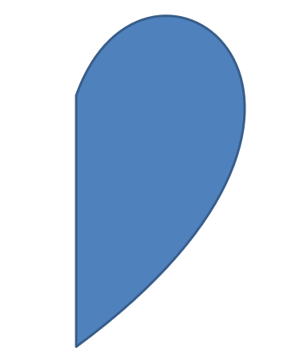

## **개요**

이 문서는 편집점 및 기하 경로를 통해 형태 기하학을 편집함으로써 Aspose.Slides에서 프레젠테이션 도형을 사용자 지정하는 방법을 설명합니다. 기존 도형을 수정하고, 기본 경로 편집 작업을 수행하며, 점을 추가하거나 제거하고, 업데이트된 기하학을 도형에 적용하는 데 `GeometryPath`를 사용하는 방법을 보여줍니다.

또한 사용자 정의 및 복합 도형을 만들고, 곡선 모서리가 있는 도형을 구축하며, 도형 기하학이 폐쇄되는지 여부를 판단하고, 추가 기하학 사용자 지정 시나리오를 위해 `GeometryPath`와 `java.awt.Shape` 간 변환하는 방법을 시연합니다.

## **편집점을 사용하여 도형 변경**

정사각형을 예로 들어 보겠습니다. PowerPoint에서 **편집점**을 사용하면

* 정사각형 모서리를 안쪽이나 바깥쪽으로 이동할 수 있습니다
* 모서리 또는 점의 곡률을 지정할 수 있습니다
* 정사각형에 새 점을 추가할 수 있습니다
* 정사각형의 점을 조작할 수 있습니다 등

본질적으로 이러한 작업은 모든 도형에서 수행할 수 있습니다. 편집점을 사용하면 기존 도형을 변경하거나 기존 도형을 기반으로 새 도형을 만들 수 있습니다.

## **도형 편집 팁**


편집점을 통해 PowerPoint 도형을 편집하기 전에, 도형에 대해 다음과 같은 사항을 고려하십시오:

* 도형(또는 그 경로)은 닫힌 형태이거나 열린 형태일 수 있습니다.
* 닫힌 도형은 시작점이나 끝점이 없으며, 열린 도형은 시작점과 끝점이 있습니다. 
* 모든 도형은 최소 2개의 앵커 포인트가 선으로 연결된 구조를 가집니다.
* 선은 직선이거나 곡선일 수 있습니다. 앵커 포인트가 선의 형태를 결정합니다. 
* 앵커 포인트는 코너 포인트, 직선 포인트, 혹은 스무스 포인트로 존재합니다:
  * 코너 포인트는 두 직선이 각을 이루며 연결되는 점입니다. 
  * 스무스 포인트는 두 핸들이 직선상에 존재하고, 선의 구간이 부드러운 곡선으로 연결되는 점입니다. 이 경우 모든 핸들은 앵커 포인트와 동일한 거리를 두고 떨어져 있습니다. 
  * 직선 포인트는 두 핸들이 직선상에 존재하지만 해당 선의 구간이 부드러운 곡선으로 연결되는 점입니다. 이 경우 핸들은 앵커 포인트와 동일한 거리를 유지할 필요가 없습니다. 
* 앵커 포인트를 이동하거나 편집(선의 각도를 변경)하면 도형의 모양을 바꿀 수 있습니다. 

편집점을 통해 PowerPoint 도형을 편집하려면 **Aspose.Slides**가 [**GeometryPath**](https://reference.aspose.com/slides/ko/php-java/aspose.slides/GeometryPath) 클래스를 제공합니다.

* A [GeometryPath](https://reference.aspose.com/slides/ko/php-java/aspose.slides/GeometryPath) instance represents a geometry path of the [GeometryShape](https://reference.aspose.com/slides/ko/php-java/aspose.slides/geometryshape/) object.  
* GeometryShape 인스턴스에서 `GeometryPath`를 가져오려면 [GeometryShape::getGeometryPaths](https://reference.aspose.com/slides/ko/php-java/aspose.slides/geometryshape/#getGeometryPaths) 메서드를 사용할 수 있습니다.  
* 도형에 `GeometryPath`를 설정하려면 다음 메서드를 사용할 수 있습니다: 고형 도형의 경우 [GeometryShape::setGeometryPath](https://reference.aspose.com/slides/ko/php-java/aspose.slides/geometryshape/#setGeometryPath) 및 복합 도형의 경우 [GeometryShape::setGeometryPaths](https://reference.aspose.com/slides/ko/php-java/aspose.slides/geometryshape/#setGeometryPaths).  
* 세그먼트를 추가하려면 [GeometryPath](https://reference.aspose.com/slides/ko/php-java/aspose.slides/geometrypath/) 아래의 메서드를 사용할 수 있습니다.  
* [GeometryPath::setStroke](https://reference.aspose.com/slides/ko/php-java/aspose.slides/geometrypath/setstroke/)와 [GeometryPath::setFillMode](https://reference.aspose.com/slides/ko/php-java/aspose.slides/geometrypath/setfillmode/) 메서드를 사용하여 기하 경로의 외형을 설정할 수 있습니다.  
* [GeometryPath::getPathData](https://reference.aspose.com/slides/ko/php-java/aspose.slides/geometrypath/getpathdata/) 메서드로 `GeometryShape`의 기하 경로를 경로 세그먼트 배열로 가져올 수 있습니다.  
* 추가 도형 기하 사용자 지정 옵션에 접근하려면 [GeometryPath](https://reference.aspose.com/slides/ko/php-java/aspose.slides/GeometryPath)를 [java.awt.Shape](https://docs.oracle.com/javase/7/docs/api/php-java/awt/Shape.html)으로 변환할 수 있습니다.  
* 변환을 위해 [ShapeUtil](https://reference.aspose.com/slides/ko/php-java/aspose.slides/ShapeUtil) 클래스의 [geometryPathToGraphicsPath](https://reference.aspose.com/slides/ko/php-java/aspose.slides/shapeutil/geometrypathtographicspath/)와 [graphicsPathToGeometryPath](https://reference.aspose.com/slides/ko/php-java/aspose.slides/shapeutil/graphicspathtogeometrypath/) 메서드를 사용하여 [GeometryPath]와 [java.awt.Shape]를 서로 변환할 수 있습니다.

## **간단한 편집 작업**

이 PHP 코드는 다음과 같이 수행하는 방법을 보여줍니다.

**선 추가** to the end of a path

```php

```
**선 추가** to a specified position on a path:

```php

```
**큐빅 베지어 곡선 추가** at the end of a path:

```php

```
**큐빅 베지어 곡선 추가** to the specified position on a path:

```php

```
**이차 베지어 곡선 추가** at the end of a path:

```php

```
**이차 베지어 곡선 추가** to a specified position on a path:

```php

```
**주어진 호 추가** to a path:

```php

```
**현재 도형 닫기** of a path:

```php

```
**다음 점 위치 설정**:

```php

```
**주어진 인덱스의 경로 세그먼트 제거**:

```php

```

## **도형에 사용자 정의 점 추가**

1. [GeometryShape](https://reference.aspose.com/slides/ko/php-java/aspose.slides/GeometryShape) 클래스의 인스턴스를 생성하고 [ShapeType::Rectangle](https://reference.aspose.com/slides/ko/php-java/aspose.slides/ShapeType) 유형을 설정합니다.  
2. 도형에서 [GeometryPath](https://reference.aspose.com/slides/ko/php-java/aspose.slides/GeometryPath) 클래스의 인스턴스를 가져옵니다.  
3. 경로의 상단 두 점 사이에 새 점을 추가합니다.  
4. 경로의 하단 두 점 사이에 새 점을 추가합니다.  
5. 경로를 도형에 적용합니다.  

이 PHP 코드는 도형에 사용자 정의 점을 추가하는 방법을 보여줍니다:

```php
  $pres = new Presentation();
  try {
    $shape = $pres->getSlides()->get_Item(0)->getShapes()->addAutoShape(ShapeType::Rectangle, 100, 100, 200, 100);
    $geometryPath = $shape->getGeometryPaths()[0];
    $geometryPath->lineTo(100, 50, 1);
    $geometryPath->lineTo(100, 50, 4);
    $shape->setGeometryPath($geometryPath);
  } finally {
    if (!java_is_null($pres)) {
      $pres->dispose();
    }
  }
```


## **도형에서 점 제거**

1. [GeometryShape](https://reference.aspose.com/slides/ko/php-java/aspose.slides/GeometryShape) 클래스의 인스턴스를 생성하고 [ShapeType::Heart](https://reference.aspose.com/slides/ko/php-java/aspose.slides/ShapeType) 유형을 설정합니다.  
2. 도형에서 [GeometryPath](https://reference.aspose.com/slides/ko/php-java/aspose.slides/GeometryPath) 클래스의 인스턴스를 가져옵니다.  
3. 경로의 세그먼트를 제거합니다.  
4. 경로를 도형에 적용합니다.  

이 PHP 코드는 도형에서 점을 제거하는 방법을 보여줍니다:

```php
  $pres = new Presentation();
  try {
    $shape = $pres->getSlides()->get_Item(0)->getShapes()->addAutoShape(ShapeType::Heart, 100, 100, 300, 300);
    $path = $shape->getGeometryPaths()[0];
    $path->removeAt(2);
    $shape->setGeometryPath($path);
  } finally {
    if (!java_is_null($pres)) {
      $pres->dispose();
    }
  }
```


## **사용자 정의 도형 만들기**

1. 도형에 대한 점들을 계산합니다.  
2. [GeometryPath](https://reference.aspose.com/slides/ko/php-java/aspose.slides/GeometryPath) 클래스의 인스턴스를 생성합니다.  
3. 점들로 경로를 채웁니다.  
4. [GeometryShape](https://reference.aspose.com/slides/ko/php-java/aspose.slides/GeometryShape) 클래스의 인스턴스를 생성합니다.  
5. 경로를 도형에 적용합니다.  

이 Java 코드는 사용자 정의 도형을 만드는 방법을 보여줍니다:

```php
  $points = new Java("java.util.ArrayList");
  $R = 100;
  $r = 50;
  $step = 72;
  for($angle = -90; $angle < 270; $angle += $step) {
    $radians = $angle * java("java.lang.Math")->PI / 180.0;
    $x = $R * java("java.lang.Math")->cos($radians);
    $y = $R * java("java.lang.Math")->sin($radians);
    $points->add(new Point2DFloat($x + $R, $y + $R));
    $radians = java("java.lang.Math")->PI * $angle . $step / 2 / 180.0;
    $x = $r * java("java.lang.Math")->cos($radians);
    $y = $r * java("java.lang.Math")->sin($radians);
    $points->add(new Point2DFloat($x + $R, $y + $R));
  }
  $starPath = new GeometryPath();
  $starPath->moveTo($points->get(0));
  for($i = 1; $i < java_values($points->size()) ; $i++) {
    $starPath->lineTo($points->get($i));
  }
  $starPath->closeFigure();
  $pres = new Presentation();
  try {
    $shape = $pres->getSlides()->get_Item(0)->getShapes()->addAutoShape(ShapeType::Rectangle, 100, 100, $R * 2, $R * 2);
    $shape->setGeometryPath($starPath);
  } finally {
    if (!java_is_null($pres)) {
      $pres->dispose();
    }
  }
```


## **복합 사용자 정의 도형 만들기**

1. [GeometryShape](https://reference.aspose.com/slides/ko/php-java/aspose.slides/GeometryShape) 클래스의 인스턴스를 생성합니다.  
2. 첫 번째 [GeometryPath](https://reference.aspose.com/slides/ko/php-java/aspose.slides/GeometryPath) 클래스의 인스턴스를 생성합니다.  
3. 두 번째 [GeometryPath](https://reference.aspose.com/slides/ko/php-java/aspose.slides/GeometryPath) 클래스의 인스턴스를 생성합니다.  
4. 경로들을 도형에 적용합니다.  

이 PHP 코드는 복합 사용자 정의 도형을 만드는 방법을 보여줍니다:

```php
  $pres = new Presentation();
  try {
    $shape = $pres->getSlides()->get_Item(0)->getShapes()->addAutoShape(ShapeType::Rectangle, 100, 100, 200, 100);
    $geometryPath0 = new GeometryPath();
    $geometryPath0->moveTo(0, 0);
    $geometryPath0->lineTo($shape->getWidth(), 0);
    $geometryPath0->lineTo($shape->getWidth(), $shape->getHeight() / 3);
    $geometryPath0->lineTo(0, $shape->getHeight() / 3);
    $geometryPath0->closeFigure();
    $geometryPath1 = new GeometryPath();
    $geometryPath1->moveTo(0, $shape->getHeight() / 3 * 2);
    $geometryPath1->lineTo($shape->getWidth(), $shape->getHeight() / 3 * 2);
    $geometryPath1->lineTo($shape->getWidth(), $shape->getHeight());
    $geometryPath1->lineTo(0, $shape->getHeight());
    $geometryPath1->closeFigure();
    $shape->setGeometryPaths(array($geometryPath0, $geometryPath1 ));
  } finally {
    if (!java_is_null($pres)) {
      $pres->dispose();
    }
  }
```


## **곡선 모서리가 있는 사용자 정의 도형 만들기**

이 PHP 코드는 안쪽으로 곡선 모서리가 있는 사용자 정의 도형을 만드는 방법을 보여줍니다;

```php
  $shapeX = 20.0;
  $shapeY = 20.0;
  $shapeWidth = 300.0;
  $shapeHeight = 200.0;
  $leftTopSize = 50.0;
  $rightTopSize = 20.0;
  $rightBottomSize = 40.0;
  $leftBottomSize = 10.0;
  $pres = new Presentation();
  try {
    $childShape = $pres->getSlides()->get_Item(0)->getShapes()->addAutoShape(ShapeType::Custom, $shapeX, $shapeY, $shapeWidth, $shapeHeight);
    $geometryPath = new GeometryPath();
    $point1 = new Point2DFloat($leftTopSize, 0);
    $point2 = new Point2DFloat($shapeWidth - $rightTopSize, 0);
    $point3 = new Point2DFloat($shapeWidth, $shapeHeight - $rightBottomSize);
    $point4 = new Point2DFloat($leftBottomSize, $shapeHeight);
    $point5 = new Point2DFloat(0, $leftTopSize);
    $geometryPath->moveTo($point1);
    $geometryPath->lineTo($point2);
    $geometryPath->arcTo($rightTopSize, $rightTopSize, 180, -90);
    $geometryPath->lineTo($point3);
    $geometryPath->arcTo($rightBottomSize, $rightBottomSize, -90, -90);
    $geometryPath->lineTo($point4);
    $geometryPath->arcTo($leftBottomSize, $leftBottomSize, 0, -90);
    $geometryPath->lineTo($point5);
    $geometryPath->arcTo($leftTopSize, $leftTopSize, 90, -90);
    $geometryPath->closeFigure();
    $childShape->setGeometryPath($geometryPath);
    $pres->save("output.pptx", SaveFormat::Pptx);
  } finally {
    if (!java_is_null($pres)) {
      $pres->dispose();
    }
  }
```

## **도형 기하가 닫혀 있는지 확인**

닫힌 도형은 모든 면이 연결되어 빈틈 없는 단일 경계를 형성하는 형태로 정의됩니다. 이러한 형태는 단순한 기하학적 형태일 수도 있고 복잡한 사용자 정의 윤곽일 수도 있습니다. 다음 코드 예제는 도형 기하가 닫혀 있는지 확인하는 방법을 보여줍니다:

```php
function isGeometryClosed($geometryShape)
{
    $isClosed = null;

    foreach ($geometryShape->getGeometryPaths() as $geometryPath) {
        $dataLength = count(java_values($geometryPath->getPathData()));
        if ($dataLength === 0) {
            continue;
        }

        $lastSegment = java_values($geometryPath->getPathData())[$dataLength - 1];
        $isClosed = $lastSegment->getPathCommand() === PathCommandType::Close;

        if ($isClosed === false) {
            return false;
        }
    }

    return $isClosed === true;
}
```

## **GeometryPath를 java.awt.Shape로 변환**

1. [GeometryShape](https://reference.aspose.com/slides/ko/php-java/aspose.slides/GeometryShape) 클래스의 인스턴스를 생성합니다.  
2. [java.awt.Shape](https://docs.oracle.com/javase/7/docs/api/php-java/awt/Shape.html) 클래스의 인스턴스를 생성합니다.  
3. [ShapeUtil](https://reference.aspose.com/slides/ko/php-java/aspose.slides/ShapeUtil)을 사용하여 [java.awt.Shape] 인스턴스를 [GeometryPath] 인스턴스로 변환합니다.  
4. 경로를 도형에 적용합니다.  

이 PHP 코드는 위 단계를 구현한 것으로, **GeometryPath**를 **GraphicsPath**로 변환하는 과정을 보여줍니다:

```php
  $pres = new Presentation();
  try {
    # 새 도형 생성
    $shape = $pres->getSlides()->get_Item(0)->getShapes()->addAutoShape(ShapeType::Rectangle, 100, 100, 300, 100);
    # 도형의 기하 경로 가져오기
    $originalPath = $shape->getGeometryPaths()[0];
    $originalPath->setFillMode(PathFillModeType::None);
    # 텍스트가 있는 새 그래픽 경로 생성
    $graphicsPath;
    $font = new Font("Arial", Font->PLAIN, 40);
    $text = "Text in shape";
    $img = new BufferedImage(100, 100, BufferedImage->TYPE_INT_ARGB);
    $g2 = $img->createGraphics();
    try {
      $glyphVector = $font->createGlyphVector($g2->getFontRenderContext(), $text);
      $graphicsPath = $glyphVector->getOutline(20.0, -$glyphVector->getVisualBounds()->getY() + 10);
    } finally {
      $g2->dispose();
    }
    # 그래픽 경로를 기하 경로로 변환
    $textPath = ShapeUtil->graphicsPathToGeometryPath($graphicsPath);
    $textPath->setFillMode(PathFillModeType::Normal);
    # 새 기하 경로와 원본 기하 경로를 도형에 결합하여 설정
    $shape->setGeometryPaths(array($originalPath, $textPath ));
  } finally {
    if (!java_is_null($pres)) {
      $pres->dispose();
    }
  }
```


## **FAQ**

**기하를 교체한 후 채우기 및 윤곽선은 어떻게 되나요?**

스타일은 도형에 그대로 유지되며, 컨투어만 변경됩니다. 채우기와 윤곽선은 새로운 기하에 자동으로 적용됩니다.

**사용자 정의 도형과 그 기하를 올바르게 회전하려면 어떻게 해야 하나요?**

[setRotation](https://reference.aspose.com/slides/ko/php-java/aspose.slides/shape/setrotation/) 메서드를 사용하면 됩니다; 기하가 도형 자체 좌표계에 바인딩되어 있기 때문에 도형과 함께 회전합니다.

**결과를 "고정"하기 위해 사용자 정의 도형을 이미지로 변환할 수 있나요?**

예. 필요한 [slide](/slides/ko/php-java/convert-powerpoint-to-png/) 영역이나 [shape](/slides/ko/php-java/create-shape-thumbnails/) 자체를 래스터 형식으로 내보내세요; 이렇게 하면 복잡한 기하를 다룰 때 작업이 간소화됩니다.