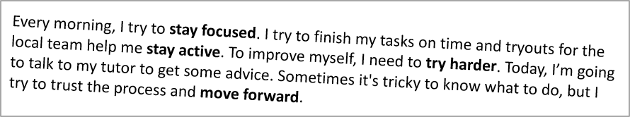

## **개요**

이 문서에서는 Aspose.Slides for Python via Java을 사용하여 PowerPoint 및 OpenDocument 프레젠테이션의 텍스트를 형식화하는 방법을 보여줍니다. 배경 색, 투명도, 문자 간격, 글꼴 속성, 회전, 단락 간격, 자동 맞춤 동작, 텍스트 앵커링, 탭 정지, 언어 설정 등을 다룹니다.

아래 예제에서는 첫 번째 슬라이드에 단일 텍스트 상자가 포함된 "sample.pptx" 파일을 사용합니다.


리터럴 텍스트 또는 정규식 일치를 찾고 강조 표시하려면 [텍스트 검색 및 바꾸기](/slides/ko/python-java/search-and-replace-text/)를 참조하십시오.

## **텍스트 배경 색상 설정**

[ParagraphFormat.getDefaultPortionFormat](https://reference.aspose.com/slides/ko/python-java/aspose.slides/paragraphformat/#getDefaultPortionFormat)을 사용하여 단락의 기본 강조 색을 설정하거나, 개별 텍스트 부분에 대해서는 [PortionFormat.getHighlightColor](https://reference.aspose.com/slides/ko/python-java/aspose.slides/portionformat/)을 사용합니다.

다음 코드는 **전체 단락**에 대한 배경 색을 설정하는 예제입니다.

```python
import jpype
import asposeslides

if not jpype.isJVMStarted():
    jpype.startJVM()

from asposeslides.api import Presentation, SaveFormat
from java.awt import Color

presentation = Presentation("sample.pptx")
try:
    slide = presentation.getSlides().get_Item(0)
    auto_shape = slide.getShapes().get_Item(0)
    paragraph = auto_shape.getTextFrame().getParagraphs().get_Item(0)

    # 전체 단락에 대한 강조 색상을 설정합니다.
    paragraph.getParagraphFormat().getDefaultPortionFormat().getHighlightColor().setColor(Color.LIGHT_GRAY)

    presentation.save("gray_paragraph.pptx", SaveFormat.Pptx)
finally:
    presentation.dispose()
```

결과:


다음 코드는 **볼드 글꼴이 적용된 텍스트 부분**에 대한 배경 색을 설정하는 예제입니다.

```python
import jpype
import asposeslides

if not jpype.isJVMStarted():
    jpype.startJVM()

from asposeslides.api import Presentation, SaveFormat
from java.awt import Color

presentation = Presentation("sample.pptx")
try:
    slide = presentation.getSlides().get_Item(0)
    auto_shape = slide.getShapes().get_Item(0)
    paragraph = auto_shape.getTextFrame().getParagraphs().get_Item(0)

    for portion in paragraph.getPortions():
        if portion.getPortionFormat().getEffective().getFontBold():
            # 텍스트 부분에 대한 강조 색상을 설정합니다.
            portion.getPortionFormat().getHighlightColor().setColor(Color.LIGHT_GRAY)

    presentation.save("gray_text_portions.pptx", SaveFormat.Pptx)
finally:
    presentation.dispose()
```

결과:


## **텍스트 단락 정렬**

[ParagraphFormat.setAlignment](https://reference.aspose.com/slides/ko/python-java/aspose.slides/paragraphformat/#setAlignment)을 사용하여 텍스트 프레임 내 단락 정렬을 설정합니다. 가운데, 왼쪽, 오른쪽, 양쪽 정렬 등 다양한 값을 지정할 수 있습니다.

다음 코드는 단락을 **중앙**에 정렬하는 예제입니다.

```python
import jpype
import asposeslides

if not jpype.isJVMStarted():
    jpype.startJVM()

from asposeslides.api import Presentation, SaveFormat, TextAlignment

presentation = Presentation("sample.pptx")
try:
    slide = presentation.getSlides().get_Item(0)
    auto_shape = slide.getShapes().get_Item(0)
    paragraph = auto_shape.getTextFrame().getParagraphs().get_Item(0)

    # 단락의 정렬을 가운데로 설정합니다.
    paragraph.getParagraphFormat().setAlignment(TextAlignment.Center)

    presentation.save("aligned_paragraph.pptx", SaveFormat.Pptx)
finally:
    presentation.dispose()
```

결과:


## **텍스트 투명도 설정**

텍스트 투명도는 [PortionFormat.getFillFormat](https://reference.aspose.com/slides/ko/python-java/aspose.slides/portionformat/)에 할당된 색상의 알파 구성 요소를 통해 제어됩니다. 아래 예제에서 `alpha = 50`은 0–255 범위의 ARGB 알파 채널 값이며 투명도 백분율이 아닙니다.

다음 코드는 **전체 단락**에 투명도를 적용하는 예제입니다.

```python
import jpype
import asposeslides

if not jpype.isJVMStarted():
    jpype.startJVM()

from asposeslides.api import FillType, Presentation, SaveFormat
from java.awt import Color

alpha = 50
text_color = Color(0, 0, 0, alpha)

presentation = Presentation("sample.pptx")
try:
    slide = presentation.getSlides().get_Item(0)
    auto_shape = slide.getShapes().get_Item(0)
    paragraph = auto_shape.getTextFrame().getParagraphs().get_Item(0)

    # 텍스트의 채우기 색을 투명 색으로 설정합니다.
    paragraph.getParagraphFormat().getDefaultPortionFormat().getFillFormat().setFillType(FillType.Solid)
    paragraph.getParagraphFormat().getDefaultPortionFormat().getFillFormat().getSolidFillColor().setColor(text_color)

    presentation.save("transparent_paragraph.pptx", SaveFormat.Pptx)
finally:
    presentation.dispose()
```

결과:


다음 코드는 **볼드 글꼴이 적용된 텍스트 부분**에 투명도를 적용하는 예제입니다.

```python
import jpype
import asposeslides

if not jpype.isJVMStarted():
    jpype.startJVM()

from asposeslides.api import FillType, Presentation, SaveFormat
from java.awt import Color

alpha = 50
text_color = Color(0, 0, 0, alpha)

presentation = Presentation("sample.pptx")
try:
    slide = presentation.getSlides().get_Item(0)
    auto_shape = slide.getShapes().get_Item(0)
    paragraph = auto_shape.getTextFrame().getParagraphs().get_Item(0)

    for portion in paragraph.getPortions():
        if portion.getPortionFormat().getEffective().getFontBold():
            # 텍스트 부분의 투명도를 설정합니다.
            portion.getPortionFormat().getFillFormat().setFillType(FillType.Solid)
            portion.getPortionFormat().getFillFormat().getSolidFillColor().setColor(text_color)

    presentation.save("transparent_text_portions.pptx", SaveFormat.Pptx)
finally:
    presentation.dispose()
```

결과:


## **텍스트 문자 간격 설정**

[PortionFormat.setSpacing](https://reference.aspose.com/slides/ko/python-java/aspose.slides/portionformat/)을 사용하여 텍스트 상자 내 문자 사이의 간격을 확대하거나 축소할 수 있습니다.

다음 파이썬 코드는 **전체 단락**의 문자 간격을 확대하는 예제입니다.

```python
import jpype
import asposeslides

if not jpype.isJVMStarted():
    jpype.startJVM()

from asposeslides.api import Presentation, SaveFormat

presentation = Presentation("sample.pptx")
try:
    slide = presentation.getSlides().get_Item(0)
    auto_shape = slide.getShapes().get_Item(0)
    paragraph = auto_shape.getTextFrame().getParagraphs().get_Item(0)

    # 참고: 문자 간격을 압축하려면 음수 값을 사용합니다.
    paragraph.getParagraphFormat().getDefaultPortionFormat().setSpacing(3) # 문자 간격을 확대합니다.

    presentation.save("character_spacing_in_paragraph.pptx", SaveFormat.Pptx)
finally:
    presentation.dispose()
```

결과:


다음 코드는 **볼드 글꼴이 적용된 텍스트 부분**의 문자 간격을 확대하는 예제입니다.

```python
import jpype
import asposeslides

if not jpype.isJVMStarted():
    jpime.startJVM()

from asposeslides.api import Presentation, SaveFormat

presentation = Presentation("sample.pptx")
try:
    slide = presentation.getSlides().get_Item(0)
    auto_shape = slide.getShapes().get_Item(0)
    paragraph = auto_shape.getTextFrame().getParagraphs().get_Item(0)

    for portion in paragraph.getPortions():
        if portion.getPortionFormat().getEffective().getFontBold():
            # 참고: 문자 간격을 압축하려면 음수 값을 사용합니다.
            portion.getPortionFormat().setSpacing(3) # 문자 간격을 확대합니다.

    presentation.save("character_spacing_in_text_portions.pptx", SaveFormat.Pptx)
finally:
    presentation.dispose()
```

결과:


### **특정 글꼴에 대한 커닝 비활성화**

때때로 Aspose.Slides가 렌더링한 텍스트는 PowerPoint에서 표시되는 텍스트보다 약간 더 촘촘하게 보일 수 있습니다. 이는 PowerPoint가 해당 글꼴에 대한 커닝 데이터를 무시하기 때문일 수 있습니다. 이러한 경우 영향을 받는 글꼴을 사용하는 텍스트 부분에 대해 커닝을 비활성화할 수 있습니다. 실제 글꼴 크기보다 현저히 큰 값을 [PortionFormat.setKerningMinimalSize](https://reference.aspose.com/slides/ko/python-java/aspose.slides/portionformat/)에 설정하십시오.

```python
import jpype
import asposeslides

if not jpype.isJVMStarted():
    jpype.startJVM()

from asposeslides.api import Presentation, SaveFormat

presentation = Presentation("presentation.pptx")
try:
    slide = presentation.getSlides().get_Item(0)
    auto_shape = slide.getShapes().get_Item(0)
    target_font = "Roboto"

    for paragraph in auto_shape.getTextFrame().getParagraphs():
        for portion in paragraph.getPortions():
            portion_format = portion.getPortionFormat()
            fonts = (portion_format.getLatinFont(), portion_format.getEastAsianFont(), portion_format.getComplexScriptFont())
            if any(font is not None and font.getFontName() == target_font for font in fonts):
                portion_format.setKerningMinimalSize(100)

    presentation.save("output.pptx", SaveFormat.Pptx)
finally:
    presentation.dispose()
```

이 설정은 일치하는 텍스트 부분에 커닝이 적용되는 것을 방지하여 해당 PowerPoint 전용 동작으로 인해 발생한 차이를 최소화합니다.

## **텍스트 글꼴 속성 관리**

글꼴 속성은 [ParagraphFormat.getDefaultPortionFormat](https://reference.aspose.com/slides/ko/python-java/aspose.slides/paragraphformat/#getDefaultPortionFormat)을 통해 단락 수준에서, 또는 개별 부분에 대해서는 [PortionFormat](https://reference.aspose.com/slides/ko/python-java/aspose.slides/portionformat/)을 통해 설정할 수 있습니다.

다음 코드는 전체 단락에 대해 글꼴과 텍스트 스타일을 설정합니다. 여기서는 글꼴 크기, 볼드, 이탤릭, 점선 밑줄, 그리고 Times New Roman 글꼴을 모든 부분에 적용합니다.

```python
import jpype
import asposeslides

if not jpype.isJVMStarted():
    jpype.startJVM()

from asposeslides.api import FontData, NullableBool, Presentation, SaveFormat, TextUnderlineType

presentation = Presentation("sample.pptx")
try:
    slide = presentation.getSlides().get_Item(0)
    auto_shape = slide.getShapes().get_Item(0)
    paragraph = auto_shape.getTextFrame().getParagraphs().get_Item(0)

    # 단락에 대한 글꼴 속성을 설정합니다.
    paragraph.getParagraphFormat().getDefaultPortionFormat().setFontHeight(12)
    paragraph.getParagraphFormat().getDefaultPortionFormat().setFontBold(NullableBool.True_)
    paragraph.getParagraphFormat().getDefaultPortionFormat().setFontItalic(NullableBool.True_)
    paragraph.getParagraphFormat().getDefaultPortionFormat().setFontUnderline(TextUnderlineType.Dotted)
    font = FontData("Times New Roman")
    paragraph.getParagraphFormat().getDefaultPortionFormat().setLatinFont(font)

    presentation.save("font_properties_for_paragraph.pptx", SaveFormat.Pptx)
finally:
    presentation.dispose()
```

결과:


다음 코드는 **볼드 글꼴이 적용된 텍스트 부분**에 유사한 속성을 적용하는 예제입니다.

```python
import jpype
import asposeslides

if not jpype.isJVMStarted():
    jpype.startJVM()

from asposeslides.api import FontData, NullableBool, Presentation, SaveFormat, TextUnderlineType

presentation = Presentation("sample.pptx")
try:
    slide = presentation.getSlides().get_Item(0)
    auto_shape = slide.getShapes().get_Item(0)
    paragraph = auto_shape.getTextFrame().getParagraphs().get_Item(0)

    for portion in paragraph.getPortions():
        if portion.getPortionFormat().getEffective().getFontBold():
            # 텍스트 부분에 대한 글꼴 속성을 설정합니다.
            portion.getPortionFormat().setFontHeight(13)
            portion.getPortionFormat().setFontItalic(NullableBool.True_)
            portion.getPortionFormat().setFontUnderline(TextUnderlineType.Dotted)
            font = FontData("Times New Roman")
            portion.getPortionFormat().setLatinFont(font)

    presentation.save("font_properties_for_text_portions.pptx", SaveFormat.Pptx)
finally:
    presentation.dispose()
```

결과:


## **텍스트 회전 설정**

[TextFrameFormat.setTextVerticalType](https://reference.aspose.com/slides/ko/python-java/aspose.slides/textframeformat/#setTextVerticalType)을 사용하여 도형 내에 미리 정의된 텍스트 방향을 설정할 수 있습니다.

다음 코드는 텍스트 방향을 `Vertical270`으로 설정하여 텍스트를 **시계 반대 방향으로 90도** 회전합니다.

```python
import jpype
import asposeslides

if not jpype.isJVMStarted():
    jpype.startJVM()

from asposeslides.api import Presentation, SaveFormat, TextVerticalType

presentation = Presentation("sample.pptx")
try:
    slide = presentation.getSlides().get_Item(0)
    auto_shape = slide.getShapes().get_Item(0)

    auto_shape.getTextFrame().getTextFrameFormat().setTextVerticalType(TextVerticalType.Vertical270)

    presentation.save("text_rotation.pptx", SaveFormat.Pptx)
finally:
    presentation.dispose()
```

결과:


## **텍스트 프레임 사용자 지정 회전 설정**

[TextFrameFormat.setRotationAngle](https://reference.aspose.com/slides/ko/python-java/aspose.slides/textframeformat/#setRotationAngle)을 사용하여 [TextFrame](https://reference.aspose.com/slides/ko/python-java/aspose.slides/textframe/)의 사용자 지정 회전 각도를 설정할 수 있습니다.

다음 코드는 도형 내 텍스트 프레임을 **시계 방향으로 3도** 회전합니다.

```python
import jpype
import asposeslides

if not jpype.isJVMStarted():
    jpype.startJVM()

from asposeslides.api import Presentation, SaveFormat

presentation = Presentation("sample.pptx")
try:
    slide = presentation.getSlides().get_Item(0)
    auto_shape = slide.getShapes().get_Item(0)

    auto_shape.getTextFrame().getTextFrameFormat().setRotationAngle(3)

    presentation.save("custom_text_rotation.pptx", SaveFormat.Pptx)
finally:
    presentation.dispose()
```

결과:



## **단락 줄 간격 설정**

Aspose.Slides는 [ParagraphFormat.setSpaceAfter](https://reference.aspose.com/slides/ko/python-java/aspose.slides/paragraphformat/#setSpaceAfter), [ParagraphFormat.setSpaceBefore](https://reference.aspose.com/slides/ko/python-java/aspose.slides/paragraphformat/#setSpaceBefore), [ParagraphFormat.setSpaceWithin](https://reference.aspose.com/slides/ko/python-java/aspose.slides/paragraphformat/#setSpaceWithin) 를 제공하여 단락 간격을 제어합니다. 사용 방법은 다음과 같습니다.

* 양의 값을 사용하면 줄 높이의 백분율로 줄 간격을 지정합니다.
* 음의 값을 사용하면 포인트 단위로 줄 간격을 지정합니다.

다음 코드는 단락 내 줄 간격을 지정하는 예제입니다.

```python
import jpype
import asposeslides

if not jpype.isJVMStarted():
    jpype.startJVM()

from asposeslides.api import Presentation, SaveFormat

presentation = Presentation("sample.pptx")
try:
    slide = presentation.getSlides().get_Item(0)
    auto_shape = slide.getShapes().get_Item(0)
    paragraph = auto_shape.getTextFrame().getParagraphs().get_Item(0)

    paragraph.getParagraphFormat().setSpaceWithin(200)

    presentation.save("line_spacing.pptx", SaveFormat.Pptx)
finally:
    presentation.dispose()
```

결과:


## **텍스트 프레임 자동 맞춤 유형 설정**

[TextFrameFormat.setAutofitType](https://reference.aspose.com/slides/ko/python-java/aspose.slides/textframeformat/#setAutofitType)는 텍스트가 컨테이너 경계를 초과할 때 텍스트가 어떻게 동작할지를 결정합니다. 텍스트가 축소되는지, 넘치는지, 또는 도형이 자동으로 크기 조정되는지를 제어합니다.

```python
import jpype
import asposeslides

if not jpype.isJVMStarted():
    jpype.startJVM()

from asposeslides.api import Presentation, SaveFormat, TextAutofitType

presentation = Presentation("sample.pptx")
try:
    slide = presentation.getSlides().get_Item(0)
    auto_shape = slide.getShapes().get_Item(0)

    auto_shape.getTextFrame().getTextFrameFormat().setAutofitType(TextAutofitType.Shape)

    presentation.save("autofit_type.pptx", SaveFormat.Pptx)
finally:
    presentation.dispose()
```

## **텍스트 프레임 앵커 설정**

[TextFrameFormat.setAnchoringType](https://reference.aspose.com/slides/ko/python-java/aspose.slides/textframeformat/#setAnchoringType)은 텍스트가 도형 내부에서 수직으로 어떻게 배치되는지를 정의합니다(예: 상단, 중간, 하단).

```python
import jpype
import asposeslides

if not jpype.isJVMStarted():
    jpype.startJVM()

from asposeslides.api import Presentation, SaveFormat, TextAnchorType

presentation = Presentation("sample.pptx")
try:
    slide = presentation.getSlides().get_Item(0)
    auto_shape = slide.getShapes().get_Item(0)

    auto_shape.getTextFrame().getTextFrameFormat().setAnchoringType(TextAnchorType.Bottom)

    presentation.save("text_anchor.pptx", SaveFormat.Pptx)
finally:
    presentation.dispose()
```

## **텍스트 탭 설정**

[ParagraphFormat.setDefaultTabSize](https://reference.aspose.com/slides/ko/python-java/aspose.slides/paragraphformat/#setDefaultTabSize) 및 [ParagraphFormat.getTabs](https://reference.aspose.com/slides/ko/python-java/aspose.slides/paragraphformat/#getTabs)을 사용하여 단락의 탭 정지를 구성합니다.

```python
import jpype
import asposeslides

if not jpype.isJVMStarted():
    jpype.startJVM()

from asposeslides.api import Presentation, SaveFormat, TabAlignment

presentation = Presentation("sample.pptx")
try:
    slide = presentation.getSlides().get_Item(0)
    auto_shape = slide.getShapes().get_Item(0)
    paragraph = auto_shape.getTextFrame().getParagraphs().get_Item(0)

    paragraph.getParagraphFormat().setDefaultTabSize(100)
    paragraph.getParagraphFormat().getTabs().add(30, TabAlignment.Left)

    presentation.save("paragraph_tabs.pptx", SaveFormat.Pptx)
finally:
    presentation.dispose()
```

결과:


## **교정 언어 설정**

Aspose.Slides는 [PortionFormat.setLanguageId](https://reference.aspose.com/slides/ko/python-java/aspose.slides/portionformat/)를 제공하여 텍스트 부분의 교정 언어를 설정할 수 있습니다. 교정 언어는 PowerPoint에서 맞춤법 및 문법 검사를 수행할 언어를 결정합니다.

다음 코드는 텍스트 부분에 교정 언어를 설정하는 예제입니다.

```python
import jpype
import asposeslides

if not jpype.isJVMStarted():
    jpype.startJVM()

from asposeslides.api import FontData, Portion, Presentation, SaveFormat

presentation = Presentation("presentation.pptx")
try:
    slide = presentation.getSlides().get_Item(0)
    auto_shape = slide.getShapes().get_Item(0)

    paragraph = auto_shape.getTextFrame().getParagraphs().get_Item(0)
    paragraph.getPortions().clear()

    font = FontData("SimSun")

    text_portion = Portion()
    text_portion.getPortionFormat().setComplexScriptFont(font)
    text_portion.getPortionFormat().setEastAsianFont(font)
    text_portion.getPortionFormat().setLatinFont(font)

    # 교정 언어의 Id를 설정합니다.
    text_portion.getPortionFormat().setLanguageId("zh-CN")

    text_portion.setText("1。")
    paragraph.getPortions().add(text_portion)

    presentation.save("proofing_language.pptx", SaveFormat.Pptx)
finally:
    presentation.dispose()
```

## **기본 언어 설정**

[LoadOptions.setDefaultTextLanguage](https://reference.aspose.com/slides/ko/python-java/aspose.slides/loadoptions/#setDefaultTextLanguage)을 사용하여 프레젠테이션을 로드하거나 생성할 때 텍스트의 기본 언어를 정의할 수 있습니다.

```python
import jpype
import asposeslides

if not jpype.isJVMStarted():
    jpype.startJVM()

from asposeslides.api import LoadOptions, Presentation, ShapeType

load_options = LoadOptions()
load_options.setDefaultTextLanguage("en-US")

presentation = Presentation(load_options)
try:
    slide = presentation.getSlides().get_Item(0)

    # 사각형 도형을 텍스트와 함께 추가합니다.
    shape = slide.getShapes().addAutoShape(ShapeType.Rectangle, 20, 20, 150, 50)
    shape.getTextFrame().setText("Sample text")

    # 첫 번째 부분의 언어를 확인합니다.
    portion = shape.getTextFrame().getParagraphs().get_Item(0).getPortions().get_Item(0)
    print(portion.getPortionFormat().getLanguageId())
finally:
    presentation.dispose()
```

## **기본 텍스트 스타일 설정**

프레젠테이션 수준에서 기본 텍스트 서식을 적용하려면 [Presentation.getDefaultTextStyle](https://reference.aspose.com/slides/ko/python-java/aspose.slides/presentation/#getDefaultTextStyle)를 사용합니다.

다음 코드는 새 프레젠테이션의 모든 슬라이드에 대해 14pt 크기의 볼드 기본 글꼴을 설정하는 예제입니다.

```python
import jpype
import asposeslides

if not jpype.isJVMStarted():
    jpype.startJVM()

from asposeslides.api import NullableBool, Presentation, SaveFormat

presentation = Presentation()
try:
    # 최상위 레벨 단락 형식을 가져옵니다.
    paragraph_format = presentation.getDefaultTextStyle().getLevel(0)

    if paragraph_format is not None:
        paragraph_format.getDefaultPortionFormat().setFontHeight(14)
        paragraph_format.getDefaultPortionFormat().setFontBold(NullableBool.True_)

    presentation.save("default_text_style.pptx", SaveFormat.Pptx)
finally:
    presentation.dispose()
```

## **전체 대문자 효과로 텍스트 추출**

PowerPoint에서 **All Caps** 글꼴 효과를 적용하면 원본 텍스트가 소문자이더라도 슬라이드에 대문자로 표시됩니다. Aspose.Slides로 해당 텍스트 부분을 가져오면 라이브러리는 입력된 그대로의 텍스트를 반환합니다. 표시된 텍스트와 일치시키려면 [TextCapType](https://reference.aspose.com/slides/ko/python-java/aspose.slides/textcaptype/)을 확인하고 값이 `All`인 경우 반환 문자열을 대문자로 변환하십시오.

예를 들어 sample2.pptx 파일의 첫 번째 슬라이드에 다음과 같은 텍스트 상자가 있다고 가정합니다.


다음 코드는 **All Caps** 효과가 적용된 텍스트를 추출하는 예제입니다.

```python
import jpype
import asposeslides

if not jpype.isJVMStarted():
    jpype.startJVM()

from asposeslides.api import Presentation, TextCapType

presentation = Presentation("sample2.pptx")
try:
    slide = presentation.getSlides().get_Item(0)
    auto_shape = slide.getShapes().get_Item(0)
    text_portion = auto_shape.getTextFrame().getParagraphs().get_Item(0).getPortions().get_Item(0)

    print("Original text: " + str(text_portion.getText()))

    text_format = text_portion.getPortionFormat().getEffective()
    if text_format.getTextCapType() == TextCapType.All:
        text = str(text_portion.getText()).upper()
        print("All-Caps effect: " + text)
finally:
    presentation.dispose()
```

출력:

```text
Original text: Hello, Aspose!
All-Caps effect: HELLO, ASPOSE!
```

## **FAQ**

**슬라이드의 표에서 텍스트를 어떻게 수정합니까?**

슬라이드의 표에서 텍스트를 수정하려면 [Table](https://reference.aspose.com/slides/ko/python-java/aspose.slides/table/)을 사용하십시오. 셀을 순회하면서 [Cell.getTextFrame](https://reference.aspose.com/slides/ko/python-java/aspose.slides/cell/#getTextFrame)으로 각 셀을 업데이트하고, [Paragraph.getParagraphFormat](https://reference.aspose.com/slides/ko/python-java/aspose.slides/paragraph/#getParagraphFormat)으로 단락 서식을 지정합니다.

**PowerPoint 슬라이드의 텍스트에 그라디언트 색을 어떻게 적용합니까?**

그라디언트 색을 적용하려면 [PortionFormat.getFillFormat](https://reference.aspose.com/slides/ko/python-java/aspose.slides/portionformat/)를 사용하십시오. [FillFormat.setFillType](https://reference.aspose.com/slides/ko/python-java/aspose.slides/fillformat/#setFillType)을 [FillType.Gradient](https://reference.aspose.com/slides/ko/python-java/aspose.slides/filltype/#Gradient)로 설정하고, 그라디언트 정지점, 방향, 투명도를 구성합니다.