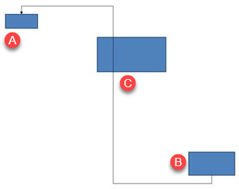

## **개요**

커넥터는 두 도형 중 하나가 이동하더라도 두 도형에 연결된 상태를 유지할 수 있는 선입니다. 그 끝은 PowerPoint에서 초록색 점으로 표시되는 연결 사이트에 부착됩니다. 일부 구부러지거나 곡선형 커넥터는 주황색 점으로 표시되는 조정점을 제공하며, 이를 통해 개별 커넥터 세그먼트의 위치를 제어합니다.

Aspose.Slides는 커넥터를 [Connector](https://reference.aspose.com/slides/ko/python-java/aspose.slides/connector/) 클래스로 나타냅니다. 커넥터를 만들고, 끝을 도형에 연결하고, 연결 사이트를 선택하고, 재경로를 지정하며, 조정점이 있는 커넥터의 기하학을 수정할 수 있습니다.

## **커넥터 종류**

[ShapeType](https://reference.aspose.com/slides/ko/python-java/aspose.slides/shapetype/) 클래스는 직선, 구부러진 및 곡선형 커넥터 프리셋을 포함합니다. 다음 표는 사용 가능한 커넥터 기하학과 각 프리셋에 정의된 조정점 수를 보여줍니다.

| 커넥터 | 이미지 | 조정점 수 |
|---|---|---|
| [ShapeType.Line](https://reference.aspose.com/slides/ko/python-java/aspose.slides/shapetype/#Line) |  | 0 |
| [ShapeType.StraightConnector1](https://reference.aspose.com/slides/ko/python-java/aspose.slides/shapetype/#StraightConnector1) |  | 0 |
| [ShapeType.BentConnector2](https://reference.aspose.com/slides/ko/python-java/aspose.slides/shapetype/#BentConnector2) |  | 0 |
| [ShapeType.BentConnector3](https://reference.aspose.com/slides/ko/python-java/aspose.slides/shapetype/#BentConnector3) |  | 1 |
| [ShapeType.BentConnector4](https://reference.aspose.com/slides/ko/python-java/aspose.slides/shapetype/#BentConnector4) |  | 2 |
| [ShapeType.BentConnector5](https://reference.aspose.com/slides/ko/python-java/aspose.slides/shapetype/#BentConnector5) |  | 3 |
| [ShapeType.CurvedConnector2](https://reference.aspose.com/slides/ko/python-java/aspose.slides/shapetype/#CurvedConnector2) |  | 0 |
| [ShapeType.CurvedConnector3](https://reference.aspose.com/slides/ko/python-java/aspose.slides/shapetype/#CurvedConnector3) |  | 1 |
| [ShapeType.CurvedConnector4](https://reference.aspose.com/slides/ko/python-java/aspose.slides/shapetype/#CurvedConnector4) |  | 2 |
| [ShapeType.CurvedConnector5](https://reference.aspose.com/slides/ko/python-java/aspose.slides/shapetype/#CurvedConnector5) |  | 3 |

조정점의 수와 의미는 선택된 커넥터 프리셋의 일부입니다. 두 개의 다른 커넥터 유형이 동일한 컬렉션 레이아웃을 제공한다고 가정하지 마십시오.

## **두 도형 연결**

[ShapeCollection.addConnector](https://reference.aspose.com/slides/ko/python-java/aspose.slides/shapecollection/#addConnector) 를 사용하여 커넥터를 추가하고, [Connector.setStartShapeConnectedTo](https://reference.aspose.com/slides/ko/python-java/aspose.slides/connector/#setStartShapeConnectedTo) 와 [Connector.setEndShapeConnectedTo](https://reference.aspose.com/slides/ko/python-java/aspose.slides/connector/#setEndShapeConnectedTo) 를 사용하여 양쪽 끝을 연결합니다. 두 끝이 모두 연결된 후, [Connector.reroute](https://reference.aspose.com/slides/ko/python-java/aspose.slides/connector/#reroute) 가 도형 사이의 짧은 경로를 선택합니다.

다음 예제는 타원과 사각형을 구부러진 커넥터로 연결합니다:

```python
import jpype
import asposeslides

if not jpype.isJVMStarted():
    jpype.startJVM()

from asposeslides.api import Presentation, ShapeType, SaveFormat

presentation = Presentation()
try:
    slide = presentation.getSlides().get_Item(0)

    ellipse = slide.getShapes().addAutoShape(ShapeType.Ellipse, 40, 80, 120, 80)
    rectangle = slide.getShapes().addAutoShape(ShapeType.Rectangle, 320, 240, 140, 80)
    connector = slide.getShapes().addConnector(ShapeType.BentConnector2, 0, 0, 10, 10)

    connector.setStartShapeConnectedTo(ellipse)
    connector.setEndShapeConnectedTo(rectangle)
    connector.reroute()

    presentation.save("connected-shapes.pptx", SaveFormat.Pptx)
finally:
    presentation.dispose()
```

{}
재경로를 수행하면 [reroute](https://reference.aspose.com/slides/ko/python-java/aspose.slides/connector/#reroute) 가 [setStartShapeConnectionSiteIndex](https://reference.aspose.com/slides/ko/python-java/aspose.slides/connector/#setStartShapeConnectionSiteIndex) 및 [setEndShapeConnectionSiteIndex](https://reference.aspose.com/slides/ko/python-java/aspose.slides/connector/#setEndShapeConnectionSiteIndex) 값을 변경할 수 있습니다. 해당 사이트가 고정되어야 하는 경우 재경로 후에 특정 연결 사이트를 지정하십시오.
{}

## **연결 사이트 선택**

연결 가능한 각 도형은 [Shape.getConnectionSiteCount](https://reference.aspose.com/slides/ko/python-java/aspose.slides/shape/#getConnectionSiteCount) 를 통해 사이트 수를 보고합니다. 커넥터 끝에 할당하기 전에 원하는 0 기반 사이트 인덱스를 검증하세요; 사이트 수는 도형 기하학에 따라 다릅니다.

이 예제는 해당 사이트가 존재할 경우 타원에 특정 사이트에 커넥터를 연결합니다:

```python
import jpype
import asposeslides

if not jpype.isJVMStarted():
    jpype.startJVM()

from asposeslides.api import Presentation, ShapeType, SaveFormat

presentation = Presentation()
try:
    slide = presentation.getSlides().get_Item(0)

    ellipse = slide.getShapes().addAutoShape(ShapeType.Ellipse, 40, 80, 120, 80)
    rectangle = slide.getShapes().addAutoShape(ShapeType.Rectangle, 320, 240, 140, 80)
    connector = slide.getShapes().addConnector(ShapeType.BentConnector3, 0, 0, 10, 10)

    connector.setStartShapeConnectedTo(ellipse)
    connector.setEndShapeConnectedTo(rectangle)

    preferred_site_index = 2
    if preferred_site_index < ellipse.getConnectionSiteCount():
        connector.setStartShapeConnectionSiteIndex(preferred_site_index)
    else:
        print(f"The ellipse has only {ellipse.getConnectionSiteCount()} connection sites.")

    presentation.save("specific-connection-site.pptx", SaveFormat.Pptx)
finally:
    presentation.dispose()
```

## **커넥터 포인트 조정**

조정점을 가진 커넥터는 [GeometryShape.getAdjustments](https://reference.aspose.com/slides/ko/python-java/aspose.slides/geometryshape/#getAdjustments) 를 통해 이를 노출합니다. 모든 [AdjustValue](https://reference.aspose.com/slides/ko/python-java/aspose.slides/adjustvalue/) 를 검사하고, 변경하기 전에 그 [getType](https://reference.aspose.com/slides/ko/python-java/aspose.slides/adjustvalue/#getType) 값을 확인한 후 [setRawValue](https://reference.aspose.com/slides/ko/python-java/aspose.slides/adjustvalue/#setRawValue) 로 값을 변경합니다. 사전 설정된 도형 조정 식별에 대한 일반 규칙은 [Shape Manipulation](/slides/ko/python-java/shape-manipulations/) 에 설명되어 있습니다.

조정점의 수, 순서, 의미 및 유효 값 범위는 커넥터 프리셋에 따라 달라집니다. 조정 유형은 읽기 전용이며, 조정 값은 쓰기 가능합니다. 동일한 의미 유형의 조정이 여러 개 있는 경우 [getName](https://reference.aspose.com/slides/ko/python-java/aspose.slides/adjustvalue/#getName) 메서드가 추가 식별 정보를 제공합니다.

### **장애물 우회**

다음 레이아웃에서 두 도형 사이의 [BentConnector5](https://reference.aspose.com/slides/ko/python-java/aspose.slides/shapetype/#BentConnector5) 커넥터가 세 번째 도형을 통과합니다:



이 코드는 방해받는 커넥터를 생성합니다:

```python
import jpype
import asposeslides

if not jpype.isJVMStarted():
    jpype.startJVM()

from asposeslides.api import Presentation, ShapeType, SaveFormat, LineArrowheadStyle, FillType

Color = jpype.JClass("java.awt.Color")

presentation = Presentation()
try:
    slide = presentation.getSlides().get_Item(0)

    slide.getShapes().addAutoShape(ShapeType.Rectangle, 300, 150, 150, 75)
    source_shape = slide.getShapes().addAutoShape(ShapeType.Rectangle, 500, 400, 100, 50)
    target_shape = slide.getShapes().addAutoShape(ShapeType.Rectangle, 100, 100, 70, 30)
    connector = slide.getShapes().addConnector(ShapeType.BentConnector5, 20, 20, 400, 300)

    connector.getLineFormat().setEndArrowheadStyle(LineArrowheadStyle.Triangle)
    connector.getLineFormat().getFillFormat().setFillType(FillType.Solid)
    connector.getLineFormat().getFillFormat().getSolidFillColor().setColor(Color.BLACK)
    connector.setStartShapeConnectedTo(source_shape)
    connector.setEndShapeConnectedTo(target_shape)
    connector.setStartShapeConnectionSiteIndex(2)

    presentation.save("connector-obstruction.pptx", SaveFormat.Pptx)
finally:
    presentation.dispose()
```

세로 굽힘을 이동하면 경로가 바뀌어 커넥터가 장애물을 우회합니다:


컬렉션 인덱스 `1`이 항상 세로 굽힘을 나타낸다고 가정하지 않고, 이 예제는 [ConnectorBendPositionY](https://reference.aspose.com/slides/ko/python-java/aspose.slides/shapeadjustmenttype/#ConnectorBendPositionY) 를 찾아 기대하는 의미 유형이 존재할 때만 변경합니다:

```python
import jpype
import asposeslides

if not jpype.isJVMStarted():
    jpype.startJVM()

from asposeslides.api import Presentation, ShapeType, SaveFormat, LineArrowheadStyle, FillType, ShapeAdjustmentType

Color = jpype.JClass("java.awt.Color")

presentation = Presentation()
try:
    slide = presentation.getSlides().get_Item(0)

    slide.getShapes().addAutoShape(ShapeType.Rectangle, 300, 150, 150, 75)
    source_shape = slide.getShapes().addAutoShape(ShapeType.Rectangle, 500, 400, 100, 50)
    target_shape = slide.getShapes().addAutoShape(ShapeType.Rectangle, 100, 100, 70, 30)
    connector = slide.getShapes().addConnector(ShapeType.BentConnector5, 20, 20, 400, 300)

    connector.getLineFormat().setEndArrowheadStyle(LineArrowheadStyle.Triangle)
    connector.getLineFormat().getFillFormat().setFillType(FillType.Solid)
    connector.getLineFormat().getFillFormat().getSolidFillColor().setColor(Color.BLACK)
    connector.setStartShapeConnectedTo(source_shape)
    connector.setEndShapeConnectedTo(target_shape)
    connector.setStartShapeConnectionSiteIndex(2)

    vertical_bend = None
    for adjustment_index in range(connector.getAdjustments().size()):
        adjustment = connector.getAdjustments().get_Item(adjustment_index)
        print(f"{adjustment.getName()}: {adjustment.getType()}, raw value = {adjustment.getRawValue()}")
        if adjustment.getType() == ShapeAdjustmentType.ConnectorBendPositionY:
            vertical_bend = adjustment
            break

    if vertical_bend is None:
        print("The connector does not expose a vertical bend adjustment.")
    else:
        vertical_bend.setRawValue(60000)
        presentation.save("connector-obstruction-fixed.pptx", SaveFormat.Pptx)
finally:
    presentation.dispose()
```

[BentConnector5](https://reference.aspose.com/slides/ko/python-java/aspose.slides/shapetype/#BentConnector5)에는 두 개의 [ConnectorBendPositionX](https://reference.aspose.com/slides/ko/python-java/aspose.slides/shapeadjustmenttype/#ConnectorBendPositionX) 조정과 하나의 [ConnectorBendPositionY](https://reference.aspose.com/slides/ko/python-java/aspose.slides/shapeadjustmenttype/#ConnectorBendPositionY) 조정이 있습니다. 필요한 유형이 여러 번 나타나는 경우 [getName](https://reference.aspose.com/slides/ko/python-java/aspose.slides/adjustvalue/#getName) 과 해당 프리셋의 알려진 기하학을 검사한 후 선택하십시오. 조정이 [ShapeAdjustmentType.Custom](https://reference.aspose.com/slides/ko/python-java/aspose.slides/shapeadjustmenttype/#Custom) 를 보고하면 그 의미와 범위를 프리셋 전용으로 간주하고 계약이 알려질 때까지 변경하지 마십시오.

## **조정값을 커넥터 기하학에 연결**

구부러진 커넥터의 경우, 조정값을 사용하여 개별 세그먼트의 위치를 추정할 수 있습니다. 이러한 계산은 커넥터 프리셋에 특정됩니다:

- [BentConnector4](https://reference.aspose.com/slides/ko/python-java/aspose.slides/shapetype/#BentConnector4) 은 일반적으로 하나의 [ConnectorBendPositionX](https://reference.aspose.com/slides/ko/python-java/aspose.slides/shapeadjustmenttype/#ConnectorBendPositionX)와 하나의 [ConnectorBendPositionY](https://reference.aspose.com/slides/ko/python-java/aspose.slides/shapeadjustmenttype/#ConnectorBendPositionY) 조정을 노출합니다.
- 이러한 굽힘 위치에 대해 [getRawValue](https://reference.aspose.com/slides/ko/python-java/aspose.slides/adjustvalue/#getRawValue) 로 반환된 값을 `100000.0` 로 나누면 아래 예제에서 사용되는 커넥터 프레임 너비 또는 높이의 비율이 됩니다.
- 커넥터 프레임은 회전되거나 뒤집힐 수 있으므로, 프레임 좌표는 슬라이드 좌표와 비교하기 전에 변환되어야 합니다.

다음 예제는 먼저 [getType](https://reference.aspose.com/slides/ko/python-java/aspose.slides/adjustvalue/#getType) 로 조정을 식별합니다. 컬렉션 인덱스를 휴대 가능한 식별자로 사용하지 않습니다.

### **회전되지 않은 커넥터**

초기 레이아웃에는 두 개의 텍스트 도형이 [BentConnector4](https://reference.aspose.com/slides/ko/python-java/aspose.slides/shapetype/#BentConnector4) 로 연결되어 있습니다:


이 예제는 커넥터를 검사하고 수평 및 수직 굽힘 조정을 얻습니다:

```python
import jpype
import asposeslides

if not jpype.isJVMStarted():
    jpype.startJVM()

from asposeslides.api import Presentation, ShapeType, LineArrowheadStyle, FillType

Color = jpype.JClass("java.awt.Color")

presentation = Presentation()
try:
    slide = presentation.getSlides().get_Item(0)

    source_shape = slide.getShapes().addAutoShape(ShapeType.Rectangle, 100, 100, 60, 25)
    source_shape.getTextFrame().setText("From")
    target_shape = slide.getShapes().addAutoShape(ShapeType.Rectangle, 500, 100, 60, 25)
    target_shape.getTextFrame().setText("To")
    connector = slide.getShapes().addConnector(ShapeType.BentConnector4, 20, 20, 400, 300)

    connector.getLineFormat().setEndArrowheadStyle(LineArrowheadStyle.Triangle)
    connector.getLineFormat().getFillFormat().setFillType(FillType.Solid)
    connector.getLineFormat().getFillFormat().getSolidFillColor().setColor(Color.RED)
    connector.getLineFormat().setWidth(3)
    connector.setStartShapeConnectedTo(source_shape)
    connector.setStartShapeConnectionSiteIndex(3)
    connector.setEndShapeConnectedTo(target_shape)
    connector.setEndShapeConnectionSiteIndex(2)

    for adjustment_index in range(connector.getAdjustments().size()):
        adjustment = connector.getAdjustments().get_Item(adjustment_index)
        print(f"{adjustment.getName()}: {adjustment.getType()}, raw value = {adjustment.getRawValue()}")
finally:
    presentation.dispose()
```

두 굽힘을 모두 변경하려면 각 예상 유형을 찾아 두 개가 모두 발견된 후에 값을 수정하십시오:

```python
import jpype
import asposeslides

if not jpype.isJVMStarted():
    jpype.startJVM()

from asposeslides.api import Presentation, ShapeType, SaveFormat, ShapeAdjustmentType

presentation = Presentation()
try:
    slide = presentation.getSlides().get_Item(0)

    source_shape = slide.getShapes().addAutoShape(ShapeType.Rectangle, 100, 100, 60, 25)
    target_shape = slide.getShapes().addAutoShape(ShapeType.Rectangle, 500, 100, 60, 25)
    connector = slide.getShapes().addConnector(ShapeType.BentConnector4, 20, 20, 400, 300)
    connector.setStartShapeConnectedTo(source_shape)
    connector.setStartShapeConnectionSiteIndex(3)
    connector.setEndShapeConnectedTo(target_shape)
    connector.setEndShapeConnectionSiteIndex(2)

    horizontal_bend = None
    vertical_bend = None
    for adjustment_index in range(connector.getAdjustments().size()):
        adjustment = connector.getAdjustments().get_Item(adjustment_index)
        if adjustment.getType() == ShapeAdjustmentType.ConnectorBendPositionX:
            horizontal_bend = adjustment
        elif adjustment.getType() == ShapeAdjustmentType.ConnectorBendPositionY:
            vertical_bend = adjustment

    if horizontal_bend is None or vertical_bend is None:
        print("The connector does not expose the expected bend adjustments.")
    else:
        horizontal_bend.setRawValue(horizontal_bend.getRawValue() + 20000)
        vertical_bend.setRawValue(vertical_bend.getRawValue() + 200000)
        presentation.save("connector-adjusted.pptx", SaveFormat.Pptx)
finally:
    presentation.dispose()
```

그 결과 수평 및 수직 세그먼트가 이동한 커넥터가生成됩니다:


의미 유형이 확인되면 해당 값을 커넥터 프레임 좌표로 변환할 수 있습니다. 이 예제는 두 굽힘 조정으로 제어되는 수직 세그먼트 위에 얇은 사각형을 그립니다:

```python
import jpype
import asposeslides

if not jpype.isJVMStarted():
    jpype.startJVM()

from asposeslides.api import Presentation, ShapeType, SaveFormat, ShapeAdjustmentType

presentation = Presentation()
try:
    slide = presentation.getSlides().get_Item(0)

    source_shape = slide.getShapes().addAutoShape(ShapeType.Rectangle, 100, 100, 60, 25)
    target_shape = slide.getShapes().addAutoShape(ShapeType.Rectangle, 500, 100, 60, 25)
    connector = slide.getShapes().addConnector(ShapeType.BentConnector4, 20, 20, 400, 300)
    connector.setStartShapeConnectedTo(source_shape)
    connector.setStartShapeConnectionSiteIndex(3)
    connector.setEndShapeConnectedTo(target_shape)
    connector.setEndShapeConnectionSiteIndex(2)

    horizontal_bend = None
    vertical_bend = None
    for adjustment_index in range(connector.getAdjustments().size()):
        adjustment = connector.getAdjustments().get_Item(adjustment_index)
        if adjustment.getType() == ShapeAdjustmentType.ConnectorBendPositionX:
            horizontal_bend = adjustment
        elif adjustment.getType() == ShapeAdjustmentType.ConnectorBendPositionY:
            vertical_bend = adjustment

    if horizontal_bend is None or vertical_bend is None:
        print("The connector does not expose the expected bend adjustments.")
    else:
        x = connector.getX() + connector.getWidth() * horizontal_bend.getRawValue() / 100000.0
        y = connector.getY()
        height = connector.getHeight() * vertical_bend.getRawValue() / 100000.0
        slide.getShapes().addAutoShape(ShapeType.Rectangle, x, y, 1, height)
        presentation.save("connector-segment-guide.pptx", SaveFormat.Pptx)
finally:
    presentation.dispose()
```

가이드 도형은 계산된 세그먼트를 표시합니다:


### **회전 또는 뒤집힌 커넥터**

같은 커넥터 기하학이 수직으로 배치될 때, its [Shape.getFrame](https://reference.aspose.com/slides/ko/python-java/aspose.slides/shape/#getFrame), [ShapeFrame.getFlipH](https://reference.aspose.com/slides/ko/python-java/aspose.slides/shapeframe/#getFlipH), and [ShapeFrame.getFlipV](https://reference.aspose.com/slides/ko/python-java/aspose.slides/shapeframe/#getFlipV) values affect the conversion from connector-frame coordinates to slide coordinates.

이 예제는 수직으로 배치된 커넥터를 만들고 조정합니다:

```python
import jpype
import asposeslides

if not jpype.isJVMStarted():
    jpype.startJVM()

from asposeslides.api import Presentation, ShapeType, SaveFormat, LineArrowheadStyle, FillType, ShapeAdjustmentType

Color = jpype.JClass("java.awt.Color")

presentation = Presentation()
try:
    slide = presentation.getSlides().get_Item(0)

    source_shape = slide.getShapes().addAutoShape(ShapeType.Rectangle, 100, 100, 60, 25)
    source_shape.getTextFrame().setText("From")
    target_shape = slide.getShapes().addAutoShape(ShapeType.Rectangle, 100, 400, 60, 25)
    target_shape.getTextFrame().setText("To 1")
    connector = slide.getShapes().addConnector(ShapeType.BentConnector4, 20, 20, 400, 300)

    connector.getLineFormat().setEndArrowheadStyle(LineArrowheadStyle.Triangle)
    connector.getLineFormat().getFillFormat().setFillType(FillType.Solid)
    connector_color = Color(102, 205, 170)
    connector.getLineFormat().getFillFormat().getSolidFillColor().setColor(connector_color)
    connector.getLineFormat().setWidth(3)
    connector.setStartShapeConnectedTo(source_shape)
    connector.setStartShapeConnectionSiteIndex(2)
    connector.setEndShapeConnectedTo(target_shape)
    connector.setEndShapeConnectionSiteIndex(3)

    for adjustment_index in range(connector.getAdjustments().size()):
        adjustment = connector.getAdjustments().get_Item(adjustment_index)
        if adjustment.getType() == ShapeAdjustmentType.ConnectorBendPositionX:
            adjustment.setRawValue(adjustment.getRawValue() + 20000)
        elif adjustment.getType() == ShapeAdjustmentType.ConnectorBendPositionY:
            adjustment.setRawValue(adjustment.getRawValue() + 200000)

    presentation.save("vertical-connector-adjusted.pptx", SaveFormat.Pptx)
finally:
    presentation.dispose()
```

조정된 커넥터가 도형 사이에 수직으로 나타납니다:


임의의 회전 각도 `alpha`에 대해, 프레임 중심 `(x0, y0)` 를 기준으로 커넥터 프레임 점 `(x, y)` 를 회전하면:

`X = (x - x0) * cos(alpha) - (y - y0) * sin(alpha) + x0`

`Y = (x - x0) * sin(alpha) + (y - y0) * cos(alpha) + y0`

다음 코드는 이 예제에서 사용된 90도 방향을 처리하고 해당 커넥터 세그먼트 위에 빨간 가이드를 그립니다:

```python
import jpype
import asposeslides

if not jpype.isJVMStarted():
    jpype.startJVM()

from asposeslides.api import Presentation, ShapeType, SaveFormat, FillType, ShapeAdjustmentType, NullableBool

Color = jpype.JClass("java.awt.Color")

presentation = Presentation()
try:
    slide = presentation.getSlides().get_Item(0)

    source_shape = slide.getShapes().addAutoShape(ShapeType.Rectangle, 100, 100, 60, 25)
    target_shape = slide.getShapes().addAutoShape(ShapeType.Rectangle, 100, 400, 60, 25)
    connector = slide.getShapes().addConnector(ShapeType.BentConnector4, 20, 20, 400, 300)
    connector.setStartShapeConnectedTo(source_shape)
    connector.setStartShapeConnectionSiteIndex(2)
    connector.setEndShapeConnectedTo(target_shape)
    connector.setEndShapeConnectionSiteIndex(3)

    horizontal_bend = None
    vertical_bend = None
    for adjustment_index in range(connector.getAdjustments().size()):
        adjustment = connector.getAdjustments().get_Item(adjustment_index)
        if adjustment.getType() == ShapeAdjustmentType.ConnectorBendPositionX:
            horizontal_bend = adjustment
        elif adjustment.getType() == ShapeAdjustmentType.ConnectorBendPositionY:
            vertical_bend = adjustment

    if horizontal_bend is None or vertical_bend is None:
        print("The connector does not expose the expected bend adjustments.")
    else:
        horizontal_bend.setRawValue(horizontal_bend.getRawValue() + 20000)
        vertical_bend.setRawValue(vertical_bend.getRawValue() + 200000)

        x = connector.getX()
        y = connector.getY()
        if connector.getFrame().getFlipH() == NullableBool.True_:
            x += connector.getWidth()
        if connector.getFrame().getFlipV() == NullableBool.True_:
            y += connector.getHeight()

        x += connector.getWidth() * horizontal_bend.getRawValue() / 100000.0
        rotated_x = connector.getFrame().getCenterX() - y + connector.getFrame().getCenterY()
        rotated_y = x - connector.getFrame().getCenterX() + connector.getFrame().getCenterY()
        segment_width = connector.getHeight() * vertical_bend.getRawValue() / 100000.0
        guide = slide.getShapes().addAutoShape(ShapeType.Rectangle, rotated_x, rotated_y, segment_width, 1)
        guide.getLineFormat().getFillFormat().setFillType(FillType.Solid)
        guide.getLineFormat().getFillFormat().getSolidFillColor().setColor(Color.RED)

        presentation.save("rotated-connector-segment-guide.pptx", SaveFormat.Pptx)
finally:
    presentation.dispose()
```

빨간 가이드는 좌표 변환 후 계산된 세그먼트를 표시합니다:


이 공식들은 예제에 사용된 프리셋을 설명할 뿐, 보편적인 커넥터 모델을 의미하지 않습니다. 다른 프리셋에 동일한 계산을 적용하기 전에 조정 유형, 프레임 방향 및 값 범위를 확인하십시오.

## **커넥터 방향 각도 찾기**

직선 커넥터의 방향은 너비와 높이에서 계산할 수 있으며, 수평·수직 뒤집기가 적용됩니다. 다음 예제는 슬라이드 좌표계에서 양의 수평 축으로부터 시계 방향 각도를 보고합니다:

```python
import jpype
import asposeslides
import math

if not jpype.isJVMStarted():
    jpype.startJVM()

from asposeslides.api import Presentation, ShapeType, NullableBool

presentation = Presentation()
try:
    slide = presentation.getSlides().get_Item(0)
    connector = slide.getShapes().addConnector(ShapeType.StraightConnector1, 100, 100, 200, 100)

    flip_h = connector.getFrame().getFlipH() == NullableBool.True_
    flip_v = connector.getFrame().getFlipV() == NullableBool.True_
    delta_x = connector.getWidth() * (-1 if flip_h else 1)
    delta_y = connector.getHeight() * (-1 if flip_v else 1)
    angle = math.atan2(delta_y, delta_x) * 180.0 / math.pi

    if angle < 0:
        angle += 360

    print(f"Connector direction: {angle:.2f} degrees")
finally:
    presentation.dispose()
```

## **FAQ**

**커넥터가 도형에 연결될 수 있는지 어떻게 확인합니까?**

도형의 [getConnectionSiteCount](https://reference.aspose.com/slides/ko/python-java/aspose.slides/shape/#getConnectionSiteCount) 값을 확인하십시오. 양수인 경우 해당 도형이 연결 사이트를 제공한다는 의미이며, 선택한 사이트 인덱스를 커넥터 끝에 할당하기 전에 검증해야 합니다.

**컬렉션 인덱스로 커넥터 조정을 식별할 수 있습니까?**

인덱스는 알려진 커넥터 프리셋 및 컬렉션 레이아웃에 대해서만 의미가 있습니다. 값을 변경하기 전에 [AdjustValue.getType](https://reference.aspose.com/slides/ko/python-java/aspose.slides/adjustvalue/#getType) 을 확인하고, 동일한 의미 유형의 조정이 여러 개 존재할 경우 [AdjustValue.getName](https://reference.aspose.com/slides/ko/python-java/aspose.slides/adjustvalue/#getName) 을 추가 정보로 사용하십시오.

**연결된 도형이 삭제되면 어떻게 됩니까?**

해당 커넥터 끝은 분리됩니다. 커넥터는 슬라이드에 남아 있으며 삭제하거나 자유선으로 위치를 바꾸거나 다른 도형에 다시 연결할 수 있습니다.

**슬라이드를 복사하면 커넥터 바인딩이 보존됩니까?**

연결된 도형과 함께 슬라이드를 복사하면 바인딩이 일반적으로 보존됩니다. 커넥터만 복사되고 대상 도형이 없을 경우, 영향을 받은 끝을 다시 연결해야 합니다.