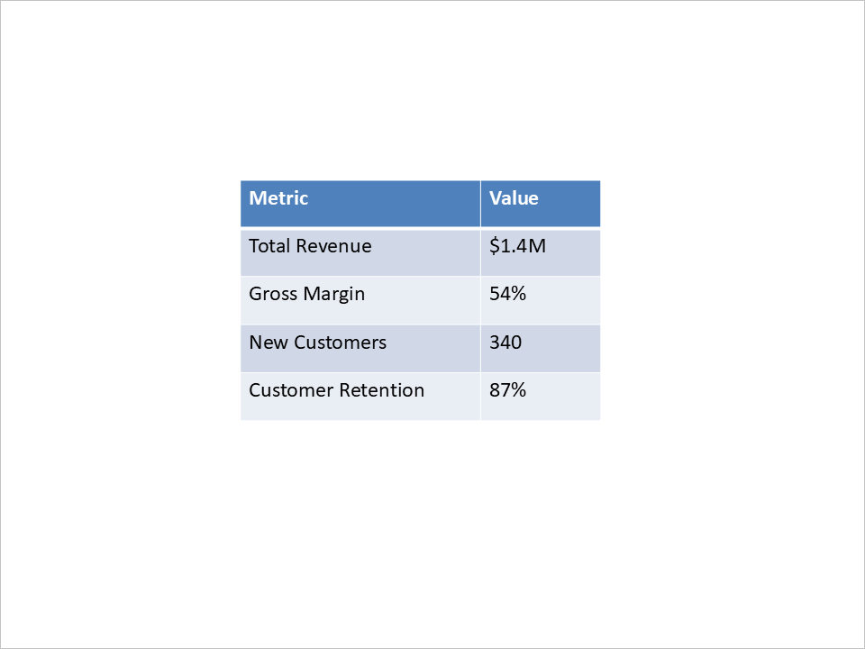

## **소개**

프레젠테이션을 수동으로 만드는 작업은 내용이 자주 바뀔 때 반복적입니다. 주간 보고서, 교육 자료, 고객 프레젠테이션은 공통된 구조를 가지지만 매번 새로운 데이터를 필요로 합니다.

Aspose.Slides for Python via Java를 사용하면 Python 애플리케이션에서 이러한 프레젠테이션을 생성할 수 있습니다. 데이터베이스, API, 업로드된 파일 등으로부터 데이터를 가져와 웹 포털, 예약 작업, 클라우드 워커 등에 슬라이드 생성 기능을 통합할 수 있습니다.

## **Python에서 PowerPoint 자동화의 일반적인 사용 사례**

- **비즈니스 보고서 및 대시보드:** 매출 수치와 성과 지표를 차트와 표로 변환합니다.
- **맞춤형 영업 프레젠테이션:** 일관된 디자인을 유지하면서 클라이언트별 데이터를 슬라이드에 채워 넣습니다.
- **교육 콘텐츠:** 구조화된 자료를 기반으로 강의, 퀴즈, 코스 요약을 조합합니다.
- **데이터 및 AI 기반 인사이트:** 분석 또는 언어 처리 서비스의 결과를 프레젠테이션 내용으로 사용합니다.
- **미디어 기반 슬라이드:** 업로드된 이미지나 스크린샷을 설명 텍스트와 결합합니다.
- **문서 워크플로우:** 다른 도구가 추출한 내용을 프레젠테이션 레이아웃에 매핑합니다.
- **개발자 도구:** 릴리스 요약, 기술 개요, 데모를 프로젝트 데이터에서 자동 생성합니다.

## **전제 조건**

[설치](/slides/ko/python-java/installation/)를 따라 Python, Java, JPype, Aspose.Slides를 설정하십시오. 클라우드 배포의 경우 [Slides on Cloud Platforms](/slides/ko/python-java/slides-on-cloud-platforms/)도 검토하십시오.

예제는 고정된 비즈니스 데이터를 사용하므로 데이터베이스나 외부 서비스 없이 실행할 수 있습니다. 보고서 워크플로에 통합할 때는 이러한 값을 애플리케이션 데이터로 교체하십시오.

{}

라이선스 없이 예제를 실행할 수 있지만 평가 출력에는 워터마크가 포함되고 평가 제한이 적용됩니다. 자세한 내용 및 임시 라이선스 정보는 [Aspose.Slides 평가](/slides/ko/python-java/evaluate-aspose-slides/)를 참고하십시오.

{}

## **프레젠테이션 만들기**

아래 전체 스크립트는 4개의 슬라이드가 포함된 프레젠테이션을 생성합니다. 각 단계는 동일한 프레젠테이션을 사용하며, 마지막 단계에서 `presentation.pptx`로 저장합니다.

### **제목 슬라이드 만들기**

새로운 [Presentation](https://reference.aspose.com/slides/ko/python-java/aspose.slides/presentation/)에서 초기 슬라이드를 사용하고 제목 레이아웃을 적용하십시오. 보고서 제목과 청중 정보를 제목 및 부제 자리표시자에 채워 넣습니다.


### **열 차트가 포함된 슬라이드 추가**

빈 슬라이드를 추가하고 [ShapeCollection.addChart](https://reference.aspose.com/slides/ko/python-java/aspose.slides/shapecollection/#addChart)으로 차트를 생성합니다. 차트에 포함된 워크북을 다섯 개 지역과 하나의 매출 시리즈로 채웁니다. 값은 PowerPoint에서 편집 가능하게 유지됩니다.


### **표가 포함된 슬라이드 추가**

[ShapeCollection.addTable](https://reference.aspose.com/slides/ko/python-java/aspose.slides/shapecollection/#addTable)를 사용해 표를 만들고 두 열에 메트릭 이름과 값을 채워 넣습니다. 예제에서는 JPype를 통해 Java double 배열을 명시적으로 전달합니다.



### **글머리표가 있는 요약 슬라이드 추가**

텍스트 도형을 만들고 각 작업 항목마다 [Paragraph](https://reference.aspose.com/slides/ko/python-java/aspose.slides/paragraph/)를 추가합니다. 기호 글머리표와 검은색 텍스트를 적용하고 도형의 채우기와 윤곽선을 제거합니다.


### **프레젠테이션 저장**

[Presentation.save](https://reference.aspose.com/slides/ko/python-java/aspose.slides/presentation/#save)를 사용해 PowerPoint 파일을 기록합니다. `finally` 블록에서 [Presentation.dispose](https://reference.aspose.com/slides/ko/python-java/aspose.slides/presentation/#dispose)로 프레젠테이션을 해제하십시오.

### **전체 Python 예제**

이 스크립트를 쓰기 가능한 디렉터리에 저장하고 위에서 구성한 Python 환경에서 실행하십시오. 필요할 경우에만 JVM을 시작하고 프로세스 종료 시까지 유지합니다. 노트북 및 서비스 사용에 관한 내용은 [JVM 라이프사이클 가이드](/slides/ko/python-java/limitations-and-api-differences/#import-the-library)를 참고하십시오.

```python
import jpype
import asposeslides
from jpype.types import JArray, JDouble

if not jpype.isJVMStarted():
    jpype.startJVM()

from asposeslides.api import BulletType, ChartType, FillType, LegendPositionType, Paragraph, Presentation, SaveFormat, ShapeType, SlideLayoutType
from java.awt import Color


def create_bullet_paragraph(text):
    paragraph = Paragraph()
    paragraph.getParagraphFormat().getBullet().setType(BulletType.Symbol)
    paragraph.getParagraphFormat().setIndent(15)
    paragraph.getParagraphFormat().getDefaultPortionFormat().getFillFormat().setFillType(FillType.Solid)
    paragraph.getParagraphFormat().getDefaultPortionFormat().getFillFormat().getSolidFillColor().setColor(Color.BLACK)
    paragraph.setText(text)
    return paragraph


presentation = Presentation()
try:
    # 제목 슬라이드 만들기.
    title_slide = presentation.getSlides().get_Item(0)
    title_layout = presentation.getLayoutSlides().getByType(SlideLayoutType.Title)
    title_slide.setLayoutSlide(title_layout)
    title_shape = title_slide.getShapes().get_Item(0)
    subtitle_shape = title_slide.getShapes().get_Item(1)
    title_shape.getTextFrame().setText("Quarterly Business Review – Q1 2025")
    subtitle_shape.getTextFrame().setText("Prepared for Executive Team")

    # 차트 슬라이드 추가.
    blank_layout = presentation.getLayoutSlides().getByType(SlideLayoutType.Blank)
    chart_slide = presentation.getSlides().addEmptySlide(blank_layout)
    chart = chart_slide.getShapes().addChart(ChartType.ClusteredColumn, 100, 100, 500, 350, False)
    chart.getLegend().setPosition(LegendPositionType.Bottom)
    chart.setTitle(True)
    chart.getChartTitle().addTextFrameForOverriding("Data from January – March 2025")
    chart.getChartTitle().setOverlay(False)

    workbook = chart.getChartData().getChartDataWorkbook()
    worksheet_index = 0
    sales = [("North America", 480), ("Europe", 365), ("Asia Pacific", 290), ("Latin America", 150), ("Middle East", 120)]
    for row_index, (region, amount) in enumerate(sales, start=1):
        category_cell = workbook.getCell(worksheet_index, row_index, 0, region)
        chart.getChartData().getCategories().add(category_cell)

    series_cell = workbook.getCell(worksheet_index, 0, 1, "Sales ($K)")
    series = chart.getChartData().getSeries().add(series_cell, chart.getType())
    for row_index, (region, amount) in enumerate(sales, start=1):
        value_cell = workbook.getCell(worksheet_index, row_index, 1, JDouble(amount))
        series.getDataPoints().addDataPointForBarSeries(value_cell)

    # 표 슬라이드 추가.
    table_slide = presentation.getSlides().addEmptySlide(blank_layout)
    column_widths = JArray(JDouble)([200, 100])
    row_heights = JArray(JDouble)([40, 40, 40, 40, 40])
    table = table_slide.getShapes().addTable(200, 200, column_widths, row_heights)
    metrics = [("Metric", "Value"), ("Total Revenue", "$1.4M"), ("Gross Margin", "54%"), ("New Customers", "340"), ("Customer Retention", "87%")]
    for row_index, (metric, value) in enumerate(metrics):
        table.getColumns().get_Item(0).get_Item(row_index).getTextFrame().setText(metric)
        table.getColumns().get_Item(1).get_Item(row_index).getTextFrame().setText(value)

    # 요약 슬라이드 추가.
    summary_slide = presentation.getSlides().addEmptySlide(blank_layout)
    bullet_list = summary_slide.getShapes().addAutoShape(ShapeType.Rectangle, 100, 50, 600, 200)
    bullet_list.getFillFormat().setFillType(FillType.NoFill)
    bullet_list.getLineFormat().getFillFormat().setFillType(FillType.NoFill)
    paragraphs = bullet_list.getTextFrame().getParagraphs()
    paragraphs.clear()
    action_items = ["Strong performance in North America; growth opportunity in Asia Pacific", "Improve marketing outreach in underperforming regions", "Prepare new campaign strategy for Q2", "Schedule follow-up review in early July"]
    for text in action_items:
        paragraph = create_bullet_paragraph(text)
        paragraphs.add(paragraph)

    presentation.save("presentation.pptx", SaveFormat.Pptx)
finally:
    presentation.dispose()
```

삽화는 Java 예제의 해당 슬라이드를 보여줍니다. 설치된 글꼴 및 평가 모드에 따라 외관이 달라질 수 있습니다.

## **클라우드 애플리케이션에서 예제 사용하기**

프레젠테이션을 만들기 전에 보고서 데이터를 가져와 차트, 표, 텍스트 생성 단계에 전달하십시오. 각 작업마다 별도의 출력 경로를 사용합니다. 저장 후 애플리케이션은 파일을 객체 저장소에 업로드하거나 다운로드로 반환할 수 있습니다.

같은 워커 프로세스 내에서 작업 간에 JVM을 계속 실행하고, 작업이 끝나면 각 프레젠테이션을 해제하십시오. 보고서 디자인에 필요한 글꼴을 배포 패키지에 포함시켜 환경 간 차이를 최소화하십시오.

## **결론**

이 예제는 편집 가능한 차트, 표, 텍스트를 사용해 Python에서 완전한 비즈니스 프레젠테이션을 생성합니다. 샘플 데이터를 애플리케이션 데이터로 교체하면 반복 보고서, 고객 프레젠테이션, 교육 자료 등에 동일한 접근 방식을 적용할 수 있습니다.

## **FAQ**

**스크립트가 Microsoft PowerPoint 또는 Excel이 필요합니까?**

아니오. Aspose.Slides는 슬라이드와 차트에 포함된 워크북을 애플리케이션 없이 생성합니다.

**표 예제에서 Java 배열을 사용하는 이유는?**

기본 메서드가 Java double 배열을 받기 때문입니다. 명시적인 배열을 사용해 JPype를 통해 전달되는 숫자 타입을 명확히 합니다.

**같은 프레젠테이션을 PDF 또는 ODP로 저장할 수 있나요?**

예. 해제하기 전에 원하는 출력 파일명과 해당 [SaveFormat](https://reference.aspose.com/slides/ko/python-java/aspose.slides/saveformat/) 값을 사용해 저장하십시오. 포맷별 기능은 [지원 파일 형식](/slides/ko/python-java/supported-file-formats/)을 참고하십시오.

**브랜드 템플릿을 사용할 수 있나요?**

예. 빈 프레젠테이션을 만들 대신 템플릿을 로드하고 레이아웃 및 자리표시자 선택을 템플릿에 맞게 조정하십시오. 샘플은 새 기본 프레젠테이션의 레이아웃 및 자리표시자 순서를 전제로 합니다.