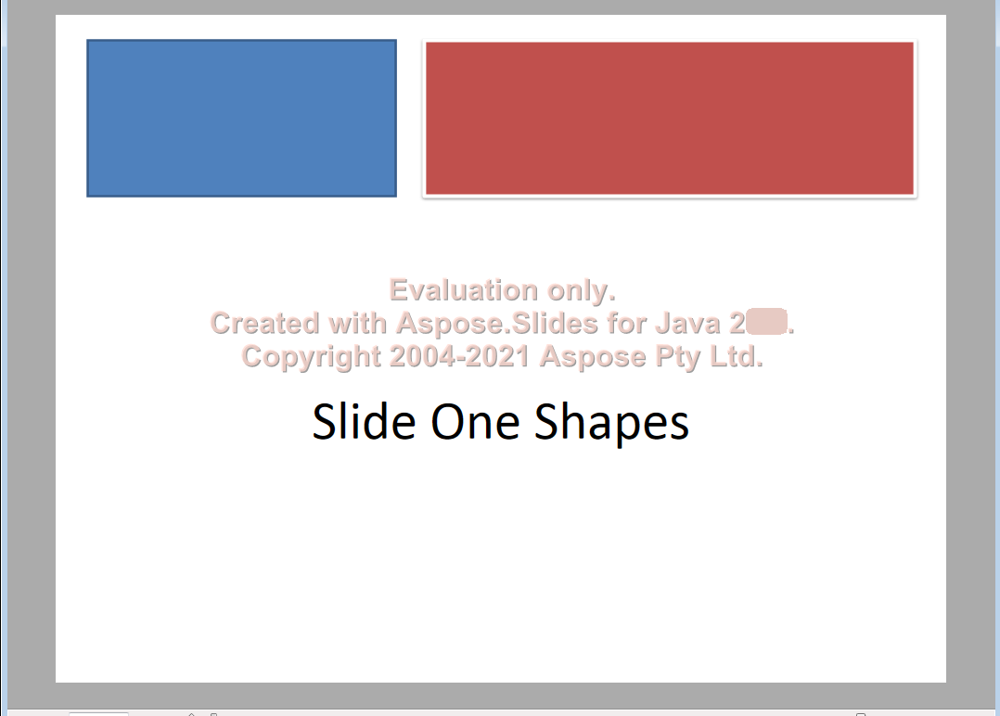

## **개요**

Aspose.Slides를 사용하면 PPT 또는 PPTX 파일을 XPS 형식으로 저장하여 PowerPoint 프레젠테이션을 XPS로 변환할 수 있습니다. 이 문서에서는 XPS 형식이 유용할 수 있는 경우를 설명하고, 기본 설정 또는 사용자 지정 [XpsOptions](https://reference.aspose.com/slides/ko/python-net/aspose.slides.export/xpsoptions/) 설정을 사용하여 Aspose.Slides로 변환하는 방법을 보여줍니다.

## **XPS 소개**
Microsoft는 [PDF](https://docs.fileformat.com/pdf/)의 대안으로 [XPS](https://docs.fileformat.com/page-description-language/xps/)를 개발했습니다. PDF와 매우 유사한 파일을 출력하여 내용을 인쇄할 수 있습니다. XPS 형식은 XML을 기반으로 하며, XPS 파일의 레이아웃이나 구조는 모든 운영 체제와 프린터에서 동일하게 유지됩니다. 

## Microsoft XPS 형식을 사용할 때

{} 

Aspose.Slides가 PPT 또는 PPTX 프레젠테이션을 XPS 형식으로 변환하는 방법을 확인하려면 [이 무료 온라인 변환기 앱](https://products.aspose.app/slides/ko/conversion)을 확인하십시오. 

{} 

스토리지 비용을 절감하고 싶다면 Microsoft PowerPoint 프레젠테이션을 XPS 형식으로 변환할 수 있습니다. 이렇게 하면 문서를 저장·공유·인쇄하기가 더 쉬워집니다. 

Microsoft는 Windows(Windows 10에서도)에서 XPS에 대한 강력한 지원을 지속적으로 구현하고 있으므로 이 형식으로 파일을 저장하는 것을 고려할 수 있습니다. Windows 8.1, Windows 8, Windows 7 및 Windows Vista를 사용 중이라면 특정 작업에 대해 XPS가 실제로 가장 좋은 옵션이 될 수 있습니다. 

- **Windows 8**은 XPS 파일에 OXPS(Open XPS) 형식을 사용합니다. OXPS는 원래 XPS 형식의 표준화 버전이며, Windows 8은 PDF 파일보다 XPS 파일에 대한 지원이 더 우수합니다. 
  - **XPS:** 기본 제공 XPS 뷰어/리더 및 XPS 인쇄 기능 사용 가능. 
  - **PDF:** PDF 리더는 있지만 PDF 인쇄 기능은 없음. 

- **Windows 7 및 Windows Vista**는 원래 XPS 형식을 사용합니다. 이러한 운영 체제 역시 PDF보다 XPS 파일에 대한 지원이 더 좋습니다. 
  - **XPS:** 기본 제공 XPS 뷰어 및 XPS 인쇄 기능 사용 가능. 
  - **PDF:** PDF 리더 없음. PDF 인쇄 기능 없음. 

|<p>**입력 PPT(X):**</p><p>****</p>|<p>**출력 XPS:**</p><p>****</p>|
| :- | :- |


Microsoft는 Windows 10의 Print to PDF 기능을 통해 PDF 인쇄 작업에 대한 지원을 최종적으로 구현했습니다. 이전에는 사용자가 XPS 형식을 통해 문서를 인쇄해야 했습니다. 

## Aspose.Slides를 사용한 XPS 변환

.NET용 [**Aspose.Slides**](https://products.aspose.com/slides/ko/python-net/)에서는 [Presentation](https://reference.aspose.com/slides/ko/python-net/aspose.slides/presentation/) 클래스가 제공하는 [**Save**](https://reference.aspose.com/slides/ko/python-net/aspose.slides/presentation/) 메서드를 사용하여 전체 프레젠테이션을 XPS 문서로 변환할 수 있습니다. 

프레젠테이션을 XPS로 변환할 때는 다음 설정 중 하나를 사용해 저장해야 합니다.

- 기본 설정( [**XPSOptions**](https://reference.aspose.com/slides/ko/python-net/aspose.slides.export/xpsoptions/) 없이)
- 사용자 지정 설정( [**XPSOptions**](https://reference.aspose.com/slides/ko/python-net/aspose.slides.export/xpsoptions/) 사용)

### **기본 설정을 사용한 프레젠테이션 XPS 변환**

다음 Python 샘플 코드는 기본 설정을 사용해 프레젠테이션을 XPS 문서로 변환하는 방법을 보여줍니다.

```py
import aspose.slides as slides

# 프레젠테이션 파일을 나타내는 Presentation 객체를 인스턴스화합니다
pres = slides.Presentation("Convert_XPS.pptx")

# 프레젠테이션을 XPS 문서로 저장합니다
pres.save("XPS_Output_Without_XPSOption_out.xps", slides.export.SaveFormat.XPS)
```

### **사용자 지정 설정을 사용한 프레젠테이션 XPS 변환**
다음 샘플 코드는 Python에서 사용자 지정 설정을 사용해 프레젠테이션을 XPS 문서로 변환하는 방법을 보여줍니다.

```py
import aspose.slides as slides

# 프레젠테이션 파일을 나타내는 Presentation 객체를 인스턴스화합니다
pres = slides.Presentation("Convert_XPS_Options.pptx")

# TiffOptions 클래스를 인스턴스화합니다
options = slides.export.XpsOptions()

# MetaFiles를 PNG로 저장합니다
options.save_metafiles_as_png = True

# 프레젠테이션을 XPS 문서로 저장합니다
pres.save("XPS_With_Options_out.xps", slides.export.SaveFormat.XPS, options)
```

## **FAQ**

**스트림에 XPS를 저장하고 파일 대신 사용할 수 있나요?**

예—Aspose.Slides는 스트림으로 직접 내보내는 기능을 제공하므로 웹 API, 서버 측 파이프라인 또는 파일 시스템에 접근하지 않고 XPS를 전송해야 하는 모든 시나리오에 적합합니다.

**숨긴 슬라이드가 XPS에 포함되며, 이를 제외할 수 있나요?**

기본적으로 일반(보이는) 슬라이드만 렌더링됩니다. 저장 전에 [export settings](https://reference.aspose.com/slides/ko/python-net/aspose.slides.export/xpsoptions/)를 통해 [숨긴 슬라이드 포함 또는 제외](https://reference.aspose.com/slides/ko/python-net/aspose.slides.export/xpsoptions/show_hidden_slides/)를 지정할 수 있어 원하는 페이지만 출력에 포함할 수 있습니다.