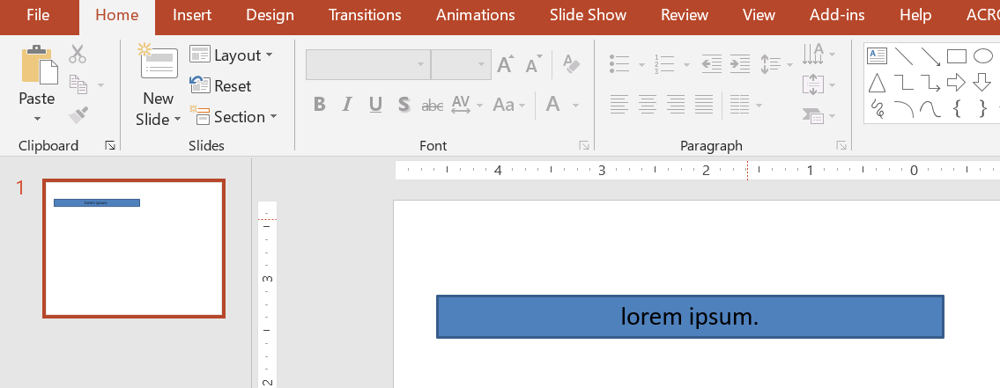

## **소개**

기본적으로 텍스트 상자를 추가하면 Microsoft PowerPoint는 텍스트 상자에 대해 **Resize shape to fix text** 설정을 사용합니다—텍스트가 항상 들어갈 수 있도록 텍스트 상자의 크기를 자동으로 조정합니다. 



* 텍스트 상자의 텍스트가 길어지거나 커지면 PowerPoint가 자동으로 텍스트 상자를 확대(높이를 증가)하여 더 많은 텍스트를 담을 수 있게 합니다. 
* 텍스트 상자의 텍스트가 짧아지거나 작아지면 PowerPoint가 자동으로 텍스트 상자를 축소(높이를 감소)하여 불필요한 공간을 없앱니다. 

PowerPoint에서 텍스트 상자의 자동 맞춤 동작을 제어하는 4가지 중요한 매개변수 및 옵션은 다음과 같습니다: 

* **Do not Autofit**
* **Shrink text on overflow**
* **Resize shape to fit text**
* **Wrap text in shape.**


Aspose.Slides for Python via .NET는 비슷한 옵션—[TextFrameFormat](https://reference.aspose.com/slides/ko/python-net/aspose.slides/textframeformat/) 클래스 아래 몇몇 속성—을 제공하여 프레젠테이션의 텍스트 상자 자동 맞춤 동작을 제어할 수 있습니다. 

## **텍스트에 맞게 도형 크기 조정**

텍스트가 변경된 후에도 항상 텍스트 상자 안에 맞게 하려면 **Resize shape to fix text** 옵션을 사용해야 합니다. 이 설정을 지정하려면 [TextFrameFormat](https://reference.aspose.com/slides/ko/python-net/aspose.slides/textframeformat/) 클래스의 [autofit_type](https://reference.aspose.com/slides/ko/python-net/aspose.slides/textframeformat/) 속성을 `SHAPE` 로 설정합니다. 


이 Python 코드는 텍스트가 항상 상자에 맞도록 지정하는 방법을 보여줍니다:

```py
import aspose.slides as slides
import aspose.pydrawing as draw

with slides.Presentation() as presentation:
    slide = presentation.slides[0]
    auto_shape = slide.shapes.add_auto_shape(slides.ShapeType.RECTANGLE, 30, 30, 350, 100)

    portion = slides.Portion("lorem ipsum...")
    portion.portion_format.fill_format.solid_fill_color.color = draw.Color.black
    portion.portion_format.fill_format.fill_type = slides.FillType.SOLID
    auto_shape.text_frame.paragraphs[0].portions.add(portion)

    text_frame_format = auto_shape.text_frame.text_frame_format
    text_frame_format.autofit_type = slides.TextAutofitType.SHAPE

    presentation.save("output.pptx", slides.export.SaveFormat.PPTX)
```

텍스트가 길어지거나 커지면 텍스트 상자가 자동으로 크기 조정(높이 증가)되어 모든 텍스트가 들어갑니다. 텍스트가 짧아지면 그 반대가 발생합니다. 

## **자동 맞춤 안 함**

텍스트가 변경되어도 텍스트 상자나 도형의 크기를 유지하려면 **Do not Autofit** 옵션을 사용해야 합니다. 이 설정을 지정하려면 [TextFrameFormat](https://reference.aspose.com/slides/ko/python-net/aspose.slides/textframeformat/) 클래스의 [autofit_type](https://reference.aspose.com/slides/ko/python-net/aspose.slides/textframeformat/) 속성을 `NONE` 로 설정합니다. 


이 Python 코드는 텍스트 상자가 항상 차원을 유지하도록 지정하는 방법을 보여줍니다:

```py
import aspose.slides as slides
import aspose.pydrawing as draw

with slides.Presentation() as presentation:
    slide = presentation.slides[0]
    auto_shape = slide.shapes.add_auto_shape(slides.ShapeType.RECTANGLE, 30, 30, 350, 100)

    portion = slides.Portion("lorem ipsum...")
    portion.portion_format.fill_format.solid_fill_color.color = draw.Color.black
    portion.portion_format.fill_format.fill_type = slides.FillType.SOLID
    auto_shape.text_frame.paragraphs[0].portions.add(portion)

    text_frame_format = auto_shape.text_frame.text_frame_format
    text_frame_format.autofit_type = slides.TextAutofitType.NONE

    presentation.save("output.pptx", slides.export.SaveFormat.PPTX)
```

텍스트가 상자보다 길어지면 텍스트가 넘칩니다. 

## **Overflow 시 텍스트 축소**

텍스트가 상자보다 길어질 경우 **Shrink text on overflow** 옵션을 사용하면 텍스트 크기와 간격을 줄여 상자에 맞출 수 있습니다. 이 설정을 지정하려면 [TextFrameFormat](https://reference.aspose.com/slides/ko/python-net/aspose.slides/textframeformat/) 클래스의 [autofit_type](https://reference.aspose.com/slides/ko/python-net/aspose.slides/textframeformat/) 속성을 `NORMAL` 로 설정합니다. 


이 Python 코드는 Overflow 시 텍스트를 축소하도록 지정하는 방법을 보여줍니다:

```py
import aspose.slides as slides
import aspose.pydrawing as draw

with slides.Presentation() as presentation:
    slide = presentation.slides[0]
    auto_shape = slide.shapes.add_auto_shape(slides.ShapeType.RECTANGLE, 30, 30, 350, 100)

    portion = slides.Portion("lorem ipsum...")
    portion.portion_format.fill_format.solid_fill_color.color = draw.Color.black
    portion.portion_format.fill_format.fill_type = slides.FillType.SOLID
    auto_shape.text_frame.paragraphs[0].portions.add(portion)

    text_frame_format = auto_shape.text_frame.text_frame_format
    text_frame_format.autofit_type = slides.TextAutofitType.NORMAL

    presentation.save("output.pptx", slides.export.SaveFormat.PPTX)
```

{}
**Shrink text on overflow** 옵션이 사용될 때, 텍스트가 상자보다 길어지는 경우에만 설정이 적용됩니다. 
{}

## **텍스트 자동 줄바꿈**

텍스트가 도형의 경계(너비) 밖으로 나갈 경우 해당 도형 내부에서 줄바꿈되도록 하려면 **Wrap text in shape** 매개변수를 사용해야 합니다. 이 설정을 지정하려면 [TextFrameFormat](https://reference.aspose.com/slides/ko/python-net/aspose.slides/textframeformat/) 클래스의 [wrap_text](https://reference.aspose.com/slides/ko/python-net/aspose.slides/textframeformat/) 속성을 `NullableBool.TRUE` 로 설정합니다. 

이 Python 코드는 PowerPoint 프레젠테이션에서 텍스트 자동 줄바꿈 설정을 사용하는 방법을 보여줍니다:

```py
import aspose.slides as slides
import aspose.pydrawing as draw

with slides.Presentation() as presentation:
    slide = presentation.slides[0]
    auto_shape = slide.shapes.add_auto_shape(slides.ShapeType.RECTANGLE, 30, 30, 350, 100)

    portion = slides.Portion("lorem ipsum...")
    portion.portion_format.fill_format.solid_fill_color.color = draw.Color.black
    portion.portion_format.fill_format.fill_type = slides.FillType.SOLID
    auto_shape.text_frame.paragraphs[0].portions.add(portion)

    text_frame_format = auto_shape.text_frame.text_frame_format
    text_frame_format.autofit_type = slides.TextAutofitType.NONE
    text_frame_format.wrap_text = slides.NullableBool.TRUE

    presentation.save("output.pptx", slides.export.SaveFormat.PPTX)
```

{} 
도형에 대해 `wrap_text` 속성을 `NullableBool.FALSE` 로 설정하면, 텍스트가 도형 너비보다 길어질 때 텍스트가 한 줄로 도형 경계를 넘어 확장됩니다. 
{}

## **FAQ**

**텍스트 프레임 내부 여백이 AutoFit에 영향을 줍니까?**  
예. 패딩(내부 여백) 때문에 사용 가능한 텍스트 영역이 줄어들어 AutoFit이 더 일찍 작동합니다—글꼴을 축소하거나 도형 크기를 더 빨리 조정합니다. 여백을 확인하고 조정한 후 AutoFit을 튜닝하십시오.

**AutoFit은 수동 및 소프트 라인 브레이크와 어떻게 상호 작용합니까?**  
강제 브레이크는 유지되며 AutoFit은 그 주위에서 글꼴 크기와 간격을 조정합니다. 불필요한 브레이크를 제거하면 AutoFit이 텍스트를 축소해야 하는 정도가 감소합니다.

**테마 글꼴을 변경하거나 글꼴 대체가 AutoFit 결과에 영향을 줍니까?**  
예. 다른 글리프 메트릭을 가진 글꼴로 대체하면 텍스트 너비/높이가 변해 최종 글꼴 크기와 줄 바꿈이 달라질 수 있습니다. 글꼴을 변경하거나 대체한 후 슬라이드를 다시 확인하십시오.