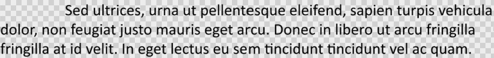

## **소개**

Aspose.Slides는 Python에서 PowerPoint 텍스트를 작업하기 위해 필요한 클래스를 제공합니다.

* Aspose.Slides는 텍스트 프레임 객체를 만들기 위한 [TextFrame](https://reference.aspose.com/slides/ko/python-net/aspose.slides/textframe/) 클래스를 제공합니다. `TextFrame` 객체에는 하나 이상의 단락을 포함할 수 있으며(각 단락은 캐리지 리턴으로 구분됩니다).
* Aspose.Slides는 단락 객체를 만들기 위한 [Paragraph](https://reference.aspose.com/slides/ko/python-net/aspose.slides/paragraph/) 클래스를 제공합니다. `Paragraph` 객체는 하나 이상의 텍스트 부분을 포함할 수 있습니다.
* Aspose.Slides는 텍스트 부분 객체를 만들고 해당 서식 속성을 지정하기 위한 [Portion](https://reference.aspose.com/slides/ko/python-net/aspose.slides/portion/) 클래스를 제공합니다.

`Paragraph` 객체는 기본 `Portion` 객체를 통해 다양한 서식 속성을 가진 텍스트를 처리할 수 있습니다.

## **여러 부분을 포함하는 여러 단락 추가**

다음 단계에서는 세 개의 단락이 각각 세 개의 부분을 포함하는 텍스트 프레임을 추가하는 방법을 보여줍니다.

1. [Presentation](https://reference.aspose.com/slides/ko/python-net/aspose.slides/presentation/) 클래스의 인스턴스를 생성합니다.
1. 인덱스를 사용하여 대상 슬라이드에 대한 참조를 가져옵니다.
1. 슬라이드에 사각형 [AutoShape](https://reference.aspose.com/slides/ko/python-net/aspose.slides/autoshape/)을 추가합니다.
1. [AutoShape](https://reference.aspose.com/slides/ko/python-net/aspose.slides/autoshape/)와 연결된 [TextFrame](https://reference.aspose.com/slides/ko/python-net/aspose.slides/textframe/)을 가져옵니다.
1. 두 개의 [Paragraph](https://reference.aspose.com/slides/ko/python-net/aspose.slides/paragraph/) 객체를 생성하고 이를 [TextFrame](https://reference.aspose.com/slides/ko/python-net/aspose.slides/textframe/)의 단락 컬렉션에 추가합니다(기본 단락과 함께 세 개의 단락이 됩니다).
1. 각 단락마다 세 개의 [Portion](https://reference.aspose.com/slides/ko/python-net/aspose.slides/portion/) 객체를 생성하고 해당 단락의 부분 컬렉션에 추가합니다.
1. 각 부분의 텍스트를 설정합니다.
1. [Portion](https://reference.aspose.com/slides/ko/python-net/aspose.slides/portion/)이 제공하는 속성을 사용하여 각 텍스트 부분에 원하는 서식을 적용합니다.
1. 수정된 프레젠테이션을 저장합니다.

다음 Python 코드가 이러한 단계를 구현합니다:

```python
import aspose.slides as slides
import aspose.pydrawing as draw

# 프레젠테이션 클래스를 인스턴스화하여 새 PPTX 파일을 생성합니다.
with slides.Presentation() as presentation:

    # 첫 번째 슬라이드에 접근합니다.
    slide = presentation.slides[0]

    # 사각형 AutoShape를 추가합니다.
    shape = slide.shapes.add_auto_shape(slides.ShapeType.RECTANGLE, 50, 150, 300, 150)

    # AutoShape의 TextFrame에 접근합니다.
    text_frame = shape.text_frame

    # 단락과 부분을 생성합니다; 서식은 아래에서 적용됩니다.
    paragraph0 = text_frame.paragraphs[0]
    portion01 = slides.Portion()
    portion02 = slides.Portion()
    paragraph0.portions.add(portion01)
    paragraph0.portions.add(portion02)

    paragraph1 = slides.Paragraph()
    text_frame.paragraphs.add(paragraph1)
    portion10 = slides.Portion()
    portion11 = slides.Portion()
    portion12 = slides.Portion()
    paragraph1.portions.add(portion10)
    paragraph1.portions.add(portion11)
    paragraph1.portions.add(portion12)

    paragraph2 = slides.Paragraph()
    text_frame.paragraphs.add(paragraph2)
    portion20 = slides.Portion()
    portion21 = slides.Portion()
    portion22 = slides.Portion()
    paragraph2.portions.add(portion20)
    paragraph2.portions.add(portion21)
    paragraph2.portions.add(portion22)

    for i in range(3):
        for j in range(3):
            text_frame.paragraphs[i].portions[j].text = "Portion0" + str(j)
            if j == 0:
                text_frame.paragraphs[i].portions[j].portion_format.fill_format.fill_type = slides.FillType.SOLID
                text_frame.paragraphs[i].portions[j].portion_format.fill_format.solid_fill_color.color = draw.Color.red
                text_frame.paragraphs[i].portions[j].portion_format.font_bold = 1
                text_frame.paragraphs[i].portions[j].portion_format.font_height = 15
            elif j == 1:
                text_frame.paragraphs[i].portions[j].portion_format.fill_format.fill_type = slides.FillType.SOLID
                text_frame.paragraphs[i].portions[j].portion_format.fill_format.solid_fill_color.color = draw.Color.blue
                text_frame.paragraphs[i].portions[j].portion_format.font_italic = 1
                text_frame.paragraphs[i].portions[j].portion_format.font_height = 18

    # PPTX를 디스크에 저장합니다.
    presentation.save("paragraphs_and_portions_out.pptx", slides.export.SaveFormat.PPTX)
```

## **단락 글머리표 관리**

글머리표 목록은 정보를 빠르고 효율적으로 조직하고 제시하는 데 도움이 됩니다. 글머리표가 있는 단락은 종종 읽고 이해하기가 더 쉽습니다.

1. [Presentation](https://reference.aspose.com/slides/ko/python-net/aspose.slides/presentation/) 클래스의 인스턴스를 생성합니다.
1. 인덱스를 사용하여 대상 슬라이드에 접근합니다.
1. 슬라이드에 [AutoShape](https://reference.aspose.com/slides/ko/python-net/aspose.slides/autoshape/)을 추가합니다.
1. 도형의 [TextFrame](https://reference.aspose.com/slides/ko/python-net/aspose.slides/textframe/)에 접근합니다.
1. [TextFrame](https://reference.aspose.com/slides/ko/python-net/aspose.slides/textframe/)에서 기본 단락을 제거합니다.
1. [Paragraph](https://reference.aspose.com/slides/ko/python-net/aspose.slides/paragraph/) 클래스를 사용하여 첫 번째 단락을 생성합니다.
1. 단락의 글머리표 유형을 `SYMBOL`로 설정하고 글머리표 문자를 지정합니다.
1. 단락의 텍스트를 설정합니다.
1. 단락의 글머리표 들여쓰기를 설정합니다.
1. 글머리표 색상을 설정합니다.
1. 글머리표 크기(높이)를 설정합니다.
1. 단락을 [TextFrame](https://reference.aspose.com/slides/ko/python-net/aspose.slides/textframe/)의 단락 컬렉션에 추가합니다.
1. 두 번째 단락을 추가하고 단계 7~12를 반복합니다.
1. 프레젠테이션을 저장합니다.

다음 Python 코드는 글머리표 단락을 추가하는 방법을 보여줍니다:

```python
import aspose.slides as slides
import aspose.pydrawing as draw

# 프레젠테이션 인스턴스를 생성합니다.
with slides.Presentation() as presentation:

    # 첫 번째 슬라이드에 접근합니다.
    slide = presentation.slides[0]

    # AutoShape을 추가하고 접근합니다.
    shape = slide.shapes.add_auto_shape(slides.ShapeType.RECTANGLE, 200, 200, 400, 200)

    # 생성된 AutoShape의 텍스트 프레임에 접근합니다.
    text_frame = shape.text_frame

    # 기본 단락을 제거합니다.
    text_frame.paragraphs.remove_at(0)

    # 단락을 생성합니다.
    paragraph = slides.Paragraph()

    # 단락의 글머리표 스타일과 기호를 설정합니다.
    paragraph.paragraph_format.bullet.type = slides.BulletType.SYMBOL
    paragraph.paragraph_format.bullet.char = chr(8226)

    # 단락 텍스트를 설정합니다.
    paragraph.text = "Welcome to Aspose.Slides"

    # 글머리표 들여쓰기를 설정합니다.
    paragraph.paragraph_format.indent = 25

    # 글머리표 색상을 설정합니다.
    paragraph.paragraph_format.bullet.color.color_type = slides.ColorType.RGB
    paragraph.paragraph_format.bullet.color.color = draw.Color.black
    paragraph.paragraph_format.bullet.is_bullet_hard_color = 1 

    # 글머리표 높이를 설정합니다.
    paragraph.paragraph_format.bullet.height = 100

    # 단락을 텍스트 프레임에 추가합니다.
    text_frame.paragraphs.add(paragraph)

    # 두 번째 단락을 생성합니다.
    paragraph2 = slides.Paragraph()

    # 단락의 글머리표 유형과 스타일을 설정합니다.
    paragraph2.paragraph_format.bullet.type = slides.BulletType.NUMBERED
    paragraph2.paragraph_format.bullet.numbered_bullet_style = slides.NumberedBulletStyle.BULLET_CIRCLE_NUM_WDBLACK_PLAIN

    # 단락 텍스트를 설정합니다.
    paragraph2.text = "This is numbered bullet"

    # 글머리표 들여쓰기를 설정합니다.
    paragraph2.paragraph_format.indent = 25

    # 글머리표 색상을 설정합니다.
    paragraph2.paragraph_format.bullet.color.color_type = slides.ColorType.RGB
    paragraph2.paragraph_format.bullet.color.color = draw.Color.black
    paragraph2.paragraph_format.bullet.is_bullet_hard_color = 1

    # 글머리표 높이를 설정합니다.
    paragraph2.paragraph_format.bullet.height = 100

    # 단락을 텍스트 프레임에 추가합니다.
    text_frame.paragraphs.add(paragraph2)

    # 프레젠테이션을 PPTX 파일로 저장합니다.
    presentation.save("bullets_out.pptx", slides.export.SaveFormat.PPTX)
```

## **그림 글머리표 관리**

글머리표 목록은 정보를 빠르고 효율적으로 조직하고 제시하는 데 도움이 됩니다. 그림 글머리표는 읽고 이해하기 쉽습니다.

1. [Presentation](https://reference.aspose.com/slides/ko/python-net/aspose.slides/presentation/) 클래스의 인스턴스를 생성합니다.
1. 인덱스를 사용하여 대상 슬라이드에 접근합니다.
1. 슬라이드에 [AutoShape](https://reference.aspose.com/slides/ko/python-net/aspose.slides/autoshape/)을 추가합니다.
1. 도형의 [TextFrame](https://reference.aspose.com/slides/ko/python-net/aspose.slides/textframe/)에 접근합니다.
1. [TextFrame](https://reference.aspose.com/slides/ko/python-net/aspose.slides/textframe/)에서 기본 단락을 제거합니다.
1. [Paragraph](https://reference.aspose.com/slides/ko/python-net/aspose.slides/paragraph/) 클래스를 사용하여 첫 번째 단락을 생성합니다.
1. [PPImage](https://reference.aspose.com/slides/ko/python-net/aspose.slides/ppimage/)에 이미지를 로드합니다.
1. 글머리표 유형을 [PPImage](https://reference.aspose.com/slides/ko/python-net/aspose.slides/ppimage/)으로 설정하고 이미지를 할당합니다.
1. 단락의 텍스트를 설정합니다.
1. 글머리표에 대한 단락 들여쓰기를 설정합니다.
1. 글머리표 색상을 설정합니다.
1. 글머리표 높이를 설정합니다.
1. 새 단락을 [TextFrame](https://reference.aspose.com/slides/ko/python-net/aspose.slides/textframe/)의 단락 컬렉션에 추가합니다.
1. 두 번째 단락을 추가하고 단계 8~12를 반복합니다.
1. 프레젠테이션을 저장합니다.

다음 Python 코드는 그림 글머리표를 추가하고 관리하는 방법을 보여줍니다:

```python
import aspose.slides as slides
import aspose.pydrawing as draw

with slides.Presentation() as presentation:

    # 첫 번째 슬라이드에 접근합니다.
    slide = presentation.slides[0]

    # 글머리표 이미지를 로드합니다.
    image = draw.Bitmap("bullets.png")
    pp_image = presentation.images.add_image(image)

    # AutoShape을 추가하고 접근합니다.
    auto_shape = slide.shapes.add_auto_shape(slides.ShapeType.RECTANGLE, 200, 200, 400, 200)

    # 생성된 AutoShape의 TextFrame에 접근합니다.
    text_frame = auto_shape.text_frame

    # 기본 단락을 제거합니다.
    text_frame.paragraphs.remove_at(0)

    # 새 단락을 생성합니다.
    paragraph = slides.Paragraph()
    paragraph.text = "Welcome to Aspose.Slides"

    # 단락의 글머리표 유형을 Picture(그림)으로 설정하고 이미지를 할당합니다.
    paragraph.paragraph_format.bullet.type = slides.BulletType.PICTURE
    paragraph.paragraph_format.bullet.picture.image = pp_image

    # 글머리표 높이를 설정합니다.
    paragraph.paragraph_format.bullet.height = 100

    # 단락을 텍스트 프레임에 추가합니다.
    text_frame.paragraphs.add(paragraph)

    # 프레젠테이션을 PPTX 파일로 저장합니다.
    presentation.save("picture_bullets_out.pptx", slides.export.SaveFormat.PPTX)
    # 프레젠테이션을 PPT 파일로 저장합니다.
    presentation.save("picture_bullets_out.ppt", slides.export.SaveFormat.PPT)
```

## **다단계 글머리표 관리**

글머리표 목록은 정보를 빠르고 효율적으로 조직하고 제시하는 데 도움이 됩니다. 다단계 글머리표는 읽고 이해하기 쉽습니다.

1. [Presentation](https://reference.aspose.com/slides/ko/python-net/aspose.slides/presentation/) 클래스의 인스턴스를 생성합니다.
1. 인덱스를 사용하여 대상 슬라이드에 접근합니다.
1. 슬라이드에 [AutoShape](https://reference.aspose.com/slides/ko/python-net/aspose.slides/autoshape/)을 추가합니다.
1. [AutoShape](https://reference.aspose.com/slides/ko/python-net/aspose.slides/autoshape/)의 [TextFrame](https://reference.aspose.com/slides/ko/python-net/aspose.slides/textframe/)에 접근합니다.
1. [TextFrame](https://reference.aspose.com/slides/ko/python-net/aspose.slides/textframe/)에서 기본 단락을 제거합니다.
1. [Paragraph](https://reference.aspose.com/slides/ko/python-net/aspose.slides/paragraph/) 클래스를 사용하여 첫 번째 단락을 생성하고 깊이를 0으로 설정합니다.
1. [Paragraph](https://reference.aspose.com/slides/ko/python-net/aspose.slides/paragraph/) 클래스를 사용하여 두 번째 단락을 생성하고 깊이를 1으로 설정합니다.
1. [Paragraph](https://reference.aspose.com/slides/ko/python-net/aspose.slides/paragraph/) 클래스를 사용하여 세 번째 단락을 생성하고 깊이를 2로 설정합니다.
1. [Paragraph](https://reference.aspose.com/slides/ko/python-net/aspose.slides/paragraph/) 클래스를 사용하여 네 번째 단락을 생성하고 깊이를 3으로 설정합니다.
1. 새 단락들을 [TextFrame](https://reference.aspose.com/slides/ko/python-net/aspose.slides/textframe/)의 단락 컬렉션에 추가합니다.
1. 프레젠테이션을 저장합니다.

다음 Python 코드가 다단계 글머리표를 추가하고 관리하는 방법을 보여줍니다:

```python
import aspose.slides as slides
import aspose.pydrawing as draw

# 프레젠테이션 인스턴스를 생성합니다.
with slides.Presentation() as presentation:

    # 첫 번째 슬라이드에 접근합니다.
    slide = presentation.slides[0]
    
    # AutoShape을 추가합니다.
    shape = slide.shapes.add_auto_shape(slides.ShapeType.RECTANGLE, 200, 200, 400, 200)

    # 생성된 AutoShape의 TextFrame에 접근합니다.
    text_frame = auto_shape.text_frame
    
    # 기본 단락을 모두 제거합니다.
    text_frame.paragraphs.clear()

    # 첫 번째 단락을 추가합니다.
    paragraph1 = slides.Paragraph()
    paragraph1.text = "Content"
    paragraph1.paragraph_format.bullet.type = slides.BulletType.SYMBOL
    paragraph1.paragraph_format.bullet.char = chr(8226)
    paragraph1.paragraph_format.default_portion_format.fill_format.fill_type = slides.FillType.SOLID
    paragraph1.paragraph_format.default_portion_format.fill_format.solid_fill_color.color = draw.Color.black
    # 글머리표 수준을 설정합니다.
    paragraph1.paragraph_format.depth = 0

    # 두 번째 단락을 추가합니다.
    paragraph2 = slides.Paragraph()
    paragraph2.text = "Second Level"
    paragraph2.paragraph_format.bullet.type = slides.BulletType.SYMBOL
    paragraph2.paragraph_format.bullet.char = '-'
    paragraph2.paragraph_format.default_portion_format.fill_format.fill_type = slides.FillType.SOLID
    paragraph2.paragraph_format.default_portion_format.fill_format.solid_fill_color.color = draw.Color.black
    # 글머리표 수준을 설정합니다.
    paragraph2.paragraph_format.depth = 1

    # 세 번째 단락을 추가합니다.
    paragraph3 = slides.Paragraph()
    paragraph3.text = "Third Level"
    paragraph3.paragraph_format.bullet.type = slides.BulletType.SYMBOL
    paragraph3.paragraph_format.bullet.char = chr(8226)
    paragraph3.paragraph_format.default_portion_format.fill_format.fill_type = slides.FillType.SOLID
    paragraph3.paragraph_format.default_portion_format.fill_format.solid_fill_color.color = draw.Color.black
    # 글머리표 수준을 설정합니다.
    paragraph3.paragraph_format.depth = 2

    # 네 번째 단락을 추가합니다.
    paragraph4 = slides.Paragraph()
    paragraph4.text = "Fourth Level"
    paragraph4.paragraph_format.bullet.type = slides.BulletType.SYMBOL
    paragraph4.paragraph_format.bullet.char = '-'
    paragraph4.paragraph_format.default_portion_format.fill_format.fill_type = slides.FillType.SOLID
    paragraph4.paragraph_format.default_portion_format.fill_format.solid_fill_color.color = draw.Color.black
    # 글머리표 수준을 설정합니다.
    paragraph4.paragraph_format.depth = 3

    # 단락들을 컬렉션에 추가합니다.
    text_frame.paragraphs.add(paragraph1)
    text_frame.paragraphs.add(paragraph2)
    text_frame.paragraphs.add(paragraph3)
    text_frame.paragraphs.add(paragraph4)

    # 프레젠테이션을 PPTX 파일로 저장합니다.
    presentation.save("multilevel_bullets_out.pptx", slides.export.SaveFormat.PPTX)
```

## **사용자 지정 번호 매기기 목록을 사용한 단락 관리**

[BulletFormat](https://reference.aspose.com/slides/ko/python-net/aspose.slides/bulletformat/) 클래스는 단락에 대한 사용자 지정 번호 매기기와 서식을 제어하기 위해 `numbered_bullet_start_with` 속성(및 기타)을 제공합니다.

1. [Presentation](https://reference.aspose.com/slides/ko/python-net/aspose.slides/presentation/) 클래스의 인스턴스를 생성합니다.
1. 단락을 포함할 슬라이드에 접근합니다.
1. 슬라이드에 [AutoShape](https://reference.aspose.com/slides/ko/python-net/aspose.slides/autoshape/)을 추가합니다.
1. 도형의 [TextFrame](https://reference.aspose.com/slides/ko/python-net/aspose.slides/textframe/)에 접근합니다.
1. [TextFrame](https://reference.aspose.com/slides/ko/python-net/aspose.slides/textframe/)에서 기본 단락을 제거합니다.
1. 첫 번째 [Paragraph](https://reference.aspose.com/slides/ko/python-net/aspose.slides/paragraph/)을 생성하고 `numbered_bullet_start_with`를 2로 설정합니다.
1. 두 번째 [Paragraph](https://reference.aspose.com/slides/ko/python-net/aspose.slides/paragraph/)을 생성하고 `numbered_bullet_start_with`를 3으로 설정합니다.
1. 세 번째 [Paragraph](https://reference.aspose.com/slides/ko/python-net/aspose.slides/paragraph/)을 생성하고 `numbered_bullet_start_with`를 7로 설정합니다.
1. 단락들을 [TextFrame](https://reference.aspose.com/slides/ko/python-net/aspose.slides/textframe/)의 컬렉션에 추가합니다.
1. 프레젠테이션을 저장합니다.

다음 Python 코드는 사용자 지정 번호 매기기와 서식을 사용한 단락을 추가하고 관리하는 방법을 보여줍니다.

```python
import aspose.slides as slides

with slides.Presentation() as presentation:

    # AutoShape을 추가하고 접근합니다.
    shape = presentation.slides[0].shapes.add_auto_shape(slides.ShapeType.RECTANGLE, 200, 200, 400, 200)

    # 생성된 AutoShape의 TextFrame에 접근합니다.
    text_frame = shape.text_frame

    # 기본 기존 단락을 제거합니다.
    text_frame.paragraphs.remove_at(0)

    # 첫 번째 번호 매긴 항목을 생성합니다 (시작 번호 2, 깊이 레벨 4).
    paragraph1 = slides.Paragraph()
    paragraph1.text = "bullet 2"
    paragraph1.paragraph_format.depth = 4 
    paragraph1.paragraph_format.bullet.numbered_bullet_start_with = 2
    paragraph1.paragraph_format.bullet.type = slides.BulletType.NUMBERED
    text_frame.paragraphs.add(paragraph1)

    # 두 번째 번호 매긴 항목을 생성합니다 (시작 번호 3, 깊이 레벨 4).
    paragraph2 = slides.Paragraph()
    paragraph2.text = "bullet 3"
    paragraph2.paragraph_format.depth = 4
    paragraph2.paragraph_format.bullet.numbered_bullet_start_with = 3 
    paragraph2.paragraph_format.bullet.type = slides.BulletType.NUMBERED  
    text_frame.paragraphs.add(paragraph2)

    # 세 번째 번호 매긴 항목을 생성합니다 (시작 번호 7, 깊이 레벨 4).
    paragraph5 = slides.Paragraph()
    paragraph5.text = "bullet 7"
    paragraph5.paragraph_format.depth = 4
    paragraph5.paragraph_format.bullet.numbered_bullet_start_with = 7
    paragraph5.paragraph_format.bullet.type = slides.BulletType.NUMBERED
    text_frame.paragraphs.add(paragraph5)

    presentation.save("custom_bullets_out.pptx", slides.export.SaveFormat.PPTX)
```

## **단락의 첫 줄 들여쓰기 설정**

[ParagraphFormat.indent](https://reference.aspose.com/slides/ko/python-net/aspose.slides/paragraphformat/indent/) 속성을 사용하여 단락의 첫 줄 들여쓰기를 제어합니다. 이 속성은 단락의 왼쪽 여백에 대해 첫 번째 줄만 이동시킵니다. 양수 값은 첫 번째 줄을 오른쪽으로 이동시키고, 나머지 줄은 단락 본문에 맞춰 정렬됩니다.

전체 단락을 이동해야 할 경우에는 [ParagraphFormat.margin_left](https://reference.aspose.com/slides/ko/python-net/aspose.slides/paragraphformat/margin_left/)를 사용하고, 첫 줄만 이동해야 할 경우에는 [ParagraphFormat.indent](https://reference.aspose.com/slides/ko/python-net/aspose.slides/paragraphformat/indent/)를 사용합니다.

아래 예제는 여러 단락을 생성하고 서로 다른 `indent` 값을 적용하여 첫 줄 들여쓰기가 단락 레이아웃에 어떻게 영향을 주는지 보여줍니다.

1. [Presentation](https://reference.aspose.com/slides/ko/python-net/aspose.slides/presentation/) 클래스의 인스턴스를 생성합니다.
2. 대상 슬라이드에 접근합니다.
3. 슬라이드에 사각형 [AutoShape](https://reference.aspose.com/slides/ko/python-net/aspose.slides/autoshape/)을 추가합니다.
4. 도형에 빈 [TextFrame](https://reference.aspose.com/slides/ko/python-net/aspose.slides/textframe/)을 추가하고 기본 단락을 제거합니다.
5. 여러 단락을 생성하고 각각에 다른 [indent](https://reference.aspose.com/slides/ko/python-net/aspose.slides/paragraphformat/indent/) 값을 설정합니다.
6. 단락들을 텍스트 프레임에 추가합니다.
7. 수정된 프레젠테이션을 저장합니다.

이 코드는 단락 들여쓰기를 설정하는 방법을 보여줍니다:

```py
import aspose.slides as slides
import aspose.pydrawing as draw

with slides.Presentation() as presentation:
    slide = presentation.slides[0]

    rectangle = slide.shapes.add_auto_shape(slides.ShapeType.RECTANGLE, 50, 50, 420, 220)
    rectangle.fill_format.fill_type = slides.FillType.NO_FILL
    rectangle.line_format.fill_format.fill_type = slides.FillType.SOLID
    rectangle.line_format.fill_format.solid_fill_color.color = draw.Color.gray

    text_frame = rectangle.add_text_frame("")
    text_frame.text_frame_format.autofit_type = slides.TextAutofitType.SHAPE
    text_frame.paragraphs.remove_at(0)

    first_paragraph = slides.Paragraph()
    first_paragraph.paragraph_format.default_portion_format.fill_format.fill_type = slides.FillType.SOLID
    first_paragraph.paragraph_format.default_portion_format.fill_format.solid_fill_color.color = draw.Color.black
    first_paragraph.text = "No first-line indent. Wrapped lines start at the same position as the first line."
    first_paragraph.paragraph_format.margin_left = 20.0
    first_paragraph.paragraph_format.indent = 0.0

    second_paragraph = slides.Paragraph()
    second_paragraph.paragraph_format.default_portion_format.fill_format.fill_type = slides.FillType.SOLID
    second_paragraph.paragraph_format.default_portion_format.fill_format.solid_fill_color.color = draw.Color.black
    second_paragraph.text = "First-line indent of 20 points. The first line moves to the right, while wrapped lines remain aligned to the paragraph body."
    second_paragraph.paragraph_format.margin_left = 20.0
    second_paragraph.paragraph_format.indent = 20.0

    third_paragraph = slides.Paragraph()
    third_paragraph.paragraph_format.default_portion_format.fill_format.fill_type = slides.FillType.SOLID
    third_paragraph.paragraph_format.default_portion_format.fill_format.solid_fill_color.color = draw.Color.black
    third_paragraph.text = "First-line indent of 40 points. This paragraph shows a larger first-line offset to make the effect easier to see."
    third_paragraph.paragraph_format.margin_left = 20.0
    third_paragraph.paragraph_format.indent = 40.0

    text_frame.paragraphs.add(first_paragraph)
    text_frame.paragraphs.add(second_paragraph)
    text_frame.paragraphs.add(third_paragraph)

    presentation.save("paragraph_indent.pptx", slides.export.SaveFormat.PPTX)
```

결과:


## **단락의 매달린 들여쓰기 설정**

매달린 들여쓰기는 첫 번째 줄이 나머지 줄보다 왼쪽에서 시작하는 단락 레이아웃입니다. Aspose.Slides에서는 [ParagraphFormat.indent](https://reference.aspose.com/slides/ko/python-net/aspose.slides/paragraphformat/indent/) 속성을 사용하여 이 효과를 만들 수 있습니다. `indent`를 음수 값으로 설정하면 첫 번째 줄이 단락 본문에 대해 왼쪽으로 이동합니다.

실제로 [ParagraphFormat.margin_left](https://reference.aspose.com/slides/ko/python-net/aspose.slides/paragraphformat/margin_left/)은 단락 본문의 왼쪽 위치를 정의하고, [ParagraphFormat.indent](https://reference.aspose.com/slides/ko/python-net/aspose.slides/paragraphformat/indent/)은 해당 여백에 대해 첫 번째 줄의 위치를 정의합니다. 매달린 들여쓰기를 만들려면 양수 `margin_left` 값을 설정하고 음수 `indent` 값을 설정합니다.

이 서식은 서지, 참고문헌, 용어집 항목 및 줄 바꿈된 줄이 첫 번째 줄의 첫 문자 아래가 아니라 단락 본문 아래에 정렬되어야 하는 기타 단락에 유용합니다.

1. [Presentation](https://reference.aspose.com/slides/ko/python-net/aspose.slides/presentation/) 클래스의 인스턴스를 생성합니다.
2. 대상 슬라이드에 접근합니다.
3. 슬라이드에 사각형 [AutoShape](https://reference.aspose.com/slides/ko/python-net/aspose.slides/autoshape/)을 추가합니다.
4. 도형에 빈 [TextFrame](https://reference.aspose.com/slides/ko/python-net/aspose.slides/textframe/)을 추가하고 기본 단락을 제거합니다.
5. 각 단락에 대해 양수 [margin_left](https://reference.aspose.com/slides/ko/python-net/aspose.slides/paragraphformat/margin_left/) 값을 설정합니다.
6. 매달린 들여쓰기 효과를 만들기 위해 음수 [indent](https://reference.aspose.com/slides/ko/python-net/aspose.slides/paragraphformat/indent/) 값을 설정합니다.
7. 단락들을 텍스트 프레임에 추가합니다.
8. 수정된 프레젠테이션을 저장합니다.

이 코드는 단락에 매달린 들여쓰기를 설정하는 방법을 보여줍니다:

```py
with slides.Presentation() as presentation:
    slide = presentation.slides[0]

    rectangle = slide.shapes.add_auto_shape(slides.ShapeType.RECTANGLE, 50, 50, 420, 220)
    rectangle.fill_format.fill_type = slides.FillType.NO_FILL
    rectangle.line_format.fill_format.fill_type = slides.FillType.SOLID
    rectangle.line_format.fill_format.solid_fill_color.color = draw.Color.gray

    text_frame = rectangle.add_text_frame("")
    text_frame.text_frame_format.autofit_type = slides.TextAutofitType.SHAPE
    text_frame.paragraphs.remove_at(0)

    first_paragraph = slides.Paragraph()
    first_paragraph.paragraph_format.default_portion_format.fill_format.fill_type = slides.FillType.SOLID
    first_paragraph.paragraph_format.default_portion_format.fill_format.solid_fill_color.color = draw.Color.black
    first_paragraph.text = "A hanging indent is created by combining a positive left margin with a negative indent. The first line starts to the left, while wrapped lines align with the paragraph body."
    first_paragraph.paragraph_format.margin_left = 40.0
    first_paragraph.paragraph_format.indent = -20.0

    second_paragraph = slides.Paragraph()
    second_paragraph.paragraph_format.default_portion_format.fill_format.fill_type = slides.FillType.SOLID
    second_paragraph.paragraph_format.default_portion_format.fill_format.solid_fill_color.color = draw.Color.black
    second_paragraph.text = "This second example uses a deeper hanging indent so the difference between the first line and the wrapped lines is easier to compare."
    second_paragraph.paragraph_format.margin_left = 60.0
    second_paragraph.paragraph_format.indent = -30.0

    text_frame.paragraphs.add(first_paragraph)
    text_frame.paragraphs.add(second_paragraph)

    presentation.save("hanging_indent.pptx", slides.export.SaveFormat.PPTX)
```

결과:


## **단락 끝 부분 서식 관리**

단락의 "끝"(마지막 텍스트 부분 이후에 적용되는 서식)을 제어해야 할 때는 `end_paragraph_portion_format` 속성을 사용합니다. 아래 예제는 두 번째 단락 끝에 더 큰 Times New Roman 글꼴을 적용합니다.

1. [Presentation](https://reference.aspose.com/slides/ko/python-net/aspose.slides/presentation/) 파일을 생성하거나 엽니다.
1. 인덱스로 대상 슬라이드를 가져옵니다.
1. 슬라이드에 사각형 [AutoShape](https://reference.aspose.com/slides/ko/python-net/aspose.slides/autoshape/)을 추가합니다.
1. 도형의 [TextFrame](https://reference.aspose.com/slides/ko/python-net/aspose.slides/textframe/)을 사용하여 두 개의 단락을 생성합니다.
1. 48pt Times New Roman으로 설정된 [PortionFormat](https://reference.aspose.com/slides/ko/python-net/aspose.slides/portionformat/)을 생성하고 이를 단락의 end_paragraph_portion_format으로 적용합니다.
1. 이를 단락의 `end_paragraph_portion_format`에 할당합니다(두 번째 단락의 끝에 적용됩니다).
1. 수정된 프레젠테이션을 PPTX 파일로 저장합니다.

다음 Python 코드는 두 번째 단락에 대한 단락 끝 서식을 설정하는 방법을 보여줍니다:

```python
import aspose.slides as slides

with slides.Presentation("presentation.pptx") as presentation:
	shape = presentation.slides[0].shapes.add_auto_shape(slides.ShapeType.RECTANGLE, 10, 10, 200, 250)

	paragraph1 = slides.Paragraph()
	paragraph1.portions.add(slides.Portion("Sample text"))

	end_paragraph_portion_format = slides.PortionFormat()
	end_paragraph_portion_format.font_height = 48
	end_paragraph_portion_format.latin_font = slides.FontData("Times New Roman")

	paragraph2 = slides.Paragraph()
	paragraph2.portions.add(slides.Portion("Sample text 2"))
	paragraph2.end_paragraph_portion_format = end_paragraph_portion_format

	shape.text_frame.paragraphs.add(paragraph1)
	shape.text_frame.paragraphs.add(paragraph2)

	presentation.save("presentation.pptx", slides.export.SaveFormat.PPTX)
```

## **HTML 텍스트를 단락으로 가져오기**

Aspose.Slides는 HTML 텍스트를 단락으로 가져오는 향상된 지원을 제공합니다.

1. [Presentation](https://reference.aspose.com/slides/ko/python-net/aspose.slides/presentation/) 클래스의 인스턴스를 생성합니다.
1. 인덱스를 사용하여 대상 슬라이드에 접근합니다.
1. 슬라이드에 [AutoShape](https://reference.aspose.com/slides/ko/python-net/aspose.slides/autoshape/)을 추가합니다.
1. [AutoShape](https://reference.aspose.com/slides/ko/python-net/aspose.slides/autoshape/)의 [TextFrame](https://reference.aspose.com/slides/ko/python-net/aspose.slides/textframe/)에 접근합니다.
1. [TextFrame](https://reference.aspose.com/slides/ko/python-net/aspose.slides/textframe/)에서 기본 단락을 제거합니다.
1. 소스 HTML 파일을 읽습니다.
1. [Paragraph](https://reference.aspose.com/slides/ko/python-net/aspose.slides/paragraph/) 클래스를 사용하여 첫 번째 단락을 생성합니다.
1. HTML 콘텐츠를 [TextFrame](https://reference.aspose.com/slides/ko/python-net/aspose.slides/textframe/)의 단락 컬렉션에 추가합니다.
1. 수정된 프레젠테이션을 저장합니다.

다음 Python 코드가 HTML 텍스트를 단락으로 가져오는 단계를 구현합니다.

```python
import aspose.slides as slides

# 빈 Presentation 인스턴스를 생성합니다.
with slides.Presentation() as presentation:

    # 프레젠테이션의 첫 번째 슬라이드에 접근합니다.
    slide = presentation.slides[0]

    slide_width = presentation.slide_size.size.width
    slide_height = presentation.slide_size.size.height

    # HTML 콘텐츠를 담을 AutoShape을 추가합니다.
    shape = slide.shapes.add_auto_shape(slides.ShapeType.RECTANGLE, 10, 10, slide_width - 20, slide_height - 10)

    # 추가된 텍스트 프레임의 모든 단락을 삭제합니다.
    shape.text_frame.paragraphs.clear()

    # HTML 파일을 로드합니다.
    with open("file.html", "rt") as html_stream:
        # HTML 파일의 텍스트를 텍스트 프레임에 추가합니다.
        shape.text_frame.paragraphs.add_from_html(html_stream.read())

    # 프레젠테이션을 저장합니다.
    presentation.save("output.pptx", slides.export.SaveFormat.PPTX)
```

## **단락 텍스트를 HTML로 내보내기**

Aspose.Slides는 텍스트를 HTML로 내보내는 향상된 지원을 제공합니다.

1. [Presentation](https://reference.aspose.com/slides/ko/python-net/aspose.slides/presentation/) 클래스의 인스턴스를 생성하고 대상 프레젠테이션을 로드합니다.
1. 인덱스로 원하는 슬라이드에 접근합니다.
1. 내보낼 텍스트가 포함된 도형을 선택합니다.
1. 도형의 [TextFrame](https://reference.aspose.com/slides/ko/python-net/aspose.slides/textframe/)에 접근합니다.
1. HTML 출력을 기록할 파일 스트림을 엽니다.
1. 시작 인덱스를 지정하고 필요한 단락을 내보냅니다.

다음 Python 예제는 단락 텍스트를 HTML로 내보내는 방법을 보여줍니다.

```python
import aspose.slides as slides

# 프레젠테이션 파일을 로드합니다.
with slides.Presentation("exporting_HTML_text.pptx") as presentation:
    # 프레젠테이션의 첫 번째 슬라이드에 접근합니다.
    slide = presentation.slides[0]

    # 대상 도형 인덱스.
    index = 0

    # 인덱스로 도형에 접근합니다.
    shape = slide.shapes[index]

    with open("output.html", "w") as html_stream:
        # 시작 단락 인덱스와 내보낼 총 단락 수를 제공하여 단락 데이터를 HTML에 씁니다.
        html_stream.write(shape.text_frame.paragraphs.export_to_html(0, shape.text_frame.paragraphs.count, None))
```

## **단락을 이미지로 저장**

이 섹션에서는 [Paragraph] 클래스로 표현된 텍스트 단락을 이미지로 저장하는 두 가지 예제를 살펴봅니다. 두 예제 모두 [Shape] 클래스의 `get_image` 메서드를 사용하여 단락이 포함된 도형의 이미지를 얻고, 도형 내에서 단락의 경계를 계산한 다음 비트맵 이미지로 내보냅니다. 이러한 방법을 사용하면 PowerPoint 프레젠테이션에서 텍스트의 특정 부분을 추출하여 별도의 이미지로 저장할 수 있어 다양한 시나리오에서 활용할 수 있습니다.


**예제 1**

이 예제에서는 두 번째 단락을 이미지로 얻습니다. 이를 위해 프레젠테이션 첫 슬라이드에서 도형의 이미지를 추출한 후 도형의 텍스트 프레임에서 두 번째 단락의 경계를 계산합니다. 그런 다음 단락을 새 비트맵 이미지에 다시 그려 PNG 형식으로 저장합니다. 이 방법은 텍스트의 정확한 크기와 서식을 유지하면서 특정 단락을 별도 이미지로 저장해야 할 때 특히 유용합니다.

```py
import aspose.slides as slides
import math
import io
from PIL import Image

with slides.Presentation("sample.pptx") as presentation:
    first_shape = presentation.slides[0].shapes[0]

    # 형식을 메모리에 비트맵으로 저장합니다.
    with first_shape.get_image() as shape_image:
        shape_image_stream = io.BytesIO()
        shape_image.save(shape_image_stream, slides.ImageFormat.PNG)

    # 메모리에서 형태 비트맵을 생성합니다.
    shape_image_stream.seek(0)
    shape_bitmap = Image.open(shape_image_stream)

    # 두 번째 단락의 경계를 계산합니다.
    second_paragraph = first_shape.text_frame.paragraphs[1]
    paragraph_rectangle = second_paragraph.get_rect()

    # 출력 이미지의 좌표와 크기를 계산합니다 (최소 크기 - 1x1 픽셀).
    image_left = math.floor(paragraph_rectangle.x)
    image_top = math.floor(paragraph_rectangle.y)
    image_right = image_left + max(1, math.ceil(paragraph_rectangle.width))
    image_bottom = image_top + max(1, math.ceil(paragraph_rectangle.height))

    # 형태 비트맵을 자르고 단락 비트맵만 가져옵니다.
    paragraph_bitmap = shape_bitmap.crop((image_left, image_top, image_right, image_bottom))

    paragraph_bitmap.save("paragraph.png")
```

결과:



**예제 2**

이 예제에서는 이전 접근 방식에 스케일 팩터를 추가하여 단락 이미지를 확장합니다. 도형을 프레젠테이션에서 추출하고 `2`의 스케일 팩터로 이미지를 저장합니다. 이를 통해 단락을 내보낼 때 더 높은 해상도의 출력이 가능합니다. 그런 다음 스케일을 고려하여 단락 경계를 계산합니다. 스케일링은 고품질 인쇄물 등 더 자세한 이미지가 필요할 때 특히 유용합니다.

```py
import aspose.slides as slides
import math
import io
from PIL import Image

image_scale_x = 2
image_scale_y = image_scale_x

with slides.Presentation("sample.pptx") as presentation:
    first_shape = presentation.slides[0].shapes[0]

    # 형태를 메모리에 비트맵으로 저장합니다.
    with first_shape.get_image(slides.ShapeThumbnailBounds.SHAPE, image_scale_x, image_scale_y) as shape_image:
        shape_image_stream = io.BytesIO()
        shape_image.save(shape_image_stream, slides.ImageFormat.PNG)

    # 메모리에서 형태 비트맵을 생성합니다.
    shape_image_stream.seek(0)
    shape_bitmap = Image.open(shape_image_stream)

    # 두 번째 단락의 경계를 계산합니다.
    second_paragraph = first_shape.text_frame.paragraphs[1]
    paragraph_rectangle = second_paragraph.get_rect()
    paragraph_rectangle.x *= image_scale_x
    paragraph_rectangle.y *= image_scale_y
    paragraph_rectangle.width *= image_scale_x
    paragraph_rectangle.height *= image_scale_y

    # 출력 이미지의 좌표와 크기를 계산합니다 (최소 크기 - 1x1 픽셀).
    image_left = math.floor(paragraph_rectangle.x)
    image_top = math.floor(paragraph_rectangle.y)
    image_right = image_left + max(1, math.ceil(paragraph_rectangle.width))
    image_bottom = image_top + max(1, math.ceil(paragraph_rectangle.height))

    # 형태 비트맵을 자르고 단락 비트맵만 가져옵니다.
    paragraph_bitmap = shape_bitmap.crop((image_left, image_top, image_right, image_bottom))

    paragraph_bitmap.save("paragraph.png")
```

## **FAQ**

**텍스트 프레임 내부에서 줄 바꿈을 완전히 비활성화할 수 있나요?**

예. 텍스트 프레임의 줄 바꿈 설정([wrap_text](https://reference.aspose.com/slides/ko/python-net/aspose.slides/textframeformat/wrap_text/))을 사용하여 줄 바꿈을 끄면 프레임 가장자리에서 줄이 끊기지 않습니다.

**특정 단락의 슬라이드상의 정확한 경계를 어떻게 얻을 수 있나요?**

단락(또는 단일 부분)의 경계 사각형을 가져와 슬라이드에서 정확한 위치와 크기를 확인할 수 있습니다.

**단락 정렬(왼쪽/오른쪽/가운데/양쪽 맞춤)은 어디에서 제어되나요?**

[Alignment](https://reference.aspose.com/slides/ko/python-net/aspose.slides/paragraphformat/alignment/)는 [ParagraphFormat](https://reference.aspose.com/slides/ko/python-net/aspose.slides/paragraphformat/)의 단락 수준 설정이며, 개별 부분 서식과 무관하게 전체 단락에 적용됩니다.

**단락의 일부(예: 한 단어)만 맞춤법 검사 언어를 설정할 수 있나요?**

예. 언어는 부분 수준([PortionFormat.language_id](https://reference.aspose.com/slides/ko/python-net/aspose.slides/portionformat/language_id/))에서 설정되므로 하나의 단락 내에 여러 언어를 동시에 사용할 수 있습니다.