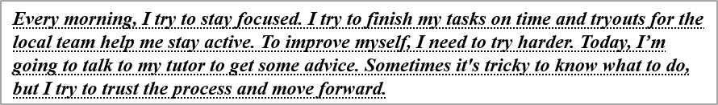

## **개요**

이 문서에서는 Aspose.Slides for Python via .NET을 사용하여 PowerPoint 및 OpenDocument 프레젠테이션에서 텍스트를 서식 지정하는 방법을 보여 줍니다. 강조, 배경 색, 투명도, 문자 간격, 글꼴 속성, 회전, 단락 간격, 자동 맞춤 동작, 텍스트 앵커링, 탭 정지점 및 언어 설정을 다룹니다.

아래 예제에서는 첫 번째 슬라이드에 단일 텍스트 상자가 포함된 "sample.pptx" 파일을 사용합니다.


## **텍스트 강조**

텍스트 프레임 내에서 특정 샘플과 일치하는 텍스트를 강조해야 할 때는 [TextFrame.highlight_text](https://reference.aspose.com/slides/ko/python-net/aspose.slides/textframe/highlight_text/) 메서드를 사용합니다. 이 메서드는 일치하는 텍스트 조각에 강조 색을 적용하며, [TextSearchOptions](https://reference.aspose.com/slides/ko/python-net/aspose.slides/textsearchoptions/)를 사용해 검색 방식을 제어할 수 있습니다(예: 전체 단어만 일치).

아래 코드 예제는 **"try"** 문자를 모두 강조한 다음, 전체 단어 **"to"** 만 강조합니다.

```python
import aspose.pydrawing as draw
import aspose.slides as slides

with slides.Presentation("sample.pptx") as presentation:
    # 첫 번째 슬라이드에서 첫 번째 도형을 가져옵니다.
    shape = presentation.slides[0].shapes[0]

    # 도형에서 단어 "try"를 강조합니다.
    shape.text_frame.highlight_text("try", draw.Color.light_blue)

    search_options = slides.TextSearchOptions()
    search_options.whole_words_only = True

    # 도형에서 단어 "to"를 강조합니다.
    shape.text_frame.highlight_text("to", draw.Color.violet, search_options, None)

    presentation.save("highlighted_text.pptx", slides.export.SaveFormat.PPTX)
```

결과:


## **정규식으로 텍스트 강조**

[TextFrame.highlight_regex](https://reference.aspose.com/slides/ko/python-net/aspose.slides/textframe/highlight_regex/) 메서드는 정규식으로 찾은 텍스트 일치를 강조합니다. Python에서는 이 API가 [TextFrame](https://reference.aspose.com/slides/ko/python-net/aspose.slides/textframe/)에 노출됩니다.

아래 코드 예제는 **길이가 7자 이상인** 모든 단어를 강조합니다.

```python
import aspose.pydrawing as draw
import aspose.slides as slides

with slides.Presentation("sample.pptx") as presentation:
    shape = presentation.slides[0].shapes[0]

    regex = r"\b[^\s]{7,}\b"

    # 7자 이상인 모든 단어를 강조합니다.
    shape.text_frame.highlight_regex(regex, draw.Color.yellow, None)

    presentation.save("highlighted_text_using_regex.pptx", slides.export.SaveFormat.PPTX)
```

결과:


## **텍스트 배경 색 설정**

단락의 기본 강조 색을 설정하려면 [ParagraphFormat.default_portion_format](https://reference.aspose.com/slides/ko/python-net/aspose.slides/paragraphformat/default_portion_format/)을 사용하고, 개별 텍스트 부분에 대해서는 [PortionFormat.highlight_color](https://reference.aspose.com/slides/ko/python-net/aspose.slides/portionformat/highlight_color/)를 사용합니다.

다음 코드 예제는 **전체 단락**에 배경 색을 설정하는 방법을 보여 줍니다.

```python
import aspose.pydrawing as draw
import aspose.slides as slides

with slides.Presentation("sample.pptx") as presentation:
    auto_shape = presentation.slides[0].shapes[0]
    paragraph = auto_shape.text_frame.paragraphs[0]

    # 전체 단락에 대한 강조 색을 설정합니다.
    paragraph.paragraph_format.default_portion_format.highlight_color.color = draw.Color.light_gray

    presentation.save("gray_paragraph.pptx", slides.export.SaveFormat.PPTX)
```

결과:


아래 코드 예제는 **굵은 글꼴을 가진 텍스트 부분**에 배경 색을 설정하는 방법을 보여 줍니다.

```python
import aspose.pydrawing as draw
import aspose.slides as slides

with slides.Presentation("sample.pptx") as presentation:
    auto_shape = presentation.slides[0].shapes[0]
    paragraph = auto_shape.text_frame.paragraphs[0]

    for portion in paragraph.portions:
        if portion.portion_format.get_effective().font_bold:
            # 텍스트 부분에 대한 강조 색을 설정합니다.
            portion.portion_format.highlight_color.color = draw.Color.light_gray

    presentation.save("gray_text_portions.pptx", slides.export.SaveFormat.PPTX)
```

결과:


## **텍스트 단락 정렬**

텍스트 프레임 내 단락 정렬을 설정하려면 [ParagraphFormat.alignment](https://reference.aspose.com/slides/ko/python-net/aspose.slides/paragraphformat/alignment/)을 사용합니다. 값은 가운데, 왼쪽 정렬, 오른쪽 정렬, 양쪽 맞춤 등으로 지정할 수 있습니다.

다음 코드 예제는 단락을 **가운데** 정렬하는 방법을 보여 줍니다.

```python
import aspose.slides as slides

with slides.Presentation("sample.pptx") as presentation:
    auto_shape = presentation.slides[0].shapes[0]
    paragraph = auto_shape.text_frame.paragraphs[0]

    # 단락 정렬을 가운데로 설정합니다.
    paragraph.paragraph_format.alignment = slides.TextAlignment.CENTER

    presentation.save("aligned_paragraph.pptx", slides.export.SaveFormat.PPTX)
```

결과:


## **텍스트 투명도 설정**

텍스트 투명도는 [PortionFormat.fill_format](https://reference.aspose.com/slides/ko/python-net/aspose.slides/portionformat/fill_format/)에 지정된 색상의 알파 구성 요소를 통해 제어됩니다. 아래 예제에서 `alpha = 50`은 0-255 스케일의 ARGB 알파 값이며, 투명도 백분율이 아닙니다.

다음 코드 예제는 **전체 단락**에 투명도를 적용하는 방법을 보여 줍니다.

```python
import aspose.pydrawing as draw
import aspose.slides as slides

alpha = 50

with slides.Presentation("sample.pptx") as presentation:
    auto_shape = presentation.slides[0].shapes[0]
    paragraph = auto_shape.text_frame.paragraphs[0]

    # 텍스트의 채우기 색을 투명 색으로 설정합니다.
    paragraph.paragraph_format.default_portion_format.fill_format.fill_type = slides.FillType.SOLID
    paragraph.paragraph_format.default_portion_format.fill_format.solid_fill_color.color = draw.Color.from_argb(alpha, draw.Color.black)

    presentation.save("transparent_paragraph.pptx", slides.export.SaveFormat.PPTX)
```

결과:


아래 코드 예제는 **굵은 글꼴을 가진 텍스트 부분**에 투명도를 적용하는 방법을 보여 줍니다.

```python
import aspose.pydrawing as draw
import aspose.slides as slides

alpha = 50

with slides.Presentation("sample.pptx") as presentation:
    auto_shape = presentation.slides[0].shapes[0]
    paragraph = auto_shape.text_frame.paragraphs[0]

    for portion in paragraph.portions:
        if portion.portion_format.get_effective().font_bold:
            # 텍스트 부분의 투명도를 설정합니다.
            portion.portion_format.fill_format.fill_type = slides.FillType.SOLID
            portion.portion_format.fill_format.solid_fill_color.color = draw.Color.from_argb(alpha, draw.Color.black)

    presentation.save("transparent_text_portions.pptx", slides.export.SaveFormat.PPTX)
```

결과:


## **텍스트 문자 간격 설정**

텍스트 상자 내 문자 간격을 확대하거나 축소하려면 [BasePortionFormat.spacing](https://reference.aspose.com/slides/ko/python-net/aspose.slides/baseportionformat/spacing/)을 사용합니다.

다음 Python 코드는 **전체 단락**의 문자 간격을 확대하는 방법을 보여 줍니다.

```python
import aspose.slides as slides

with slides.Presentation("sample.pptx") as presentation:
    auto_shape = presentation.slides[0].shapes[0]
    paragraph = auto_shape.text_frame.paragraphs[0]

    # 참고: 문자 간격을 압축하려면 음수 값을 사용합니다.
    paragraph.paragraph_format.default_portion_format.spacing = 3  # 문자 간격을 확대합니다.

    presentation.save("character_spacing_in_paragraph.pptx", slides.export.SaveFormat.PPTX)
```

결과:


아래 코드 예제는 **굵은 글꼴을 가진 텍스트 부분**의 문자 간격을 확대하는 방법을 보여 줍니다.

```python
import aspose.slides as slides

with slides.Presentation("sample.pptx") as presentation:
    auto_shape = presentation.slides[0].shapes[0]
    paragraph = auto_shape.text_frame.paragraphs[0]

    for portion in paragraph.portions:
        if portion.portion_format.get_effective().font_bold:
            # 참고: 문자 간격을 압축하려면 음수 값을 사용합니다.
            portion.portion_format.spacing = 3  # 문자 간격을 확대합니다.

    presentation.save("character_spacing_in_text_portions.pptx", slides.export.SaveFormat.PPTX)
```

결과:


### **특정 글꼴에 대한 커닝 비활성화**

때때로 Aspose.Slides가 렌더링한 텍스트가 PowerPoint에서 표시되는 텍스트보다 약간 더 촘촘하게 보일 수 있습니다. 이는 PowerPoint가 특정 글꼴에 대해 커닝 데이터를 무시하기 때문일 수 있습니다(글꼴에 유효한 커닝 정보가 포함되어 있어도 PowerPoint 설정에서 커닝이 활성화돼 있어도).

이러한 경우 렌더링 결과를 PowerPoint와 더 가깝게 만들려면 해당 글꼴을 사용하는 텍스트 부분에 대해 커닝을 비활성화할 수 있습니다. [PortionFormat.kerning_minimal_size](https://reference.aspose.com/slides/ko/python-net/aspose.slides/baseportionformat/kerning_minimal_size/)를 실제 글꼴 크기보다 크게 설정하십시오.

```python
import aspose.slides as slides

with slides.Presentation("presentation.pptx") as presentation:
    auto_shape = presentation.slides[0].shapes[0]
    target_font = "Roboto"

    for paragraph in auto_shape.text_frame.paragraphs:
        for portion in paragraph.portions:
            latin_font = portion.portion_format.latin_font
            east_asian_font = portion.portion_format.east_asian_font
            complex_script_font = portion.portion_format.complex_script_font

            if ((latin_font is not None and latin_font.font_name == target_font) or
                    (east_asian_font is not None and east_asian_font.font_name == target_font) or
                    (complex_script_font is not None and complex_script_font.font_name == target_font)):
                portion.portion_format.kerning_minimal_size = 100

    presentation.save("output.pptx", slides.export.SaveFormat.PPTX)
```

이 설정은 일치하는 텍스트 부분에 커닝이 적용되는 것을 방지하여, PowerPoint 고유 동작의 영향을 받는 글꼴에 대해 Aspose.Slides 렌더링을 PowerPoint 시각 출력에 맞출 수 있습니다.

## **텍스트 글꼴 속성 관리**

글꼴 속성은 [ParagraphFormat.default_portion_format](https://reference.aspose.com/slides/ko/python-net/aspose.slides/paragraphformat/default_portion_format/)을 통해 단락 수준에서 설정하거나, 개별 부분에 대해서는 [PortionFormat](https://reference.aspose.com/slides/ko/python-net/aspose.slides/portionformat/)을 통해 설정할 수 있습니다.

다음 코드는 전체 단락에 대해 글꼴 및 스타일을 설정합니다: 글꼴 크기, 굵게, 기울임꼴, 점선 밑줄, 그리고 Times New Roman 글꼴을 모든 부분에 적용합니다.

```python
import aspose.slides as slides

with slides.Presentation("sample.pptx") as presentation:
    auto_shape = presentation.slides[0].shapes[0]
    paragraph = auto_shape.text_frame.paragraphs[0]

    # 단락의 글꼴 속성을 설정합니다.
    paragraph.paragraph_format.default_portion_format.font_height = 12
    paragraph.paragraph_format.default_portion_format.font_bold = slides.NullableBool.TRUE
    paragraph.paragraph_format.default_portion_format.font_italic = slides.NullableBool.TRUE
    paragraph.paragraph_format.default_portion_format.font_underline = slides.TextUnderlineType.DOTTED
    paragraph.paragraph_format.default_portion_format.latin_font = slides.FontData("Times New Roman")

    presentation.save("font_properties_for_paragraph.pptx", slides.export.SaveFormat.PPTX)
```

결과:



아래 코드 예제는 **굵은 글꼴을 가진 텍스트 부분**에 유사한 속성을 적용합니다.

```python
import aspose.slides as slides

with slides.Presentation("sample.pptx") as presentation:
    auto_shape = presentation.slides[0].shapes[0]
    paragraph = auto_shape.text_frame.paragraphs[0]

    for portion in paragraph.portions:
        if portion.portion_format.get_effective().font_bold:
            # 텍스트 부분의 글꼴 속성을 설정합니다.
            portion.portion_format.font_height = 13
            portion.portion_format.font_italic = slides.NullableBool.TRUE
            portion.portion_format.font_underline = slides.TextUnderlineType.DOTTED
            portion.portion_format.latin_font = slides.FontData("Times New Roman")

    presentation.save("font_properties_for_text_portions.pptx", slides.export.SaveFormat.PPTX)
```

결과:


## **텍스트 회전 설정**

[TextFrameFormat.text_vertical_type](https://reference.aspose.com/slides/ko/python-net/aspose.slides/textframeformat/text_vertical_type/)을 사용하여 도형 내에 미리 정의된 텍스트 방향을 설정합니다.

다음 코드 예제는 텍스트 방향을 `VERTICAL270`으로 설정하여 텍스트를 **시계 반대 방향으로 90도** 회전시킵니다.

```python
import aspose.slides as slides

with slides.Presentation("sample.pptx") as presentation:
    auto_shape = presentation.slides[0].shapes[0]

    auto_shape.text_frame.text_frame_format.text_vertical_type = slides.TextVerticalType.VERTICAL270

    presentation.save("text_rotation.pptx", slides.export.SaveFormat.PPTX)
```

결과:


## **텍스트 프레임에 대한 사용자 정의 회전 설정**

[TextFrameFormat.rotation_angle](https://reference.aspose.com/slides/ko/python-net/aspose.slides/textframeformat/rotation_angle/)을 사용하여 [TextFrame](https://reference.aspose.com/slides/ko/python-net/aspose.slides/textframe/)에 대한 사용자 정의 회전 각도를 설정합니다.

아래 코드 예제는 도형 내 텍스트 프레임을 시계 방향으로 3도 회전시킵니다.

```python
import aspose.slides as slides

with slides.Presentation("sample.pptx") as presentation:
    auto_shape = presentation.slides[0].shapes[0]

    auto_shape.text_frame.text_frame_format.rotation_angle = 3

    presentation.save("custom_text_rotation.pptx", slides.export.SaveFormat.PPTX)
```

결과:


## **단락의 줄 간격 설정**

Aspose.Slides는 [ParagraphFormat.space_after](https://reference.aspose.com/slides/ko/python-net/aspose.slides/paragraphformat/space_after/), [ParagraphFormat.space_before](https://reference.aspose.com/slides/ko/python-net/aspose.slides/paragraphformat/space_before/), 및 [ParagraphFormat.space_within](https://reference.aspose.com/slides/ko/python-net/aspose.slides/paragraphformat/space_within/)을 제공하여 단락 간격을 제어합니다. 사용 방법은 다음과 같습니다.

* 양수 값을 사용하면 줄 높이 비율(%)로 줄 간격을 지정합니다.
* 음수 값을 사용하면 포인트 단위로 줄 간격을 지정합니다.

다음 코드 예제는 단락 내 줄 간격을 지정하는 방법을 보여 줍니다.

```python
import aspose.slides as slides

with slides.Presentation("sample.pptx") as presentation:
    auto_shape = presentation.slides[0].shapes[0]
    paragraph = auto_shape.text_frame.paragraphs[0]

    paragraph.paragraph_format.space_within = 200

    presentation.save("line_spacing.pptx", slides.export.SaveFormat.PPTX)
```

결과:


## **텍스트 프레임 자동 맞춤 유형 설정**

[TextFrameFormat.autofit_type](https://reference.aspose.com/slides/ko/python-net/aspose.slides/textframeformat/autofit_type/)은 텍스트가 컨테이너 경계를 초과할 때 동작을 결정합니다. 텍스트를 축소, 넘침, 또는 도형을 자동으로 크기 조정하도록 제어하는 데 사용합니다.

```python
import aspose.slides as slides

with slides.Presentation("sample.pptx") as presentation:
    auto_shape = presentation.slides[0].shapes[0]

    auto_shape.text_frame.text_frame_format.autofit_type = slides.TextAutofitType.SHAPE

    presentation.save("autofit_type.pptx", slides.export.SaveFormat.PPTX)
```

## **텍스트 프레임 앵커 설정**

[TextFrameFormat.anchoring_type](https://reference.aspose.com/slides/ko/python-net/aspose.slides/textframeformat/anchoring_type/)은 텍스트가 도형 내부에서 수직으로 배치되는 방식을 정의합니다(예: 상단, 가운데, 하단).

```python
import aspose.slides as slides

with slides.Presentation("sample.pptx") as presentation:
    auto_shape = presentation.slides[0].shapes[0]

    auto_shape.text_frame.text_frame_format.anchoring_type = slides.TextAnchorType.BOTTOM

    presentation.save("text_anchor.pptx", slides.export.SaveFormat.PPTX)
```

## **텍스트 탭 설정**

[ParagraphFormat.default_tab_size](https://reference.aspose.com/slides/ko/python-net/aspose.slides/paragraphformat/default_tab_size/) 및 [ParagraphFormat.tabs](https://reference.aspose.com/slides/ko/python-net/aspose.slides/paragraphformat/tabs/)를 사용하여 단락의 탭 정지점을 구성합니다.

```python
import aspose.slides as slides

with slides.Presentation("sample.pptx") as presentation:
    auto_shape = presentation.slides[0].shapes[0]
    paragraph = auto_shape.text_frame.paragraphs[0]

    paragraph.paragraph_format.default_tab_size = 100
    paragraph.paragraph_format.tabs.add(30, slides.TabAlignment.LEFT)

    presentation.save("paragraph_tabs.pptx", slides.export.SaveFormat.PPTX)
```

결과:


## **교정 언어 설정**

Aspose.Slides는 [PortionFormat.language_id](https://reference.aspose.com/slides/ko/python-net/aspose.slides/portionformat/language_id/)를 제공하여 텍스트 부분의 교정 언어를 설정할 수 있습니다. 교정 언어는 PowerPoint에서 맞춤법 및 문법 검사를 수행할 때 사용되는 언어를 결정합니다.

다음 코드 예제는 텍스트 부분의 교정 언어를 설정하는 방법을 보여 줍니다.

```python
import aspose.slides as slides

with slides.Presentation("presentation.pptx") as presentation:
    auto_shape = presentation.slides[0].shapes[0]

    paragraph = auto_shape.text_frame.paragraphs[0]
    paragraph.portions.clear()

    font = slides.FontData("SimSun")

    text_portion = slides.Portion()
    text_portion.portion_format.complex_script_font = font
    text_portion.portion_format.east_asian_font = font
    text_portion.portion_format.latin_font = font

    # 교정 언어의 Id를 설정합니다.
    text_portion.portion_format.language_id = "zh-CN"

    text_portion.text = "1."
    paragraph.portions.add(text_portion)

    presentation.save("proofing_language.pptx", slides.export.SaveFormat.PPTX)
```

## **기본 언어 설정**

[LoadOptions.default_text_language](https://reference.aspose.com/slides/ko/python-net/aspose.slides/loadoptions/default_text_language/)를 사용하여 프레젠테이션을 로드하거나 생성할 때 생성되는 텍스트의 기본 언어를 정의합니다.

```python
import aspose.slides as slides

load_options = slides.LoadOptions()
load_options.default_text_language = "en-US"

with slides.Presentation(load_options) as presentation:
    slide = presentation.slides[0]

    # 텍스트가 포함된 새로운 사각형 도형을 추가합니다.
    shape = slide.shapes.add_auto_shape(slides.ShapeType.RECTANGLE, 20, 20, 150, 50)
    shape.text_frame.text = "Sample text"

    # 첫 번째 부분의 언어를 확인합니다.
    portion = shape.text_frame.paragraphs[0].portions[0]
    print(portion.portion_format.language_id)
```

## **기본 텍스트 스타일 설정**

프레젠테이션 수준에서 기본 텍스트 서식을 적용하려면 [Presentation.default_text_style](https://reference.aspose.com/slides/ko/python-net/aspose.slides/presentation/default_text_style/)를 사용합니다.

다음 코드 예제는 새 프레젠테이션의 모든 슬라이드에 대해 14pt 크기의 굵은 기본 글꼴을 설정하는 방법을 보여 줍니다.

```python
import aspose.slides as slides

with slides.Presentation() as presentation:
    # 최상위 수준 단락 형식을 가져옵니다.
    paragraph_format = presentation.default_text_style.get_level(0)

    if paragraph_format is not None:
        paragraph_format.default_portion_format.font_height = 14
        paragraph_format.default_portion_format.font_bold = slides.NullableBool.TRUE

    presentation.save("default_text_style.pptx", slides.export.SaveFormat.PPTX)
```

## **대문자 효과가 적용된 텍스트 추출**

PowerPoint에서 **All Caps** 글꼴 효과를 적용하면 원래 소문자로 입력된 텍스트가 슬라이드에 대문자로 표시됩니다. Aspose.Slides로 해당 텍스트 부분을 가져오면 라이브러리는 입력된 그대로의 텍스트를 반환합니다. 표시된 텍스트와 일치시키려면 [TextCapType](https://reference.aspose.com/slides/ko/python-net/aspose.slides/textcaptype/)을 확인하고 값이 `ALL`인 경우 반환 문자열을 대문자로 변환합니다.

예를 들어 sample2.pptx 파일의 첫 번째 슬라이드에 다음과 같은 텍스트 상자가 있다고 가정합니다.


아래 코드 예제는 **All Caps** 효과가 적용된 텍스트를 추출하는 방법을 보여 줍니다.

```python
import aspose.slides as slides

with slides.Presentation("sample2.pptx") as presentation:
    auto_shape = presentation.slides[0].shapes[0]
    text_portion = auto_shape.text_frame.paragraphs[0].portions[0]

    print("Original text:", text_portion.text)

    text_format = text_portion.portion_format.get_effective()
    if text_format.text_cap_type == slides.TextCapType.ALL:
        text = text_portion.text.upper()
        print("All-Caps effect:", text)
```

출력:

```text
Original text: Hello, Aspense!
All-Caps effect: HELLO, ASPOSE!
```

## **FAQ**

**슬라이드의 표에서 텍스트를 수정하려면 어떻게 해야 하나요?**

슬라이드의 표에서 텍스트를 수정하려면 [Table](https://reference.aspose.com/slides/ko/python-net/aspose.slides/table/)를 사용합니다. 셀을 순회하면서 각 셀을 [Cell.text_frame](https://reference.aspose.com/slides/ko/python-net/aspose.slides/cell/text_frame/)와 [Paragraph.paragraph_format](https://reference.aspose.com/slides/ko/python-net/aspose.slides/paragraph/paragraph_format/)을 통해 업데이트하십시오.

**PowerPoint 슬라이드의 텍스트에 그라디언트 색을 적용하려면 어떻게 해야 하나요?**

그라디언트 색을 적용하려면 [PortionFormat.fill_format](https://reference.aspose.com/slides/ko/python-net/aspose.slides/portionformat/fill_format/)를 사용합니다. [FillFormat.fill_type](https://reference.aspose.com/slides/ko/python-net/aspose.slides/fillformat/fill_type/)을 [FillType.GRADIENT](https://reference.aspose.com/slides/ko/python-net/aspose.slides/filltype/)으로 설정하고 그라디언트 정지점, 방향 및 투명도를 구성하십시오.