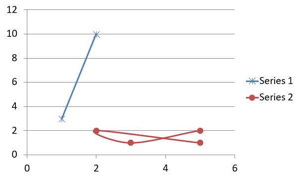

## **개요**

이 문서에서는 Aspose.Slides for Python via .NET을 사용하여 차트를 만들고 사용자 지정하는 방법을 설명합니다. 슬라이드에 차트를 추가하고 데이터를 채우며 디자인 요구 사항에 맞게 형식을 지정하는 방법을 배웁니다. 코드 예제는 프레젠테이션 및 차트 생성, 시리즈, 축 및 범례 구성, 그리고 애플리케이션에 차트 생성을 통합하는 내용을 다룹니다.

## **차트 만들기**

차트는 사용자가 데이터를 빠르게 시각화하고 표나 스프레드시트에서 즉시 알기 어려운 통찰력을 얻을 수 있도록 도와줍니다.

**왜 차트를 만들까요?**

* 프레젠테이션의 단일 슬라이드에 대량의 데이터를 집계, 압축 또는 요약합니다;
* 데이터의 패턴과 추세를 드러냅니다;
* 시간 경과에 따른 데이터의 방향과 모멘텀, 또는 특정 측정 단위에 대한 데이터를 추론합니다;
* 이상치, 변칙, 편차, 오류 및 비논리적인 데이터를 찾아냅니다;
* 복잡한 데이터를 전달하거나 프레젠테이션합니다.

PowerPoint에서는 *Insert* 기능을 통해 차트를 만들 수 있으며, 다양한 차트 유형을 디자인하기 위한 템플릿을 제공합니다. Aspose.Slides를 사용하면 일반 차트(대중적인 차트 유형 기반)와 사용자 정의 차트를 모두 만들 수 있습니다.

{}
다음 네임스페이스인 [Aspose.Slides.Charts](https://reference.aspose.com/slides/python-net/aspose.slides.charts/) 아래에 있는 [ChartType](https://reference.aspose.com/slides/python-net/aspose.slides.charts/charttype/) 열거형을 사용하십시오. 이 열거형의 값은 다양한 차트 유형에 대응합니다.
{}

### **클러스터드 컬럼 차트 만들기**

이 섹션에서는 Aspose.Slides for Python via .NET을 사용하여 클러스터드 컬럼 차트를 만드는 방법을 설명합니다. 프레젠테이션을 초기화하고 차트를 추가하며 제목, 데이터, 시리즈, 범주 및 스타일과 같은 요소를 사용자 지정하는 방법을 배우게 됩니다. 아래 단계에 따라 표준 클러스터드 컬럼 차트가 생성되는 과정을 확인하십시오:

1. [Presentation](https://reference.aspose.com/slides/python-net/aspose.slides/presentation/) 클래스를 인스턴스화합니다.
1. 인덱스를 사용하여 슬라이드에 대한 참조를 가져옵니다.
1. 일부 데이터를 포함한 차트를 추가하고 `ChartType.CLUSTERED_COLUMN` 유형을 지정합니다.
1. 차트에 제목을 추가합니다.
1. 차트의 데이터 워크시트에 액세스합니다.
1. 기본 시리즈와 범주를 모두 제거합니다.
1. 새로운 시리즈와 범주를 추가합니다.
1. 차트 시리즈에 새로운 차트 데이터를 추가합니다.
1. 차트 시리즈에 채우기 색을 적용합니다.
1. 차트 시리즈에 레이블을 추가합니다.
1. 수정된 프레젠테이션을 PPTX 파일로 저장합니다.

다음 Python 코드는 클러스터드 컬럼 차트를 만드는 방법을 보여줍니다:

```py
import aspose.slides.charts as charts
import aspose.slides as slides
import aspose.pydrawing as draw

# PPTX 파일을 나타내는 Presentation 클래스를 인스턴스화합니다.
with slides.Presentation() as presentation:

    # 첫 번째 슬라이드에 액세스합니다.
    slide = presentation.slides[0]

    # 기본 데이터를 가진 클러스터드 컬럼 차트를 추가합니다.
    chart = slide.shapes.add_chart(charts.ChartType.CLUSTERED_COLUMN, 20, 20, 500, 300)

    # 차트 제목을 설정합니다.
    chart.chart_title.add_text_frame_for_overriding("Sample Title")
    chart.chart_title.text_frame_for_overriding.text_frame_format.center_text = slides.NullableBool.TRUE
    chart.chart_title.height = 20
    chart.has_title = True

    # 차트 데이터 시트의 인덱스를 설정합니다.
    worksheet_index = 0

    # 차트 데이터 워크북을 가져옵니다.
    workbook = chart.chart_data.chart_data_workbook

    # 기본 생성된 시리즈와 범주를 삭제합니다.
    chart.chart_data.series.clear()
    chart.chart_data.categories.clear()

    # 새로운 시리즈를 추가합니다.
    chart.chart_data.series.add(workbook.get_cell(worksheet_index, 0, 1, "Series 1"), chart.type)
    chart.chart_data.series.add(workbook.get_cell(worksheet_index, 0, 2, "Series 2"), chart.type)

    # 새로운 범주를 추가합니다.
    chart.chart_data.categories.add(workbook.get_cell(worksheet_index, 1, 0, "Category 1"))
    chart.chart_data.categories.add(workbook.get_cell(worksheet_index, 2, 0, "Category 2"))
    chart.chart_data.categories.add(workbook.get_cell(worksheet_index, 3, 0, "Category 3"))

    # 첫 번째 차트 시리즈를 가져옵니다.
    series = chart.chart_data.series[0]

    # 시리즈 데이터를 채웁니다.
    series.data_points.add_data_point_for_bar_series(workbook.get_cell(worksheet_index, 1, 1, 20))
    series.data_points.add_data_point_for_bar_series(workbook.get_cell(worksheet_index, 2, 1, 50))
    series.data_points.add_data_point_for_bar_series(workbook.get_cell(worksheet_index, 3, 1, 30))

    # 시리즈의 채우기 색상을 설정합니다.
    series.format.fill.fill_type = slides.FillType.SOLID
    series.format.fill.solid_fill_color.color = draw.Color.red

    # 두 번째 차트 시리즈를 가져옵니다.
    series = chart.chart_data.series[1]

    # 시리즈 데이터를 채웁니다.
    series.data_points.add_data_point_for_bar_series(workbook.get_cell(worksheet_index, 1, 2, 30))
    series.data_points.add_data_point_for_bar_series(workbook.get_cell(worksheet_index, 2, 2, 10))
    series.data_points.add_data_point_for_bar_series(workbook.get_cell(worksheet_index, 3, 2, 60))

    # 시리즈의 채우기 색상을 설정합니다.
    series.format.fill.fill_type = slides.FillType.SOLID
    series.format.fill.solid_fill_color.color = draw.Color.green

    # 첫 번째 레이블에 범주 이름을 표시하도록 설정합니다.
    label = series.data_points[0].label
    label.data_label_format.show_category_name = True

    label = series.data_points[1].label
    label.data_label_format.show_series_name = True

    # 세 번째 레이블에 값을 표시하도록 시리즈를 설정합니다.
    label = series.data_points[2].label
    label.data_label_format.show_value = True
    label.data_label_format.show_series_name = True
    label.data_label_format.separator = "/"
                
    # 프레젠테이션을 PPTX 파일로 디스크에 저장합니다.
    presentation.save("ClusteredColumnChart.pptx", slides.export.SaveFormat.PPTX)
```

결과:


### **산점도 차트 만들기**

산점도 차트(산점도 플롯 또는 x‑y 그래프라고도 함)는 두 변수 사이의 패턴을 확인하거나 상관관계를 보여주기 위해 자주 사용됩니다.

다음 경우에 산점도 차트를 사용합니다:

* 쌍을 이루는 숫자 데이터가 있습니다.
* 함께 잘 어울리는 두 변수가 있습니다.
* 두 변수 간의 관련성을 확인하고자 합니다.
* 종속 변수에 대해 여러 값을 갖는 독립 변수가 있습니다.

다음 Python 코드는 각 시리즈마다 다른 마커를 사용하여 산점도 차트를 만드는 방법을 보여줍니다:

```py
import aspose.slides.charts as charts
import aspose.slides as slides
import aspose.pydrawing as draw

# Presentation 클래스를 인스턴스화합니다.
with slides.Presentation() as presentation:

    # 첫 번째 슬라이드에 액세스합니다.
    slide = presentation.slides[0]

    # 기본 산점도 차트를 생성합니다.
    chart = slide.shapes.add_chart(charts.ChartType.SCATTER_WITH_SMOOTH_LINES, 20, 20, 500, 300)

    # 차트 데이터 시트의 인덱스를 설정합니다.
    worksheet_index = 0

    # 차트 데이터 워크북을 가져옵니다.
    workbook = chart.chart_data.chart_data_workbook

    # 기본 시리즈를 삭제합니다.
    chart.chart_data.series.clear()

    # 새 시리즈를 추가합니다.
    chart.chart_data.series.add(workbook.get_cell(worksheet_index, 1, 1, "Series 1"), chart.type)
    chart.chart_data.series.add(workbook.get_cell(worksheet_index, 1, 3, "Series 2"), chart.type)

    # 첫 번째 차트 시리즈를 가져옵니다.
    series = chart.chart_data.series[0]

    # 시리즈에 새 포인트 (1:3)를 추가합니다.
    series.data_points.add_data_point_for_scatter_series(workbook.get_cell(worksheet_index, 2, 1, 1), workbook.get_cell(worksheet_index, 2, 2, 3))

    # 새 포인트 (2:10)를 추가합니다.
    series.data_points.add_data_point_for_scatter_series(workbook.get_cell(worksheet_index, 3, 1, 2), workbook.get_cell(worksheet_index, 3, 2, 10))

    # 시리즈 유형을 변경합니다.
    series.type = charts.ChartType.SCATTER_WITH_STRAIGHT_LINES_AND_MARKERS

    # 차트 시리즈 마커를 변경합니다.
    series.marker.size = 10
    series.marker.symbol = charts.MarkerStyleType.STAR

    # 두 번째 차트 시리즈를 가져옵니다.
    series = chart.chart_data.series[1]

    # 차트 시리즈에 새 포인트 (5:2)를 추가합니다.
    series.data_points.add_data_point_for_scatter_series(workbook.get_cell(worksheet_index, 2, 3, 5), workbook.get_cell(worksheet_index, 2, 4, 2))

    # 새 포인트 (3:1)를 추가합니다.
    series.data_points.add_data_point_for_scatter_series(workbook.get_cell(worksheet_index, 3, 3, 3), workbook.get_cell(worksheet_index, 3, 4, 1))

    # 새 포인트 (2:2)를 추가합니다.
    series.data_points.add_data_point_for_scatter_series(workbook.get_cell(worksheet_index, 4, 3, 2), workbook.get_cell(worksheet_index, 4, 4, 2))

    # 새 포인트 (5:1)를 추가합니다.
    series.data_points.add_data_point_for_scatter_series(workbook.get_cell(worksheet_index, 5, 3, 5), workbook.get_cell(worksheet_index, 5, 4, 1))

    # 차트 시리즈 마커를 변경합니다.
    series.marker.size = 10
    series.marker.symbol = charts.MarkerStyleType.CIRCLE

    presentation.save("ScatterChart.pptx", slides.export.SaveFormat.PPTX)
```

결과:



### **파이 차트 만들기**

파이 차트는 특히 데이터가 숫자 값과 함께 범주형 레이블을 포함할 때 전체 대비 부분 관계를 표시하는 데 가장 적합합니다. 그러나 데이터에 많은 부분이나 레이블이 포함된 경우 막대 차트를 고려하는 것이 좋습니다.

1. [Presentation](https://reference.aspose.com/slides/python-net/aspose.slides/presentation/) 클래스를 인스턴스화합니다.
1. 인덱스를 사용하여 슬라이드에 대한 참조를 가져옵니다.
1. 기본 데이터를 사용하여 차트를 추가하고 `ChartType.PIE` 유형을 지정합니다.
1. 차트의 데이터 워크북([ChartDataWorkbook](https://reference.aspose.com/slides/python-net/aspose.slides.charts/chartdataworkbook/))에 액세스합니다.
1. 기본 시리즈와 범주를 제거합니다.
1. 새로운 시리즈와 범주를 추가합니다.
1. 차트 시리즈에 새로운 차트 데이터를 추가합니다.
1. 차트에 새로운 포인트를 추가하고 파이 차트 섹터에 사용자 지정 색을 적용합니다.
1. 시리즈에 레이블을 설정합니다.
1. 시리즈 레이블에 리더 라인을 활성화합니다.
1. 파이 차트의 회전 각도를 설정합니다.
1. 수정된 프레젠테이션을 PPTX 파일로 저장합니다.

다음 Python 코드는 파이 차트를 만드는 방법을 보여줍니다:

```py
import aspose.slides.charts as charts
import aspose.slides as slides
import aspose.pydrawing as draw

# PPTX 파일을 나타내는 Presentation 클래스를 인스턴스화합니다.
with slides.Presentation() as presentation:

    # 첫 번째 슬라이드에 액세스합니다.
    slide = presentation.slides[0]

    # 기본 데이터를 가진 차트를 추가합니다.
    chart = slide.shapes.add_chart(charts.ChartType.PIE, 20, 20, 500, 300)

    # 차트 제목을 설정합니다.
    chart.chart_title.add_text_frame_for_overriding("Sample Title")
    chart.chart_title.text_frame_for_overriding.text_frame_format.center_text = slides.NullableBool.TRUE
    chart.chart_title.height = 20
    chart.has_title = True

    # 차트 데이터 시트의 인덱스를 설정합니다.
    worksheet_index = 0

    # 차트 데이터 워크북을 가져옵니다.
    workbook = chart.chart_data.chart_data_workbook

    # 기본 생성된 시리즈와 범주를 삭제합니다.
    chart.chart_data.series.clear()
    chart.chart_data.categories.clear()

    # 새 범주를 추가합니다.
    chart.chart_data.categories.add(workbook.get_cell(0, 1, 0, "First Qtr"))
    chart.chart_data.categories.add(workbook.get_cell(0, 2, 0, "2nd Qtr"))
    chart.chart_data.categories.add(workbook.get_cell(0, 3, 0, "3rd Qtr"))

    # 새 시리즈를 추가합니다.
    series = chart.chart_data.series.add(workbook.get_cell(0, 0, 1, "Series 1"), chart.type)

    # 시리즈 데이터를 채웁니다.
    series.data_points.add_data_point_for_pie_series(workbook.get_cell(worksheet_index, 1, 1, 20))
    series.data_points.add_data_point_for_pie_series(workbook.get_cell(worksheet_index, 2, 1, 50))
    series.data_points.add_data_point_for_pie_series(workbook.get_cell(worksheet_index, 3, 1, 30))

    # 섹터 색상을 설정합니다.
    chart.chart_data.series_groups[0].is_color_varied = True

    point = series.data_points[0]
    point.format.fill.fill_type = slides.FillType.SOLID
    point.format.fill.solid_fill_color.color = draw.Color.cyan

    # 섹터 테두리를 설정합니다.
    point.format.line.fill_format.fill_type = slides.FillType.SOLID
    point.format.line.fill_format.solid_fill_color.color = draw.Color.gray
    point.format.line.width = 3.0
    point.format.line.style = slides.LineStyle.THIN_THICK
    point.format.line.dash_style = slides.LineDashStyle.DASH_DOT

    point1 = series.data_points[1]
    point1.format.fill.fill_type = slides.FillType.SOLID
    point1.format.fill.solid_fill_color.color = draw.Color.brown

    # 섹터 테두리를 설정합니다.
    point1.format.line.fill_format.fill_type = slides.FillType.SOLID
    point1.format.line.fill_format.solid_fill_color.color = draw.Color.blue
    point1.format.line.width = 3.0
    point1.format.line.style = slides.LineStyle.SINGLE
    point1.format.line.dash_style = slides.LineDashStyle.LARGE_DASH_DOT

    point2 = series.data_points[2]
    point2.format.fill.fill_type = slides.FillType.SOLID
    point2.format.fill.solid_fill_color.color = draw.Color.coral

    # 섹터 테두리를 설정합니다.
    point2.format.line.fill_format.fill_type = slides.FillType.SOLID
    point2.format.line.fill_format.solid_fill_color.color = draw.Color.red
    point2.format.line.width = 2.0
    point2.format.line.style = slides.LineStyle.THIN_THIN
    point2.format.line.dash_style = slides.LineDashStyle.LARGE_DASH_DOT_DOT

    # 새 시리즈의 각 범주에 대한 사용자 지정 레이블을 만들습니다.
    label1 = series.data_points[0].label

    label1.data_label_format.show_value = True

    label2 = series.data_points[1].label
    label2.data_label_format.show_value = True
    label2.data_label_format.show_legend_key = True
    label2.data_label_format.show_percentage = True

    label3 = series.data_points[2].label
    label3.data_label_format.show_series_name = True
    label3.data_label_format.show_percentage = True

    # 차트에 대한 리더 라인을 표시하도록 시리즈를 설정합니다.
    series.labels.default_data_label_format.show_leader_lines = True

    # 파이 차트 섹터의 회전 각도를 설정합니다.
    chart.chart_data.series_groups[0].first_slice_angle = 180

    # 프레젠테이션을 PPTX 파일로 디스크에 저장합니다.
    presentation.save("PieChart.pptx", slides.export.SaveFormat.PPTX)
```

결과:


### **라인 차트 만들기**

라인 차트(라인 그래프라고도 함)는 시간 경과에 따른 값 변화 를 보여주고자 할 때 가장 적합합니다. 라인 차트를 사용하면 대량의 데이터를 한 번에 비교하고, 시간에 따른 변화와 추세를 추적하며, 데이터 시리즈의 이상치를 강조하는 등 다양한 작업을 수행할 수 있습니다.

1. [Presentation](https://reference.aspose.com/slides/python-net/aspose.slides/presentation/) 클래스를 인스턴스화합니다.
1. 인덱스를 사용하여 슬라이드에 대한 참조를 가져옵니다.
1. 기본 데이터를 사용하여 차트를 추가하고 `ChartType.LINE` 유형을 지정합니다.
1. 수정된 프레젠테이션을 PPTX 파일로 저장합니다.

다음 Python 코드는 라인 차트를 만드는 방법을 보여줍니다:

```python
import aspose.slides as slides

with slides.Presentation() as presentation:
    line_chart = presentation.slides[0].shapes.add_chart(slides.charts.ChartType.LINE, 20, 20, 500, 300)
    
    presentation.save("LineChart.pptx", slides.export.SaveFormat.PPTX)
```

기본적으로 라인 차트의 포인트는 직선으로 연결됩니다. 포인트를 점선으로 연결하려면 다음과 같이 원하는 대시 유형을 지정할 수 있습니다:

```python
import aspose.slides as slides

with slides.Presentation() as presentation:
    line_chart = presentation.slides[0].shapes.add_chart(slides.charts.ChartType.LINE, 10, 50, 600, 350)

    for series in line_chart.chart_data.series:
        series.format.line.dash_style = slides.LineDashStyle.DASH

    presentation.save("LineChart.pptx", slides.export.SaveFormat.PPTX)
```

결과:


### **트리맵 차트 만들기**

트리맵 차트는 판매 데이터에서 각 범주의 상대적인 규모를 표시하고, 각 범주 내에서 큰 기여도를 가진 항목에 빠르게 주의를 끌고자 할 때 가장 적합합니다.

1. [Presentation](https://reference.aspose.com/slides/python-net/aspose.slides/presentation/) 클래스를 인스턴스화합니다.
1. 인덱스를 사용하여 슬라이드에 대한 참조를 가져옵니다.
1. 기본 데이터를 사용하여 차트를 추가하고 `ChartType.TREEMAP` 유형을 지정합니다.
1. 차트의 데이터 워크북([ChartDataWorkbook](https://reference.aspose.com/slides/python-net/aspose.slides.charts/chartdataworkbook/))에 액세스합니다.
1. 기본 시리즈와 범주를 제거합니다.
1. 새로운 시리즈와 범주를 추가합니다.
1. 차트 시리즈에 새로운 차트 데이터를 추가합니다.
1. 수정된 프레젠테이션을 PPTX 파일로 저장합니다.

다음 Python 코드는 트리맵 차트를 만드는 방법을 보여줍니다:

```py
import aspose.slides.charts as charts
import aspose.slides as slides
import aspose.pydrawing as draw

with slides.Presentation() as presentation:
    chart = presentation.slides[0].shapes.add_chart(charts.ChartType.TREEMAP, 20, 20, 500, 300)
    chart.chart_data.categories.clear()
    chart.chart_data.series.clear()

    workbook = chart.chart_data.chart_data_workbook
    workbook.clear(0)

    # 브랜치 1
    leaf = chart.chart_data.categories.add(workbook.get_cell(0, "C1", "Leaf1"))
    leaf.grouping_levels.set_grouping_item(1, "Stem1")
    leaf.grouping_levels.set_grouping_item(2, "Branch1")

    chart.chart_data.categories.add(workbook.get_cell(0, "C2", "Leaf2"))

    leaf = chart.chart_data.categories.add(workbook.get_cell(0, "C3", "Leaf3"))
    leaf.grouping_levels.set_grouping_item(1, "Stem2")

    chart.chart_data.categories.add(workbook.get_cell(0, "C4", "Leaf4"))

    # 브랜치 2
    leaf = chart.chart_data.categories.add(workbook.get_cell(0, "C5", "Leaf5"))
    leaf.grouping_levels.set_grouping_item(1, "Stem3")
    leaf.grouping_levels.set_grouping_item(2, "Branch2")

    chart.chart_data.categories.add(workbook.get_cell(0, "C6", "Leaf6"))

    leaf = chart.chart_data.categories.add(workbook.get_cell(0, "C7", "Leaf7"))
    leaf.grouping_levels.set_grouping_item(1, "Stem4")

    chart.chart_data.categories.add(workbook.get_cell(0, "C8", "Leaf8"))

    series = chart.chart_data.series.add(charts.ChartType.TREEMAP)
    series.labels.default_data_label_format.show_category_name = True
    series.data_points.add_data_point_for_treemap_series(workbook.get_cell(0, "D1", 4))
    series.data_points.add_data_point_for_treemap_series(workbook.get_cell(0, "D2", 5))
    series.data_points.add_data_point_for_treemap_series(workbook.get_cell(0, "D3", 3))
    series.data_points.add_data_point_for_treemap_series(workbook.get_cell(0, "D4", 6))
    series.data_points.add_data_point_for_treemap_series(workbook.get_cell(0, "D5", 9))
    series.data_points.add_data_point_for_treemap_series(workbook.get_cell(0, "D6", 9))
    series.data_points.add_data_point_for_treemap_series(workbook.get_cell(0, "D7", 4))
    series.data_points.add_data_point_for_treemap_series(workbook.get_cell(0, "D8", 3))

    series.parent_label_layout = charts.ParentLabelLayoutType.OVERLAPPING

    presentation.save("TreeMap.pptx", slides.export.SaveFormat.PPTX)
```

결과:


### **주식 차트 만들기**

주식 차트는 시가, 고가, 저가, 종가와 같은 금융 데이터를 표시하여 시장 추세와 변동성을 분석하는 데 사용됩니다. 이는 주식 실적에 대한 중요한 통찰을 제공하여 투자자와 분석가가 정보에 입각한 결정을 내리는 데 도움을 줍니다.

1. [Presentation](https://reference.aspose.com/slides/python-net/aspose.slides/presentation/) 클래스를 인스턴스화합니다.
1. 인덱스를 사용하여 슬라이드에 대한 참조를 가져옵니다.
1. 기본 데이터를 사용하여 차트를 추가하고 `ChartType.OPEN_HIGH_LOW_CLOSE` 유형을 지정합니다.
1. 차트의 데이터 워크북([ChartDataWorkbook](https://reference.aspose.com/slides/python-net/aspose.slides.charts/chartdataworkbook/))에 액세스합니다.
1. 기본 시리즈와 범주를 제거합니다.
1. 새로운 시리즈와 범주를 추가합니다.
1. 차트 시리즈에 새로운 차트 데이터를 추가합니다.
1. 고저선 형식을 지정합니다.
1. 수정된 프레젠테이션을 PPTX 파일로 저장합니다.

다음 Python 코드는 주식 차트를 만드는 방법을 보여줍니다:

```py
import aspose.slides.charts as charts
import aspose.slides as slides
import aspose.pydrawing as draw

with slides.Presentation() as presentation:
    chart = presentation.slides[0].shapes.add_chart(charts.ChartType.OPEN_HIGH_LOW_CLOSE, 20, 20, 500, 300, False)

    chart.chart_data.series.clear()
    chart.chart_data.categories.clear()

    workbook = chart.chart_data.chart_data_workbook

    chart.chart_data.categories.add(workbook.get_cell(0, 1, 0, "A"))
    chart.chart_data.categories.add(workbook.get_cell(0, 2, 0, "B"))
    chart.chart_data.categories.add(workbook.get_cell(0, 3, 0, "C"))

    chart.chart_data.series.add(workbook.get_cell(0, 0, 1, "Open"), chart.type)
    chart.chart_data.series.add(workbook.get_cell(0, 0, 2, "High"), chart.type)
    chart.chart_data.series.add(workbook.get_cell(0, 0, 3, "Low"), chart.type)
    chart.chart_data.series.add(workbook.get_cell(0, 0, 4, "Close"), chart.type)

    series = chart.chart_data.series[0]

    series.data_points.add_data_point_for_stock_series(workbook.get_cell(0, 1, 1, 72))
    series.data_points.add_data_point_for_stock_series(workbook.get_cell(0, 2, 1, 25))
    series.data_points.add_data_point_for_stock_series(workbook.get_cell(0, 3, 1, 38))

    series = chart.chart_data.series[1]
    series.data_points.add_data_point_for_stock_series(workbook.get_cell(0, 1, 2, 172))
    series.data_points.add_data_point_for_stock_series(workbook.get_cell(0, 2, 2, 57))
    series.data_points.add_data_point_for_stock_series(workbook.get_cell(0, 3, 2, 57))

    series = chart.chart_data.series[2]
    series.data_points.add_data_point_for_stock_series(workbook.get_cell(0, 1, 3, 12))
    series.data_points.add_data_point_for_stock_series(workbook.get_cell(0, 2, 3, 12))
    series.data_points.add_data_point_for_stock_series(workbook.get_cell(0, 3, 3, 13))

    series = chart.chart_data.series[3]
    series.data_points.add_data_point_for_stock_series(workbook.get_cell(0, 1, 4, 25))
    series.data_points.add_data_point_for_stock_series(workbook.get_cell(0, 2, 4, 38))
    series.data_points.add_data_point_for_stock_series(workbook.get_cell(0, 3, 4, 50))

    chart.chart_data.series_groups[0].up_down_bars.has_up_down_bars = True
    chart.chart_data.series_groups[0].hi_low_lines_format.line.fill_format.fill_type = slides.FillType.SOLID

    for ser in chart.chart_data.series:
        ser.format.line.fill_format.fill_type = slides.FillType.NO_FILL

    presentation.save("StockChart.pptx", slides.export.SaveFormat.PPTX)
```

결과:


### **박스 및 위스커 차트 만들기**

박스 및 위스커 차트는 중앙값, 사분위수, 잠재적 이상치와 같은 주요 통계 측정을 요약하여 데이터 분포를 표시합니다. 탐색적 데이터 분석 및 통계 연구에서 데이터 변동성을 빠르게 이해하고 이상치를 식별하는 데 특히 유용합니다.

1. [Presentation](https://reference.aspose.com/slides/python-net/aspose.slides/presentation/) 클래스를 인스턴스화합니다.
1. 인덱스를 사용하여 슬라이드에 대한 참조를 가져옵니다.
1. 기본 데이터를 사용하여 차트를 추가하고 `ChartType.BOX_AND_WHISKER` 유형을 지정합니다.
1. 차트의 데이터 워크북([ChartDataWorkbook](https://reference.aspose.com/slides/python-net/aspose.slides.charts/chartdataworkbook/))에 액세스합니다.
1. 기본 시리즈와 범주를 제거합니다.
1. 새로운 시리즈와 범주를 추가합니다.
1. 차트 시리즈에 새로운 차트 데이터를 추가합니다.
1. 수정된 프레젠테이션을 PPTX 파일로 저장합니다.

다음 Python 코드는 박스 및 위스커 차트를 만드는 방법을 보여줍니다:

```py
import aspose.slides.charts as charts
import aspose.slides as slides
import aspose.pydrawing as draw

with slides.Presentation() as presentation:
    chart = presentation.slides[0].shapes.add_chart(charts.ChartType.BOX_AND_WHISKER, 20, 20, 500, 300)
    chart.chart_data.categories.clear()
    chart.chart_data.series.clear()

    workbook = chart.chart_data.chart_data_workbook
    workbook.clear(0)

    chart.chart_data.categories.add(workbook.get_cell(0, "A1", "Category 1"))
    chart.chart_data.categories.add(workbook.get_cell(0, "A2", "Category 1"))
    chart.chart_data.categories.add(workbook.get_cell(0, "A3", "Category 1"))
    chart.chart_data.categories.add(workbook.get_cell(0, "A4", "Category 1"))
    chart.chart_data.categories.add(workbook.get_cell(0, "A5", "Category 1"))
    chart.chart_data.categories.add(workbook.get_cell(0, "A6", "Category 1"))

    series = chart.chart_data.series.add(charts.ChartType.BOX_AND_WHISKER)

    series.quartile_method = charts.QuartileMethodType.EXCLUSIVE
    series.show_mean_line = True
    series.show_mean_markers = True
    series.show_inner_points = True
    series.show_outlier_points = True

    series.data_points.add_data_point_for_box_and_whisker_series(workbook.get_cell(0, "B1", 15))
    series.data_points.add_data_point_for_box_and_whisker_series(workbook.get_cell(0, "B2", 41))
    series.data_points.add_data_point_for_box_and_whisker_series(workbook.get_cell(0, "B3", 16))
    series.data_points.add_data_point_for_box_and_whisker_series(workbook.get_cell(0, "B4", 10))
    series.data_points.add_data_point_for_box_and_whisker_series(workbook.get_cell(0, "B5", 23))
    series.data_points.add_data_point_for_box_and_whisker_series(workbook.get_cell(0, "B6", 16))

    presentation.save("BoxAndWhiskerChart.pptx", slides.export.SaveFormat.PPTX)
```

### **펀넬 차트 만들기**

펀넬 차트는 단계별로 데이터 양이 감소하는 순차적 과정을 시각화하는 데 사용됩니다. 전환율 분석, 병목 현상 파악, 영업 또는 마케팅 프로세스 효율성 추적 등에 특히 유용합니다.

1. [Presentation](https://reference.aspose.com/slides/python-net/aspose.slides/presentation/) 클래스를 인스턴스화합니다.
1. 인덱스를 사용하여 슬라이드에 대한 참조를 가져옵니다.
1. 기본 데이터를 사용하여 차트를 추가하고 `ChartType.FUNNEL` 유형을 지정합니다.
1. 수정된 프레젠테이션을 PPTX 파일로 저장합니다.

다음 Python 코드는 펀넬 차트를 만드는 방법을 보여줍니다:

```py
import aspose.slides.charts as charts
import aspose.slides as slides
import aspose.pydrawing as draw

with slides.Presentation() as presentation:
    chart = presentation.slides[0].shapes.add_chart(charts.ChartType.FUNNEL, 50, 50, 500, 400)
    chart.chart_data.categories.clear()
    chart.chart_data.series.clear()

    workbook = chart.chart_data.chart_data_workbook
    workbook.clear(0)

    chart.chart_data.categories.add(workbook.get_cell(0, "A1", "Category 1"))
    chart.chart_data.categories.add(workbook.get_cell(0, "A2", "Category 2"))
    chart.chart_data.categories.add(workbook.get_cell(0, "A3", "Category 3"))
    chart.chart_data.categories.add(workbook.get_cell(0, "A4", "Category 4"))
    chart.chart_data.categories.add(workbook.get_cell(0, "A5", "Category 5"))
    chart.chart_data.categories.add(workbook.get_cell(0, "A6", "Category 6"))

    series = chart.chart_data.series.add(charts.ChartType.FUNNEL)

    series.data_points.add_data_point_for_funnel_series(workbook.get_cell(0, "B1", 50))
    series.data_points.add_data_point_for_funnel_series(workbook.get_cell(0, "B2", 100))
    series.data_points.add_data_point_for_funnel_series(workbook.get_cell(0, "B3", 200))
    series.data_points.add_data_point_for_funnel_series(workbook.get_cell(0, "B4", 300))
    series.data_points.add_data_point_for_funnel_series(workbook.get_cell(0, "B5", 400))
    series.data_points.add_data_point_for_funnel_series(workbook.get_cell(0, "B6", 500))

    presentation.save("FunnelChart.pptx", slides.export.SaveFormat.PPTX)
```

결과:


### **선버스트 차트 만들기**

선버스트 차트는 계층적 데이터를 시각화하며, 레벨을 동심원 형태의 링으로 표시합니다. 전체 대비 부분 관계를 보여주며, 중첩된 카테고리와 하위 카테고리를 명확하고 컴팩트하게 표현하는 데 적합합니다.

1. [Presentation](https://reference.aspose.com/slides/python-net/aspose.slides/presentation/) 클래스를 인스턴스화합니다.
1. 인덱스를 사용하여 슬라이드에 대한 참조를 가져옵니다.
1. 기본 데이터를 사용하여 차트를 추가하고 `ChartType.SUNBURST` 유형을 지정합니다.
1. 수정된 프레젠테이션을 PPTX 파일로 저장합니다.

다음 Python 코드는 선버스트 차트를 만드는 방법을 보여줍니다:

```py
import aspose.slides.charts as charts
import aspose.slides as slides
import aspose.pydrawing as draw

with slides.Presentation() as presentation:
    chart = presentation.slides[0].shapes.add_chart(charts.ChartType.SUNBURST, 20, 20, 500, 300)
    chart.chart_data.categories.clear()
    chart.chart_data.series.clear()

    workbook = chart.chart_data.chart_data_workbook
    workbook.clear(0)

    # 브랜치 1
    leaf = chart.chart_data.categories.add(workbook.get_cell(0, "C1", "Leaf1"))
    leaf.grouping_levels.set_grouping_item(1, "Stem1")
    leaf.grouping_levels.set_grouping_item(2, "Branch1")

    chart.chart_data.categories.add(workbook.get_cell(0, "C2", "Leaf2"))

    leaf = chart.chart_data.categories.add(workbook.get_cell(0, "C3", "Leaf3"))
    leaf.grouping_levels.set_grouping_item(1, "Stem2")

    chart.chart_data.categories.add(workbook.get_cell(0, "C4", "Leaf4"))

    # 브랜치 2
    leaf = chart.chart_data.categories.add(workbook.get_cell(0, "C5", "Leaf5"))
    leaf.grouping_levels.set_grouping_item(1, "Stem3")
    leaf.grouping_levels.set_grouping_item(2, "Branch2")

    chart.chart_data.categories.add(workbook.get_cell(0, "C6", "Leaf6"))

    leaf = chart.chart_data.categories.add(workbook.get_cell(0, "C7", "Leaf7"))
    leaf.grouping_levels.set_grouping_item(1, "Stem4")

    chart.chart_data.categories.add(workbook.get_cell(0, "C8", "Leaf8"))

    series = chart.chart_data.series.add(charts.ChartType.SUNBURST)
    series.labels.default_data_label_format.show_category_name = True
    series.data_points.add_data_point_for_sunburst_series(workbook.get_cell(0, "D1", 4))
    series.data_points.add_data_point_for_sunburst_series(workbook.get_cell(0, "D2", 5))
    series.data_points.add_data_point_for_sunburst_series(workbook.get_cell(0, "D3", 3))
    series.data_points.add_data_point_for_sunburst_series(workbook.get_cell(0, "D4", 6))
    series.data_points.add_data_point_for_sunburst_series(workbook.get_cell(0, "D5", 9))
    series.data_points.add_data_point_for_sunburst_series(workbook.get_cell(0, "D6", 9))
    series.data_points.add_data_point_for_sunburst_series(workbook.get_cell(0, "D7", 4))
    series.data_points.add_data_point_for_sunburst_series(workbook.get_cell(0, "D8", 3))

    presentation.save("SunburstChart.pptx", slides.export.SaveFormat.PPTX)
```

결과:


### **히스토그램 차트 만들기**

히스토그램 차트는 수치 데이터를 구간(빈)별로 그룹화하여 분포를 나타냅니다. 데이터의 빈도, 왜도, 퍼짐 등을 식별하고, 데이터 세트에서 이상치를 감지하는 데 특히 유용합니다.

1. [Presentation](https://reference.aspose.com/slides/python-net/aspose.slides/presentation/) 클래스를 인스턴스화합니다.
1. 인덱스를 사용하여 슬라이드에 대한 참조를 가져옵니다.
1. 일부 데이터를 사용하여 차트를 추가하고 `ChartType.HISTOGRAM` 유형을 지정합니다.
1. 차트의 데이터 워크북([ChartDataWorkbook](https://reference.aspose.com/slides/python-net/aspose.slides.charts/chartdataworkbook/))에 액세스합니다.
1. 기본 시리즈와 범주를 제거합니다.
1. 새로운 시리즈를 추가하고 데이터 포인트로 채웁니다. 히스토그램은 범주가 없으며, 빈은 값으로부터 계산됩니다.
1. 수정된 프레젠테이션을 PPTX 파일로 저장합니다.

다음 Python 코드는 히스토그램 차트를 만드는 방법을 보여줍니다:

```py
import aspose.slides.charts as charts
import aspose.slides as slides
import aspose.pydrawing as draw

with slides.Presentation() as presentation:
    chart = presentation.slides[0].shapes.add_chart(charts.ChartType.HISTOGRAM, 20, 20, 500, 300)
    chart.chart_data.categories.clear()
    chart.chart_data.series.clear()

    workbook = chart.chart_data.chart_data_workbook
    workbook.clear(0)

    series = chart.chart_data.series.add(charts.ChartType.HISTOGRAM)
    series.data_points.add_data_point_for_histogram_series(workbook.get_cell(0, "A1", 15))
    series.data_points.add_data_point_for_histogram_series(workbook.get_cell(0, "A2", -41))
    series.data_points.add_data_point_for_histogram_series(workbook.get_cell(0, "A3", 16))
    series.data_points.add_data_point_for_histogram_series(workbook.get_cell(0, "A4", 10))
    series.data_points.add_data_point_for_histogram_series(workbook.get_cell(0, "A5", -23))
    series.data_points.add_data_point_for_histogram_series(workbook.get_cell(0, "A6", 16))

    chart.axes.horizontal_axis.aggregation_type = charts.AxisAggregationType.AUTOMATIC

    presentation.save("HistogramChart.pptx", slides.export.SaveFormat.PPTX)
```

결과:


### **레이더 차트 만들기**

레이더 차트는 다변량 데이터를 2차원 형태로 표시하여 여러 변수를 동시에 비교할 수 있게 합니다. 여러 성능 지표나 속성에 대한 패턴, 강점, 약점을 식별하는 데 특히 유용합니다.

1. [Presentation](https://reference.aspose.com/slides/python-net/aspose.slides/presentation/) 클래스를 인스턴스화합니다.
1. 인덱스를 사용하여 슬라이드에 대한 참조를 가져옵니다.
1. 일부 데이터를 사용하여 차트를 추가하고 `ChartType.RADAR` 유형을 지정합니다.
1. 수정된 프레젠테이션을 PPTX 파일로 저장합니다.

다음 Python 코드는 레이더 차트를 만드는 방법을 보여줍니다:

```python
import aspose.slides as slides

with slides.Presentation() as presentation:
    presentation.slides[0].shapes.add_chart(slides.charts.ChartType.RADAR, 20, 20, 500, 300)
    presentation.save("RadarChart.pptx", slides.export.SaveFormat.PPTX)
```

결과:


### **다중 카테고리 차트 만들기**

다중 카테고리 차트는 하나 이상의 범주 그룹을 포함하는 데이터를 표시하여 여러 차원에서 값을 동시에 비교할 수 있게 합니다. 복잡하고 다층적인 데이터 세트의 추세와 관계를 분석할 때 특히 도움이 됩니다.

1. [Presentation](https://reference.aspose.com/slides/python-net/aspose.slides/presentation/) 클래스를 인스턴스화합니다.
1. 인덱스를 사용하여 슬라이드에 대한 참조를 가져옵니다.
1. 기본 데이터를 사용하여 차트를 추가하고 `ChartType.CLUSTERED_COLUMN` 유형을 지정합니다.
1. 차트의 데이터 워크북([ChartDataWorkbook](https://reference.aspose.com/slides/python-net/aspose.slides.charts/chartdataworkbook/))에 액세스합니다.
1. 기본 시리즈와 범주를 제거합니다.
1. 새로운 시리즈와 범주를 추가합니다.
1. 차트 시리즈에 새로운 차트 데이터를 추가합니다.
1. 수정된 프레젠테이션을 PPTX 파일로 저장합니다.

다음 Python 코드는 다중 카테고리 차트를 만드는 방법을 보여줍니다:

```py
import aspose.slides.charts as charts
import aspose.slides as slides
import aspose.pydrawing as draw

with slides.Presentation() as presentation:
    slide = presentation.slides[0]

    chart = presentation.slides[0].shapes.add_chart(charts.ChartType.CLUSTERED_COLUMN, 20, 20, 500, 300)
    chart.chart_data.series.clear()
    chart.chart_data.categories.clear()

    workbook = chart.chart_data.chart_data_workbook
    workbook.clear(0)

    worksheet_index = 0

    category = chart.chart_data.categories.add(workbook.get_cell(0, "c2", "A"))
    category.grouping_levels.set_grouping_item(1, "Group1")
    category = chart.chart_data.categories.add(workbook.get_cell(0, "c3", "B"))

    category = chart.chart_data.categories.add(workbook.get_cell(0, "c4", "C"))
    category.grouping_levels.set_grouping_item(1, "Group2")
    category = chart.chart_data.categories.add(workbook.get_cell(0, "c5", "D"))

    category = chart.chart_data.categories.add(workbook.get_cell(0, "c6", "E"))
    category.grouping_levels.set_grouping_item(1, "Group3")
    category = chart.chart_data.categories.add(workbook.get_cell(0, "c7", "F"))

    category = chart.chart_data.categories.add(workbook.get_cell(0, "c8", "G"))
    category.grouping_levels.set_grouping_item(1, "Group4")
    category = chart.chart_data.categories.add(workbook.get_cell(0, "c9", "H"))

    # 시리즈를 추가합니다.
    series = chart.chart_data.series.add(workbook.get_cell(0, "D1", "Series 1"), charts.ChartType.CLUSTERED_COLUMN)

    series.data_points.add_data_point_for_bar_series(workbook.get_cell(worksheet_index, "D2", 10))
    series.data_points.add_data_point_for_bar_series(workbook.get_cell(worksheet_index, "D3", 20))
    series.data_points.add_data_point_for_bar_series(workbook.get_cell(worksheet_index, "D4", 30))
    series.data_points.add_data_point_for_bar_series(workbook.get_cell(worksheet_index, "D5", 40))
    series.data_points.add_data_point_for_bar_series(workbook.get_cell(worksheet_index, "D6", 50))
    series.data_points.add_data_point_for_bar_series(workbook.get_cell(worksheet_index, "D7", 60))
    series.data_points.add_data_point_for_bar_series(workbook.get_cell(worksheet_index, "D8", 70))
    series.data_points.add_data_point_for_bar_series(workbook.get_cell(worksheet_index, "D9", 80))

    # 차트와 함께 프레젠테이션을 저장합니다.
    presentation.save("MultiCategoryChart.pptx", slides.export.SaveFormat.PPTX)
```

결과:


### **맵 차트 만들기**

맵 차트는 국가, 주, 도시 등 특정 위치에 정보를 매핑하여 지리 데이터를 시각화하는 데 사용됩니다. 지역별 추세, 인구 통계 데이터, 공간 분포 등을 명확하고 시각적으로 매력적인 방식으로 분석하는 데 특히 유용합니다.

다음 Python 코드는 맵 차트를 만드는 방법을 보여줍니다:

```python
import aspose.slides as slides

with slides.Presentation() as presentation:
    chart = presentation.slides[0].shapes.add_chart(slides.charts.ChartType.MAP, 20, 20, 500, 300)
    presentation.save("mapChart.pptx", slides.export.SaveFormat.PPTX)
```

결과:


### **콤비네이션 차트 만들기**

콤비네이션 차트(또는 콤보 차트)는 하나의 그래프에 두 개 이상의 차트 유형을 결합합니다. 이 차트를 사용하면 두 개 이상의 데이터 세트를 강조, 비교 또는 차이점을 분석하여 그들 간의 관계를 파악할 수 있습니다.


다음 Python 코드는 위에 표시된 콤비네이션 차트를 PowerPoint 프레젠테이션에 만드는 방법을 보여줍니다:

```python
import aspose.slides.charts as charts
import aspose.pydrawing as draw
import aspose.slides as slides

def create_combo_chart():
    with slides.Presentation() as presentation:
        chart = create_chart_with_first_series(presentation.slides[0])

        add_second_series_to_chart(chart)
        add_third_series_to_chart(chart)

        set_primary_axes_format(chart)
        set_secondary_axes_format(chart)

        presentation.save("combo-chart.pptx", slides.export.SaveFormat.PPTX)


def create_chart_with_first_series(slide):
    chart = slide.shapes.add_chart(charts.ChartType.CLUSTERED_COLUMN, 50, 50, 600, 400)

    # 차트 제목을 설정합니다.
    chart.has_title = True
    chart.chart_title.add_text_frame_for_overriding("Chart Title")
    chart.chart_title.overlay = False
    title_paragraph = chart.chart_title.text_frame_for_overriding.paragraphs[0]
    title_format = title_paragraph.paragraph_format.default_portion_format

    title_format.font_bold = slides.NullableBool.FALSE
    title_format.font_height = 18

    # 차트 범례를 설정합니다.
    chart.legend.position = charts.LegendPositionType.BOTTOM
    chart.legend.text_format.portion_format.font_height = 12

    # 기본 생성된 시리즈와 카테고리를 삭제합니다.
    chart.chart_data.series.clear()
    chart.chart_data.categories.clear()

    worksheet_index = 0
    workbook = chart.chart_data.chart_data_workbook

    # 새 카테고리를 추가합니다.
    chart.chart_data.categories.add(workbook.get_cell(worksheet_index, 1, 0, "Category 1"))
    chart.chart_data.categories.add(workbook.get_cell(worksheet_index, 2, 0, "Category 2"))
    chart.chart_data.categories.add(workbook.get_cell(worksheet_index, 3, 0, "Category 3"))
    chart.chart_data.categories.add(workbook.get_cell(worksheet_index, 4, 0, "Category 4"))

    # 첫 번째 시리즈를 추가합니다.
    series_name_cell = workbook.get_cell(worksheet_index, 0, 1, "Series 1")
    series = chart.chart_data.series.add(series_name_cell, chart.type)

    series.parent_series_group.overlap = -25
    series.parent_series_group.gap_width = 220

    series.data_points.add_data_point_for_bar_series(workbook.get_cell(worksheet_index, 1, 1, 4.3))
    series.data_points.add_data_point_for_bar_series(workbook.get_cell(worksheet_index, 2, 1, 2.5))
    series.data_points.add_data_point_for_bar_series(workbook.get_cell(worksheet_index, 3, 1, 3.5))
    series.data_points.add_data_point_for_bar_series(workbook.get_cell(worksheet_index, 4, 1, 4.5))

    return chart


def add_second_series_to_chart(chart):
    workbook = chart.chart_data.chart_data_workbook
    worksheet_index = 0

    series_name_cell = workbook.get_cell(worksheet_index, 0, 2, "Series 2")
    series = chart.chart_data.series.add(series_name_cell, charts.ChartType.CLUSTERED_COLUMN)

    series.parent_series_group.overlap = -25
    series.parent_series_group.gap_width = 220

    series.data_points.add_data_point_for_bar_series(workbook.get_cell(worksheet_index, 1, 2, 2.4))
    series.data_points.add_data_point_for_bar_series(workbook.get_cell(worksheet_index, 2, 2, 4.4))
    series.data_points.add_data_point_for_bar_series(workbook.get_cell(worksheet_index, 3, 2, 1.8))
    series.data_points.add_data_point_for_bar_series(workbook.get_cell(worksheet_index, 4, 2, 2.8))


def add_third_series_to_chart(chart):
    workbook = chart.chart_data.chart_data_workbook
    worksheet_index = 0

    series_name_cell = workbook.get_cell(worksheet_index, 0, 3, "Series 3")
    series = chart.chart_data.series.add(series_name_cell, charts.ChartType.LINE)

    series.data_points.add_data_point_for_line_series(workbook.get_cell(worksheet_index, 1, 3, 2.0))
    series.data_points.add_data_point_for_line_series(workbook.get_cell(worksheet_index, 2, 3, 2.0))
    series.data_points.add_data_point_for_line_series(workbook.get_cell(worksheet_index, 3, 3, 3.0))
    series.data_points.add_data_point_for_line_series(workbook.get_cell(worksheet_index, 4, 3, 5.0))

    series.plot_on_second_axis = True


def set_primary_axes_format(chart):
    # 가로 축을 설정합니다.
    horizontal_axis = chart.axes.horizontal_axis
    horizontal_axis.text_format.portion_format.font_height = 12.0
    horizontal_axis.format.line.fill_format.fill_type = slides.FillType.NO_FILL

    set_axis_title(horizontal_axis, "X Axis")

    # 세로 축을 설정합니다.
    vertical_axis = chart.axes.vertical_axis
    vertical_axis.text_format.portion_format.font_height = 12.0
    vertical_axis.format.line.fill_format.fill_type = slides.FillType.NO_FILL

    set_axis_title(vertical_axis, "Y Axis 1")

    # 세로 주요 격자선 색상을 설정합니다.
    major_grid_lines_format = vertical_axis.major_grid_lines_format.line.fill_format
    major_grid_lines_format.fill_type = slides.FillType.SOLID
    major_grid_lines_format.solid_fill_color.color = draw.Color.from_argb(217, 217, 217)


def set_secondary_axes_format(chart):
    # 보조 가로 축을 설정합니다.
    secondary_horizontal_axis = chart.axes.secondary_horizontal_axis
    secondary_horizontal_axis.position = charts.AxisPositionType.BOTTOM
    secondary_horizontal_axis.cross_type = charts.CrossesType.MAXIMUM
    secondary_horizontal_axis.is_visible = False
    secondary_horizontal_axis.major_grid_lines_format.line.fill_format.fill_type = slides.FillType.NO_FILL
    secondary_horizontal_axis.minor_grid_lines_format.line.fill_format.fill_type = slides.FillType.NO_FILL

    # 보조 세로 축을 설정합니다.
    secondary_vertical_axis = chart.axes.secondary_vertical_axis
    secondary_vertical_axis.position = charts.AxisPositionType.RIGHT
    secondary_vertical_axis.text_format.portion_format.font_height = 12.0
    secondary_vertical_axis.format.line.fill_format.fill_type = slides.FillType.NO_FILL
    secondary_vertical_axis.major_grid_lines_format.line.fill_format.fill_type = slides.FillType.NO_FILL
    secondary_vertical_axis.minor_grid_lines_format.line.fill_format.fill_type = slides.FillType.NO_FILL

    set_axis_title(secondary_vertical_axis, "Y Axis 2")


def set_axis_title(axis, axis_title):
    axis.has_title = True
    axis.title.overlay = False
    title_portion_format = axis.title.add_text_frame_for_overriding(axis_title).paragraphs[0].paragraph_format.default_portion_format
    title_portion_format.font_bold = slides.NullableBool.FALSE
    title_portion_format.font_height = 12.0
```

## **차트 업데이트**

Aspose.Slides for Python via .NET을 사용하면 차트 데이터, 형식 및 스타일을 업데이트하여 PowerPoint 프레젠테이션을 최신 상태로 유지할 수 있습니다.

1. 차트가 포함된 프레젠테이션을 열기 위해 [Presentation](https://reference.aspose.com/slides/python-net/aspose.slides/presentation/) 클래스를 인스턴스화합니다.
1. 인덱스를 사용하여 슬라이드에 대한 참조를 가져옵니다.
1. 모든 도형을 순회하여 차트를 찾습니다.
1. 차트의 데이터 워크시트에 액세스합니다.
1. 시리즈 값을 변경하여 차트 데이터 시리즈를 수정합니다.
1. 새로운 시리즈를 추가하고 데이터를 채웁니다.
1. 수정된 프레젠테이션을 PPTX 파일로 저장합니다.

다음 Python 코드는 차트를 업데이트하는 방법을 보여줍니다:

```py
import aspose.slides.charts as charts
import aspose.slides as slides
import aspose.pydrawing as draw

chart_name = "My chart"

# PPTX 파일을 나타내는 Presentation 클래스를 인스턴스화합니다.
with slides.Presentation("ExistingChart.pptx") as presentation:

    # 첫 번째 슬라이드에 액세스합니다.
    slide = presentation.slides[0]

    for shape in slide.shapes:
        if isinstance(shape, charts.Chart) and shape.name == chart_name:
            chart = shape

            # 차트 데이터 시트의 인덱스를 설정합니다.
            worksheet_index = 0

            # 차트 데이터 워크북을 가져옵니다.
            workbook = chart.chart_data.chart_data_workbook

            # 차트 카테고리 이름을 변경합니다.
            workbook.get_cell(worksheet_index, 1, 0, "Modified Category 1")
            workbook.get_cell(worksheet_index, 2, 0, "Modified Category 2")

            # 첫 번째 차트 시리즈를 가져옵니다.
            series = chart.chart_data.series[0]

            # 시리즈 데이터를 업데이트합니다.
            workbook.get_cell(worksheet_index, 0, 1, "New_Series1")  # 시리즈 이름을 수정합니다.
            series.data_points[0].value.data = 90
            series.data_points[1].value.data = 123
            series.data_points[2].value.data = 44

            # 두 번째 차트 시리즈를 가져옵니다.
            series = chart.chart_data.series[1]

            # 시리즈 데이터를 업데이트합니다.
            workbook.get_cell(worksheet_index, 0, 2, "New_Series2")  # 시리즈 이름을 수정합니다.
            series.data_points[0].value.data = 23
            series.data_points[1].value.data = 67
            series.data_points[2].value.data = 99

            # 새 시리즈를 추가합니다.
            series = chart.chart_data.series.add(workbook.get_cell(worksheet_index, 0, 3, "Series 3"), chart.type)

            # 시리즈 데이터를 채웁니다.
            series.data_points.add_data_point_for_bar_series(workbook.get_cell(worksheet_index, 1, 3, 20))
            series.data_points.add_data_point_for_bar_series(workbook.get_cell(worksheet_index, 2, 3, 50))
            series.data_points.add_data_point_for_bar_series(workbook.get_cell(worksheet_index, 3, 3, 30))

            chart.type = charts.ChartType.CLUSTERED_CYLINDER

            # 차트와 함께 프레젠테이션을 저장합니다.
            presentation.save("ModifiedChart.pptx", slides.export.SaveFormat.PPTX)
```

## **차트 데이터 범위 설정**

기존 차트에서 이미 사용 중인 범위를 확인하려면 [Retrieve a Chart's Data Range](/slides/ko/python-net/chart-workbook/#retrieve-a-charts-data-range)를 참조하십시오.

Aspose.Slides for Python via .NET을 사용하면 특정 워크시트 범위를 차트의 데이터 소스로 사용할 수 있습니다. 이를 통해 차트의 시리즈와 범주에 제공되는 셀을 제어하고, 워크시트의 변경 사항을 반영하도록 차트를 업데이트할 수 있습니다.

1. 차트가 포함된 프레젠테이션을 열기 위해 [Presentation](https://reference.aspose.com/slides/python-net/aspose.slides/presentation/) 클래스를 인스턴스화합니다.
1. 인덱스를 사용하여 슬라이드에 대한 참조를 가져옵니다.
1. 모든 도형을 순회하여 차트를 찾습니다.
1. 차트 데이터를 액세스하고 범위를 설정합니다.
1. 수정된 프레젠테이션을 PPTX 파일로 저장합니다.

다음 Python 코드는 차트의 데이터 범위를 설정하는 방법을 보여줍니다:

```py
import aspose.slides.charts as charts
import aspose.slides as slides
import aspose.pydrawing as draw

chart_name = "My chart"

# PPTX 파일을 나타내는 Presentation 클래스를 인스턴스화합니다.
with slides.Presentation("ExistingChart.pptx") as presentation:

    # 첫 번째 슬라이드에 액세스합니다.
    slide = presentation.slides[0]

    for shape in slide.shapes:
        if isinstance(shape, charts.Chart) and shape.name == chart_name:
            chart = shape
            chart.chart_data.set_range("Sheet1!A1:B4")

    presentation.save("DataRange.pptx", slides.export.SaveFormat.PPTX)
```

## **차트에서 기본 마커 사용**

차트에서 기본 마커를 사용하면 각 차트 시리즈에 자동으로 서로 다른 마커 기호가 할당됩니다.

다음 Python 코드는 차트 시리즈 마커를 자동으로 설정하는 방법을 보여줍니다:

```py
import aspose.slides.charts as charts
import aspose.slides as slides
import aspose.pydrawing as draw

with slides.Presentation() as presentation:
    slide = presentation.slides[0]
    chart = slide.shapes.add_chart(charts.ChartType.LINE_WITH_MARKERS, 10, 10, 400, 400)

    chart.chart_data.series.clear()
    chart.chart_data.categories.clear()

    workbook = chart.chart_data.chart_data_workbook

    series = chart.chart_data.series.add(workbook.get_cell(0, 0, 1, "Series 1"), chart.type)

    chart.chart_data.categories.add(workbook.get_cell(0, 1, 0, "C1"))
    series.data_points.add_data_point_for_line_series(workbook.get_cell(0, 1, 1, 24))

    chart.chart_data.categories.add(workbook.get_cell(0, 2, 0, "C2"))
    series.data_points.add_data_point_for_line_series(workbook.get_cell(0, 2, 1, 23))

    chart.chart_data.categories.add(workbook.get_cell(0, 3, 0, "C3"))
    series.data_points.add_data_point_for_line_series(workbook.get_cell(0, 3, 1, -10))

    chart.chart_data.categories.add(workbook.get_cell(0, 4, 0, "C4"))
    series.data_points.add_data_point_for_line_series(workbook.get_cell(0, 4, 1, None))

    series2 = chart.chart_data.series.add(workbook.get_cell(0, 0, 2, "Series 2"), chart.type)

    # 시리즈 데이터를 채웁니다.
    series2.data_points.add_data_point_for_line_series(workbook.get_cell(0, 1, 2, 30))
    series2.data_points.add_data_point_for_line_series(workbook.get_cell(0, 2, 2, 10))
    series2.data_points.add_data_point_for_line_series(workbook.get_cell(0, 3, 2, 60))
    series2.data_points.add_data_point_for_line_series(workbook.get_cell(0, 4, 2, 40))

    chart.has_legend = True
    chart.legend.overlay = False

    presentation.save("DefaultMarkersInChart.pptx", slides.export.SaveFormat.PPTX)
```

## **자주 묻는 질문**

**Aspose.Slides for Python via .NET에서 지원하는 차트 유형은 무엇입니까?**

Aspose.Slides for Python via .NET은 막대, 라인, 파이, 영역, 산점도, 히스토그램, 레이더 등 다양한 차트 유형을 지원합니다. 이러한 유연성을 통해 데이터 시각화 요구에 가장 적합한 차트 유형을 선택할 수 있습니다.

**슬라이드에 새 차트를 추가하려면 어떻게 해야 하나요?**

차트를 추가하려면 먼저 [Presentation](https://reference.aspose.com/slides/python-net/aspose.slides/presentation/) 클래스를 인스턴스화하고, 인덱스를 사용해 원하는 슬라이드를 가져온 다음, 차트 유형과 초기 데이터를 지정하여 차트를 추가하는 메서드를 호출합니다. 이 과정으로 차트가 프레젠테이션에 직접 삽입됩니다.

**차트에 표시된 데이터를 어떻게 업데이트할 수 있나요?**

차트의 데이터를 업데이트하려면 차트의 데이터 워크북([ChartDataWorkbook](https://reference.aspose.com/slides/python-net/aspose.slides.charts/chartdataworkbook/))에 액세스하고, 기본 시리즈와 범주를 제거한 후 사용자 정의 데이터를 추가하면 됩니다. 이를 통해 최신 데이터를 반영하도록 차트를 프로그래밍 방식으로 새로 고칠 수 있습니다.

**차트 모양을 사용자 지정할 수 있나요?**

예, Aspose.Slides for Python via .NET은 광범위한 사용자 지정 옵션을 제공합니다. 색상, 글꼴, 레이블, 범례 및 기타 서식 요소를 수정하여 차트의 모양을 특정 디자인 요구 사항에 맞게 조정할 수 있습니다.