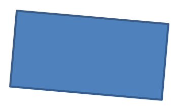
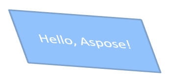

## **소개**

PowerPoint에서는 슬라이드에 도형을 추가할 수 있습니다. 도형은 선으로 구성되어 있기 때문에 외곽선을 수정하거나 효과를 적용하여 서식 지정할 수 있습니다. 또한 내부가 채워지는 방식을 제어하는 설정을 지정하여 도형을 서식 지정할 수 있습니다.


Aspose.Slides for Python은 PowerPoint에서 제공되는 동일한 옵션을 사용하여 도형을 서식 지정할 수 있는 클래스와 속성을 제공합니다.

## **라인 서식**

Aspose.Slides를 사용하면 도형에 맞춤 선 스타일을 지정할 수 있습니다. 다음 단계가 절차를 설명합니다:

1. [프레젠테이션](https://reference.aspose.com/slides/ko/python-net/aspose.slides/presentation/) 클래스의 인스턴스를 생성합니다.
1. 인덱스로 슬라이드에 대한 참조를 가져옵니다.
1. 슬라이드에 [AutoShape](https://reference.aspose.com/slides/ko/python-net/aspose.slides/autoshape/)를 추가합니다.
1. 도형의 [line style](https://reference.aspose.com/slides/ko/python-net/aspose.slides/linestyle/)을 설정합니다.
1. 선 너비를 설정합니다.
1. 도형의 [dash style](https://reference.aspose.com/slides/ko/python-net/aspose.slides/linedashstyle/)을 설정합니다.
1. 도형의 선 색을 설정합니다.
1. 수정된 프레젠테이션을 PPTX 파일로 저장합니다.

다음 Python 코드에서는 사각형 `AutoShape`를 서식 지정하는 방법을 보여 줍니다:

```python
import aspose.slides as slides
import aspose.pydrawing as draw

# 프레젠테이션 파일을 나타내는 Presentation 클래스를 인스턴스화합니다.
with slides.Presentation() as presentation:

    # 첫 번째 슬라이드를 가져옵니다.
    slide = presentation.slides[0]

    # Rectangle 유형의 자동 도형을 추가합니다.
    shape = slide.shapes.add_auto_shape(slides.ShapeType.RECTANGLE, 50, 150, 150, 75)

    # 직사각형 도형의 채우기 색상을 설정합니다.
    shape.fill_format.fill_type = slides.FillType.NO_FILL

    # 직사각형 선에 서식을 적용합니다.
    shape.line_format.style = slides.LineStyle.THICK_THIN
    shape.line_format.width = 7
    shape.line_format.dash_style = slides.LineDashStyle.DASH

    # 직사각형 선의 색을 설정합니다.
    shape.line_format.fill_format.fill_type = slides.FillType.SOLID
    shape.line_format.fill_format.solid_fill_color.color = draw.Color.blue

    # PPTX 파일을 디스크에 저장합니다.
    presentation.save("formatted_lines.pptx", slides.export.SaveFormat.PPTX)
```

결과:


## **조인 스타일 서식**

다음은 세 가지 조인 유형 옵션입니다:

* 라운드
* 미터
* 베벨

기본적으로 PowerPoint가 두 선을 각도에서(예: 도형 모서리) 연결할 때 **라운드** 설정을 사용합니다. 그러나 각이 날카로운 도형을 그리는 경우 **미터** 옵션을 선호할 수 있습니다.


다음 Python 코드는 위 이미지와 같이 미터, 베벨, 라운드 조인 타입 설정을 사용하여 세 개의 사각형을 만든 방법을 보여 줍니다:

```python
import aspose.slides as slides
import aspose.pydrawing as draw

# 프레젠테이션 파일을 나타내는 Presentation 클래스를 인스턴스화합니다.
with slides.Presentation() as presentation:

	# 첫 번째 슬라이드를 가져옵니다.
	slide = presentation.slides[0]

	# Rectangle 유형의 자동 도형 세 개를 추가합니다.
	shape1 = slide.shapes.add_auto_shape(slides.ShapeType.RECTANGLE, 20, 20, 150, 75)
	shape2 = slide.shapes.add_auto_shape(slides.ShapeType.RECTANGLE, 210, 20, 150, 75)
	shape3 = slide.shapes.add_auto_shape(slides.ShapeType.RECTANGLE, 20, 135, 150, 75)

	# 각 직사각형 도형의 채우기 색상을 설정합니다.
	shape1.fill_format.fill_type = slides.FillType.SOLID
	shape1.fill_format.solid_fill_color.color = draw.Color.black
	shape2.fill_format.fill_type = slides.FillType.SOLID
	shape2.fill_format.solid_fill_color.color = draw.Color.black
	shape3.fill_format.fill_type = slides.FillType.SOLID
	shape3.fill_format.solid_fill_color.color = draw.Color.black

	# 선 너비를 설정합니다.
	shape1.line_format.width = 15
	shape2.line_format.width = 15
	shape3.line_format.width = 15

	# 각 직사각형 선의 색상을 설정합니다.
	shape1.line_format.fill_format.fill_type = slides.FillType.SOLID
	shape1.line_format.fill_format.solid_fill_color.color = draw.Color.blue
	shape2.line_format.fill_format.fill_type = slides.FillType.SOLID
	shape2.line_format.fill_format.solid_fill_color.color = draw.Color.blue
	shape3.line_format.fill_format.fill_type = slides.FillType.SOLID
	shape3.line_format.fill_format.solid_fill_color.color = draw.Color.blue

	# 조인 스타일을 설정합니다.
	shape1.line_format.join_style = slides.LineJoinStyle.MITER
	shape2.line_format.join_style = slides.LineJoinStyle.BEVEL
	shape3.line_format.join_style = slides.LineJoinStyle.ROUND

	# 각 직사각형에 텍스트를 추가합니다.
	shape1.text_frame.text = "Miter Join style"
	shape2.text_frame.text = "Bevel Join style"
	shape3.text_frame.text = "Round Join style"

	# PPTX 파일을 디스크에 저장합니다.
	presentation.save("join_styles.pptx", slides.export.SaveFormat.PPTX)
```

## **그라디언트 채우기**

PowerPoint에서 그라디언트 채우기는 도형에 연속적인 색상 혼합을 적용하는 서식 옵션입니다. 예를 들어 두 개 이상의 색상을 점진적으로 서로 섞이도록 적용할 수 있습니다.

Aspose.Slides를 사용하여 도형에 그라디언트 채우기를 적용하는 방법은 다음과 같습니다:

1. [프레젠테이션](https://reference.aspose.com/slides/ko/python-net/aspose.slides/presentation/) 클래스의 인스턴스를 생성합니다.
1. 인덱스로 슬라이드에 대한 참조를 가져옵니다.
1. 슬라이드에 [AutoShape](https://reference.aspose.com/slides/ko/python-net/aspose.slides/autoshape/)를 추가합니다.
1. 도형의 [FillType](https://reference.aspose.com/slides/ko/python-net/aspose.slides/filltype/)을 `GRADIENT`로 설정합니다.
1. [GradientFormat](https://reference.aspose.com/slides/ko/python-net/aspose.slides/gradientformat/) 클래스가 노출하는 `gradient_stops` 컬렉션의 `add` 메서드를 사용하여 정의된 위치와 함께 두 개의 원하는 색상을 추가합니다.
1. 수정된 프레젠테이션을 PPTX 파일로 저장합니다.

다음 Python 코드는 타원에 그라디언트 채우기 효과를 적용하는 방법을 보여 줍니다:

```python
import aspose.slides as slides

# 프레젠테이션 파일을 나타내는 Presentation 클래스를 인스턴스화합니다.
with slides.Presentation() as presentation:

    # 첫 번째 슬라이드를 가져옵니다.
    slide = presentation.slides[0]

    # Ellipse 유형의 자동 도형을 추가합니다.
    shape = slide.shapes.add_auto_shape(slides.ShapeType.ELLIPSE, 50, 50, 150, 75)

    # 타원에 그라디언트 서식을 적용합니다.
    shape.fill_format.fill_type = slides.FillType.GRADIENT
    shape.fill_format.gradient_format.gradient_shape = slides.GradientShape.LINEAR

    # 그라디언트 방향을 설정합니다.
    shape.fill_format.gradient_format.gradient_direction = slides.GradientDirection.FROM_CORNER2

    # 두 개의 그라디언트 스톱을 추가합니다.
    shape.fill_format.gradient_format.gradient_stops.add(1.0, slides.PresetColor.PURPLE)
    shape.fill_format.gradient_format.gradient_stops.add(0, slides.PresetColor.RED)

    # PPTX 파일을 디스크에 저장합니다.
    presentation.save("gradient_fill.pptx", slides.export.SaveFormat.PPTX)
```

결과:


## **패턴 채우기**

PowerPoint에서 패턴 채우기는 점, 줄무늬, 교차선 또는 체크와 같은 두 색상 디자인을 도형에 적용할 수 있는 서식 옵션입니다. 패턴의 전경색과 배경색을 사용자 지정할 수 있습니다.

Aspose.Slides는 프레젠테이션의 시각적 매력을 높이기 위해 도형에 적용할 수 있는 45개 이상의 사전 정의된 패턴 스타일을 제공합니다. 사전 정의된 패턴을 선택한 뒤에도 정확히 사용할 색상을 지정할 수 있습니다.

Aspose.Slides를 사용하여 도형에 패턴 채우기를 적용하는 방법은 다음과 같습니다:

1. [프레젠테이션](https://reference.aspose.com/slides/ko/python-net/aspose.slides/presentation/) 클래스의 인스턴스를 생성합니다.
1. 인덱스로 슬라이드에 대한 참조를 가져옵니다.
1. 슬라이드에 [AutoShape](https://reference.aspose.com/slides/ko/python-net/aspose.slides/autoshape/)를 추가합니다.
1. 도형의 [FillType](https://reference.aspose.com/slides/ko/python-net/aspose.slides/filltype/)을 `PATTERN`으로 설정합니다.
1. 사전 정의된 옵션 중에서 패턴 스타일을 선택합니다.
1. 패턴의 [back_color](https://reference.aspose.com/slides/ko/python-net/aspose.slides/patternformat/back_color/)을 설정합니다.
1. 패턴의 [fore_color](https://reference.aspose.com/slides/ko/python-net/aspose.slides/patternformat/fore_color/)을 설정합니다.
1. 수정된 프레젠테이션을 PPTX 파일로 저장합니다.

다음 Python 코드는 사각형에 패턴 채우기를 적용하는 방법을 보여 줍니다:

```python
import aspose.slides as slides
import aspose.pydrawing as draw

# 프레젠테이션 파일을 나타내는 Presentation 클래스를 인스턴스화합니다.
with slides.Presentation() as presentation:

    # 첫 번째 슬라이드를 가져옵니다.
    slide = presentation.slides[0]

    # Rectangle 유형의 자동 도형을 추가합니다.
    shape = slide.shapes.add_auto_shape(slides.ShapeType.RECTANGLE, 50, 50, 150, 75)

    # 채우기 유형을 Pattern으로 설정합니다.
    shape.fill_format.fill_type = slides.FillType.PATTERN

    # 패턴 스타일을 설정합니다.
    shape.fill_format.pattern_format.pattern_style = slides.PatternStyle.TRELLIS

    # 패턴 배경색과 전경색을 설정합니다.
    shape.fill_format.pattern_format.back_color.color = draw.Color.light_gray
    shape.fill_format.pattern_format.fore_color.color = draw.Color.yellow

    # PPTX 파일을 디스크에 저장합니다.
    presentation.save("pattern_fill.pptx", slides.export.SaveFormat.PPTX)
```

결과:


## **그림 채우기**

PowerPoint에서 그림 채우기는 이미지를 도형 내부에 삽입하여 도형의 배경처럼 사용할 수 있는 서식 옵션입니다.

Aspose.Slides를 사용하여 도형에 그림 채우기를 적용하는 방법은 다음과 같습니다:

1. [프레젠테이션](https://reference.aspose.com/slides/ko/python-net/aspose.slides/presentation/) 클래스의 인스턴스를 생성합니다.
1. 인덱스로 슬라이드에 대한 참조를 가져옵니다.
1. 슬라이드에 [AutoShape](https://reference.aspose.com/slides/ko/python-net/aspose.slides/autoshape/)를 추가합니다.
1. 도형의 [FillType](https://reference.aspose.com/slides/ko/python-net/aspose.slides/filltype/)을 `PICTURE`로 설정합니다.
1. 그림 채우기 모드를 `TILE`(또는 원하는 다른 모드)로 설정합니다.
1. 사용하려는 이미지에서 [PPImage](https://reference.aspose.com/slides/ko/python-net/aspose.slides/ppimage/) 객체를 생성합니다.
1. 이 이미지를 도형의 `picture_fill_format` 안에 있는 `picture.image` 속성에 할당합니다.
1. 수정된 프레젠테이션을 PPTX 파일로 저장합니다.

예를 들어 "lotus.png" 파일이 다음과 같은 그림이라고 가정해 보겠습니다:


다음 Python 코드는 도형을 그림으로 채우는 방법을 보여 줍니다:

```python
import aspose.slides as slides

# 프레젠테이션 파일을 나타내는 Presentation 클래스를 인스턴스화합니다.
with slides.Presentation() as presentation:

    # 첫 번째 슬라이드를 가져옵니다.
    slide = presentation.slides[0]

    # Rectangle 유형의 자동 도형을 추가합니다.
    shape = slide.shapes.add_auto_shape(slides.ShapeType.RECTANGLE, 50, 50, 192, 95)

    # 채우기 유형을 Picture로 설정합니다.
    shape.fill_format.fill_type = slides.FillType.PICTURE

    # 그림 채우기 모드를 설정합니다.
    shape.fill_format.picture_fill_format.picture_fill_mode = slides.PictureFillMode.TILE

    # 이미지를 로드하고 프레젠테이션 리소스에 추가합니다.
    with slides.Images.from_file("lotus.png") as image:
        presentation_image = presentation.images.add_image(image)

    # 그림을 설정합니다.
    shape.fill_format.picture_fill_format.picture.image = presentation_image

    # PPTX 파일을 디스크에 저장합니다.
    presentation.save("picture_fill.pptx", slides.export.SaveFormat.PPTX)
```

결과:


### **텍스처로 타일 그림 사용**

타일 그림을 텍스처로 설정하고 타일링 동작을 사용자 지정하려면 [PictureFillFormat](https://reference.aspose.com/slides/ko/python-net/aspose.slides/picturefillformat/) 클래스의 다음 속성을 사용할 수 있습니다:

- [picture_fill_mode](https://reference.aspose.com/slides/ko/python-net/aspose.slides/picturefillformat/picture_fill_mode/): 그림 채우기 모드를 `TILE` 또는 `STRETCH`로 설정합니다.
- [tile_alignment](https://reference.aspose.com/slides/ko/python-net/aspose.slides/picturefillformat/tile_alignment/): 도형 내 타일 정렬을 지정합니다.
- [tile_flip](https://reference.aspose.com/slides/ko/python-net/aspose.slides/picturefillformat/tile_flip/): 타일을 수평, 수직 또는 모두 뒤집을지 제어합니다.
- [tile_offset_x](https://reference.aspose.com/slides/ko/python-net/aspose.slides/picturefillformat/tile_offset_x/): 도형 원점에서 타일의 가로 오프셋(포인트)을 설정합니다.
- [tile_offset_y](https://reference.aspose.com/slides/ko/python-net/aspose.slides/picturefillformat/tile_offset_y/): 도형 원점에서 타일의 세로 오프셋(포인트)을 설정합니다.
- [tile_scale_x](https://reference.aspose.com/slides/ko/python-net/aspose.slides/picturefillformat/tile_scale_x/): 타일의 가로 스케일을 백분율로 정의합니다.
- [tile_scale_y](https://reference.aspose.com/slides/ko/python-net/aspose.slides/picturefillformat/tile_scale_y/): 타일의 세로 스케일을 백분율로 정의합니다.

다음 코드 샘플은 타일 그림 채우기가 적용된 사각형 도형을 추가하고 타일 옵션을 구성하는 방법을 보여 줍니다:

```py
import aspose.slides as slides

# 프레젠테이션 파일을 나타내는 Presentation 클래스를 인스턴스화합니다.
with slides.Presentation() as presentation:

    # 첫 번째 슬라이드를 가져옵니다.
    first_slide = presentation.slides[0]

    # 사각형 자동 도형을 추가합니다.
    shape = first_slide.shapes.add_auto_shape(slides.ShapeType.RECTANGLE, 50, 50, 190, 95)

    # 도형의 채우기 유형을 Picture로 설정합니다.
    shape.fill_format.fill_type = slides.FillType.PICTURE

    # 이미지를 로드하고 프레젠테이션 리소스에 추가합니다.
    with slides.Images.from_file("lotus.png") as source_image:
        presentation_image = presentation.images.add_image(source_image)

    # 이미지를 도형에 할당합니다.
    picture_fill_format = shape.fill_format.picture_fill_format
    picture_fill_format.picture.image = presentation_image

    # 그림 채우기 모드와 타일링 속성을 구성합니다.
    picture_fill_format.picture_fill_mode = slides.PictureFillMode.TILE
    picture_fill_format.tile_offset_x = -32
    picture_fill_format.tile_offset_y = -32
    picture_fill_format.tile_scale_x = 50
    picture_fill_format.tile_scale_y = 50
    picture_fill_format.tile_alignment = slides.RectangleAlignment.BOTTOM_RIGHT
    picture_fill_format.tile_flip = slides.TileFlip.FLIP_BOTH

    # PPTX 파일을 디스크에 저장합니다.
    presentation.save("tile.pptx", slides.export.SaveFormat.PPTX)
```

결과:


## **단색 채우기**

PowerPoint에서 단색 채우기는 도형을 하나의 균일한 색으로 채우는 서식 옵션입니다. 이 배경색은 그라디언트, 텍스처 또는 패턴 없이 순수하게 적용됩니다.

Aspose.Slides를 사용하여 도형에 단색 채우기를 적용하려면 다음 절차를 따르세요:

1. [프레젠테이션](https://reference.aspose.com/slides/ko/python-net/aspose.slides/presentation/) 클래스의 인스턴스를 생성합니다.
1. 인덱스로 슬라이드에 대한 참조를 가져옵니다.
1. 슬라이드에 [AutoShape](https://reference.aspose.com/slides/ko/python-net/aspose.slides/autoshape/)를 추가합니다.
1. 도형의 [FillType](https://reference.aspose.com/slides/ko/python-net/aspose.slides/filltype/)을 `SOLID`로 설정합니다.
1. 원하는 채우기 색을 도형에 할당합니다.
1. 수정된 프레젠테이션을 PPTX 파일로 저장합니다.

다음 Python 코드는 PowerPoint 슬라이드의 사각형에 단색 채우기를 적용하는 방법을 보여 줍니다:

```python
import aspose.slides as slides
import aspose.pydrawing as draw

# 프레젠테이션 파일을 나타내는 Presentation 클래스를 인스턴스화합니다.
with slides.Presentation() as presentation:

    # 첫 번째 슬라이드를 가져옵니다.
    slide = presentation.slides[0]

    # Rectangle 유형의 자동 도형을 추가합니다.
    shape = slide.shapes.add_auto_shape(slides.ShapeType.RECTANGLE, 50, 50, 150, 75)

    # 채우기 유형을 Solid로 설정합니다.
    shape.fill_format.fill_type = slides.FillType.SOLID

    # 채우기 색상을 설정합니다.
    shape.fill_format.solid_fill_color.color = draw.Color.yellow

    # PPTX 파일을 디스크에 저장합니다.
    presentation.save("solid_color_fill.pptx", slides.export.SaveFormat.PPTX)
```

결과:


## **투명도 설정**

PowerPoint에서 도형에 단색, 그라디언트, 그림 또는 텍스처 채우기를 적용할 때 투명도 수준을 설정하여 채우기의 불투명도를 제어할 수 있습니다. 투명도 값이 높을수록 도형이 더 투명해져 배경이나 아래 객체가 부분적으로 보이게 됩니다.

Aspose.Slides는 채우기에 사용되는 색상의 알파 값을 조정하여 투명도 수준을 설정할 수 있게 해 줍니다. 방법은 다음과 같습니다:

1. [프레젠테이션](https://reference.aspose.com/slides/ko/python-net/aspose.slides/presentation/) 클래스의 인스턴스를 생성합니다.
1. 인덱스로 슬라이드에 대한 참조를 가져옵니다.
1. 슬라이드에 [AutoShape](https://reference.aspose.com/slides/ko/python-net/aspose.slides/autoshape/)를 추가합니다.
1. 채우기 유형을 `SOLID`로 설정합니다.
1. `Color.from_argb`를 사용하여 투명도가 포함된 색을 정의합니다(`alpha` 구성 요소가 투명도를 제어합니다).
1. 프레젠테이션을 저장합니다.

다음 Python 코드는 사각형에 투명 색 채우기를 적용하는 방법을 보여 줍니다:

```python
import aspose.pydrawing as draw
import aspose.slides as slides

# 프레젠테이션 파일을 나타내는 Presentation 클래스를 인스턴스화합니다.
with slides.Presentation() as presentation:

    # 첫 번째 슬라이드를 가져옵니다.
    slide = presentation.slides[0]
    
    # 단색 사각형 자동 도형을 추가합니다.
    slide.shapes.add_auto_shape(slides.ShapeType.RECTANGLE, 50, 50, 150, 75)

    # 투명한 사각형 자동 도형을 실선 도형 위에 추가합니다.
    shape = slide.shapes.add_auto_shape(slides.ShapeType.RECTANGLE, 80, 80, 150, 75)
    shape.fill_format.fill_type = slides.FillType.SOLID
    shape.fill_format.solid_fill_color.color = draw.Color.from_argb(128, 204, 102, 0)
    
    presentation.save("shape_transparency.pptx", slides.export.SaveFormat.PPTX)
```

결과:


## **도형 회전**

Aspose.Slides를 사용하면 PowerPoint 프레젠테이션에서 도형을 회전시킬 수 있습니다. 이는 특정 정렬이나 디자인 요구 사항에 맞게 시각 요소를 배치할 때 유용합니다.

슬라이드에서 도형을 회전시키려면 다음 절차를 따르세요:

1. [프레젠테이션](https://reference.aspose.com/slides/ko/python-net/aspose.slides/presentation/) 클래스의 인스턴스를 생성합니다.
1. 인덱스로 슬라이드에 대한 참조를 가져옵니다.
1. 슬라이드에 [AutoShape](https://reference.aspose.com/slides/ko/python-net/aspose.slides/autoshape/)를 추가합니다.
1. 도형의 `rotation` 속성을 원하는 각도로 설정합니다.
1. 프레젠테이션을 저장합니다.

다음 Python 코드는 도형을 5도 회전시키는 방법을 보여 줍니다:

```python
import aspose.slides as slides

# 프레젠테이션 파일을 나타내는 Presentation 클래스를 인스턴스화합니다.
with slides.Presentation() as presentation:

    # 첫 번째 슬라이드를 가져옵니다.
    slide = presentation.slides[0]

    # Rectangle 유형의 자동 도형을 추가합니다.
    shape = slide.shapes.add_auto_shape(slides.ShapeType.RECTANGLE, 50, 50, 150, 75)

    # 도형을 5도 회전시킵니다.
    shape.rotation = 5

    # PPTX 파일을 디스크에 저장합니다.
    presentation.save("shape_rotation.pptx", slides.export.SaveFormat.PPTX)
```

결과:



## **3D 베벨 효과 추가**

Aspose.Slides는 도형의 [ThreeDFormat](https://reference.aspose.com/slides/ko/python-net/aspose.slides/threedformat/) 속성을 구성하여 3D 베벨 효과를 적용할 수 있도록 해 줍니다.

도형에 3D 베벨 효과를 추가하려면 다음 절차를 따르세요:

1. [프레젠테이션](https://reference.aspose.com/slides/ko/python-net/aspose.slides/presentation/) 클래스를 인스턴스화합니다.
1. 인덱스로 슬라이드에 대한 참조를 가져옵니다.
1. 슬라이드에 [AutoShape](https://reference.aspose.com/slides/ko/python-net/aspose.slides/autoshape/)를 추가합니다.
1. 도형의 [ThreeDFormat](https://reference.aspose.com/slides/ko/python-net/aspose.slides/threedformat/)을 구성하여 베벨 설정을 정의합니다.
1. 프레젠테이션을 저장합니다.

다음 Python 코드는 도형에 3D 베벨 효과를 적용하는 방법을 보여 줍니다:

```python
import aspose.slides as slides
import aspose.pydrawing as draw

# Presentation 클래스의 인스턴스를 생성합니다.
with slides.Presentation() as presentation:

    slide = presentation.slides[0]

    # 슬라이드에 도형을 추가합니다.
    shape = slide.shapes.add_auto_shape(slides.ShapeType.ELLIPSE, 50, 50, 100, 100)
    shape.fill_format.fill_type = slides.FillType.SOLID
    shape.fill_format.solid_fill_color.color = draw.Color.green
    shape.line_format.fill_format.fill_type = slides.FillType.SOLID
    shape.line_format.fill_format.solid_fill_color.color = draw.Color.orange
    shape.line_format.width = 2.0

    # 도형의 ThreeDFormat 속성을 설정합니다.
    shape.three_d_format.depth = 4
    shape.three_d_format.bevel_top.bevel_type = slides.BevelPresetType.CIRCLE
    shape.three_d_format.bevel_top.height = 6
    shape.three_d_format.bevel_top.width = 6
    shape.three_d_format.camera.camera_type = slides.CameraPresetType.ORTHOGRAPHIC_FRONT
    shape.three_d_format.light_rig.light_type = slides.LightRigPresetType.THREE_PT
    shape.three_d_format.light_rig.direction = slides.LightingDirection.TOP

    # 프레젠테이션을 PPTX 파일로 저장합니다.
    presentation.save("3D_bevel_effect.pptx", slides.export.SaveFormat.PPTX)
```

결과:


## **3D 회전 효과 추가**

Aspose.Slides는 도형의 [ThreeDFormat](https://reference.aspose.com/slides/ko/python-net/aspose.slides/threedformat/) 속성을 구성하여 3D 회전 효과를 적용할 수 있도록 해 줍니다.

도형에 3D 회전을 적용하려면:

1. [프레젠테이션](https://reference.aspose.com/slides/ko/python-net/aspose.slides/presentation/) 클래스의 인스턴스를 생성합니다.
1. 인덱스로 슬라이드에 대한 참조를 가져옵니다.
1. 슬라이드에 [AutoShape](https://reference.aspose.com/slides/ko/python-net/aspose.slides/autoshape/)를 추가합니다.
1. 도형의 [camera_type](https://reference.aspose.com/slides/ko/python-net/aspose.slides/camera/camera_type/)와 [light_type](https://reference.aspose.com/slides/ko/python-net/aspose.slides/lightrig/light_type/)을 설정하여 3D 회전을 정의합니다.
1. 프레젠테이션을 저장합니다.

다음 Python 코드는 도형에 3D 회전 효과를 적용하는 방법을 보여 줍니다:

```python
import aspose.slides as slides

# Presentation 클래스의 인스턴스를 생성합니다.
with slides.Presentation() as presentation:

    slide = presentation.slides[0]

    auto_shape = slide.shapes.add_auto_shape(slides.ShapeType.RECTANGLE, 50, 50, 150, 75)
    auto_shape.text_frame.text = "Hello, Aspose!"

    auto_shape.three_d_format.depth = 6
    auto_shape.three_d_format.camera.set_rotation(40, 35, 20)
    auto_shape.three_d_format.camera.camera_type = slides.CameraPresetType.ISOMETRIC_LEFT_UP
    auto_shape.three_d_format.light_rig.light_type = slides.LightRigPresetType.BALANCED

    # PPTX 파일로 프레젠테이션을 저장합니다.      
    presentation.save("3D_rotation_effect.pptx", slides.export.SaveFormat.PPTX)
```

결과:



## **서식 초기화**

다음 Python 코드는 슬라이드의 서식을 초기화하고 [LayoutSlide](https://reference.aspose.com/slides/ko/python-net/aspose.slides/layoutslide/)에 있는 모든 자리 표시자 도형의 위치, 크기 및 서식을 기본값으로 되돌리는 방법을 보여 줍니다:

```python
import aspose.slides as slides

with slides.Presentation("sample.pptx") as presentation:

    for slide in presentation.slides:
        # 레이아웃에 자리 표시자가 있는 슬라이드의 각 도형을 초기화합니다.
        slide.reset()

    presentation.save("reset_formatting.pptx", slides.export.SaveFormat.PPTX)
```

## **FAQ**

**도형 서식이 최종 프레젠테이션 파일 크기에 영향을 줍니까?**

거의 영향을 주지 않습니다. 임베드된 이미지와 미디어가 파일 용량의 대부분을 차지하고, 색상, 효과, 그라디언트와 같은 도형 매개변수는 메타데이터로 저장되어 실질적인 크기 증가가 없습니다.

**슬라이드에서 동일한 서식을 공유하는 도형을 찾아 그룹화하려면 어떻게 해야 하나요?**

각 도형의 핵심 서식 속성(채우기, 선, 효과 설정)을 비교합니다. 모든 해당 값이 일치하면 스타일이 동일하다고 판단하고 논리적으로 그룹화하면 이후 스타일 관리를 간소화할 수 있습니다.

**맞춤 도형 스타일 세트를 별도 파일에 저장해 다른 프레젠테이션에서 재사용할 수 있나요?**

예. 원하는 스타일을 적용한 샘플 도형을 템플릿 슬라이드나 .POTX 템플릿 파일에 저장합니다. 새 프레젠테이션을 만들 때 템플릿을 열어 필요한 스타일 도형을 복제하고 필요에 따라 서식을 재적용하면 됩니다.