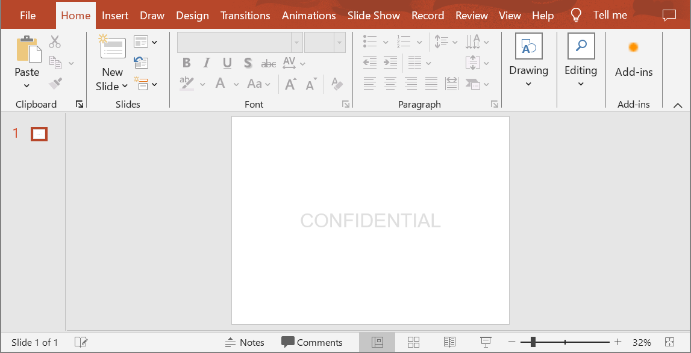

## **소개**

**워터마크**는 슬라이드 또는 전체 프레젠테이션 슬라이드에 사용되는 텍스트 또는 이미지 스탬프입니다. 일반적으로 워터마크는 프레젠테이션이 초안임을 나타내기 위해(예: “Draft” 워터마크), 기밀 정보를 포함하고 있음을 표시하기 위해(예: “Confidential” 워터마크), 소속 회사를 지정하기 위해(예: “Company Name” 워터마크), 프레젠테이션 작성자를 식별하기 위해 등 사용됩니다. 워터마크는 프레젠테이션을 복사해서는 안 된다는 표시를 함으로써 저작권 침해를 방지하는 데 도움이 됩니다. 워터마크는 PowerPoint와 OpenOffice 프레젠테이션 형식 모두에서 사용할 수 있습니다. Aspose.Slides에서는 PowerPoint PPT, PPTX 및 OpenOffice ODP 파일 형식에 워터마크를 추가할 수 있습니다.

[**Aspose.Slides**](https://products.aspose.com/slides/ko/python-net/)에서는 PowerPoint 또는 OpenOffice 문서에 워터마크를 만들고 디자인 및 동작을 수정하는 다양한 방법을 제공합니다. 공통점은 텍스트 워터마크를 추가하려면 [TextFrame](https://reference.aspose.com/slides/ko/python-net/aspose.slides/textframe/) 클래스를 사용하고, 이미지 워터마크를 추가하려면 [PictureFrame](https://reference.aspose.com/slides/ko/python-net/aspose.slides/pictureframe/) 클래스를 사용하거나 워터마크 모양을 이미지로 채우는 것입니다. `PictureFrame`은 [Shape](https://reference.aspose.com/slides/ko/python-net/aspose.slides/shape/) 클래스를 구현하므로 모양 객체의 모든 유연한 설정을 사용할 수 있습니다. `TextFrame`은 모양이 아니며 설정이 제한적이기 때문에 [Shape](https://reference.aspose.com/slides/ko/python-net/aspose.slides/shape/) 객체에 래핑됩니다.

워터마크를 적용하는 방법에는 두 가지가 있습니다: 단일 슬라이드에 적용하거나 전체 프레젠테이션 슬라이드에 적용하는 것. 슬라이드 마스터를 사용하면 전체 프레젠테이션 슬라이드에 워터마크를 적용할 수 있습니다—워터마크는 슬라이드 마스터에 추가되고 거기서 완전히 디자인된 뒤 개별 슬라이드의 수정 권한에 영향을 주지 않고 모든 슬라이드에 적용됩니다.

워터마크는 일반적으로 다른 사용자가 편집할 수 없도록 간주됩니다. 워터마크(또는 워터마크의 상위 모양)의 편집을 방지하려면 Aspose.Slides에서 제공하는 모양 잠금 기능을 사용할 수 있습니다. 특정 모양은 일반 슬라이드 또는 슬라이드 마스터에서 잠글 수 있습니다. 슬라이드 마스터에서 워터마크 모양을 잠그면 모든 프레젠테이션 슬라이드에서 잠깁니다.

워터마크에 이름을 지정하면 향후 삭제하려 할 때 슬라이드의 모양 목록에서 이름으로 찾아낼 수 있습니다.

워터마크는 원하는 방식으로 디자인할 수 있지만, 일반적으로 중앙 정렬, 회전, 앞쪽 배치 등 공통적인 특성을 갖습니다. 아래 예제에서 이러한 특성을 어떻게 활용하는지 살펴보겠습니다.

## **텍스트 워터마크**

### **슬라이드에 텍스트 워터마크 추가**

PPT, PPTX 또는 ODP에 텍스트 워터마크를 추가하려면 먼저 슬라이드에 모양을 추가한 다음 해당 모양에 텍스트 프레임을 추가합니다. 텍스트 프레임은 [TextFrame](https://reference.aspose.com/slides/ko/python-net/aspose.slides/textframe/) 클래스로 표현됩니다. 이 타입은 [Shape](https://reference.aspose.com/slides/ko/python-net/aspose.slides/shape/)을 상속하지 않으며, 워터마크 위치를 유연하게 지정할 수 있는 다양한 속성이 없습니다. 따라서 [TextFrame](https://reference.aspose.com/slides/ko/python-net/aspose.slides/textframe/) 객체는 [AutoShape](https://reference.aspose.com/slides/ko/python-net/aspose.slides/autoshape/) 객체에 래핑됩니다. 모양에 워터마크 텍스트를 추가하려면 아래와 같이 [add_text_frame](https://reference.aspose.com/slides/ko/python-net/aspose.slides/autoshape/add_text_frame/#str) 메서드를 사용합니다.

```py
watermark_text = "CONFIDENTIAL"

with Presentation() as presentation:
    slide = presentation.slides[0]

    watermark_shape = slide.shapes.add_auto_shape(ShapeType.RECTANGLE, 100, 100, 400, 40)
    watermark_frame = watermark_shape.add_text_frame(watermark_text)
```

{} 
- [How to Use the TextFrame Class](/slides/ko/python-net/text-formatting/)
{}

### **프레젠테이션에 텍스트 워터마크 추가**

전체 프레젠테이션(즉, 모든 슬라이드)에 텍스트 워터마크를 추가하려면 [MasterSlide](https://reference.aspose.com/slides/ko/python-net/aspose.slides/masterslide/)에 추가합니다. 나머지 논리는 단일 슬라이드에 워터마크를 추가할 때와 동일합니다—[AutoShape](https://reference.aspose.com/slides/ko/python-net/aspose.slides/autoshape/) 객체를 만든 다음 [add_text_frame](https://reference.aspose.com/slides/ko/python-net/aspose.slides/autoshape/add_text_frame/#str) 메서드로 워터마크를 추가합니다.

```py
watermark_text = "CONFIDENTIAL"

with Presentation() as presentation:
    master_slide = presentation.masters[0]

    watermark_shape = master_slide.shapes.add_auto_shape(ShapeType.RECTANGLE, 100, 100, 400, 40)
    watermark_frame = watermark_shape.add_text_frame(watermark_text)
```

{} 
- [How to Use the Slide Master](/slides/ko/python-net/slide-master/)
{}

### **워터마크 모양 투명도 설정**

기본적으로 사각형 모양은 채우기 및 선 색상이 적용됩니다. 다음 코드 라인은 모양을 투명하게 만듭니다.

```py
watermark_shape.fill_format.fill_type = FillType.NO_FILL
watermark_shape.line_format.fill_format.fill_type = FillType.NO_FILL
```

### **텍스트 워터마크의 글꼴 설정**

아래와 같이 텍스트 워터마크의 글꼴을 변경할 수 있습니다.

```py
text_format = watermark_frame.paragraphs[0].paragraph_format.default_portion_format
text_format.latin_font = FontData("Arial")
text_format.font_height = 50
```

### **워터마크 텍스트 색상 설정**

워터마크 텍스트 색상을 설정하려면 다음 코드를 사용합니다.

```py
alpha = 150
red = 200
green = 200
blue = 200

fill_format = watermark_frame.paragraphs[0].paragraph_format.default_portion_format.fill_format
fill_format.fill_type = FillType.SOLID
fill_format.solid_fill_color.color = drawing.Color.from_argb(alpha, red, green, blue)
```

### **텍스트 워터마크 중앙 정렬**

워터마크를 슬라이드 중앙에 배치하려면 다음과 같이 수행합니다.

```py
slide_size = presentation.slide_size.size

watermark_width = 400
watermark_height = 40
watermark_x = (slide_size.width - watermark_width) / 2
watermark_y = (slide_size.height - watermark_height) / 2

watermark_shape = slide.shapes.add_auto_shape(
    ShapeType.RECTANGLE, watermark_x, watermark_y, watermark_width, watermark_height)

watermark_frame = watermark_shape.add_text_frame(watermark_text)
```

아래 이미지는 최종 결과를 보여줍니다.



## **이미지 워터마크**

### **프레젠테이션에 이미지 워터마크 추가**

프레젠테이션 슬라이드에 이미지 워터마크를 추가하려면 다음과 같이 진행합니다.

```py
with open("watermark.png", "rb") as image_stream:
    image = presentation.images.add_image(image_stream.read())

    watermark_shape.fill_format.fill_type = FillType.PICTURE
    watermark_shape.fill_format.picture_fill_format.picture.image = image
    watermark_shape.fill_format.picture_fill_format.picture_fill_mode = PictureFillMode.STRETCH
```

## **워터마크 편집 잠금**

워터마크 편집을 방지해야 하는 경우 모양에 대한 [AutoShape.auto_shape_lock](https://reference.aspose.com/slides/ko/python-net/aspose.slides/autoshape/auto_shape_lock/) 속성을 사용합니다. 이 속성을 통해 모양을 선택, 크기 조정, 위치 변경, 다른 요소와 그룹화, 텍스트 편집 잠금 등으로부터 보호할 수 있습니다.

```py
# 워터마크 모양을 수정하지 못하도록 잠금
watermark_shape.auto_shape_lock.select_locked = True
watermark_shape.auto_shape_lock.size_locked = True
watermark_shape.auto_shape_lock.text_locked = True
watermark_shape.auto_shape_lock.position_locked = True
watermark_shape.auto_shape_lock.grouping_locked = True
```

## **워터마크 앞쪽 배치**

Aspose.Slides에서는 [ShapeCollection.reorder](https://reference.aspose.com/slides/ko/python-net/aspose.slides/ishapecollection/reorder/#int-ishape) 메서드를 통해 모양의 Z-순서를 설정할 수 있습니다. 이 메서드를 프레젠테이션 슬라이드 목록에서 호출하고 모양 참조와 순서 번호를 전달하면 모양을 앞쪽으로 가져오거나 뒤쪽으로 보낼 수 있습니다. 프레젠테이션 앞에 워터마크를 배치해야 할 때 특히 유용합니다.

```py
shape_count = len(slide.shapes)
slide.shapes.reorder(shape_count - 1, watermark_shape)
```

## **워터마크 회전 설정**

다음 코드는 워터마크를 슬라이드 대각선 방향으로 배치하도록 회전시키는 예제입니다.

```py
diagonal_angle = math.atan(slide_size.height / slide_size.width) * 180 / math.pi

watermark_shape.rotation = float(diagonal_angle)
```

## **워터마크 이름 지정**

Aspose.Slides에서는 모양에 이름을 지정할 수 있습니다. 모양 이름을 사용하면 이후에 해당 워터마크를 수정하거나 삭제할 때 이름으로 접근할 수 있습니다. 워터마크 모양의 이름을 지정하려면 [AutoShape.name](https://reference.aspose.com/slides/ko/python-net/aspose.slides/autoshape/name/) 속성에 값을 할당합니다.

```py
watermark_shape.name = "watermark"
```

## **워터마크 제거**

워터마크 모양을 제거하려면 슬라이드 모양 목록에서 [AutoShape.name](https://reference.aspose.com/slides/ko/python-net/aspose.slides/autoshape/name/)을 사용해 찾은 뒤, 해당 모양을 [ShapeCollection.remove](https://reference.aspose.com/slides/ko/python-net/aspose.slides/shapecollection/remove/#ishape) 메서드에 전달합니다.

```py
slide_shapes = list(slide.shapes)
for shape in slide_shapes:
    if shape.name == "watermark":
        slide.shapes.remove(watermark_shape)
```

## **실시간 예제**

**Aspose.Slides 무료** [Add Watermark](https://products.aspose.app/slides/ko/watermark) 및 [Remove Watermark](https://products.aspose.app/slides/ko/watermark/remove-watermark) 온라인 도구를 확인해 보세요.


## **FAQ**

**워터마크란 무엇이며 왜 사용해야 하나요?**

워터마크는 슬라이드에 적용되는 텍스트 또는 이미지 오버레이로, 지적 재산을 보호하고 브랜드 인지도를 높이며 프레젠테이션의 무단 사용을 방지하는 데 도움이 됩니다.

**프레젠테이션의 모든 슬라이드에 워터마크를 추가할 수 있나요?**

예, Aspose.Slides를 사용하면 프레젠테이션의 모든 슬라이드에 워터마크를 추가할 수 있습니다. 모든 슬라이드를 순회하면서 개별적으로 워터마크 설정을 적용하면 됩니다.

**워터마크의 투명도를 어떻게 조절하나요?**

모양의 채우기 설정([FillFormat](https://reference.aspose.com/slides/ko/python-net/aspose.slides/fillformat/))을 수정하여 워터마크의 투명도를 조절할 수 있습니다. 이렇게 하면 워터마크가 미묘하게 표시되어 슬라이드 내용에 방해가 되지 않습니다.

**워터마크에 사용할 수 있는 이미지 형식은 무엇인가요?**

Aspose.Slides는 PNG, JPEG, GIF, BMP, SVG 등 다양한 이미지 형식을 지원합니다.

**텍스트 워터마크의 글꼴과 스타일을 맞춤 설정할 수 있나요?**

예, 프레젠테이션 디자인과 브랜드 일관성을 유지하도록 원하는 글꼴, 크기 및 스타일을 선택할 수 있습니다.

**워터마크의 위치나 방향을 어떻게 변경하나요?**

모양([shape](https://reference.aspose.com/slides/ko/python-net/aspose.slides/shape/))의 좌표, 크기 및 회전 속성을 수정하여 워터마크의 위치와 방향을 조정할 수 있습니다.