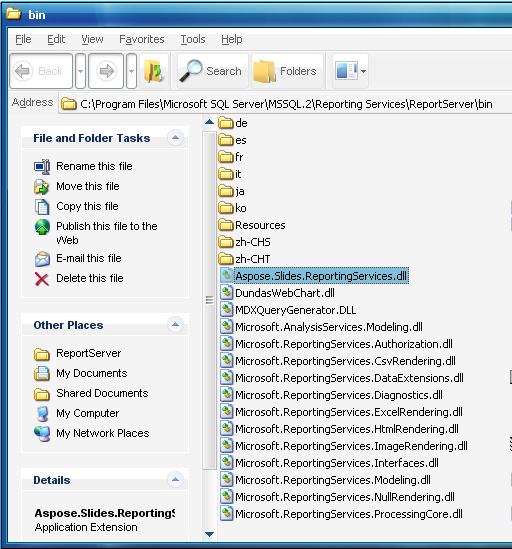

{}

Aspose.Slides for Reporting Services는 Microsoft SQL Server Reporting Services 및 Power BI Report Server용 [rendering extension](https://learn.microsoft.com/en-us/sql/reporting-services/extensions/rendering-extension/rendering-extensions-overview)입니다.
Aspose.Slides for Reporting Services는 지원되는 보고 서버가 실행 중인 컴퓨터(32비트 또는 64비트)에 설치할 수 있는 단일 MSI 설치 프로그램으로 제공됩니다. 자세한 내용은 [System Requirements](/slides/ko/reportingservices/system-requirements/)를 참조하십시오.

Aspose.Slides for Reporting Services는 수동으로 배포하고 관리하기도 쉽습니다. 이는 하나의 .NET 어셈블리 *Aspose.Slides* *.ReportingServices.dll* 로만 구성되어 있으며, 완전히 C#로 작성되고 CLS를 준수하며 안전한 관리 코드만 포함하고 있기 때문입니다.

{}

ZIP 다운로드에는 보고 서버용 Aspose.Slides.ReportingServices.dll 두 개의 빌드가 포함됩니다:

- Bin\SSRS2005\Aspose.Slides.ReportingServices.dll – Microsoft SQL Server 2005 및 .NET Framework 2.0용으로 빌드되었습니다( x86 및 x64 사용)
- Bin\Universal\Aspose.Slides.ReportingServices.dll – Microsoft SQL Server 2008 이후, Power BI Report Server 및 .NET Framework 2.0용으로 빌드되었습니다( x86 및 x64 사용)

MSI 설치 프로그램은 동일한 두 빌드를 설치하고 각 보고 서버 인스턴스에 맞는 빌드를 선택합니다. [Install Manually](/slides/ko/reportingservices/install-manually/)에서는 ZIP 다운로드에 포함된 모든 파일을 나열합니다.

설치 시, Aspose.Slides.ReportingServices.dll이 ReportServer\bin 디렉터리로 복사되고 구성 파일이 업데이트되어 Reporting Services가 새로운 rendering extension을 인식하게 됩니다. 이러한 단계는 Aspose.Slides for Reporting Services 설치 프로그램에 의해 수행되지만, 이 문서에서 자세히 설명하는 대로 수동으로 수행할 수도 있습니다.

**그림**: Aspose.Slides.ReportingServices.dll이 **ReportServer\bin** 디렉터리로 복사됩니다.