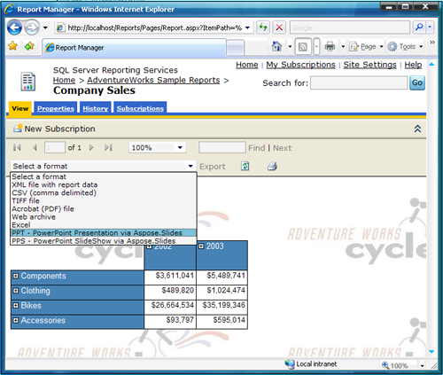

{} 

Aspose.Slides for Reporting Services를 수동으로 설치하려는 경우에만 아래 단계를 따르세요. 이 경우 어셈블리 파일이 포함된 ZIP 패키지를 다운로드했습니다. 

{} 

{} 

**Aspose.Slides for Reporting Services**는 호스트 머신에 **.NET Framework 3.5**를 설치해야 합니다. 

{}

### **수동 설치**
이 지침에서는 Microsoft SQL Server Reporting Services가 설치된 디렉터리에서 파일을 복사하고 수정하는 방법을 보여줍니다:

1. Report Server 설치 디렉터리를 찾습니다.  
   Microsoft SQL Server의 루트 디렉터리는 일반적으로 여기입니다: ***C:\Program Files\Microsoft SQL Server***
   
   {} 
   
   **Microsoft SQL Server 2005 및 2008**: 머신에 여러 Microsoft SQL Server 인스턴스가 구성되어 있을 수 있으며, MSSQL.1, MSSQL.2 등과 같은 다른 MSSQL.x 하위 디렉터리를 차지할 수 있습니다. 다음 단계로 진행하기 전에 올바른 ***C:\Program Files\Microsoft SQL Server\MSSQL.x\Reporting Services\ReportServer*** 디렉터리를 찾아야 합니다.
   
   {} 아래에서 사용되는 모든 경로는 이 디렉터리를 <Instance>로 지칭합니다. 

2. Aspose.Slides.ReportingServices.dll를 **C:\Program Files\Microsoft SQL Server\xxx\Reporting Services\ReportServer\bin** 폴더에 복사합니다.  
   **Aspose.Slides.ReportingServices.zip** 다운로드에는 **Aspose.Slides.ReportingServices.dll**이 포함되어 있습니다. {} 

일부 경우, DLL을 **ReportServer\bin** 디렉터리에 복사하면 명시적으로 할당된 NTFS 파일 권한과 함께 복사될 수 있습니다. NTFS 권한 때문에 Microsoft SQL Server Reporting Services가 **Aspose.Slides.ReportingServices.dll**을 로드할 때 액세스가 거부됩니다. 이 경우 새로운 내보내기 형식이 제공되지 않습니다. 올바른 NTFS 권한이 적용되어 있는지 확인하십시오:

   1. **Aspose.Slides.ReportingServices.dll**를 마우스 오른쪽 버튼으로 클릭합니다.  
   2. **Properties**를 클릭하고 **Security** 탭을 선택합니다.  
   3. 명시적으로 할당된 NTFS 권한을 모두 제거하고 상속된 권한만 남깁니다.

{}

3. Aspose.Slides for Reporting Services를 렌더링 확장으로 등록합니다:  
   1. *C:\Program Files\Microsoft SQL Server\<Instance>\Reporting Services\ReportServer\rsreportserver.config*를 엽니다.  
   2. <Render> 요소에 다음 줄을 추가합니다:  

**<Render>**

``` xml

   ...

  <!--여기에서 시작합니다.-->

  <Extension Name="ASPPT" Type="Aspose.Slides.ReportingServices.PptRenderer,Aspose.Slides.ReportingServices"/>

  <Extension Name="ASPPS" Type="Aspose.Slides.ReportingServices.PpsRenderer,Aspose.Slides.ReportingServices"/>

  <Extension Name="ASPPTX" Type="Aspose.Slides.ReportingServices.PptxRenderer,Aspose.Slides.ReportingServices"/>

  <Extension Name="ASPPSX" Type="Aspose.Slides.ReportingServices.PpsxRenderer,Aspose.Slides.ReportingServices"/>

  <!--여기에서 끝납니다.-->

</Render>


```

4. Aspose.Slides for Reporting Services에 실행 권한을 부여합니다:  
   1. **C:\Program Files\Microsoft SQL Server\<Instance>\Reporting Services\ReportServer\rssrvpolicy.config**를 엽니다.  
   2. 다음 내용을 두 번째 바깥쪽 <CodeGroup> 요소의 마지막 항목으로 추가합니다(다음과 같아야 합니다: <CodeGroup class="FirstMatchCodeGroup" version="1" PermissionSetName="Execution" Description="This code group grants MyComputer code Execution permission. ">).  

**<CodeGroup>**

``` xml


...

  <CodeGroup>

    ...

    <!--여기에서 시작합니다.-->

    <CodeGroup

        class="UnionCodeGroup"

        version="1"

        PermissionSetName="FullTrust"

        Name="Aspose.Slides_for_Reporting_Services"

        Description="This code group grants full trust to the AS4SSRS assembly.">

        <IMembershipCondition

            class="StrongNameMembershipCondition"

            version="1"

            PublicKeyBlob="00240000048000009400000006020000002400005253413100040000010001005542e

            99cecd28842dad186257b2c7b6ae9b5947e51e0b17b4ac6d8cecd3e01c4d20658c5e4ea1b9a6c8f854b2

            d796c4fde740dac65e834167758cff283eed1be5c9a812022b015a902e0b97d4e95569eb8c0971834744

            e633d9cb4c4a6d8eda03c12f486e13a1a0cb1aa101ad94943236384cbbf5c679944b994de9546e493bf" />

    </CodeGroup>

    <!--여기에서 끝납니다.-->

  </CodeGroup>

</CodeGroup>


```

5. Aspose.Slides for Reporting Services가 성공적으로 설치되었는지 확인합니다:  
   1. Report Manager를 열고 보고서에 대한 사용 가능한 내보내기 형식 목록을 확인합니다.  
   
      {} 브라우저(Microsoft Internet Explorer 6.0 이상)를 열고 주소 표시줄에 Report Manager URL을 입력하여 Report Manager를 시작할 수 있습니다(기본값은 http://<ComputerName>/Reports 입니다).  
   
      {}

   1. 서버에서 보고서를 선택합니다.  
   1. **Select Format** 목록을 엽니다.  
      Aspose.Slides for Reporting Services에서 제공하는 내보내기 형식 목록이 표시됩니다.  
   1. **PPT – PowerPoint Presentation via Aspose.Slides**을 선택합니다.  

   **Aspose.Slides for Reporting Services가 성공적으로 설치되었으며 새로운 내보내기 형식을 사용할 수 있습니다.**  




6. **Export** 링크를 클릭합니다.  
   보고서는 선택한 형식으로 생성되어 클라이언트에 전송되고 적절한 응용 프로그램에서 열립니다. 이 경우 보고서는 Microsoft PowerPoint에서 열렸습니다.  

   **Aspose.Slides for Reporting Services가 생성한 PPT 보고서.**  


Aspose.Slides for Reporting Services를 성공적으로 설치하고 Microsoft PowerPoint 프레젠테이션 형태의 보고서를 생성했습니다!