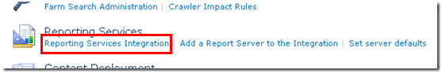

{} 

SharePoint가 RS 서버에 설치되고 구성되었으며 Reporting Services Configuration Manager를 통해 RS가 설정되었으므로 Central Admin 내의 구성을 진행할 수 있습니다. RS 2008 R2는 이 프로세스를 크게 단순화했습니다. 이전에는 작동시키기 위해 3단계가 필요했지만 이제는 한 단계만 필요합니다.  

Central Administrator 웹 사이트로 이동한 다음 **General Application Settings** 로 들어갑니다. 아래쪽에 **Reporting Services** 가 표시됩니다. 

{} 

**Figure 17**: SharePoint 구성 

{} 

“**Reporting Services Integration**” 를 클릭합니다. 

{} 
## **Web Service URL**
Reporting Services Configuration Manager에서 찾은 Report Server의 URL을 제공합니다. 
## **Authentication Mode**
인증 모드도 선택합니다. 다음 MSDN 링크에서 이에 대해 자세히 설명합니다. 
[SharePoint 통합 모드에서 Reporting Services에 대한 보안 개요](https://docs.microsoft.com/en-us/previous-versions/sql/sql-server-2008-r2/bb283324(v=sql.105)) 

요약하면, 사이트가 **Claims Authentication** 을 사용하고 있다면 여기에서 무엇을 선택하든 항상 Trusted Authentication 을 사용하게 됩니다. Windows 자격 증명을 전달하려면 Windows Authentication을 선택해야 합니다. Trusted Authentication을 사용할 경우 SPUser 토큰을 전달하고 Windows 자격 증명에 의존하지 않습니다.  

Classic Mode 사이트를 NTLM으로 구성했고 RS도 NTLM으로 설정된 경우 Trusted Authentication을 사용해야 합니다. Windows Authentication을 사용하고 데이터 소스에 전달하려면 Kerberos가 필요합니다. 

**Figure 18**: Reporting Services Integration 자격 증명 설정
## **Activate Feature**
이 옵션을 통해 모든 사이트 컬렉션에 Reporting Services를 활성화하거나 활성화할 사이트를 선택할 수 있습니다. 이는 어떤 사이트가 Reporting Services를 사용할 수 있는지를 의미합니다. 완료되면 다음 그림과 같이 표시됩니다. 

**Figure 19**: SharePoint 환경과 Reporting Services의 성공적인 통합 

Figure 14에서 본 Report Server URL 로 돌아가면 다음과 유사한 그림이 표시됩니다. 

**Figure 20**: SharePoint 환경에서 Reporting Services의 성공적인 확인 

{} 

SharePoint 사이트가 SSL로 구성된 경우 이 목록에 표시되지 않습니다. 이는 알려진 문제이며 문제가 있다는 의미는 아닙니다. 보고서는 여전히 작동합니다. 

{} 

이제 Reporting Services를 SharePoint 2010에서 사용할 준비가 되었습니다. 이전 버전과 마찬가지로 “Site Collection Feature”에 Reporting Services Integration을 구성할 때 활성화되는 기능이 있습니다. 또한 설치 시 사이트에 추가되는 3개의 컨텐츠 유형이 있습니다. Figure 21에서 볼 수 있듯이 문서 라이브러리에 2개의 컨텐츠 유형을 추가하여 사용자 지정 보고서를 만들 수 있습니다. 

**Figure 21**: Report Builder 

“**Reporter Builder**”는 서버에 다운로드해야 하는 ActiveX이며 Figure 22에서 확인할 수 있습니다. 

**Figure 22**: Report Builder 다운로드 및 설치 

다운로드가 완료되면 **“Report Builder”** 를 실행합니다. 이제 Figure 23과 같이 첫 번째 보고서를 디자인할 준비가 되었습니다. 

**Figure 23**: Report Builder 새 보고서 생성 마법사 

보고서를 만든 후에는 SharePoint 2010에 만든 문서 라이브러리에 저장하여 보고서를 보관할 수 있습니다. 

다른 컨텐츠 유형은 데이터 소스로서 공유 연결을 만들고 이를 SharePoint의 문서 라이브러리에 저장하는 데 사용됩니다. 문서 라이브러리를 만들고 이 컨텐츠 유형을 추가하면 연결을 저장하여 보고서의 데이터 소스를 변경할 수 있게 됩니다. 

**Figure 24**: 보고서를 Report Server에 성공적으로 내보내기