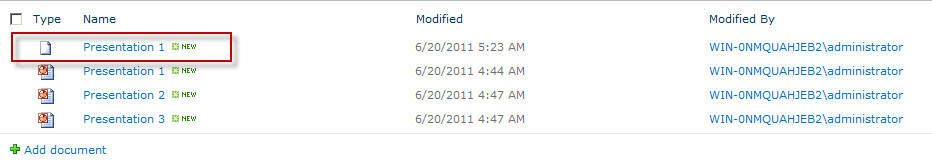

{} 

Aspose.Slides for SharePoint가 SharePoint 서버에 설치되면 아래와 같이 프레젠테이션 메뉴에 **Convert via Aspose.Slides.SharePoint** 옵션이 추가됩니다. 

**Aspose.Slides for SharePoint를 설치하면 문서 메뉴에 Convert via Aspose.Slides 옵션이 추가됩니다** 

{} 
## **프레젠테이션 변환**
SharePoint 문서 라이브러리에서 Microsoft PowerPoint 문서를 변환하려면 다음과 같이 수행합니다: 

1. 문서 라이브러리에서 Microsoft PowerPoint 문서를 선택합니다.
2. 아래 화살표를 클릭하여 메뉴를 열고 **Convert via Aspose.Slides.SharePoint**를 클릭합니다. 

   **Presentation 2 파일 메뉴에 Convert via Aspose.Slides 옵션이 표시됩니다** 

3. 양식에서 원하는 출력 형식을 선택합니다. 필요에 따라 출력 파일 이름 및 대상 폴더를 변경할 수 있습니다.
4. **Convert**를 클릭하여 파일을 변환합니다. 

   **변환 양식에서 출력 파일 형식, 이름 및 대상을 선택할 수 있습니다** 

5. 변환이 완료되면 성공 메시지가 표시됩니다. 

   **변환이 성공했습니다** 

6. **Source Library**를 클릭하여 원본 디렉터리로 이동하거나 **Destination Library**를 클릭하여 파일이 저장된 디렉터리로 이동합니다. 

   변환된 문서가 문서 라이브러리에 나타납니다. 

   **저장된 라이브러리에 표시된 변환된 문서** 

