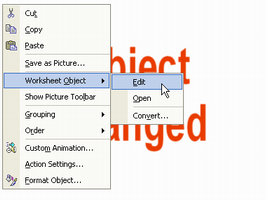
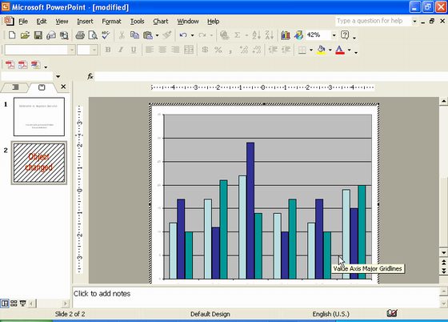
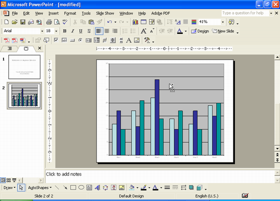
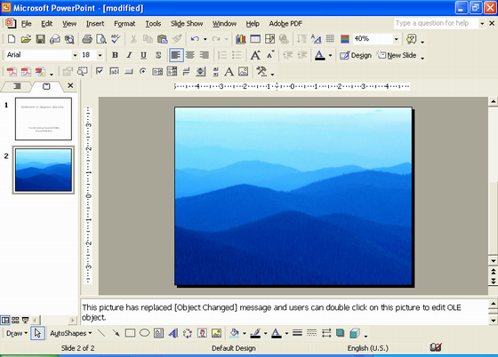

{} 

Using Aspose.Slides for .NET, when you add **[OleObjectFrame](https://reference.aspose.com/slides/net/aspose.slides/oleobjectframe)** to a slide, an **Object Changed** message is shown on the output slide (and NOT on the OLE object). The described process is a deliberate action and NOT a bug. 

For more information on working with OLE objects, see [Manage OLE](/slides/net/manage-ole/). 

{} 
## **Explanation** and Solution
Aspose.Slides displays the **Object Changed** message to notify you that the OLE object has been changed and the preview image has to be updated. 

For example, if you add a Microsoft Excel Chart as an [OleObjectFrame](https://reference.aspose.com/slides/net/aspose.slides/oleobjectframe) to a slide (for more details, see the Manage OLE article) and then open the presentation in the Microsoft PowerPoint app, you will see this image on the slide:

~~Replace all images with new images~~


If you want to check and confirm that your OLE object was added to the slide, you have to double-click on the **Object Changed** message, or you can right-click on it and go through **Worksheet Object >  Edit option.**



PowerPoint then opens the embedded OLE object




The slide may retain the **Object Changed** message. Once you click the OLE object, the slide preview gets updated and the **Object Changed** message is replaced by the actual image for the OLE object. 



Now, you may want to save your presentation to ensure the image for the OLE Object gets updated correctly. This way, after saving the presentation, when you open the presentation again, you will NOT see the **Object Changed** message. 

## **Other Solutions**
### **Solution 1: Replace the Object Changed Message With an Image**

If you do not want to remove the **Object Changed** message by opening the presentation in PowerPoint and then saving it, you can replace the message with your preferred preview image. These lines of code demonstrate the process:

``` csharp 
using (Presentation pres = new Presentation("embeddedOle.pptx"))
{
   ISlide slide = pres.Slides[0];
   IOleObjectFrame oleObjectFrame = (IOleObjectFrame)slide.Shapes[0];
    
   IPPImage oleImage = pres.Images.AddImage(File.ReadAllBytes("my_image.png"));
   oleObjectFrame.SubstitutePictureTitle = "My title";
   oleObjectFrame.SubstitutePictureFormat.Picture.Image = oleImage;
   oleObjectFrame.IsObjectIcon = false;
    
   pres.Save("embeddedOle-newImage.pptx", SaveFormat.Pptx);
}
```

The slide containing the `OleObjectFrame` then changes to this:



### **Solution 2: Create an Add-On for PowerPoint**
You can also create an add-on for Microsoft PowerPoint that updates all OLE objects when you open presentations in the program. 

