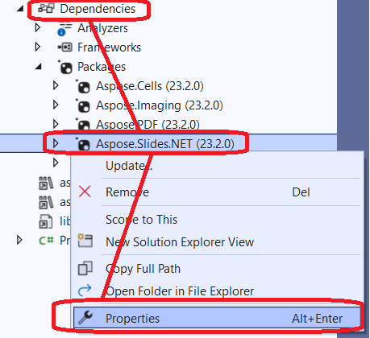
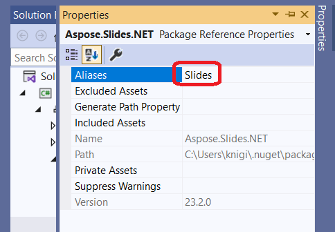

## Introduction

As of [Aspose.Slides 23.2](https://www.nuget.org/packages/Aspose.Slides.NET/23.2.0), .NET6 is supported. The peculiarity of this support is that .NET6 no longer supports System.Drawing.Common for Linux ([breaking change](https://learn.microsoft.com/en-us/dotnet/core/compatibility/core-libraries/6.0/system-drawing-common-windows-only)) and Slides implements this graphical subsystem itself as a C++ component.

Slides for .NET now work without dependencies on GDI/libgdiplus on:
* Windows
* Linux

_MacOS_ support is in progress.

## Using Slides for .NET6 on AWS and Azure

When using Slides in the cloud (AWS, Azure, or other cloud solutions), using the .NET6 version is preferred.

When using Slides when the host is Linux, it was often necessary to install additional dependencies (libgdiplus) and this was not always convenient or even possible to do (for example, when using [AWS Lambda](https://aws.amazon.com/lambda)). When using Slides for .NET6, these dependencies are no longer needed, which makes deployment much easier.

When used on a cloud solution where the host is Windows, problems can also occur. For example, [Azure Functions](https://learn.microsoft.com/en-us/azure/azure-functions/functions-overview) have limitations for the process, which leads to problems when exporting to PDF, for [example](https://github.com/projectkudu/kudu/wiki/Azure-Web-App-sandbox#unsupported-frameworks). Using Slides for .NET6 also solves this problem.

## Using the System.Drawing.Common package and Slides for .NET6 classes (CS0433: The type exists in both Slides and System.Drawing.Common error)

Sometimes it is necessary to use both System.Drawing and Slides for .NET6 dependencies in a project (for example, if the .NET6 project has dependencies on other packages, which in turn depend on System.Drawing). 

This can lead to compilation errors like these:
* CS0433: The type 'Image' exists in both 'Aspose.Slides, Version=23.2.0.0, Culture=neutral, PublicKeyToken=716fcc553a201e56' and 'System.Drawing.Common, Version=6.0.0.0
* CS0433: The type 'Graphics' exists in both 'Aspose.Slides, Version=23.2.0.0, Culture=neutral, PublicKeyToken=716fcc553a201e56' and 'System.Drawing.Common, Version=6.0.0.0

In this case you can  use [extern alias](https://learn.microsoft.com/en-us/dotnet/csharp/language-reference/keywords/extern-alias) for Slides:
1) Select the Slides assembly from the project's dependencies and go to its properties:

2) Set alias (for example, "Slides"):

3) After that the types from System.Drawing.Common will be used by default. Where Slides types are needed, external assembly alias should be specified:

```c#
extern alias Slides;
using Slides::Aspose.Slides;
```

Full example:

```c#
extern alias Slides;
using Slides::Aspose.Slides;

static Slides::System.Drawing.Image GetThumbnail(Presentation pres)
{
    return pres.Slides[0].GetThumbnail();
}
```