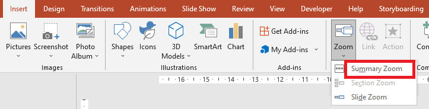

## **Overview**
A slide zoom can help you make your presentation more dynamic, allowing you to navigate freely between slides in any order you choose without interrupting the flow of your presentation. 
Slide zooms help you drill down into multiple pieces of information while feeling as though you're staying on the same canvas.


To use Zoom objects, Aspose.Slides provides the [ZoomImageType](https://apireference.aspose.com/slides/net/aspose.slides/zoomimagetype) enumeration, the [IZoomFrame](https://apireference.aspose.com/slides/net/aspose.slides/izoomframe) interface, and some methods in the [IShapeCollection](https://apireference.aspose.com/slides/net/aspose.slides/ishapecollection) interface.

## **Create Zoom Frame**
Zoom frame is one of the shapes offered by Aspose.Slides for .NET. This topic will help developers to follow the simple steps with examples for adding zoom frames in their slides. To add a zoom frame in a slide using Aspose.Slides for .NET, please follow the steps below:
1.	Create an instance of [Presentation](http://www.aspose.com/api/net/slides/aspose.slides/presentation) class.
2.	Create new slides to link to.
3.	Add identification text and background to created slides.
4.  Add zoom frames (containing the references to created slides) into the first slide.
5.	Write the modified presentation as a PPTX file.

The above steps are implemented in the example given below.
``` csharp 
using (Presentation pres = new Presentation())
{
    //Add new slides to the presentation
    ISlide slide2 = pres.Slides.AddEmptySlide(pres.Slides[0].LayoutSlide);
    ISlide slide3 = pres.Slides.AddEmptySlide(pres.Slides[0].LayoutSlide);

    // Create backgroung for the second slide
    slide2.Background.Type = BackgroundType.OwnBackground;
    slide2.Background.FillFormat.FillType = FillType.Solid;
    slide2.Background.FillFormat.SolidFillColor.Color = Color.Cyan;

    // Create text box for the second slide
    IAutoShape autoshape = slide2.Shapes.AddAutoShape(ShapeType.Rectangle, 100, 200, 500, 200);
    autoshape.TextFrame.Text = "Second Slide";

    // Create backgroung for the third slide
    slide3.Background.Type = BackgroundType.OwnBackground;
    slide3.Background.FillFormat.FillType = FillType.Solid;
    slide3.Background.FillFormat.SolidFillColor.Color = Color.DarkKhaki;

    // Create text box for the third slide
    autoshape = slide3.Shapes.AddAutoShape(ShapeType.Rectangle, 100, 200, 500, 200);
    autoshape.TextFrame.Text = "Trird Slide";

    //Add ZoomFrame objects
    pres.Slides[0].Shapes.AddZoomFrame(20, 20, 250, 200, slide2);
    pres.Slides[0].Shapes.AddZoomFrame(200, 250, 250, 200, slide3);

    // Save the presentation
    pres.Save("presentation.pptx", SaveFormat.Pptx);
}
```
## **Create Zoom Frame with Custom Image**
The following example shows how to create a zoom frame with an image other than the slide preview image. Please follow the steps below:
1.	Create an instance of [Presentation](http://www.aspose.com/api/net/slides/aspose.slides/presentation) class.
2.	Create a new slide to link to.
3.	Add identification text and background to created slide.
4.  Create an [IPPImage](https://apireference.aspose.com/slides/net/aspose.slides/ippimage) object by adding an image to the Images collection associated with the Presentation object that will be used to fill the frame.
5.  Add zoom frames (containing the reference to created slide) into the first slide.
6.	Write the modified presentation as a PPTX file.

``` csharp 
using (Presentation pres = new Presentation())
{
    //Add new slide to the presentation
    ISlide slide = pres.Slides.AddEmptySlide(pres.Slides[0].LayoutSlide);

    // Create backgroung for the second slide
    slide.Background.Type = BackgroundType.OwnBackground;
    slide.Background.FillFormat.FillType = FillType.Solid;
    slide.Background.FillFormat.SolidFillColor.Color = Color.Cyan;

    // Create text box for the third slide
    IAutoShape autoshape = slide.Shapes.AddAutoShape(ShapeType.Rectangle, 100, 200, 500, 200);
    autoshape.TextFrame.Text = "Second Slide";

    // Create new image for zoom object
    IPPImage image = pres.Images.AddImage(Image.FromFile("image.png"));

    //Add ZoomFrame object
    pres.Slides[0].Shapes.AddZoomFrame(20, 20, 300, 200, slide, image);

    // Save the presentation
    pres.Save("presentation.pptx", SaveFormat.Pptx);
}
```

## **Zoom Frame Formatting**
Zoom frames that we created in the above sections are simple. We can also control the formatting of a zoom frame according to the requirement. There are many formatting settings that can be applied on a zoom frame. To control the formatting of a zoom frame in a slide, please follow the steps below:
1.	Create an instance of [Presentation](http://www.aspose.com/api/net/slides/aspose.slides/presentation) class.
2.	Create new slides to link to.
3.	Add identification text and background to created slides.
4.  Add zoom frames (containing the references to created slides) into the first slide.
5.  Create an [IPPImage](https://apireference.aspose.com/slides/net/aspose.slides/ippimage) object by adding an image to the Images collection associated with the Presentation object that will be used to fill the frame.
6.  Set a custom image for the first zoom frame object.
7.  Change line format for the second zoom frame object.
8.  Remove the background from an image of the second zoom frame object.
5.	Write the modified presentation as a PPTX file.

The above steps are implemented in the example given below.

``` csharp 
using (Presentation pres = new Presentation())
{
    //Add new slides to presentation
    ISlide slide2 = pres.Slides.AddEmptySlide(pres.Slides[0].LayoutSlide);
    ISlide slide3 = pres.Slides.AddEmptySlide(pres.Slides[0].LayoutSlide);

    // Create backgroung for the second slide
    slide2.Background.Type = BackgroundType.OwnBackground;
    slide2.Background.FillFormat.FillType = FillType.Solid;
    slide2.Background.FillFormat.SolidFillColor.Color = Color.Cyan;

    // Create text box for the second slide
    IAutoShape autoshape = slide2.Shapes.AddAutoShape(ShapeType.Rectangle, 100, 200, 500, 200);
    autoshape.TextFrame.Text = "Second Slide";

    // Create backgroung for the third slide
    slide3.Background.Type = BackgroundType.OwnBackground;
    slide3.Background.FillFormat.FillType = FillType.Solid;
    slide3.Background.FillFormat.SolidFillColor.Color = Color.DarkKhaki;

    // Create text box for the third slide
    autoshape = slide3.Shapes.AddAutoShape(ShapeType.Rectangle, 100, 200, 500, 200);
    autoshape.TextFrame.Text = "Trird Slide";

    //Add ZoomFrame objects
    IZoomFrame zoomFrame1 = pres.Slides[0].Shapes.AddZoomFrame(20, 20, 250, 200, slide2);
    IZoomFrame zoomFrame2 = pres.Slides[0].Shapes.AddZoomFrame(200, 250, 250, 200, slide3);

    // Create new image for zoom object
    IPPImage image = pres.Images.AddImage(Image.FromFile("image.png"));
    // Set custom image for zoomFrame1 object
    zoomFrame1.Image = image;

    // Set zoom frame format for zoomFrame2 object
    zoomFrame2.LineFormat.Width = 5;
    zoomFrame2.LineFormat.FillFormat.FillType = FillType.Solid;
    zoomFrame2.LineFormat.FillFormat.SolidFillColor.Color = Color.HotPink;
    zoomFrame2.LineFormat.DashStyle = LineDashStyle.DashDot;

    // Do not show background for zoomFrame2 object
    zoomFrame2.ShowBackground = false;

    // Save the presentation
    pres.Save("presentation.pptx", SaveFormat.Pptx);
}
```

## **Create Summary Zoom**
A summary zoom is like a landing page where you can see the pieces of your presentation all at once.



Aspose.Slides for .NET has no methods to create a summary zoom, but it has an API that allows developers to create the same effect and more.
To create the summary zoom in a slide, please follow the steps below:
1.	Create an instance of [Presentation](http://www.aspose.com/api/net/slides/aspose.slides/presentation) class.
2.	Create new slides to link to.
3.	Add identification text and background to created slides.
6.  Add zoom frames (containing the references to created slides) into the first slide.
5.  Set property [ReturnToParent](https://apireference.aspose.com/slides/net/aspose.slides/izoomframe/properties/returntoparent) of every zoom frame object to "true" value.

Note that developers can use their own custom algorithm to place zoom frame objects on a slide.

The above steps are implemented in the example given below.

``` csharp 
using (Presentation pres = new Presentation())
{
    // Create slides array
    for (int slideNumber = 0; slideNumber < 5; slideNumber++)
    {
        //Add new slides to presentation
        ISlide slide = pres.Slides.AddEmptySlide(pres.Slides[0].LayoutSlide);

        // Create backgroung for the slide
        slide.Background.Type = BackgroundType.OwnBackground;
        slide.Background.FillFormat.FillType = FillType.Solid;
        slide.Background.FillFormat.SolidFillColor.Color = Color.DarkKhaki;

        // Create text box for the slide
        IAutoShape autoshape = slide.Shapes.AddAutoShape(ShapeType.Rectangle, 100, 200, 500, 200);
        autoshape.TextFrame.Text = String.Format("Slide - {0}", slideNumber + 2);
    }

    // Create zoom objects for all slides in the first slide
    for (int slideNumber = 1; slideNumber < pres.Slides.Count; slideNumber++)
    {
        int x = (slideNumber - 1) * 100;
        int y = (slideNumber - 1) * 100;
        IZoomFrame zoomFrame = pres.Slides[0].Shapes.AddZoomFrame(x, y, 150, 120, pres.Slides[slideNumber]);

        // Set ReturnToParent roperty to return to the first slide
        zoomFrame.ReturnToParent = true;
    }

    // Save the presentation
    pres.Save("presentation.pptx", SaveFormat.Pptx);
}
```

  
