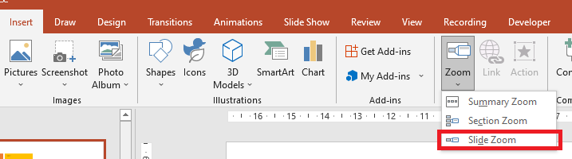
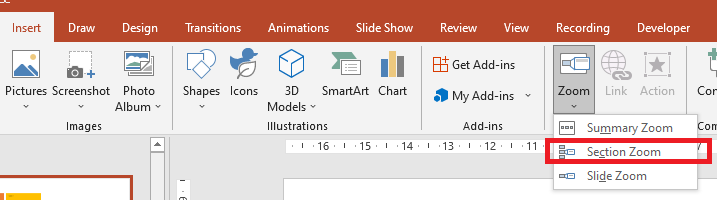

## **Overview**
When you create a Zoom in PowerPoint, you can jump to and from specific slides, sections, and portions of your presentation in an order you decide while you're presenting. 


To summarize the entire presentation on one slide, use [Summary Zoom](#Summary-Zoom).

To show selected slides only, use [Slide Zoom](#Slide-Zoom).

To show a single section only, use [Section Zoom](#Section-Zoom).


## **Slide Zoom**
A Slide Zoom can help you make your presentation more dynamic, allowing you to navigate freely between slides in any order you choose without interrupting the flow of your presentation. They're a good option for shorter presentations without lots of sections, but you can use slide zooms for lots of different presentation scenarios.

Slide Zooms help you drill down into multiple pieces of information while feeling as though you're staying on the same canvas.



To allow you use Slide Zoom objects, Aspose.Slides provides the [ZoomImageType](https://apireference.aspose.com/slides/net/aspose.slides/zoomimagetype) enumeration, the [IZoomFrame](https://apireference.aspose.com/slides/net/aspose.slides/izoomframe) interface, and some methods in the [IShapeCollection](https://apireference.aspose.com/slides/net/aspose.slides/ishapecollection) interface.

### **Creating Zoom Frames**

Zoom frame is one of the shapes offered by Aspose.Slides for .NET. We intend to provide simple steps and examples to show you how to add zoom frames to slides. 

You can add a Zoom frame in a slide using Aspose.Slides for .NET this way:

1.	Create an instance of the [Presentation](https://apireference.aspose.com/slides/net/aspose.slides/presentation) class.
2.	Create new slides to which you intend to link. 
3.	Add an identification text and background to the created slides.
4.  Add Zoom frames (containing the references to created slides) into the first slide.
5.	Write the modified presentation as a PPTX file.

This sample code shows you how to create a Zoom frame in a slide:

``` csharp 
using (Presentation pres = new Presentation())
{
    //Add new slides to the presentation
    ISlide slide2 = pres.Slides.AddEmptySlide(pres.Slides[0].LayoutSlide);
    ISlide slide3 = pres.Slides.AddEmptySlide(pres.Slides[0].LayoutSlide);

    // Create a background for the second slide
    slide2.Background.Type = BackgroundType.OwnBackground;
    slide2.Background.FillFormat.FillType = FillType.Solid;
    slide2.Background.FillFormat.SolidFillColor.Color = Color.Cyan;

    // Create a text box for the second slide
    IAutoShape autoshape = slide2.Shapes.AddAutoShape(ShapeType.Rectangle, 100, 200, 500, 200);
    autoshape.TextFrame.Text = "Second Slide";

    // Create a background for the third slide
    slide3.Background.Type = BackgroundType.OwnBackground;
    slide3.Background.FillFormat.FillType = FillType.Solid;
    slide3.Background.FillFormat.SolidFillColor.Color = Color.DarkKhaki;

    // Create a text box for the third slide
    autoshape = slide3.Shapes.AddAutoShape(ShapeType.Rectangle, 100, 200, 500, 200);
    autoshape.TextFrame.Text = "Trird Slide";

    //Add ZoomFrame objects
    pres.Slides[0].Shapes.AddZoomFrame(20, 20, 250, 200, slide2);
    pres.Slides[0].Shapes.AddZoomFrame(200, 250, 250, 200, slide3);

    // Save the presentation
    pres.Save("presentation.pptx", SaveFormat.Pptx);
}
```
### **Creating Zoom Frames with Custom Images**
With Aspose.Slides for .NET, you can create a Zoom frame with an image other than the slide preview image this way: 
1.	Create an instance of the [Presentation](https://apireference.aspose.com/slides/net/aspose.slides/presentation) class.
2.	Create a new slide to which you intend to link. 
3.	Add an identification text and background to created slide.
4.  Create an [IPPImage](https://apireference.aspose.com/slides/net/aspose.slides/ippimage) object by adding an image to the Images collection associated with the [Presentation](https://apireference.aspose.com/slides/net/aspose.slides/presentation) object that will be used to fill the frame.
5.  Add Zoom frames (containing the reference to created slide) into the first slide.
6.	Write the modified presentation as a PPTX file.

This sample code shows you how to create a zoom frame with a different image:

``` csharp 
using (Presentation pres = new Presentation())
{
    //Add a new slide to the presentation
    ISlide slide = pres.Slides.AddEmptySlide(pres.Slides[0].LayoutSlide);

    // Create a background for the second slide
    slide.Background.Type = BackgroundType.OwnBackground;
    slide.Background.FillFormat.FillType = FillType.Solid;
    slide.Background.FillFormat.SolidFillColor.Color = Color.Cyan;

    // Create a text box for the third slide
    IAutoShape autoshape = slide.Shapes.AddAutoShape(ShapeType.Rectangle, 100, 200, 500, 200);
    autoshape.TextFrame.Text = "Second Slide";

    // Create a new image for the zoom object
    IPPImage image = pres.Images.AddImage(Image.FromFile("image.png"));

    //Add the ZoomFrame object
    pres.Slides[0].Shapes.AddZoomFrame(20, 20, 300, 200, slide, image);

    // Save the presentation
    pres.Save("presentation.pptx", SaveFormat.Pptx);
}
```
### **Formatting Zoom Frames**
In the previous sections (above), we showed you how to create simple Zoom frames. To create more complicated Zoom frames, you have to alter the frames' formatting. There are several formatting settings you can apply on a zoom frame. 

You can control the formatting of a Zoom frame in a slide this way:

1.	Create an instance of the [Presentation](https://apireference.aspose.com/slides/net/aspose.slides/presentation) class.
2.	Create new slides to link to.
3.	Add identification text and background to created slides.
4.  Add zoom frames (containing the references to created slides) into the first slide.
5.  Create an [IPPImage](https://apireference.aspose.com/slides/net/aspose.slides/ippimage) object by adding an image to the Images collection associated with the [Presentation](https://apireference.aspose.com/slides/net/aspose.slides/presentation) object that will be used to fill the frame.
6.  Set a custom image for the first Zoom frame object.
7.  Change the line format for the second Zoom frame object.
8.  Remove the background from an image of the second Zoom frame object.
5.	Write the modified presentation as a PPTX file.

This sample code shows you how to change the formatting of a zoom frame: 

``` csharp 
using (Presentation pres = new Presentation())
{
    //Add new slides to presentation
    ISlide slide2 = pres.Slides.AddEmptySlide(pres.Slides[0].LayoutSlide);
    ISlide slide3 = pres.Slides.AddEmptySlide(pres.Slides[0].LayoutSlide);

    // Create a background for the second slide
    slide2.Background.Type = BackgroundType.OwnBackground;
    slide2.Background.FillFormat.FillType = FillType.Solid;
    slide2.Background.FillFormat.SolidFillColor.Color = Color.Cyan;

    // Create a text box for the second slide
    IAutoShape autoshape = slide2.Shapes.AddAutoShape(ShapeType.Rectangle, 100, 200, 500, 200);
    autoshape.TextFrame.Text = "Second Slide";

    // Create a background for the third slide
    slide3.Background.Type = BackgroundType.OwnBackground;
    slide3.Background.FillFormat.FillType = FillType.Solid;
    slide3.Background.FillFormat.SolidFillColor.Color = Color.DarkKhaki;

    // Create a text box for the third slide
    autoshape = slide3.Shapes.AddAutoShape(ShapeType.Rectangle, 100, 200, 500, 200);
    autoshape.TextFrame.Text = "Trird Slide";

    //Add ZoomFrame objects
    IZoomFrame zoomFrame1 = pres.Slides[0].Shapes.AddZoomFrame(20, 20, 250, 200, slide2);
    IZoomFrame zoomFrame2 = pres.Slides[0].Shapes.AddZoomFrame(200, 250, 250, 200, slide3);

    // Create a new image for the zoom object
    IPPImage image = pres.Images.AddImage(Image.FromFile("image.png"));
    // Set custom image for zoomFrame1 object
    zoomFrame1.Image = image;

    // Set a zoom frame format for the zoomFrame2 object
    zoomFrame2.LineFormat.Width = 5;
    zoomFrame2.LineFormat.FillFormat.FillType = FillType.Solid;
    zoomFrame2.LineFormat.FillFormat.SolidFillColor.Color = Color.HotPink;
    zoomFrame2.LineFormat.DashStyle = LineDashStyle.DashDot;

    // Do not show background for zoomFrame2 object
    zoomFrame2.ShowBackground = false;

    // Save the presentation
    pres.Save("presentation.pptx", SaveFormat.Pptx);
}
```

## **Section Zoom**

A Section Zoom is a link to a section already in your presentation. You can use them to go back to sections you want to really emphasize, or to highlight how certain pieces of your presentation connect. 



To allow you use Section Zoom objects, Aspose.Slides provides the [ISectionZoomFrame](https://apireference.aspose.com/slides/net/aspose.slides/isectionzoomframe)  and some methods in the [IShapeCollection](https://apireference.aspose.com/slides/net/aspose.slides/ishapecollection) interface.

### **Creating Section Zoom Frames**

Section Zoom frame is one of the shapes offered by Aspose.Slides for .NET. We intend to provide simple steps and examples to show you how to add Section Zoom frames to slides. 

You can add a Section Zoom frame in a slide using Aspose.Slides for .NET this way:
1.	Create an instance of the [Presentation](https://apireference.aspose.com/slides/net/aspose.slides/presentation) class.
2.	Create a new slide. 
3.	Add an identification background to the created slide.
4.  Create a new section to which you intend to link.
5.  Add Section Zoom frame (containing the references to created section) into the first slide.
6.	Write the modified presentation as a PPTX file.

This sample code shows you how to create a zoom frame in a slide:

``` csharp 
using (Presentation pres = new Presentation())
{
    //Add a new slide to the presentation
    ISlide slide = pres.Slides.AddEmptySlide(pres.Slides[0].LayoutSlide);
    slide.Background.FillFormat.FillType = FillType.Solid;
    slide.Background.FillFormat.SolidFillColor.Color = Color.YellowGreen;
    slide.Background.Type = BackgroundType.OwnBackground;

    // Add a new Section to the presentation
    pres.Sections.AddSection("Section 1", slide);

    // Add SectionZoomFrame object
    ISectionZoomFrame sectionZoomFrame = pres.Slides[0].Shapes.AddSectionZoomFrame(20, 20, 300, 200, pres.Sections[1]);

    // Save the presentation
    pres.Save("presentation.pptx", SaveFormat.Pptx);
}
```
### **Creating Section Zoom Frames with Custom Images**

With Aspose.Slides for .NET, you can create a Section Zoom frame with an image other than the slide preview image this way: 

1.	Create an instance of the [Presentation](https://apireference.aspose.com/slides/net/aspose.slides/presentation) class.
2.	Create a new slide.
3.	Add an identification background to created slide.
4.	Create a new section to which you intend to link. 
5.  Create an [IPPImage](https://apireference.aspose.com/slides/net/aspose.slides/ippimage) object by adding an image to the Images collection associated with the [Presentation](https://apireference.aspose.com/slides/net/aspose.slides/presentation) object that will be used to fill the frame.
5.  Add a Section Zoom frame (containing the reference to created section) into the first slide.
6.	Write the modified presentation as a PPTX file.

This sample code shows you how to create a zoom frame with a different image:

``` csharp 
using (Presentation pres = new Presentation())
{
    //Add new slide to presentation
    ISlide slide = pres.Slides.AddEmptySlide(pres.Slides[0].LayoutSlide);
    slide.Background.FillFormat.FillType = FillType.Solid;
    slide.Background.FillFormat.SolidFillColor.Color = Color.YellowGreen;
    slide.Background.Type = BackgroundType.OwnBackground;

    // Add a new Section to the presentation
    pres.Sections.AddSection("Section 1", slide);

    // Create a new image for the zoom object
    IPPImage image = pres.Images.AddImage(Image.FromFile("image.png"));

    // Add SectionZoomFrame object
    ISectionZoomFrame sectionZoomFrame = pres.Slides[0].Shapes.AddSectionZoomFrame(20, 20, 300, 200, pres.Sections[1], image);

    // Save the presentation
    pres.Save("presentation.pptx", SaveFormat.Pptx);
}
```
### **Formatting Section Zoom Frames**

To create more complicated Section Zoom frames, you have to alter the frames' formatting. There are several formatting settings you can apply on a Section Zoom frame. 

You can control the formatting of a Section Zoom frame in a slide this way:

1.	Create an instance of the [Presentation](https://apireference.aspose.com/slides/net/aspose.slides/presentation) class.
2.	Create a new slide.
3.	Add identification background to created slide.
4.	Create a new section to which you intend to link. 
5.  Add Section Zoom frame (containing the references to created section) into the first slide.
6.  Change size and position of the created Section Zoom object.
7.  Create an [IPPImage](https://apireference.aspose.com/slides/net/aspose.slides/ippimage) object by adding an image to the Images collection associated with the [Presentation](https://apireference.aspose.com/slides/net/aspose.slides/presentation) object that will be used to fill the frame.
8.  Set a custom image for the created Section Zoom frame object.
9.  Set the ability to return to the original slide from the linked section.
10. Remove the background from an image of the Section Zoom frame object.
11. Change the line format for the second zoom frame object.
12. Change transition duration.
13.	Write the modified presentation as a PPTX file.

This sample code shows you how to change the formatting of a Section Zoom frame:

``` csharp 
using (Presentation pres = new Presentation())
{
    //Add a new slide to the presentation
    ISlide slide = pres.Slides.AddEmptySlide(pres.Slides[0].LayoutSlide);
    slide.Background.FillFormat.FillType = FillType.Solid;
    slide.Background.FillFormat.SolidFillColor.Color = Color.YellowGreen;
    slide.Background.Type = BackgroundType.OwnBackground;

    // Add a new Section to the presentation
    pres.Sections.AddSection("Section 1", slide);

    // Add SectionZoomFrame object
    ISectionZoomFrame sectionZoomFrame = pres.Slides[0].Shapes.AddSectionZoomFrame(20, 20, 300, 200, pres.Sections[1]);

    // Format SectionZoomFrame
    sectionZoomFrame.X = 100;
    sectionZoomFrame.Y = 300;
    sectionZoomFrame.Width = 100;
    sectionZoomFrame.Height = 75;

    IPPImage image = pres.Images.AddImage(Image.FromFile("image.png"));
    sectionZoomFrame.Image = image;

    sectionZoomFrame.ReturnToParent = true;
    sectionZoomFrame.ShowBackground = false;

    sectionZoomFrame.LineFormat.FillFormat.FillType = FillType.Solid;
    sectionZoomFrame.LineFormat.FillFormat.SolidFillColor.Color = Color.Brown;
    sectionZoomFrame.LineFormat.DashStyle = LineDashStyle.DashDot;
    sectionZoomFrame.LineFormat.Width = 2.5f;

    sectionZoomFrame.TransitionDuration = 1.5f;

    // Save the presentation
    pres.Save("presentation.pptx", SaveFormat.Pptx);
}
```


## **Summary Zoom**

A Summary Zoom is like a landing page where you can see the pieces of your presentation all at once. When you're presenting, you can use the zoom to go from one place in your presentation to another in any order you like. You can get creative, skip ahead, or revisit pieces of your slide show without interrupting the flow of your presentation.


To allow you use Summary Zoom objects, Aspose.Slides provides [ISummaryZoomFrame](https://apireference.aspose.com/slides/net/aspose.slides/isummaryzoomframe), [ISummaryZoomFrameSection](https://apireference.aspose.com/slides/net/aspose.slides/isummaryzoomsection), [ISummaryZoomSectionCollection](https://apireference.aspose.com/slides/net/aspose.slides/isummaryzoomsectioncollection) interfaces, and some methods in the [IShapeCollection](https://apireference.aspose.com/slides/net/aspose.slides/ishapecollection) interface.

### **Creating Summary Zoom**

Summary Zoom frame is one of the shapes offered by Aspose.Slides for .NET. We intend to provide simple steps and examples to show you how to add Summary Zoom frames to slides. 

You can add a Summary Zoom frame in a slide using Aspose.Slides for .NET this way:

1.	Create an instance of the [Presentation](https://apireference.aspose.com/slides/net/aspose.slides/presentation) class.
2.	Create new slides with identification background and new sections for created slides.
3.  Add Summary Zoom frame into the first slide.
4.	Write the modified presentation as a PPTX file.

This sample code shows you how to create a zoom frame in a slide:

``` csharp 
using (Presentation pres = new Presentation())
{
    //Add a new slide to the presentation
    ISlide slide = pres.Slides.AddEmptySlide(pres.Slides[0].LayoutSlide);
    slide.Background.FillFormat.FillType = FillType.Solid;
    slide.Background.FillFormat.SolidFillColor.Color = Color.Brown;
    slide.Background.Type = BackgroundType.OwnBackground;

    // Add a new section to the presentation
    pres.Sections.AddSection("Section 1", slide);

    //Add a new slide to the presentation
    slide = pres.Slides.AddEmptySlide(pres.Slides[0].LayoutSlide);
    slide.Background.FillFormat.FillType = FillType.Solid;
    slide.Background.FillFormat.SolidFillColor.Color = Color.Aqua;
    slide.Background.Type = BackgroundType.OwnBackground;

    // Add a new section to the presentation
    pres.Sections.AddSection("Section 2", slide);

    //Add a new slide to the presentation
    slide = pres.Slides.AddEmptySlide(pres.Slides[0].LayoutSlide);
    slide.Background.FillFormat.FillType = FillType.Solid;
    slide.Background.FillFormat.SolidFillColor.Color = Color.Chartreuse;
    slide.Background.Type = BackgroundType.OwnBackground;

    // Add a new section to the presentation
    pres.Sections.AddSection("Section 3", slide);

    //Add a new slide to the presentation
    slide = pres.Slides.AddEmptySlide(pres.Slides[0].LayoutSlide);
    slide.Background.FillFormat.FillType = FillType.Solid;
    slide.Background.FillFormat.SolidFillColor.Color = Color.DarkGreen;
    slide.Background.Type = BackgroundType.OwnBackground;

    // Add a new section to the presentation
    pres.Sections.AddSection("Section 4", slide);

    // Add SummaryZoomFrame object
    ISummaryZoomFrame summaryZoomFrame = pres.Slides[0].Shapes.AddSummaryZoomFrame(150, 50, 300, 200);

    // Save the presentation
    pres.Save("presentation.pptx", SaveFormat.Pptx);
}
```

### **Adding and Removing Summary Zoom Section**

All sections in a Summary Zoom frame are represented by [ISummaryZoomFrameSection](https://apireference.aspose.com/slides/net/aspose.slides/isummaryzoomsection), objects, which are stored in the [ISummaryZoomSectionCollection](https://apireference.aspose.com/slides/net/aspose.slides/isummaryzoomsectioncollection) object. You can add or remove a Summary Zoom Section object  using [ISummaryZoomSectionCollection](https://apireference.aspose.com/slides/net/aspose.slides/isummaryzoomsectioncollection) interface in this way:

1.	Create an instance of the [Presentation](https://apireference.aspose.com/slides/net/aspose.slides/presentation) class.
2.	Create new slides with identification background and new sections for created slides.
3.  Add Summary Zoom frame into the first slide.
4.  Add new slide and section to the presentation.
5.  Add created section to the Summary Zoom Frame.
6.  Remove first section form Summary Zoom Frame.
7.	Write the modified presentation as a PPTX file.

Next sample code shows you how to add and remove sections in a Summary Zoom frame:

``` csharp 
using (Presentation pres = new Presentation())
{
    //Add a new slide to the presentation
    ISlide slide = pres.Slides.AddEmptySlide(pres.Slides[0].LayoutSlide);
    slide.Background.FillFormat.FillType = FillType.Solid;
    slide.Background.FillFormat.SolidFillColor.Color = Color.Brown;
    slide.Background.Type = BackgroundType.OwnBackground;

    // Add a new section to the presentation
    pres.Sections.AddSection("Section 1", slide);

    //Add a new slide to the presentation
    slide = pres.Slides.AddEmptySlide(pres.Slides[0].LayoutSlide);
    slide.Background.FillFormat.FillType = FillType.Solid;
    slide.Background.FillFormat.SolidFillColor.Color = Color.Aqua;
    slide.Background.Type = BackgroundType.OwnBackground;

    // Add a new section to the presentation
    pres.Sections.AddSection("Section 2", slide);

    // Add SummaryZoomFrame object
    ISummaryZoomFrame summaryZoomFrame = pres.Slides[0].Shapes.AddSummaryZoomFrame(150, 50, 300, 200);

    //Add a new slide to the presentation
    slide = pres.Slides.AddEmptySlide(pres.Slides[0].LayoutSlide);
    slide.Background.FillFormat.FillType = FillType.Solid;
    slide.Background.FillFormat.SolidFillColor.Color = Color.Chartreuse;
    slide.Background.Type = BackgroundType.OwnBackground;

    // Add a new section to the presentation
    ISection section3 = pres.Sections.AddSection("Section 3", slide);

    // Add section to the Summary Zoom
    summaryZoomFrame.SummaryZoomCollection.AddSummaryZoomSection(section3);

    // Remove section from the SummaryZoom
    summaryZoomFrame.SummaryZoomCollection.RemoveSummaryZoomSection(pres.Sections[1]);

    // Save the presentation
    pres.Save("presentation.pptx", SaveFormat.Pptx);
}
```

### **Formatting Summary Zoom Sections**

To create more complicated Summary Zoom Section object, you have to alter the frames' formatting. There are several formatting settings you can apply on a Summary Zoom Section object. 

You can control the formatting of a Summary Zoom Section object in Summary Zoom Frame this way:

1.	Create an instance of the [Presentation](https://apireference.aspose.com/slides/net/aspose.slides/presentation) class.
2.	Create new slides with identification background and new sections for created slides.
3.  Add Summary Zoom frame into the first slide.
4.  Get Summary Zoom Section object for the first object of the ISummaryZoomSectionCollection.
7.  Create an [IPPImage](https://apireference.aspose.com/slides/net/aspose.slides/ippimage) object by adding an image to the Images collection associated with the [Presentation](https://apireference.aspose.com/slides/net/aspose.slides/presentation) object that will be used to fill the frame.
8.  Set a custom image for the created Section Zoom frame object.
9.  Set the ability to return to the original slide from the linked section.
11. Change the line format for the second zoom frame object.
12. Change transition duration.
13.	Write the modified presentation as a PPTX file.

The next code example demonstrates you how to change the formatting of a Summary Zoom Section object:

``` csharp 
using (Presentation pres = new Presentation())
{
    //Add a new slide to the presentation
    ISlide slide = pres.Slides.AddEmptySlide(pres.Slides[0].LayoutSlide);
    slide.Background.FillFormat.FillType = FillType.Solid;
    slide.Background.FillFormat.SolidFillColor.Color = Color.Brown;
    slide.Background.Type = BackgroundType.OwnBackground;

    // Add a new section to the presentation
    pres.Sections.AddSection("Section 1", slide);

    //Add a new slide to the presentation
    slide = pres.Slides.AddEmptySlide(pres.Slides[0].LayoutSlide);
    slide.Background.FillFormat.FillType = FillType.Solid;
    slide.Background.FillFormat.SolidFillColor.Color = Color.Aqua;
    slide.Background.Type = BackgroundType.OwnBackground;

    // Add a new section to the presentation
    pres.Sections.AddSection("Section 2", slide);

    // Add SummaryZoomFrame object
    ISummaryZoomFrame summaryZoomFrame = pres.Slides[0].Shapes.AddSummaryZoomFrame(150, 50, 300, 200);

    // Get first SummaryZoomSection object
    ISummaryZoomSection summarySection = summaryZoomFrame.SummaryZoomCollection[0];

    // Format SummaryZoomSection object
    IPPImage image = pres.Images.AddImage(Image.FromFile("image.png"));
    summarySection.Image = image;

    summarySection.ReturnToParent = false;

    summarySection.LineFormat.FillFormat.FillType = FillType.Solid;
    summarySection.LineFormat.FillFormat.SolidFillColor.Color = Color.Black;
    summarySection.LineFormat.DashStyle = LineDashStyle.DashDot;
    summarySection.LineFormat.Width = 1.5f;

    summarySection.TransitionDuration = 1.5f;

    // Save the presentation
    pres.Save("presentation.pptx", SaveFormat.Pptx);
}
```
  