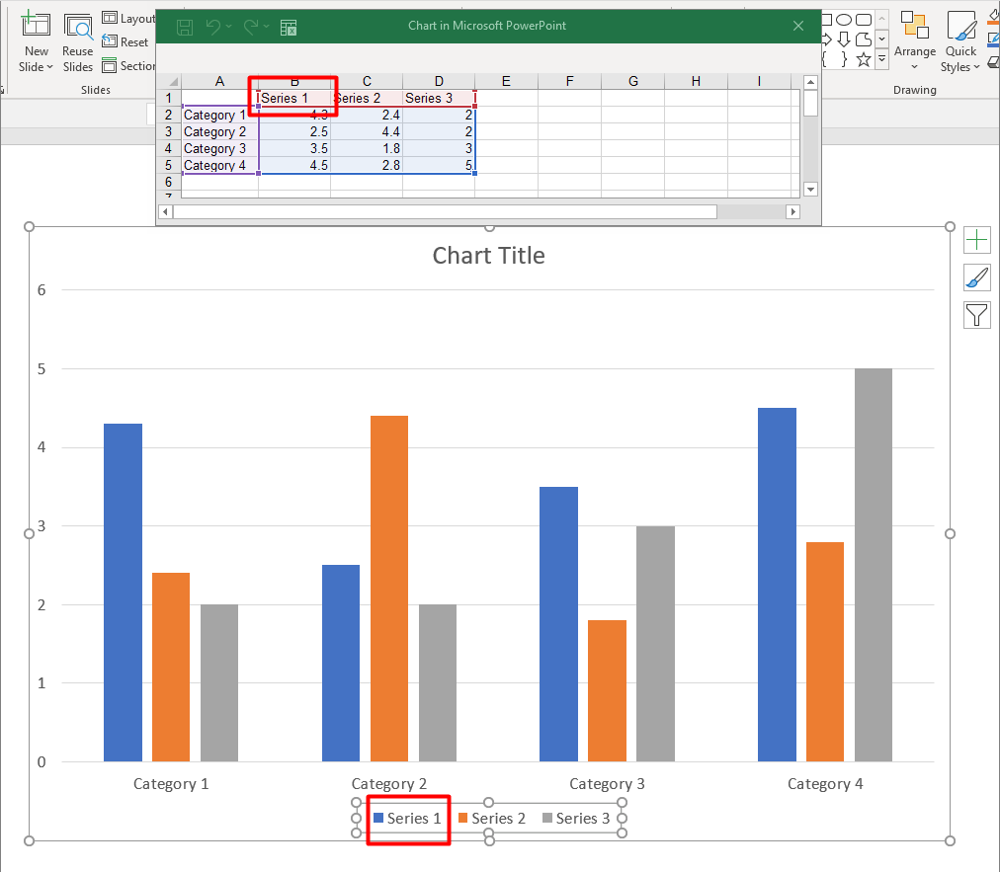

A series is a row or column of numbers plotted in a chart.



## **Set Chart Series Overlap**

With the [IChartSeriesOverlap](https://apireference.aspose.com/slides/net/aspose.slides.charts/ichartseries/properties/overlap) property, you can specify how much bars and columns should overlap on a 2D chart (range: -100 to 100). This property applies to all series of the parent series group: this is a projection of the appropriate group property. Therefore, this property is read-only. 

Use the `ParentSeriesGroup.Overlap` read/write property to set your preferred value for `Overlap`. 

1. Create an instance of the [Presentation](http://www.aspose.com/api/net/slides/aspose.slides/presentation) class.
1. Add a clustered column chart on a slide.
1. Access the first chart series.
1. Access the chart series' `ParentSeriesGroup` and set your preferred overlap value for the series. 
1. Write the modified presentation to a PPTX file.

This C# code shows you how to set the overlap for a chart series:

```c#
using (Presentation presentation = new Presentation())
{
    // Adds chart
    IChart chart = presentation.Slides[0].Shapes.AddChart(ChartType.ClusteredColumn, 50, 50, 600, 400, true);
    IChartSeriesCollection series = chart.ChartData.Series;
    if (series[0].Overlap == 0)
    {
        // Sets series overlap
        series[0].ParentSeriesGroup.Overlap = -30;
    }

    // Writes the presentation file to disk
    presentation.Save("SetChartSeriesOverlap_out.pptx", SaveFormat.Pptx);
}
```

## **Change Series Color**
Aspose.Slides for .NET allows you to change a series' color this way:

1. Create an instance of the [Presentation](http://www.aspose.com/api/net/slides/aspose.slides/presentation) class.
1. Add chart on the slide.
1. Access the series whose color you want to change. 
1. Set your preferred fill type and fill color.
1. Save the modified presentation.

This C# code shows you how to change a series' color:

```c#
using (Presentation pres = new Presentation("test.pptx"))
{
	IChart chart = pres.Slides[0].Shapes.AddChart(ChartType.Pie, 50, 50, 600, 400);
	IChartDataPoint point = chart.ChartData.Series[0].DataPoints[1];
	
	point.Explosion = 30;
	point.Format.Fill.FillType = FillType.Solid;
	point.Format.Fill.SolidFillColor.Color = Color.Blue;

	pres.Save("output.pptx", SaveFormat.Pptx);
}
```

## **Change Series Category's Color**
Aspose.Slides for .NET allows you to change a series category's color this way:

1. Create an instance of the [Presentation](http://www.aspose.com/api/net/slides/aspose.slides/presentation) class.
1. Add chart on the slide.
1. Access the series category whose color you want to change.
1. Set your preferred fill type and fill color.
1. Save the modified presentation.

This code in C# shows you how to change a series category's color:

```c#
using (Presentation pres = new Presentation())
{
	IChart chart = pres.Slides[0].Shapes.AddChart(ChartType.ClusteredColumn, 50, 50, 600, 400);
	IChartDataPoint point = chart.ChartData.Series[0].DataPoints[0];
	
	point.Format.Fill.FillType = FillType.Solid;
	point.Format.Fill.SolidFillColor.Color = Color.Blue;

	pres.Save("output.pptx", SaveFormat.Pptx);
}
```

## **Change Series' Name** 

By default, the legend names for a chart are the contents of cells above each column or row of data. 

In our example (sample image), 

* the columns are *Series 1, Series 2,* and *Series 3*;
* the rows are *Category 1, Category 2, Category 3,* and *Category 4.* 

Aspose.Slides for .NET allows you to update or change a series name in its chart data and legend. 

This C# code shows you how to change a series' name in its chart data `ChartDataWorkbook`:

```c#
using (Presentation pres = new Presentation())
{
    IChart chart = pres.Slides[0].Shapes.AddChart(ChartType.Column3D, 50, 50, 600, 400, true);
    
    IChartDataCell seriesCell = chart.ChartData.ChartDataWorkbook.GetCell(0, 0, 1);
    seriesCell.Value = "New name";
    
    pres.Save("pres.pptx", SaveFormat.Pptx);
}
```

This C# code shows you how to change a series name in its legend through`Series`:

```c#
using (Presentation pres = new Presentation())
{
    IChart chart = pres.Slides[0].Shapes.AddChart(ChartType.Column3D, 50, 50, 600, 400, true);
    IChartSeries series = chart.ChartData.Series[0];
    
    IStringChartValue name = series.Name;
    name.AsCells[0].Value = "New name";   
}
```

## **Set Chart Series Fill Color**

Aspose.Slides for .NET allows you to set the automatic fill color for chart series inside a plot area this way:

1. Create an instance of the [Presentation](http://www.aspose.com/api/net/slides/aspose.slides/presentation) class.
1. Obtain a slide's reference by its index.
1. Add a chart with default data based on your preferred type (in the example below, we used `ChartType.ClusteredColumn`).
1. Access the chart series and set the fill color to Automatic.
1. Save the presentation to a PPTX file.

This C# code shows you how to set the automatic fill color for a chart series:

```c#
using (Presentation presentation = new Presentation())
{
    // Creates a clustered column chart
    IChart chart = presentation.Slides[0].Shapes.AddChart(ChartType.ClusteredColumn, 100, 50, 600, 400);

    // Sets series fill format to automatic
    for (int i = 0; i < chart.ChartData.Series.Count; i++)
    {
        chart.ChartData.Series[i].GetAutomaticSeriesColor();
    }

    // Writes the presentation file to disk
    presentation.Save("AutoFillSeries_out.pptx", SaveFormat.Pptx);
}
```

## **Set Chart Series Invert Fill Colors**
Aspose.Slides allows you to set the invert fill color for chart series inside a plot area this way:

1. Create an instance of the [Presentation](http://www.aspose.com/api/net/slides/aspose.slides/presentation) class.
1. Obtain a slide's reference by its index.
1. Add a chart with default data based on your preferred type (in the example below, we used `ChartType.ClusteredColumn`).
1. Access the chart series and set the fill color to invert.
1. Save the presentation to a PPTX file.

This C# code demonstrates the operation:

```c#
Color inverColor = Color.Red;
using (Presentation pres = new Presentation())
{
    IChart chart = pres.Slides[0].Shapes.AddChart(ChartType.ClusteredColumn, 100, 100, 400, 300);
    IChartDataWorkbook workBook = chart.ChartData.ChartDataWorkbook;

    chart.ChartData.Series.Clear();
    chart.ChartData.Categories.Clear();

    // Adds new series and categories
    chart.ChartData.Series.Add(workBook.GetCell(0, 0, 1, "Series 1"), chart.Type);
    chart.ChartData.Categories.Add(workBook.GetCell(0, 1, 0, "Category 1"));
    chart.ChartData.Categories.Add(workBook.GetCell(0, 2, 0, "Category 2"));
    chart.ChartData.Categories.Add(workBook.GetCell(0, 3, 0, "Category 3"));

    // Takes the first chart series and populates its series data.
    IChartSeries series = chart.ChartData.Series[0];
    series.DataPoints.AddDataPointForBarSeries(workBook.GetCell(0, 1, 1, -20));
    series.DataPoints.AddDataPointForBarSeries(workBook.GetCell(0, 2, 1, 50));
    series.DataPoints.AddDataPointForBarSeries(workBook.GetCell(0, 3, 1, -30));
    var seriesColor = series.GetAutomaticSeriesColor();
    series.InvertIfNegative = true;
    series.Format.Fill.FillType = FillType.Solid;
    series.Format.Fill.SolidFillColor.Color = seriesColor;
    series.InvertedSolidFillColor.Color = inverColor;
    pres.Save("SetInvertFillColorChart_out.pptx", SaveFormat.Pptx);               
}
```


## **Set Series to Invert When Value is Negative**
Aspose.Slides allows you to set inverts through the`IChartDataPoint.InvertIfNegative` and `ChartDataPoint.InvertIfNegative` properties. When an invert is set using the properties, the data point inverts its colors when it gets a negative value. 

This C# code demonstrates the operation:

```c#
using (Presentation pres = new Presentation())
{
	IChart chart = pres.Slides[0].Shapes.AddChart(ChartType.ClusteredColumn, 50, 50, 600, 400, true);
	IChartSeriesCollection series = chart.ChartData.Series;
	chart.ChartData.Series.Clear();

	series.Add(chart.ChartData.ChartDataWorkbook.GetCell(0, "B1"), chart.Type);
	series[0].DataPoints.AddDataPointForBarSeries(chart.ChartData.ChartDataWorkbook.GetCell(0, "B2", -5));
	series[0].DataPoints.AddDataPointForBarSeries(chart.ChartData.ChartDataWorkbook.GetCell(0, "B3", 3));
	series[0].DataPoints.AddDataPointForBarSeries(chart.ChartData.ChartDataWorkbook.GetCell(0, "B4", -2));
	series[0].DataPoints.AddDataPointForBarSeries(chart.ChartData.ChartDataWorkbook.GetCell(0, "B5", 1));

	series[0].InvertIfNegative = false;

	series[0].DataPoints[2].InvertIfNegative = true;

	pres.Save("out.pptx", SaveFormat.Pptx);
}
```

## **Clear Specific Data Points' Data**
Aspose.Slides for .NET allows you to clear the `DataPoints` data for a specific chart series this way:

1. Create an instance of the [Presentation](http://www.aspose.com/api/net/slides/aspose.slides/presentation) class.
2. Obtain the reference of a slide through its index.
3. Obtain the reference of a chart through its index.
4. Iterate through all the chart `DataPoints` and set `XValue` and `YValue` to null.
5. Clear all`DataPoints` for specific chart series.
6. Write the modified presentation to a PPTX file.

This C# code demonstrates the operation:

```c#
using (Presentation pres = new Presentation("TestChart.pptx"))
{
	ISlide sl = pres.Slides[0];

	IChart chart = (IChart)sl.Shapes[0];

	foreach (IChartDataPoint dataPoint in chart.ChartData.Series[0].DataPoints)
	{
		dataPoint.XValue.AsCell.Value = null;
		dataPoint.YValue.AsCell.Value = null;
	}

	chart.ChartData.Series[0].DataPoints.Clear();

	pres.Save("ClearSpecificChartSeriesDataPointsData.pptx", SaveFormat.Pptx);
}
```

## **Set Series Gap Width**
Aspose.Slides for .NET allows you to set a series' Gap Width through the **`GapWidth`** property this way:

1. Create an instance of the [Presentation](http://www.aspose.com/api/net/slides/aspose.slides/presentation) class.
1. Access first slide.
1. Add chart with default data.
1. Access any chart series.
1. Set the `GapWidth` property.
1. Write the modified presentation to a PPTX file.

This code in C# shows you how to set a series' Gap Width:

```c#
// Creates empty presentation 
Presentation presentation = new Presentation();

// Accesses the presentation's first slide
ISlide slide = presentation.Slides[0];

// Adds a chart with default data
IChart chart = slide.Shapes.AddChart(ChartType.StackedColumn, 0, 0, 500, 500);

// Sets the index of the chart data sheet
int defaultWorksheetIndex = 0;

// Gets the chart data worksheet
IChartDataWorkbook fact = chart.ChartData.ChartDataWorkbook;

// Adds series
chart.ChartData.Series.Add(fact.GetCell(defaultWorksheetIndex, 0, 1, "Series 1"), chart.Type);
chart.ChartData.Series.Add(fact.GetCell(defaultWorksheetIndex, 0, 2, "Series 2"), chart.Type);

// Adds Categories
chart.ChartData.Categories.Add(fact.GetCell(defaultWorksheetIndex, 1, 0, "Caetegoty 1"));
chart.ChartData.Categories.Add(fact.GetCell(defaultWorksheetIndex, 2, 0, "Caetegoty 2"));
chart.ChartData.Categories.Add(fact.GetCell(defaultWorksheetIndex, 3, 0, "Caetegoty 3"));

// Takes the second chart series
IChartSeries series = chart.ChartData.Series[1];

// Populates the series data
series.DataPoints.AddDataPointForBarSeries(fact.GetCell(defaultWorksheetIndex, 1, 1, 20));
series.DataPoints.AddDataPointForBarSeries(fact.GetCell(defaultWorksheetIndex, 2, 1, 50));
series.DataPoints.AddDataPointForBarSeries(fact.GetCell(defaultWorksheetIndex, 3, 1, 30));
series.DataPoints.AddDataPointForBarSeries(fact.GetCell(defaultWorksheetIndex, 1, 2, 30));
series.DataPoints.AddDataPointForBarSeries(fact.GetCell(defaultWorksheetIndex, 2, 2, 10));
series.DataPoints.AddDataPointForBarSeries(fact.GetCell(defaultWorksheetIndex, 3, 2, 60));

// Sets GapWidth value
series.ParentSeriesGroup.GapWidth = 50;

// Saves presentation to disk
presentation.Save("GapWidth_out.pptx", SaveFormat.Pptx);
```
