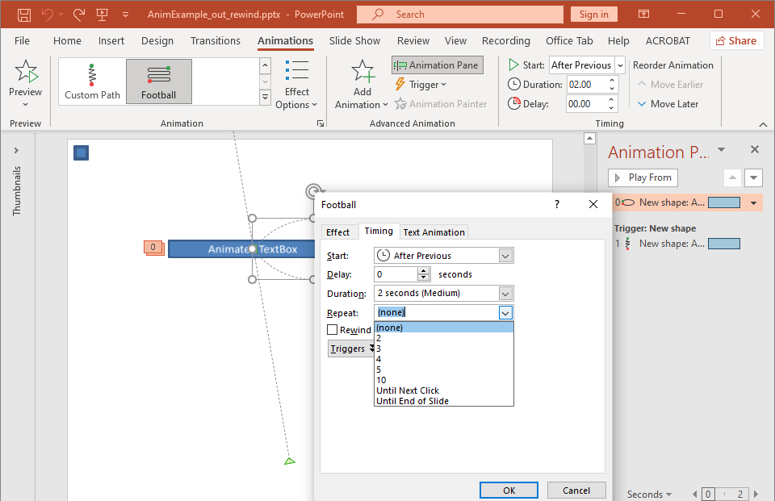

Animations are visual effects that can be applied to texts, images, shapes, or [charts](/slides/net/animated-charts/). They give life to presentations or its constituents. 

### **Why Use Animations in Presentations?**

Using animations, you can 

* control the flow of information
* emphasize important points
* increase interest or participation among your audience
* make content easier to read or assimilate or process
* draw your readers or viewers attention to important parts in a presentation

PowerPoint provides many options and tools for animations and animation effects across the **entrance**, **exit**, **emphasis**, and **motion paths** categories. 

### **Animations in Aspose.Slides**

* Aspose.Slides provides the classes and types you need to work with animations under the [Aspose.Slides.Animation](https://reference.aspose.com/slides/net/aspose.slides.animation/) namespace,
* Aspose.Slides provides over **150 animation effects** under the [EffectType](https://reference.aspose.com/slides/net/aspose.slides.animation/effecttype) enumeration. These effects are essentially the same (or equivalent) effects used in PowerPoint.

## **Apply Animation to TextBox**

Aspose.Slides for .NET allows you to apply animation to the text in a shape. 

1. Create an instance of the [Presentation](http://www.aspose.com/api/net/slides/aspose.slides/) class.
2. Get a slide's reference through its index.
3. Add a `rectangle` [IAutoShape](https://reference.aspose.com/slides/net/aspose.slides/iautoshape). 
4. Add text to [IAutoShape.TextFrame](https://reference.aspose.com/slides/net/aspose.slides/iautoshape/properties/textframe).
5. Get a main sequence of effects.
6. Add an animation effect to [IAutoShape](https://reference.aspose.com/slides/net/aspose.slides/iautoshape).
7. Set the [TextAnimation.BuildType](https://reference.aspose.com/slides/net/aspose.slides.animation/textanimation/properties/buildtype) property to the value from [BuildType Enumeration](https://reference.aspose.com/slides/net/aspose.slides.animation/buildtype).
8. Write the presentation to disk as a PPTX file.

This C# code shows you how to apply the `Fade` effect to AutoShape and set the text animation to the *By 1st Level Paragraphs* value:

```c#
// Instantiates a presentation class that represents a presentation file.
using (Presentation pres = new Presentation())
{
    ISlide sld = pres.Slides[0];
    
    // Adds new AutoShape with text
    IAutoShape autoShape = sld.Shapes.AddAutoShape(ShapeType.Rectangle, 20, 20, 150, 100);

    ITextFrame textFrame = autoShape.TextFrame;
    textFrame.Text = "First paragraph \nSecond paragraph \n Third paragraph";

    // Gets the main sequence of the slide.
    ISequence sequence = sld.Timeline.MainSequence;

    // Adds Fade animation effect to shape
    IEffect effect = sequence.AddEffect(autoShape, EffectType.Fade, EffectSubtype.None, EffectTriggerType.OnClick);

    // Animates shape text by 1st level paragraphs
    effect.TextAnimation.BuildType = BuildType.ByLevelParagraphs1;

    // Save the PPTX file to disk
    pres.Save(path + "AnimTextBox_out.pptx", SaveFormat.Pptx);
}
```

{} 

Besides applying animations to text, you can also apply animations to a single [Paragraph](https://reference.aspose.com/slides/net/aspose.slides/iparagraph). See [**Animated Text**](/slides/net/animated-text/).

{} 

## **Apply Animation to PictureFrame**

1. Create an instance of the [Presentation](http://www.aspose.com/api/net/slides/aspose.slides/) class.
2. Get a slide's reference through its index.
3. Add or get a [PictureFrame](https://reference.aspose.com/slides/net/aspose.slides/ipictureframe) on the slide. 
5. Get the main sequence of effects.
6. Add an animation effect to [PictureFrame](https://reference.aspose.com/slides/net/aspose.slides/ipictureframe).
8. Write the presentation to disk as a PPTX file.

This C# code shows you how to apply the `Fly` effect to a picture frame:

```c#
// Instantiates a presentation class that represents a presentation file.
using (Presentation pres = new Presentation())
{
    // Load Image to be added in presentaiton image collection
    Image img = new Bitmap("aspose-logo.jpg");
    IPPImage image = pres.Images.AddImage(img);

    // Adds picture frame to slide
    IPictureFrame picFrame = pres.Slides[0].Shapes.AddPictureFrame(ShapeType.Rectangle, 50, 50, 100, 100, image);

    // Gets the main sequence of the slide.
    ISequence sequence = pres.Slides[0].Timeline.MainSequence;

    // Adds Fly from Left animation effect to picture frame
    IEffect effect = sequence.AddEffect(picFrame, EffectType.Fly, EffectSubtype.Left, EffectTriggerType.OnClick);

    // Save the PPTX file to disk
    pres.Save(path + "AnimImage_out.pptx", SaveFormat.Pptx);
}
```

## **Apply Animation to Shape**

1. Create an instance of the [Presentation](http://www.aspose.com/api/net/slides/aspose.slides/) class.
2. Get a slide's reference through its index.
3. Add a `rectangle` [IAutoShape](https://reference.aspose.com/slides/net/aspose.slides/iautoshape). 
4. Add a `Bevel` [IAutoShape](https://reference.aspose.com/slides/net/aspose.slides/iautoshape) (when this object is clicked, the animation gets played).
5. Create a sequence of effects on the bevel shape.
6. Create a custom `UserPath`.
7. Add commands for moving to the `UserPath`.
8. Write the presentation to disk as a PPTX file.

This C# code shows you how to apply the `PathFootball` (path football) effect to a shape:

```c#
// Instantiates a Presentation class that represents a presentation file.
using (Presentation pres = new Presentation())
{
    ISlide sld = pres.Slides[0];

    // Creates PathFootball effect for existing shape from scratch.
    IAutoShape ashp = sld.Shapes.AddAutoShape(ShapeType.Rectangle, 150, 150, 250, 25);

    ashp.AddTextFrame("Animated TextBox");

    // Adds the PathFootBall animation effect.
    pres.Slides[0].Timeline.MainSequence.AddEffect(ashp, EffectType.PathFootball,
                           EffectSubtype.None, EffectTriggerType.AfterPrevious);

    // Creates some kind of "button".
    IShape shapeTrigger = pres.Slides[0].Shapes.AddAutoShape(ShapeType.Bevel, 10, 10, 20, 20);

    // Creates a sequence of effects for the button.
    ISequence seqInter = pres.Slides[0].Timeline.InteractiveSequences.Add(shapeTrigger);

    // Creates a custom user path. Our object will be moved only after the button is clicked.
    IEffect fxUserPath = seqInter.AddEffect(ashp, EffectType.PathUser, EffectSubtype.None, EffectTriggerType.OnClick);

    // Adds commands for moving since created path is empty.
    IMotionEffect motionBhv = ((IMotionEffect)fxUserPath.Behaviors[0]);

    PointF[] pts = new PointF[1];
    pts[0] = new PointF(0.076f, 0.59f);
    motionBhv.Path.Add(MotionCommandPathType.LineTo, pts, MotionPathPointsType.Auto, true);
    pts[0] = new PointF(-0.076f, -0.59f);
    motionBhv.Path.Add(MotionCommandPathType.LineTo, pts, MotionPathPointsType.Auto, false);
    motionBhv.Path.Add(MotionCommandPathType.End, null, MotionPathPointsType.Auto, false);

    // Writes the PPTX file to disk
    pres.Save("AnimExample_out.pptx", SaveFormat.Pptx);
}
```

## **Get the Animation Effects Applied to Shape**

You may decide to find out the all animation effects applied to a single shape. 

This C# code shows you how to get the all effects applied to a specific shape:

```c#
// Instantiates a presentation class that represents a presentation file.
using (Presentation pres = new Presentation("AnimExample_out.pptx"))
{
    ISlide firstSlide = pres.Slides[0];

    // Gets the main sequence of the slide.
    ISequence sequence = firstSlide.Timeline.MainSequence;

    // Gets the first shape on slide.
    IShape shape = firstSlide.Shapes[0];

    // Gets all animation effects applied to the shape.
    IEffect[] shapeEffects = sequence.GetEffectsByShape(shape);

    if (shapeEffects.Length > 0)
        Console.WriteLine("The shape " + shape.Name + " has " + shapeEffects.Length + " animation effects.");
}
```

## **Change Animation Effect Timing Properties**

Aspose.Slides for .NET allows you to change the Timing properties of an animation effect.

This is the Animation Timing pane and extended menu in Microsoft PowerPoint:



These are the correspondences between PowerPoint Timing and [Effect.Timing](https://reference.aspose.com/slides/net/aspose.slides.animation/effect/properties/timing) properties:
- PowerPoint Timing **Start** drop-down list matches the [Effect.Timing.TriggerType](https://reference.aspose.com/slides/net/aspose.slides.animation/itiming/properties/triggertype) property. 
- PowerPoint Timing **Duration** matches the [Effect.Timing.Duration](https://reference.aspose.com/slides/net/aspose.slides.animation/itiming/properties/duration) property. The duration of an animation (in seconds) is the total time it takes the animation to complete one cycle. 
- PowerPoint Timing **Delay** matches the [Effect.Timing.TriggerDelayTime](https://reference.aspose.com/slides/net/aspose.slides.animation/itiming/properties/triggerdelaytime) property. 
- PowerPoint Timing **Repeat** drop-down list matches these properties: 
  * [Effect.Timing.RepeatCount](https://reference.aspose.com/slides/net/aspose.slides.animation/itiming/repeatcount) property which describes the *number* of times the effect is repeated;
  * [Effect.Timing.RepeatUntilEndSlide](https://reference.aspose.com/slides/net/aspose.slides.animation/itiming/repeatuntilendslide) flag which specifies whether the effect is repeated until the end of the slide;
  * [Effect.Timing.RepeatUntilNextClick](https://reference.aspose.com/slides/net/aspose.slides.animation/itiming/repeatuntilnextclick) flag which specifies whether the effect is repeated until the next click.
- PowerPoint Timing **Rewind when done playing **checkbox matches the [Effect.Timing.Rewind](https://reference.aspose.com/slides/net/aspose.slides.animation/itiming/rewind/) property. 

This is how you change the Effect Timing properties:

1. [Apply](#apply-animation-to-shape) or get the animation effect.
2. Set new values for the [Effect.Timing](https://reference.aspose.com/slides/net/aspose.slides.animation/effect/properties/timing) properties you need. 
3. Save the modified PPTX file.

This C# code demonstrates the operation:

```c#
// Instantiates a presentation class that represents a presentation file.
using (Presentation pres = new Presentation("AnimExample_out.pptx"))
{
    // Gets the main sequence of the slide.
    ISequence sequence = pres.Slides[0].Timeline.MainSequence;

    // Gets the first effect of main sequence.
    IEffect effect = sequence[0];

    // Changes effect TriggerType to start on click
    effect.Timing.TriggerType = EffectTriggerType.OnClick;

    // Changes effect Duration
    effect.Timing.Duration = 3f;

    // Changes effect TriggerDelayTime
    effect.Timing.TriggerDelayTime = 0.5f;

    // If the effect Repeat value is "none"
    if (effect.Timing.RepeatCount == 1f)
    {
        // Changes effect Repeat to "Until Next Click"
        effect.Timing.RepeatUntilNextClick = true;
    }
    else
    {
        // Changes effect Repeat to "Until End of Slide"
        effect.Timing.RepeatUntilEndSlide = true;
    }

    // Turns the effect Rewind on
        effect.Timing.Rewind = true;
    
    // Saves the PPTX file to disk
    pres.Save("AnimExample_changed.pptx", SaveFormat.Pptx);
}
```

## **Animation Effect Sound**

Aspose.Slides provides these properties to allow you to work with sounds in animation effects: 
- [IEffect.Sound](https://reference.aspose.com/slides/net/aspose.slides.animation/effect/sound/) 
- [IEffect.StopPreviousSound](https://reference.aspose.com/slides/net/aspose.slides.animation/effect/stopprevioussound/) 

### **Add Animation Effect Sound**

This C# code shows you how to add an animation effect sound and stop it when the next effect starts:

```c#
using (Presentation pres = new Presentation("AnimExample_out.pptx"))
{
	// Adds audio to presentation audio collection
	IAudio effectSound = pres.Audios.AddAudio(File.ReadAllBytes("sampleaudio.wav"));

	ISlide firstSlide = pres.Slides[0];

	// Gets the main sequence of the slide.
	ISequence sequence = firstSlide.Timeline.MainSequence;

	// Gets the first effect of the main sequence
	IEffect firstEffect = sequence[0];

	// Сhecks the effect for "No Sound"
	if (!firstEffect.StopPreviousSound && firstEffect.Sound == null)
	{
		// Adds sound for the first effect
		firstEffect.Sound = effectSound;
	}

	// Gets the first interactive sequence of the slide.
	ISequence interactiveSequence = firstSlide.Timeline.InteractiveSequences[0];

	// Sets the effect "Stop previous sound" flag
	interactiveSequence[0].StopPreviousSound = true;

	// Writes the PPTX file to disk
	pres.Save("AnimExample_Sound_out.pptx", SaveFormat.Pptx);
}
```

### **Extract Animation Effect Sound**

1. Create an instance of the [Presentation](https://reference.aspose.com/slides/net/aspose.slides/presentation/) class.
2. Get a slide’s reference through its index. 
3. Get the main sequence of effects. 
4. Extract the [Sound](https://reference.aspose.com/slides/net/aspose.slides.animation/effect/sound/) embedded to each animation effect. 

This C# code shows you how to extract the sound embedded in an animation effect:

```c#
// Instantiates a presentation class that represents a presentation file.
using (Presentation presentation = new Presentation("EffectSound.pptx"))
{
    ISlide slide = presentation.Slides[0];

    // Gets the main sequence of the slide.
    ISequence sequence = slide.Timeline.MainSequence;

    foreach (IEffect effect in sequence)
    {
        if (effect.Sound == null)
            continue;

        // Extracts the effect sound in byte array
        byte[] audio = effect.Sound.BinaryData;
    }
}
```

## **After Animation**

Aspose.Slides for .NET allows you to change the After animation property of an animation effect.

This is the Animation Effect pane and extended menu in Microsoft PowerPoint:


PowerPoint Effect **After animation** drop-down list matches these properties: 

- [IEffect.AfterAnimationType](https://reference.aspose.com/slides/net/aspose.slides.animation/ieffect/afteranimationtype/) property which describes the After animation type :
  * PowerPoint **More Colors** matches the [AfterAnimationType.Color](https://reference.aspose.com/slides/net/aspose.slides.animation/afteranimationtype/) type;
  * PowerPoint **Don't Dim** list item matches the [AfterAnimationType.DoNotDim](https://reference.aspose.com/slides/net/aspose.slides.animation/afteranimationtype/) type (default after animation type);
  * PowerPoint **Hide After Animation** item matches the [AfterAnimationType.HideAfterAnimation](https://reference.aspose.com/slides/net/aspose.slides.animation/afteranimationtype/) type;
  * PowerPoint **Hide on Next Mouse Click** item matches the [AfterAnimationType.HideOnNextMouseClick](https://reference.aspose.com/slides/net/aspose.slides.animation/afteranimationtype/) type;
- [IEffect.AfterAnimationColor](https://reference.aspose.com/slides/net/aspose.slides.animation/ieffect/afteranimationcolor/) property which defines an after animation color format. This property works in conjunction with the [AfterAnimationType.Color](https://reference.aspose.com/slides/net/aspose.slides.animation/afteranimationtype/) type. If you change the type to another, the after animation color will be cleared.

This C# code shows you how to change an after animation effect:

```c#
// Instantiates a presentation class that represents a presentation file
using (Presentation pres = new Presentation("AnimImage_out.pptx"))
{
    ISlide firstSlide = pres.Slides[0];

    // Gets the first effect of the main sequence
    IEffect firstEffect = firstSlide.Timeline.MainSequence[0];

    // Changes the after animation type to Color
    firstEffect.AfterAnimationType = AfterAnimationType.Color;

    // Sets the after animation dim color
    firstEffect.AfterAnimationColor.Color = Color.AliceBlue;

    // Writes the PPTX file to disk
    pres.Save("AnimImage_AfterAnimation.pptx", SaveFormat.Pptx);
}
```

## **Animate Text**

Aspose.Slides provides these properties to allow you to work with an animation effect's *Animate text* block:

- [IEffect.AnimateTextType](https://reference.aspose.com/slides/net/aspose.slides.animation/ieffect/animatetexttype/) which describes an animate text type of the effect. The shape text can be animated:
  - All at once ([AnimateTextType.AllAtOnce](https://reference.aspose.com/slides/net/aspose.slides.animation/animatetexttype/) type)
  - By word ([AnimateTextType.ByWord](https://reference.aspose.com/slides/net/aspose.slides.animation/animatetexttype/) type)
  - By letter ([AnimateTextType.ByLetter](https://reference.aspose.com/slides/net/aspose.slides.animation/animatetexttype/) type)
- [IEffect.DelayBetweenTextParts](https://reference.aspose.com/slides/net/aspose.slides.animation/ieffect/delaybetweentextparts/) sets a delay between the animated text parts (words or letters). A positive value specifies the percentage of effect duration. A negative value specifies the delay in seconds.

This is how you can change the Effect Animate text properties:

1. [Apply](#apply-animation-to-shape) or get the animation effect.
2. Set the [IEffect.TextAnimation.BuildType](https://reference.aspose.com/slides/net/aspose.slides.animation/itextanimation/buildtype/) property to [BuildType.AsOneObject](https://reference.aspose.com/slides/net/aspose.slides.animation/buildtype/) value to turn off the *By Paragraphs* animation mode.
3. Set new values for the [IEffect.AnimateTextType](https://reference.aspose.com/slides/net/aspose.slides.animation/ieffect/animatetexttype/) and [IEffect.DelayBetweenTextParts](https://reference.aspose.com/slides/net/aspose.slides.animation/ieffect/delaybetweentextparts/) properties.
4. Save the modified PPTX file.

This C# code demonstrates the operation:

```c#
// Instantiates a presentation class that represents a presentation file.
using (Presentation pres = new Presentation("AnimTextBox_out.pptx"))
{
    ISlide firstSlide = pres.Slides[0];

    // Gets the first effect of the main sequence
    IEffect firstEffect = firstSlide.Timeline.MainSequence[0];

    // Changes the effect Text animation type to "As One Object"
    firstEffect.TextAnimation.BuildType = BuildType.AsOneObject;

    // Changes the effect Animate text type to "By word"
    firstEffect.AnimateTextType = AnimateTextType.ByWord;

    // Sets the delay between words to 20% of effect duration
    firstEffect.DelayBetweenTextParts = 20f;

    // Writes the PPTX file to disk
    pres.Save("AnimTextBox_AnimateText.pptx", SaveFormat.Pptx);
}
```
