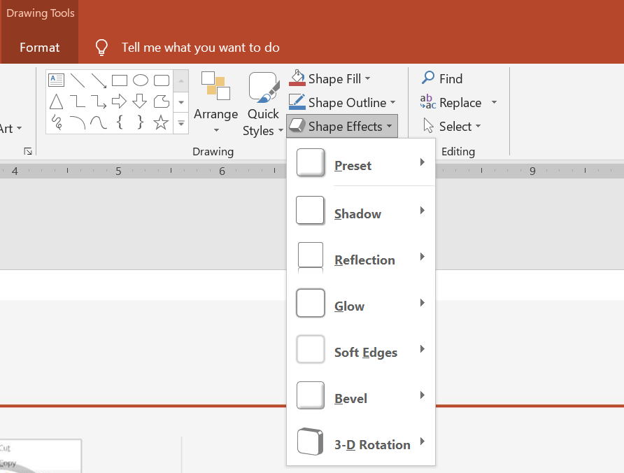

While effects in PowerPoint are also used to make a shape stand out, they differ from [fills](/slides/net/shape-formatting/#gradient-fill) or outlines. Using PowerPoint effects, you can create convincing reflections on a shape, spread a shape's glow, etc.



* PowerPoint provides six effects that can be applied to shapes. You can apply one or more effects to a shape. 

* Some combinations of effects look better than others. For this reason, PowerPoint options under **Preset**. The Preset options are essentially a known good-looking combination of two or more effects. This way, by selecting a preset, you won't have to waste time testing or combining different effects to find a nice combination.

Aspose.Slides provides properties and methods under the [`EffectFormat`](https://reference.aspose.com/slides/net/aspose.slides/effectformat/) class that allow you to apply the same effects to shapes in PowerPoint presentations.

## Apply Shadow Effect

This C# code shows you how to apply the outer shadow effect ([`OuterShadowEffect`](https://reference.aspose.com/slides/net/aspose.slides/effectformat/outershadoweffect/)) to a rectangle:

```c#
using (var pres = new Presentation())
{
    var shape = pres.Slides[0].Shapes.AddAutoShape(ShapeType.RoundCornerRectangle, 20, 20, 200, 150);

    shape.EffectFormat.EnableOuterShadowEffect();
    shape.EffectFormat.OuterShadowEffect.ShadowColor.Color = Color.DarkGray;
    shape.EffectFormat.OuterShadowEffect.Distance = 10;
    shape.EffectFormat.OuterShadowEffect.Direction = 45;

    pres.Save("output.pptx", SaveFormat.Pptx);
}
```

## Apply Reflection Effect

This C# code shows you how to apply the reflection effect to a shape: 

```c#
using (var pres = new Presentation())
{
    IAutoShape shape = pres.Slides[0].Shapes.AddAutoShape(ShapeType.RoundCornerRectangle, 20, 20, 200, 150);

    shape.EffectFormat.EnableReflectionEffect();
    shape.EffectFormat.ReflectionEffect.RectangleAlign = RectangleAlignment.Bottom;
    shape.EffectFormat.ReflectionEffect.Direction = 90;
    shape.EffectFormat.ReflectionEffect.Distance = 55;
    shape.EffectFormat.ReflectionEffect.BlurRadius = 4;

    pres.Save("reflection.pptx", SaveFormat.Pptx);
}
```

## Apply Glow Effect

This C# code shows you how to apply the glow effect to a shape: xxx

```c#

```

## Apply Soft Edges Effect

This C# code shows you how to apply the soft edges to a shape: xxx 

```c#

```
