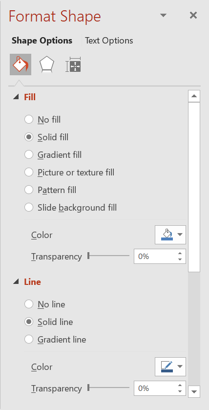

In PowerPoint, you can add shapes to slides. Since shapes are made of up lines, you can format shapes by modifying or applying certain effects to their constituent lines. Additionally, you can format shapes by specifying settings that determine how they (the area in them) are filled. 




**Aspose.Slides for .NET** provides interfaces and properties that allow you to format shapes based on known options in PowerPoint. 

## **Format Lines**

Using Aspose.Slides, you can specify your preferred line style for a shape. These steps outline such a procedure:

1. Create an instance of the [Presentation](https://reference.aspose.com/slides/net/aspose.slides/presentation) class.
2. Get a slide's reference through its index. 
3. Add an [IShape](https://reference.aspose.com/slides/net/aspose.slides/ishape) to the slide.
4. Set a color for the shape lines.
5. Set the width for the shape lines.
6. Set the [line style](https://reference.aspose.com/slides/net/aspose.slides/linestyle) for the shape line
7. Set the [dash style](http://aspose.com/api/net/slides/aspose.slides/linedashstyle) for the shape line. 
8. Write the modified presentation as a PPTX file.

This C# code demonstrates an operation where we formatted a rectangle `AutoShape`:

```c#
// Instantiates a presentation class that represents a presentation file
using (Presentation pres = new Presentation())
{
    // Gets the first slide
    ISlide sld = pres.Slides[0];

    // Adds autoshape of rectangle type
    IShape shp = sld.Shapes.AddAutoShape(ShapeType.Rectangle, 50, 150, 150, 75);

    // Sets the fill color for the rectangle shape
    shp.FillFormat.FillType = FillType.Solid;
    shp.FillFormat.SolidFillColor.Color = Color.White;

    // Applies some formatting on the rectangle's lines
    shp.LineFormat.Style = LineStyle.ThickThin;
    shp.LineFormat.Width = 7;
    shp.LineFormat.DashStyle = LineDashStyle.Dash;

    // Sets the color for the rectangle's line
    shp.LineFormat.FillFormat.FillType = FillType.Solid;
    shp.LineFormat.FillFormat.SolidFillColor.Color = Color.Blue;

    // Writes the PPTX file to disk
    pres.Save("RectShpLn_out.pptx", SaveFormat.Pptx);
}
```


## **Format Join Styles**
These are the 3 join type options:

* Round
* Miter
* Bevel

By default, when PowerPoint joins two lines at an angle (or a shape's corner), it uses the **Round** setting. However, if you are looking to draw a shape with very sharp angles, you may want to select **Miter**.


This C# demonstrates an operation where 3 rectangles (the image above) were created with the Miter, Bevel, and Round join type settings:

```c#
// Instantiates a presentation class that represents a presentation file
using (Presentation pres = new Presentation())
{

	// Gets the first slide
	ISlide sld = pres.Slides[0];

	// Adds 3 rectangle autoshapes
	IShape shp1 = sld.Shapes.AddAutoShape(ShapeType.Rectangle, 50, 100, 150, 75);
	IShape shp2 = sld.Shapes.AddAutoShape(ShapeType.Rectangle, 300, 100, 150, 75);
	IShape shp3 = sld.Shapes.AddAutoShape(ShapeType.Rectangle, 50, 250, 150, 75);

	// Sets the fill color for the rectangle shape
	shp1.FillFormat.FillType = FillType.Solid;
	shp1.FillFormat.SolidFillColor.Color = Color.Black;
	shp2.FillFormat.FillType = FillType.Solid;
	shp2.FillFormat.SolidFillColor.Color = Color.Black;
	shp3.FillFormat.FillType = FillType.Solid;
	shp3.FillFormat.SolidFillColor.Color = Color.Black;

	// Sets the line's width
	shp1.LineFormat.Width = 15;
	shp2.LineFormat.Width = 15;
	shp3.LineFormat.Width = 15;

	// Sets the color for the rectangle's line
	shp1.LineFormat.FillFormat.FillType = FillType.Solid;
	shp1.LineFormat.FillFormat.SolidFillColor.Color = Color.Blue;
	shp2.LineFormat.FillFormat.FillType = FillType.Solid;
	shp2.LineFormat.FillFormat.SolidFillColor.Color = Color.Blue;
	shp3.LineFormat.FillFormat.FillType = FillType.Solid;
	shp3.LineFormat.FillFormat.SolidFillColor.Color = Color.Blue;

	// Sets the Join Style
	shp1.LineFormat.JoinStyle = LineJoinStyle.Miter;
	shp2.LineFormat.JoinStyle = LineJoinStyle.Bevel;
	shp3.LineFormat.JoinStyle = LineJoinStyle.Round;

	// Adds text to each rectangle
	((IAutoShape)shp1).TextFrame.Text = "Miter Join Style";
	((IAutoShape)shp2).TextFrame.Text = "Bevel Join Style";
	((IAutoShape)shp3).TextFrame.Text = "Round Join Style";

	// Writes the PPTX file to disk
	pres.Save("RectShpLnJoin_out.pptx", SaveFormat.Pptx);
}
```


## **Gradient Fill**
In PowerPoint, Gradient Fill is a formatting option that allows you to apply a continuous blend of colors to a shape. For example, you can apply a two or more colors in a setup where one color gradually fades and changes into another color. 

This is how you use Aspose.Slides to apply a gradient fill to a shape:

1. Create an instance of the [Presentation](https://reference.aspose.com/slides/net/aspose.slides/presentation) class.
2. Get a slide's reference through its index. 
3. Add an [IShape](https://reference.aspose.com/slides/net/aspose.slides/ishape) to the slide.
4. Set the Shape's [FillType](https://reference.aspose.com/slides/net/aspose.slides/filltype) to `Gradient`.
5. Add your 2 preferred colors with defined positions using the `Add` methods exposed by the `GradientStops` collection associated with `GradientFormat` class.
6. Write the modified presentation as a PPTX file.

This C# code demonstrates an operation where the gradient fill effect was used on an ellipse:

```c#
// Instantiates a presentation class that represents a presentation file
using (Presentation pres = new Presentation())
{
    // Gets the first slide
    ISlide sld = pres.Slides[0];

    // Adds an ellipse autoshape
    IShape shp = sld.Shapes.AddAutoShape(ShapeType.Ellipse, 50, 150, 75, 150);

    // Applies the gradient formatting to the ellipse
    shp.FillFormat.FillType = FillType.Gradient;
    shp.FillFormat.GradientFormat.GradientShape = GradientShape.Linear;

    // Sets the direction of the gradient
    shp.FillFormat.GradientFormat.GradientDirection = GradientDirection.FromCorner2;

    // Add 2 gradient stops
    shp.FillFormat.GradientFormat.GradientStops.Add((float)1.0, PresetColor.Purple);
    shp.FillFormat.GradientFormat.GradientStops.Add((float)0, PresetColor.Red);

    // Writes the PPTX file to disk
    pres.Save("EllipseShpGrad_out.pptx", SaveFormat.Pptx);
}
```


## **Pattern Fill**
In PowerPoint, Pattern Fill is a formatting option that allows you to apply a two-color design comprising of dots, stripes, cross-hatches, or checks to a shape. Additionally, you get to select your preferred colors for your pattern's foreground and background. 

Aspose.Slides provides over 45 predefined styles that can be used to format shapes and enrich presentations. Even after you choose a predefined pattern, you can still specify the colors the pattern must contain.

This is how you use Aspose.Slides to apply a pattern fill to a shape:

1. Create an instance of the [Presentation](https://reference.aspose.com/slides/net/aspose.slides/presentation) class.
2. Get a slide's reference through its index. 
3. Add an [IShape](https://reference.aspose.com/slides/net/aspose.slides/ishape) to the slide.
4. Set the Shape's [FillType](https://reference.aspose.com/slides/net/aspose.slides/filltype) to `Pattern`.
5. Set your preferred pattern style for the shape. 
6. Set the [Background Color ](http://www.aspose.com/api/net/slides/aspose.slides/patternformat/properties/backcolor) for the [PatternFormat](http://www.aspose.com/api/net/slides/aspose.slides/patternformat).
7. Set the [Foreground Color ](http://www.aspose.com/api/net/slides/aspose.slides/patternformat/properties/forecolor) for the [PatternFormat](http://www.aspose.com/api/net/slides/aspose.slides/patternformat).
8. Write the modified presentation as a PPTX file.

This C# code demonstrates an operation where a pattern fill was used to beautify a rectangle: 

```c#
// Instantiates a presentation class that represents a presentation file
using (Presentation pres = new Presentation())
{

    // Gets the first slide
    ISlide sld = pres.Slides[0];

    // Adds a rectangle autoshape
    IShape shp = sld.Shapes.AddAutoShape(ShapeType.Rectangle, 50, 150, 75, 150);

    // Sets the fill type to Pattern
    shp.FillFormat.FillType = FillType.Pattern;

    // Sets the pattern style
    shp.FillFormat.PatternFormat.PatternStyle = PatternStyle.Trellis;

    // Sets the pattern back and fore colors
    shp.FillFormat.PatternFormat.BackColor.Color = Color.LightGray;
    shp.FillFormat.PatternFormat.ForeColor.Color = Color.Yellow;

    // Writes the PPTX file to disk
    pres.Save("RectShpPatt_out.pptx", SaveFormat.Pptx);
}
```


## **Picture Fill**
In PowerPoint, Picture Fill is a formatting option that allows you to place a picture inside a shape. Essentially, you get to use a picture as a shape's background. 

This is how you use Aspose.Slides to fill a shape with a picture:

1. Create an instance of the [Presentation](https://reference.aspose.com/slides/net/aspose.slides/presentation/) class.
2. Get a slide's reference through its index. 
3. Add an [IShape](https://reference.aspose.com/slides/net/aspose.slides/ishape) to the slide.
4. Set the Shape's [FillType](https://reference.aspose.com/slides/net/aspose.slides/filltype) to `Picture`.
5. Set the Picture Fill Mode to Tile.
6. Create an `IPPImage` object using the image that will be used to fill the shape.
7. Set the `Picture.Image` property of the `PictureFillFormat` object to the recently created `IPPImage`.
8. Write the modified presentation as a PPTX file.

This C# code shows you how to fill a shape with a picture:

```c#
// Instantiates a presentation class that represents a presentation file
using (Presentation pres = new Presentation())
{

    // Gets the first slide
    ISlide sld = pres.Slides[0];

    // Adds a rectangle autoshape
    IShape shp = sld.Shapes.AddAutoShape(ShapeType.Rectangle, 50, 150, 75, 150);


    // Sets the fill type to Picture
    shp.FillFormat.FillType = FillType.Picture;

    // Sets the picture fill mode
    shp.FillFormat.PictureFillFormat.PictureFillMode = PictureFillMode.Tile;

    // Sets the picture
    System.Drawing.Image img = (System.Drawing.Image)new Bitmap("Tulips.jpg");
    IPPImage imgx = pres.Images.AddImage(img);
    shp.FillFormat.PictureFillFormat.Picture.Image = imgx;

    // Writes the PPTX file to disk
    pres.Save("RectShpPic_out.pptx", SaveFormat.Pptx);
}
```


## **Solid Color Fill**
In PowerPoint, Solid Color Fill is a formatting option that allows you to fill a shape with a single color. The chosen color is typically a plain color. The color gets applied to the shape background with any special effects or modifications. 

This is how you use Aspose.Slides to apply solid color fill to a shape:

1. Create an instance of the [Presentation](https://reference.aspose.com/slides/net/aspose.slides/presentation) class.
2. Get a slide's reference through its index. 
3. Add an [IShape](https://reference.aspose.com/slides/net/aspose.slides/ishape) to the slide.
4. Set the Shape's [FillType](https://reference.aspose.com/slides/net/aspose.slides/filltype) to `Solid`.
5. Set your preferred color for the Shape.
6. Write the modified presentation as a PPTX file.

This C# code shows you how to apply the solid color fill to a box in PowerPoint:

```c#
// Instantiates a presentation class that represents a presentation file
using (Presentation presentation = new Presentation())
{

// Gets the first slide
    ISlide slide = presentation.Slides[0];

// Adds a rectangle autoshape
    IShape shape = slide.Shapes.AddAutoShape(ShapeType.Rectangle, 50, 150, 75, 150);

// Sets the fill type to Solid
    shape.FillFormat.FillType = FillType.Solid;

// Sets the color for the rectangle
    shape.FillFormat.SolidFillColor.Color = Color.Yellow;

// Writes the PPTX file to disk
    presentation.Save("RectShpSolid_out.pptx", SaveFormat.Pptx);
}
```

## **Set Transparency**

In PowerPoint, when you fill shapes with solid colors, gradients, pictures, or textures, you can specify the transparency level that determines the opacity of a fill. This way, for example, if you set a low transparency level, the slide object or background behind (the shape) shows through. 

Aspose.Slides allows you to set the transparency level for a shape this way:

1. Create an instance of the [Presentation](https://reference.aspose.com/slides/net/aspose.slides/presentation) class.
2. Get a slide's reference through its index. 
3. Add an [IShape](https://reference.aspose.com/slides/net/aspose.slides/ishape) to the slide.
4. Use `Color.FromArgb` with the alpha component set.
5. Save the object as a PowerPoint file. 

This C# code demonstrates the process:

```c#
// Instantiates a presentation class that represents a presentation file
using (Presentation presentation = new Presentation())
{
    ISlide slide = presentation.Slides[0];
    
    // Adds a solid shape
    IShape solidShape = slide.Shapes.AddAutoShape(ShapeType.Rectangle, 75, 175, 75, 150);

    // Adds a transparent shape over the solid shape
    IShape shape = slide.Shapes.AddAutoShape(ShapeType.Rectangle, 50, 150, 75, 150);
    shape.FillFormat.FillType = FillType.Solid;
    shape.FillFormat.SolidFillColor.Color = Color.FromArgb(128, 204, 102, 0);
    
    // Writes the PPTX file to disk
    presentation.Save("ShapeTransparentOverSolid_out.pptx", SaveFormat.Pptx);
}
```

## **Rotate Shapes**
Aspose.Slides allows you to rotate a shape added to a slide this way: 

1. Create an instance of the [Presentation](https://reference.aspose.com/slides/net/aspose.slides/presentation) class.
2. Get a slide's reference through its index. 
3. Add an [IShape](https://reference.aspose.com/slides/net/aspose.slides/ishape) to the slide.
4. Rotate the shape by the needed degrees. 
5. Write the modified presentation as a PPTX file.

This C# code shows you how to rotate a shape by 90 degrees:

```c#
// Instantiates a presentation class that represents a presentation file
using (Presentation pres = new Presentation())
{
    // Gets the first slide
    ISlide sld = pres.Slides[0];

    // Adds a rectangle autoshape
    IShape shp = sld.Shapes.AddAutoShape(ShapeType.Rectangle, 50, 150, 75, 150);

    // Rotates the shape by 90 degrees
    shp.Rotation = 90;

    // Writes the PPTX file to disk
    pres.Save("RectShpRot_out.pptx", SaveFormat.Pptx);
}
```


## **Add 3D Bevel Effects**
Aspose.Slides allows you to 3D bevel effects to a shape by modifying its [ThreeDFormat](https://reference.aspose.com/slides/net/aspose.slides/ThreeDFormat) properties this way:

1. Create an instance of the [Presentation](https://reference.aspose.com/slides/net/aspose.slides/presentation) class.
2. Get a slide's reference through its index. 
3. Add an [IShape](https://reference.aspose.com/slides/net/aspose.slides/ishape) to the slide.
3. Set your preferred parameters for the shape's [ThreeDFormat](https://reference.aspose.com/slides/net/aspose.slides/ThreeDFormat) properties. 
4. Write the presentation to disk.

This C# code shows you how to add 3D bevel effects to a shape:

```c#
// Creates an instance of the Presentation class
using (Presentation pres = new Presentation())
{
    ISlide slide = pres.Slides[0];
    
    // Adds a shape to the slide
    IAutoShape shape = slide.Shapes.AddAutoShape(ShapeType.Ellipse, 30, 30, 100, 100);
    shape.FillFormat.FillType = FillType.Solid;
    shape.FillFormat.SolidFillColor.Color = Color.Green;
    ILineFillFormat format = shape.LineFormat.FillFormat;
    format.FillType = FillType.Solid;
    format.SolidFillColor.Color = Color.Orange;
    shape.LineFormat.Width = 2.0;
    
    // Sets the shape's ThreeDFormat properties
    shape.ThreeDFormat.Depth = 4;
    shape.ThreeDFormat.BevelTop.BevelType = BevelPresetType.Circle;
    shape.ThreeDFormat.BevelTop.Height = 6;
    shape.ThreeDFormat.BevelTop.Width = 6;
    shape.ThreeDFormat.Camera.CameraType = CameraPresetType.OrthographicFront;
    shape.ThreeDFormat.LightRig.LightType = LightRigPresetType.ThreePt;
    shape.ThreeDFormat.LightRig.Direction = LightingDirection.Top;
    
    // Writes the presentation as a PPTX file
    pres.Save("Bavel_out.pptx", SaveFormat.Pptx);
}
```


## **Add 3D Rotation Effect**
Aspose.Slides allows you to apply 3D rotation effects to a shape by modifying its [ThreeDFormat](https://reference.aspose.com/slides/net/aspose.slides/ThreeDFormat) properties this way:

1. Create an instance of the [Presentation](https://reference.aspose.com/slides/net/aspose.slides/presentation) class.
2. Get a slide's reference through its index. 
3. Add an [IShape](https://reference.aspose.com/slides/net/aspose.slides/ishape) to the slide.
3. Specify your preferred figures for [CameraType](https://reference.aspose.com/slides/net/aspose.slides/icamera/properties/cameratype) and [LightType](https://reference.aspose.com/slides/net/aspose.slides/ilightrig/properties/lighttype).
4. Write the presentation to disk. 

This C# code shows you how to apply 3D rotation effects to a shape:

```c#
// Creates an instance of the Presentation class
using (Presentation pres = new Presentation())
{
    IShape autoShape = pres.Slides[0].Shapes.AddAutoShape(ShapeType.Rectangle, 30, 30, 200, 200);
    
    autoShape.ThreeDFormat.Depth = 6;
    autoShape.ThreeDFormat.Camera.SetRotation(40, 35, 20);
    autoShape.ThreeDFormat.Camera.CameraType = CameraPresetType.IsometricLeftUp;
    autoShape.ThreeDFormat.LightRig.LightType = LightRigPresetType.Balanced;
    
    autoShape = pres.Slides[0].Shapes.AddAutoShape(ShapeType.Line, 30, 300, 200, 200);
    autoShape.ThreeDFormat.Depth = 6;
    autoShape.ThreeDFormat.Camera.SetRotation(0, 35, 20);
    autoShape.ThreeDFormat.Camera.CameraType = CameraPresetType.IsometricLeftUp;
    autoShape.ThreeDFormat.LightRig.LightType = LightRigPresetType.Balanced;
    
    // Writes the presentation as a PPTX file
    pres.Save("Rotation_out.pptx", SaveFormat.Pptx);
}
```

## **Reset Formatting**

This C# code shows you how to reset the formatting in a shape and revert its layout styles to their defaults: xxx 

```c#

```

