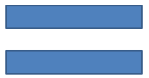

# Customization of the Shape Geometry (Shape Points Editing)
* [Overview](#overview)
* [Examples and use-cases](#examples-and-use-cases)
## Overview 
Customization of the shape geometry assumes editing points of an existing shape. 


To provide the mentioned functionality *GeometryPath* class and *IGeometryPath* interface have been added. *GeometryPath* instance represents a geometry path of the [IGeometryShape](https://apireference.aspose.com/slides/net/aspose.slides/igeometryshape) object. 

To retrieve *GeometryPath* from the [IGeometryShape](https://apireference.aspose.com/slides/net/aspose.slides/igeometryshape) instance has been added method *IGeometryShape.GetGeometryPaths()*. Shapes may be built from a few smaller shapes (e.g. an "equal" sign) so this method returns an array of *IGeometryPath* objects. 

To set *GeometryPath* to the shape has been added two methods: 
*IGeometryShape.SetGeometryPath(IGeometryPath geometryPath)* for solid shapes and *IGeometryShape.SetGeometryPaths(IGeometryPath[] geometryPaths)* for composite shapes.

IGeometryPath provides methods for adding segments of various types:

**Adds line** to the end of the path
``` csharp
void LineTo(PointF point);
void LineTo(float x, float y);
```
**Adds line** to the specified place of the path:
``` csharp    
void LineTo(PointF point, uint index)
void LineTo(float x, float y, uint index);
```
**Adds cubic Bezier curve** at the end the path:
``` csharp
void CubicBezierTo(PointF point1, PointF point2, PointF point3);
void CubicBezierTo(float x1, float y1, float x2, float y2, float x3, float y3);
```
**Adds cubic Bezier curve** to the specified place of the path:
``` csharp
void CubicBezierTo(PointF point1, PointF point2, PointF point3, uint index);
   void CubicBezierTo(float x1, float y1, float x2, float y2, float x3, float y3, uint index);
```
**Adds quadratic Bezier curve** at the end the path:
``` csharp
void QuadraticBezierTo(PointF point1, PointF point2);
void QuadraticBezierTo(float x1, float y1, float x2, float y2);
```
**Adds quadratic Bezier curve** to the specified place of the path:
``` csharp
void QuadraticBezierTo(PointF point1, PointF point2, uint index);
void QuadraticBezierTo(float x1, float y1, float x2, float y2, uint index);
```
**Appends the specified arc** to the path:
``` csharp
    void ArcTo(float width, float heigth, float startAngle, float sweepAngle);
```
**Closes the current figure** of this path:
``` csharp
    void CloseFigure();
```
**Sets next point position**:
``` csharp
void MoveTo(PointF point);
void MoveTo(float x, float y);
```
**Removes path segment** at the specified index:
``` csharp
void RemoveAt(int index);
```
Properties *GeometryPath.Stroke* and *GeometryPath.FillMode* set an appearance of the geometry path.

Property *GeometryPath.PathData* returns the geometry path of [GeometryShape](https://apireference.aspose.com/slides/net/aspose.slides/geometryshape) as an array of path segments.


*To provide more options of shape geometry customization has been added class **ShapeUtil**. Methods of this class allow to convert GeometryPath to [GraphicsPath](https://docs.microsoft.com/en-us/dotnet/api/system.drawing.drawing2d?view=dotnet-plat-ext-5.0) back and forth.*

# Examples and use-cases
  * [Add Custom Points to the Shape](#add-custom-points-to-the-shape)
  * [Remove Points From the Shape](#remove-points-from-the-shape)
  * [Create Custom Shape](#create-custom-shape)
  * [Create Composite Custom Shape](#create-composite-custom-shape)
  * [Conversion of GeometryPath to GrpahicsPath (System.Drawing.Drawing2D)](#conversion-of-geometrypath-to-grpahicspath-systemdrawingdrawing2d)
  
## Add Custom Points to the Shape
- Create an instance of the [GeometryShape](https://apireference.aspose.com/slides/net/aspose.slides/geometryshape) class of type [ShapeType.Rectangle](https://apireference.aspose.com/slides/net/aspose.slides/shapetype)
- Retrieve an instance of the GeometryPath class from the shape
- Add a new point between two top points of the path 
- Add a new point between two bottom points of the path
- Apply the path to the shape 
  
``` csharp
using (Presentation pres = new Presentation())
{
    GeometryShape shape = pres.Slides[0].Shapes.AddAutoShape(ShapeType.Rectangle, 100, 100, 200, 100) as GeometryShape;
    IGeometryPath geometryPath = shape.GetGeometryPaths()[0];

    geometryPath.LineTo(100, 50, 1);
    geometryPath.LineTo(100, 50, 4);
    shape.SetGeometryPath(geometryPath);
}
```


##  Remove Points From the Shape

- Create an instance of [GeometryShape](https://apireference.aspose.com/slides/net/aspose.slides/geometryshape) class of type [ShapeType.Heart](https://apireference.aspose.com/slides/net/aspose.slides/shapetype)
- Retrieve an instance of the [GeometryPath]() class from the shape
- Remove segment of the path
- Apply the path to the shape 
  
``` csharp
using (Presentation pres = new Presentation())
{
	GeometryShape shape = pres.Slides[0].Shapes.AddAutoShape(ShapeType.Heart, 100, 100, 300, 300) as GeometryShape;

	IGeometryPath path = shape.GetGeometryPaths()[0];
	path.RemoveAt(2);
	shape.SetGeometryPath(path);
}
```


##  Create Custom Shape

- Calculate points of the shape 
- Create an instance of the [GeometryPath]() class 
- Fill the path with the points
- Create an instance of the [GeometryShape](https://apireference.aspose.com/slides/net/aspose.slides/geometryshape) class 
- Apply the path to the shape 

``` csharp
List<PointF> points = new List<PointF>();

float R = 100, r = 50;
int step = 72;

for (int angle = -90; angle < 270; angle += step)
{
    double radians = angle * (Math.PI / 180f);
    double x = R * Math.Cos(radians);
    double y = R * Math.Sin(radians);
    points.Add(new PointF((float)x + R, (float)y + R));

    radians = Math.PI * (angle + step / 2) / 180.0;
    x = r * Math.Cos(radians);
    y = r * Math.Sin(radians);
    points.Add(new PointF((float)x + R, (float)y + R));
}

GeometryPath starPath = new GeometryPath();
starPath.MoveTo(points[0]);

for (int i = 1; i < points.Count; i++)
{
    starPath.LineTo(points[i]);
}

starPath.CloseFigure();

using (Presentation pres = new Presentation())
{
    GeometryShape shape = pres.Slides[0].Shapes.AddAutoShape(ShapeType.Rectangle, 100, 100, R * 2, R * 2) as GeometryShape;

    shape.SetGeometryPath(starPath);
}
```


## Create Composite Custom Shape

  - Create an instance of the [GeometryShape](https://apireference.aspose.com/slides/net/aspose.slides/geometryshape) class
  - Create first instance of the [GeometryPath]() class
  - Create second instance of the [GeometryPath]() class
  - Apply the paths to the shape 

``` csharp
using (Presentation pres = new Presentation())
{
    GeometryShape shape = pres.Slides[0].Shapes.AddAutoShape(ShapeType.Rectangle, 100, 100, 200, 100) as GeometryShape;

    GeometryPath geometryPath0 = new GeometryPath();
    geometryPath0.MoveTo(0, 0);
    geometryPath0.LineTo(shape.Width, 0);
    geometryPath0.LineTo(shape.Width, shape.Height/3);
    geometryPath0.LineTo(0, shape.Height / 3);
    geometryPath0.CloseFigure();

    GeometryPath geometryPath1 = new GeometryPath();
    geometryPath1.MoveTo(0, shape.Height/3 * 2);
    geometryPath1.LineTo(shape.Width, shape.Height / 3 * 2);
    geometryPath1.LineTo(shape.Width, shape.Height);
    geometryPath1.LineTo(0, shape.Height);
    geometryPath1.CloseFigure();

    shape.SetGeometryPaths(new GeometryPath[] { geometryPath0, geometryPath1});
}
```


## Conversion of GeometryPath to GrpahicsPath (System.Drawing.Drawing2D) 

- Create an instance of the [GeometryShape](https://apireference.aspose.com/slides/net/aspose.slides/geometryshape) class
- Create an instance of the [GrpahicsPath](https://docs.microsoft.com/en-us/dotnet/api/system.drawing.drawing2d.graphicspath?view=dotnet-plat-ext-5.0) class  of the [System.Drawing.Drawing2D](https://docs.microsoft.com/en-us/dotnet/api/system.drawing.drawing2d?view=dotnet-plat-ext-5.0) namespace
- Convert the [GraphicsPath](https://docs.microsoft.com/en-us/dotnet/api/system.drawing.drawing2d.graphicspath?view=dotnet-plat-ext-5.0) instance to the  [ShapePath]() instance using [ShapeUtil]()
- Apply the paths to the shape 
  
``` csharp
using (Presentation pres = new Presentation())
{
    GeometryShape shape = pres.Slides[0].Shapes.AddAutoShape(ShapeType.Rectangle, 100, 100, 300, 100) as GeometryShape;

    IGeometryPath originalPath = shape.GetGeometryPaths()[0];
    originalPath.FillMode = PathFillModeType.None;

    GraphicsPath gPath = new GraphicsPath();

    gPath.AddString("Text in shape", new FontFamily("Arial"), 1, 40, new PointF(10, 10), StringFormat.GenericDefault);

    IGeometryPath textPath = ShapeUtil.GraphicsPathToGeometryPath(gPath);
    textPath.FillMode = PathFillModeType.Normal;

    shape.SetGeometryPaths(new[] {originalPath, textPath}) ;
}
```
