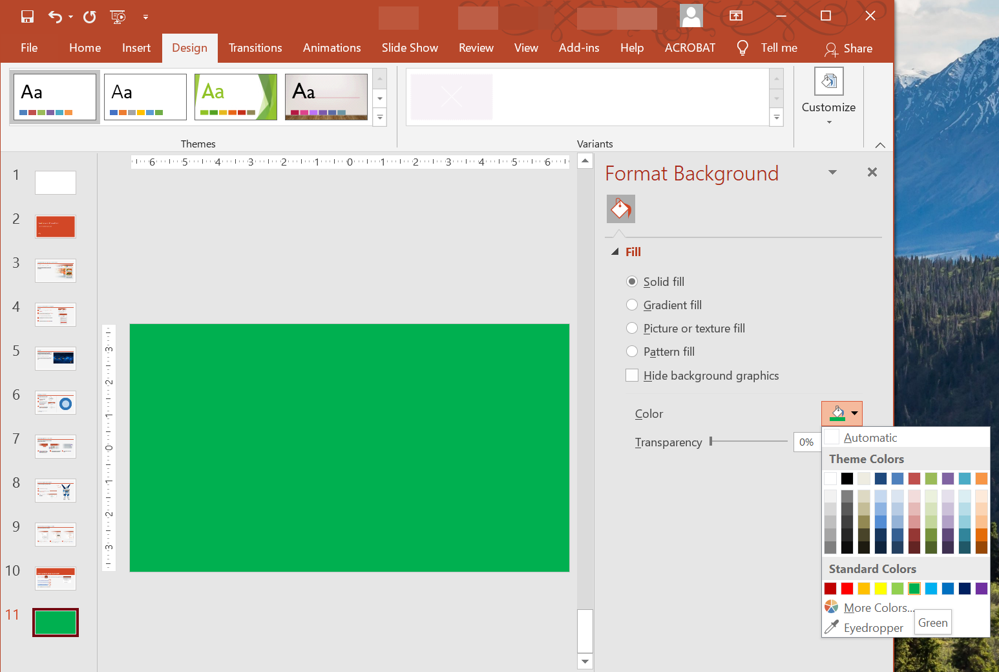

Solid colors, gradient colors, and pictures are often used as background images for slides. You can set the background either for a **normal slide** (single slide) or **master slide** (several slides at once).



## **Set Solid Color as Background for Normal Slide**

Aspose.Slides allows you to set a solid color as the background for a specific slide in a presentation (even if that presentation contains a master slide). The background change affects only the selected slide.

1. Create an instance of the [Presentation](https://reference.aspose.com/slides/net/aspose.slides/presentation/) class.
2. Set the [BackgroundType](https://reference.aspose.com/slides/net/aspose.slides/backgroundtype/) enum for the slide to `OwnBackground`.
3. Set the [FillType](https://reference.aspose.com/slides/net/aspose.slides/filltype/) enum for the slide background to `Solid`.
4. Use the [SolidFillColor](https://reference.aspose.com/slides/net/aspose.slides/fillformat/solidfillcolor/) property exposed by [FillFormat](https://reference.aspose.com/slides/net/aspose.slides/fillformat/) to specify a solid color for the background.
5. Save the modified presentation.

This C# code shows you how to set a solid color (blue) as the background for a normal slide:

```c#
// Creates an instance of the Presentation class
using (Presentation pres = new Presentation())
{

    // Sets the background color for the first ISlide to Blue
    pres.Slides[0].Background.Type = BackgroundType.OwnBackground;
    pres.Slides[0].Background.FillFormat.FillType = FillType.Solid;
    pres.Slides[0].Background.FillFormat.SolidFillColor.Color = Color.Blue;
    
    // Writes the presentation to disk
    pres.Save("ContentBG_out.pptx", SaveFormat.Pptx);
}
```

## **Set Solid Color as Background for Master Slide**

Aspose.Slides allows you to set a solid color as the background for the master slide in a presentation. The master slide acts as a template that contains and controls formatting settings for all slides. Therefore, when you select a solid color as the background for the master slide, that new background will be used for all slides.

1. Create an instance of the [Presentation](https://reference.aspose.com/slides/net/aspose.slides/presentation/) class.
2. Set the [BackgroundType](https://reference.aspose.com/slides/net/aspose.slides/backgroundtype/) enum for the master slide (`Masters`) to `OwnBackground`.
3. Set the [FillType](https://reference.aspose.com/slides/net/aspose.slides/filltype/) enum for the master slide background to `Solid`.
4. Use the [SolidFillColor](https://reference.aspose.com/slides/net/aspose.slides/fillformat/solidfillcolor/) property exposed by [FillFormat](https://reference.aspose.com/slides/net/aspose.slides/fillformat/) to specify a solid color for the background.
5. Save the modified presentation.

This C# code shows you how to set a solid color (forest green) as the background for a master slide in a presentation:

```c#
// Creates an instance of the Presentation class
using (Presentation pres = new Presentation())
{

    // SetS the background color for the Master ISlide to Forest Green
    pres.Masters[0].Background.Type = BackgroundType.OwnBackground;
    pres.Masters[0].Background.FillFormat.FillType = FillType.Solid;
    pres.Masters[0].Background.FillFormat.SolidFillColor.Color = Color.ForestGreen;

    // Writes the presentation to disk
    pres.Save("SetSlideBackgroundMaster_out.pptx", SaveFormat.Pptx);

}
```

## **Set Gradient Color as Background for Slide**

A gradient is a graphical effect based on a gradual change in color. Gradient colors, when used as backgrounds for slides, make presentations looks artistic and professional. Aspose.Slides allows you to set a gradient color as the background for slides in presentations.

1. Create an instance of the [Presentation](https://reference.aspose.com/slides/net/aspose.slides/presentation/) class.
2. Set the [BackgroundType](https://reference.aspose.com/slides/net/aspose.slides/backgroundtype/) enum for the slide to `OwnBackground`.
3. Set the [FillType](https://reference.aspose.com/slides/net/aspose.slides/filltype/) enum for the master slide background to `Gradient`.
4. Use the [GradientFormat](https://reference.aspose.com/slides/net/aspose.slides/fillformat/solidfillcolor/) property exposed by [FillFormat](https://reference.aspose.com/slides/net/aspose.slides/fillformat/) to specify your preferred gradient setting.
5. Save the modified presentation.

This C# code shows you how to set a gradient color as the background for a slide:

```c#
// Creates an instance of the Presentation class
using (Presentation pres = new Presentation("SetBackgroundToGradient.pptx"))
{

    // Apply Gradiant effect to the Background
    pres.Slides[0].Background.Type = BackgroundType.OwnBackground;
    pres.Slides[0].Background.FillFormat.FillType = FillType.Gradient;
    pres.Slides[0].Background.FillFormat.GradientFormat.TileFlip = TileFlip.FlipBoth;

    //Write the presentation to disk
    pres.Save("ContentBG_Grad_out.pptx", SaveFormat.Pptx);
}
```

## **Set Image as Background for Slide**

Besides solid colors and gradient colors, Aspose.Slides also allows you to set images as the background for slides in presentations.

1. Create an instance of the [Presentation](https://reference.aspose.com/slides/net/aspose.slides/presentation/) class.
2. Set the [BackgroundType](https://reference.aspose.com/slides/net/aspose.slides/backgroundtype/) enum for the slide to `OwnBackground`.
3. Set the [FillType](https://reference.aspose.com/slides/net/aspose.slides/filltype/) enum for the master slide background to `Picture`.
4. Load the image you want use as the slide background.
5. Add the image to the presentation's image collection.
6. Use the [PictureFillFormat](https://reference.aspose.com/slides/net/aspose.slides/fillformat/solidfillcolor/) property exposed by [FillFormat](https://reference.aspose.com/slides/net/aspose.slides/fillformat/) to set the image as the background.
7. Save the modified presentation.

This C# code shows you how to set an image as the background for a slide:

```c#
// Creates an instance of the Presentation class
using (Presentation pres = new Presentation("SetImageAsBackground.pptx"))
{

    // Sets conditions background image
    pres.Slides[0].Background.Type = BackgroundType.OwnBackground;
    pres.Slides[0].Background.FillFormat.FillType = FillType.Picture;
    pres.Slides[0].Background.FillFormat.PictureFillFormat.PictureFillMode = PictureFillMode.Stretch;

    // Loads the image
    System.Drawing.Image img = (System.Drawing.Image)new Bitmap(dataDir + "Tulips.jpg");

    // Adds image to presentation's images collection
    IPPImage imgx = pres.Images.AddImage(img);

    pres.Slides[0].Background.FillFormat.PictureFillFormat.Picture.Image = imgx;

    // Writes the presentation to disk
    pres.Save("ContentBG_Img_out.pptx", SaveFormat.Pptx);
}

```

### **Change Transparency of Background Image**

You may want to adjust the transparency of a slide's background image to make the contents of the slide stand out. This C# code shows you how to change the transparency for a slide background image:

```c#
var transparencyValue = 30; // for example

// Gets a collection of picture transform operations
var imageTransform = slide.Background.FillFormat.PictureFillFormat.Picture.ImageTransform;

// Finds a transparency effect with fixed percentage.
var transparencyOperation = null as AlphaModulateFixed;
foreach (var operation in imageTransform)
{
    if (operation is AlphaModulateFixed alphaModulateFixed)
    {
        transparencyOperation = alphaModulateFixed;
        break;
    }
}

// Sets the new transparency value.
if (transparencyOperation == null)
{
    imageTransform.AddAlphaModulateFixedEffect(100 - transparencyValue);
}
else
{
    transparencyOperation.Amount = (100 - transparencyValue);
}
```

## **Get Value of Slide Background**

Aspose.Slides provides the [IBackgroundEffectiveData](https://reference.aspose.com/slides/net/aspose.slides/ibackgroundeffectivedata/) interface to allow you to get the effective values of slide backgrounds. This interface contains information on the effective [FillFormat](https://reference.aspose.com/slides/net/aspose.slides/ibackgroundeffectivedata/effectformat/) and effective [EffectFormat](https://reference.aspose.com/slides/net/aspose.slides/ibackgroundeffectivedata/effectformat/).

Using the [Background](https://reference.aspose.com/slides/net/aspose.slides/ibaseslide/background/) property from the [BaseSlide](https://reference.aspose.com/slides/net/aspose.slides/baseslide/) class, you can get the effective value for a slide background.

This C# code shows you how to get a slide's effective background value:

```c#
// Creates an instance of the Presentation class
Presentation pres = new Presentation("SamplePresentation.pptx");

IBackgroundEffectiveData effBackground = pres.Slides[0].Background.GetEffective();

if (effBackground.FillFormat.FillType == FillType.Solid)
    Console.WriteLine("Fill color: " + effBackground.FillFormat.SolidFillColor);
else
    Console.WriteLine("Fill type: " + effBackground.FillFormat.FillType);
```

