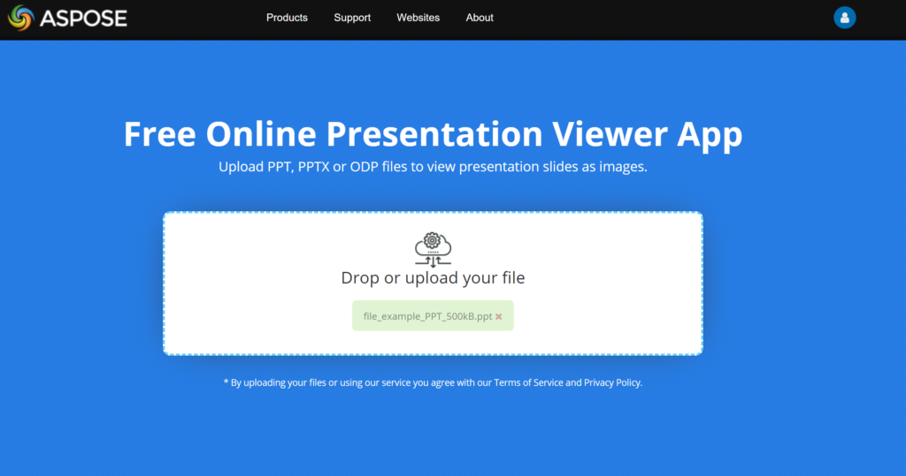

Aspose.Slides for .NET is used to create presentation files, complete with slides. These slides can be viewed by opening presentations using Microsoft PowerPoint. But sometimes, developers may also need to view slides as images in their favorite image viewer or create their own presentation viewer. In such cases, Aspose.Slides for .NET lets you export an individual slide to an image. This article describes how to do it. 
## **Live Example**
You can try [**Aspose.Slides Viewer**](https://products.aspose.app/slides/viewer/) free app to see what you can implement with Aspose.Slides API:

## **Generate SVG Image from Slide**
To generate an SVG image from any desired slide with Aspose.Slides.PPTX for .NET, please follow the steps below:

- Create an instance of the [Presentation](https://apireference.aspose.com/net/slides/aspose.slides/presentation) class.
- Obtain the desired slide's reference by using its ID or index.
- Get the SVG image in a memory stream.
- Save the memory stream to file.


## **Generate SVG with Custom Shape IDS**
Aspose.Slides for .NET can be used to generate [SVG ](https://wiki.fileformat.com/page-description-language/svg/)from slide with custom shape ID. For that, use ID property from [ISvgShape](https://apireference.aspose.com/net/slides/aspose.slides.export/isvgshape), which represents custom ID of shapes in generated SVG. CustomSvgShapeFormattingController can be used to set shape ID.




## **Create Slides Thumbnail Image**
Aspose.Slides for .NET help you generate thumbnail images of the slides. To generate the thumbnail of any desired slide using Aspose.Slides for .NET:

1. Create an instance of the [Presentation](https://apireference.aspose.com/net/slides/aspose.slides/presentation) class.
1. Obtain the reference of any desired slide by using its ID or index.
1. Get the thumbnail image of the referenced slide on a specified scale.
1. Save the thumbnail image in any desired image format.


## **Create Thumbnail with User Defined Dimensions**
1. Create an instance of the [Presentation](https://apireference.aspose.com/net/slides/aspose.slides/presentation) class.
1. Obtain the reference of any desired slide by using its ID or index.
1. Get the thumbnail image of the referenced slide on a specified scale.
1. Save the thumbnail image in any desired image format.


## **Create Thumbnail from Slide in Notes Slides View**
To generate the thumbnail of any desired slide in Notes Slide View using Aspose.Slides for .NET:

1. Create an instance of the [Presentation](https://apireference.aspose.com/net/slides/aspose.slides/presentation) class.
1. Obtain the reference of any desired slide by using its ID or index.
1. Get the thumbnail image of the referenced slide on a specified scale in Notes Slide view.
1. Save the thumbnail image in any desired image format.

The code snippet below produces a thumbnail of the first slide of a presentation in Notes Slide View.


