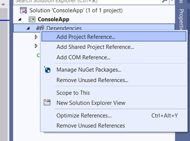
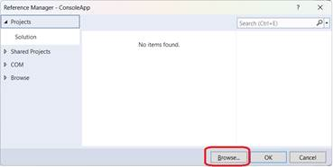

1. Cross-platform Aspose.Slides for .NET6 can be used for .NET 7 and future .NET releases.

2. **Prerequisite**: To use the cross-platform version Aspose.Slides for .NET 6, you need to download the Aspose.Slides package from the product [Release Page](https://releases.aspose.com/slides/net/). The Aspose.Slides NuGet package is not suitable because it provides cross-platform support for only the .NET Standard.

## **Get and Use Cross-Platform Aspose.Slides**

1. Download the ZIP package of the latest Aspose.Slides from the [Release Page](https://releases.aspose.com/slides/net/). 

2. Unpack the files from *\Aspose.Slides.zip\Aspose.Slides\net6.0\crossplatform* and place them in the folder that will be used for dependencies in your project.

3. Add a reference to Aspose.Slides.dll

   

   In our example (below), the libraries are located in the project folder along this path: *ConsoleApp\libs\Aspose.Slides\net6.0\crossplatform\...*

   

4. Place the remaining files (that Aspose.Slides depend on) in the output directory by adding instructions to the csproj project file this way:
```
<ItemGroup>

   <None Update="libs\Aspose.Slides\net6.0\crossplatform\aspose.slides.drawing.capi_vc14x64.dll">
         <CopyToOutputDirectory>PreserveNewest</CopyToOutputDirectory>
                  <TargetPath>aspose.slides.drawing.capi_vc14x64.dll</TargetPath>
   </None>

   <None Update="libs\Aspose.Slides\net6.0\crossplatform\aspose.slides.drawing.capi_vc14x86.dll">
         <CopyToOutputDirectory>PreserveNewest</CopyToOutputDirectory>
                  <TargetPath>aspose.slides.drawing.capi_vc14x86.dll</TargetPath>
   </None>

   <None Update="libs\Aspose.Slides\net6.0\crossplatform\Aspose.Slides.xml">
         <CopyToOutputDirectory>PreserveNewest</CopyToOutputDirectory>
                  <TargetPath>Aspose.Slides.xml</TargetPath>
   </None>

   <None Update="libs\Aspose.Slides\net6.0\crossplatform\libaspose.slides.drawing.capi_appleclang.dylib">
         <CopyToOutputDirectory>PreserveNewest</CopyToOutputDirectory>
                  <TargetPath>libaspose.slides.drawing.capi_appleclang.dylib</TargetPath>
   </None>

   <None Update="libs\Aspose.Slides\net6.0\crossplatform\libaspose.slides.drawing.capi_x86_64_libstdcpp_libc2.23.so">
         <CopyToOutputDirectory>PreserveNewest</CopyToOutputDirectory>
                  <TargetPath>libaspose.slides.drawing.capi_x86_64_libstdcpp_libc2.23.so</TargetPath>
   </None>

</ItemGroup>
```

5. Pay attention to TargetPath. 

   By default, `<CopyToOutputDirectory>` copies files while preserving their relative path, but we need the dependent libraries to go to the same folder where the output is generated (Aspose.Slides.dll location).

## Notes

### **System.Drawing.Common Support for Only Windows**

Starting in .NET 6, support for System.Drawing.Common (which provided GDI+ support) is available [only in Windows](https://learn.microsoft.com/en-us/dotnet/core/compatibility/core-libraries/6.0/system-drawing-common-windows-only). Aspose.Slides for .NET depends on GDI+. Additionally, Aspose.Slides public API contains types (Bitmap, Metafile, Graphics, etc.) from the System.Drawing.Common package.

### **Proprietary Graphics Subsystem**

To resolve the breaking change problem (that cancels cross-platform support for System.Drawing.Common), Aspose.Slides—starting in version 23.6—uses its own graphics subsystem implementation.

These are the supported systems: **Windows**, **Linux**, and **macOS**.

Aspose.Slides cross-platform is a collection of libraries:

| Aspose.Slides.dll                                          | Main.NET Assembly Responsible for All Aspose.Slides Logic    |
| ---------------------------------------------------------- | ------------------------------------------------------------ |
| aspose.slides.drawing.capi_vc14x64.dll                     | Dependency: graphics subsystem implementation for Win x64    |
| aspose.slides.drawing.capi_vc14x86.dll                     | Dependency: graphics subsystem implementation for Win x64    |
| libaspose.slides.drawing.capi_x86_64_libstdcpp_libc2.23.so | Dependency: graphics subsystem implementation for Linux (x86/x64) |
| libaspose.slides.drawing.capi_appleclang.dylib             | Dependency: graphics subsystem implementation for macOS      |

Aspose.Slides.dll uses the library that the system it is running on requires. The libraries are usually located in the same location as Aspose.Slides.dll in any file system.

### **Aspose.Slides Public API and Types from System.Drawing.Common. Solution to Name Conflicts Problem**

Aspose.Slides public API Slides uses types from System.Drawing.Common (Bitmap, Metafile, Graphics, and many others). To facilitate smooth transition to the new Aspose.Slides cross-platform product and to avoid introducing many breaking changes into Slides public API, the proprietary implementation of the graphics subsystem **duplicates** the types and namespaces from System.Drawing.Common.

Therefore, if you develop or work in a Linux environment, you just have to use Aspose.Slides as a dependency—and the entire API stays the same.

**Potential problem**: The described setup has its cons. For example, if you develop in Windows and you have projects that use the original System.Drawing.Common, you might encounter conflicts with Aspose.Slides types.

**Solution**: You can use extern alias to resolve the problem. See [**Using the System.Drawing.Common package and Slides for .NET6 classes (CS0433: The type exists in both Slides and System.Drawing.Common error**)](https://docs.aspose.com/slides/net/net6/#using-the-systemdrawingcommon-package-and-slides-for-net6-classes-cs0433-the-type-exists-in-both-slides-and-systemdrawingcommon-error).

The Slides team is working on tasks that will result in a simplified and unified public API.

### **NuGet and ZIP Packages**

* NuGet Aspose.Slides for .NET currently lacks support for cross-platform Aspose.Slides for .NET 6.

* The NuGet Aspose.Slides for .NET package supports cross-platform for .NET Standard but not for .NET 6.

* The cross-platform version of Aspose.Slides is available as zip packages provided on the [Releases page](https://releases.aspose.com/slides/net/).

* The ZIP package contains this folder structure:

  ├───net2.0

  ├───net3.5

  ├───net3.5_ClientProfile

  ├───net4.0

  ├───net4.0_ClientProfile

  ├───net6.0

  │  ├───crossplatform

  │  └───win

  ├───netstandard2.0

  └───netstandard2.1

* Each folder contains assemblies for their corresponding .NET version. There are two versions for net6.0: win and crossplatform. The latter contains the cross-platform Aspose.Slides.dll and all its dependencies. The unpacked contents of this folder can be used as a dependency addition in a project for cross-platform development and other Aspose.Slides use instances.