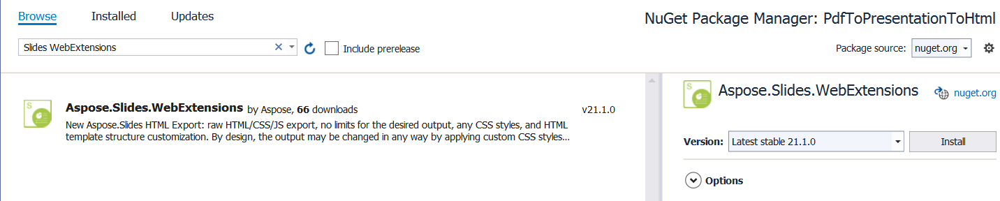

## Introduction

With the new version of WebExtensions system for exporting HTML PowerPoint presentations, you can now flexibly customize HTML exporting settings to get any result you need. In the previous Aspose.Slides API versions, the presentation document exported to HTML was represented as an SVG markup combined with HTML. Each slide was exported as an SVG container. However, the new WebExtensions version allows you to export the whole presentation into an HTML with a set of CSS classes and Javascript animations without using SVG.

The new WebExtensions version provides unlimited options and methods for configuring the resulting export. Here are some use cases of HTML documents generated with WebExtensions (based on different requirements):
* using custom CSS styles or animations; overriding the markup for certain types of shapes.  
* overriding the document structure, e.g., using custom navigation between pages.
* saving .html, .css, .js files into the folders with customized hierarchy, including specific file types in different folders. For example, exporting slides to a folder based on the section name.
* saving CSS and JS files into separate folders by default—and adding them to an HTML file. Images and embedded fonts are also saved into separate files. However, they can be embedded in a HTML file (in base64 format). You can save some part of the resources to the files and embed other resources into HTML as base64.

You can find examples of HTML export in the Aspose.Slides.WebExtensions project, published on GitHub. It contains two parts: "Examples\SinglePageApp" and "Examples\MultiPageApp". The other examples we used in this article can also be found in the GitHub repo.

## Templates

To further extend the capabilities of HTML export, we recommend you use the ASP.NET Razor template system. The instance of Presentation class (Aspose.Slides API) can be used alongside a set of templates to get an HTML document as the export result.
We can demonstrate the approach of using Aspose.Slides and WebExtensions. In this example, we will export text from presentation to HTML. First, let's create the template:

``` html
<!DOCTYPE html>
<body>
    @foreach (Slide slide in Model.Object.Slides)    
    {
        foreach (Shape shape in slide.Shapes)
        {
            if(shape is AutoShape)
            {
                ITextFrame textFrame = ((AutoShape)shape).TextFrame;
                <div class="text">@textFrame.Text</div>
            }
        }
    }
</body>
</html>
```
This template will be saved on the disk as "shape-template-hello-world.html", which will be used in the next step.

In this template, we are iterating text frames in presentation shapes to display the text. Let's generate the HTML file using WebDocument and then export the Presentation into the file: 

``` csharp
using (Presentation pres = new Presentation())
{
    IAutoShape shape = pres.Slides[0].Shapes.AddAutoShape(ShapeType.Rectangle, 10, 10, 100, 150);
    shape.TextFrame.Text = "Hello World";
                
    WebDocumentOptions options = new WebDocumentOptions
    {
        TemplateEngine = new RazorTemplateEngine(), // we will use Razor template engine, other template engines can be used by implementing ITemplateEngine  
        OutputSaver = new FileOutputSaver() // other result savers can be used by implementing IOutputSaver interface
    };
    WebDocument document = new WebDocument(options);

    // add document "input" - what source will be used to generate the HTML document
    document.Input
        .AddTemplate<Presentation>( // template will have Presentation as a "model" object (Model.Object) 
        "index", // template key - needed by template engine to match an object (Presentation) to the template loaded from disk ("shape-template-hello-world.html")  
        @"custom-templates\shape-template-hello-world.html"); // template we created earlier
                
    // add output - how the resulting HTML document will look like when it gets exported to the disk
    document.Output.Add(
        "hello-world.html", // output file path
        "index", // template key that will be used for this file (we set it in a previous statement)  
        pres); // an actual Model.Object instance 
                
    document.Save();
}
```

For example, we want to include CSS styles into the export to change the text color to red. Let's add the CSS template:

``` css
.text {
    color: red;
}
```

Now, we will add it into the input and output:

``` csharp
using (Presentation pres = new Presentation())
{
    IAutoShape shape = pres.Slides[0].Shapes.AddAutoShape(ShapeType.Rectangle, 10, 10, 100, 150);
    shape.TextFrame.Text = "Hello World";
                
    WebDocumentOptions options = new WebDocumentOptions { TemplateEngine = new RazorTemplateEngine(), OutputSaver = new FileOutputSaver() };
    WebDocument document = new WebDocument(options);

    document.Input.AddTemplate<Presentation>("index", @"custom-templates\shape-template-hello-world.html");
    document.Input.AddTemplate<Presentation>("styles", @"custom-templates\styles\shape-template-hello-world.css");
    document.Output.Add("hello-world.html", "index", pres); 
    document.Output.Add("hello-world.css", "styles", pres);
                
    document.Save();
}
```

Let's add the reference on the styles to the template and class "text":
``` html
<!DOCTYPE html>
<head>
    <link rel="stylesheet" type="text/css" href="hello-world.css" />
</head>
...
</html>
```

## Default Templates

WebExtensions include two sets of basic templates for exporting presentations:
* single-page: all presentation content is exported into one HTML file. All other resources (images, fonts, styles, etc.) are exported into separate files.
* multi-page: each presentation slide is exported into a separate HTML file. The default logic for exporting resources is the same as in a single page. 

PresentationExtensions class can be used to simplify a presentation export using templates. PresentationExtensions class includes a set of extension methods for Presentation class. To export a presentation into a single page, just include Aspose.Slides.WebExtensions namespace and call two methods. The first method, ToSinglePageWebDocument, creates a WebDocument instance. The second method saves the HTML document: 

``` csharp
using (Presentation pres = new Presentation("demo.pptx"))
{
    WebDocument document = pres.ToSinglePageWebDocument("templates\\single-page", @"single-page-output");
    document.Save();
}
```

ToSinglePageWebDocument method has two parameters: templates folder and export folder. 

To export presentation to a multi page, use the ToMultiPageWebDocument method with the same parameters:

``` csharp
using (Presentation pres = new Presentation("demo.pptx"))
{
    WebDocument document = pres.ToMultiPageWebDocument("templates\\multi-page", @"mutil-page-output");
    document.Save();
}
```

In WebExtensions, each template used for markup generation is bound to a key. The key can be used in templates. For example, in the @Include directive, you can insert a certain template to another one by the key.

We can demonstrate the procedure in the example of text portion template usage inside the paragraph template. You can find the example in the Aspose.Slides.WebExtensions project: [Templates\common\paragraph.html](https://github.com/aspose-slides/Aspose.Slides.WebExtensions/blob/main/Aspose.Slides.WebExtensions/Templates/common/paragraph.html). To draw the portions in a paragraph, we iterate them using the @foreach directive of Razor Engine:

``` html
@foreach (Portion portion in contextObject.Portions) 
{ 
    var subModel = Model.SubModel(portion);
    subModel.Local.Put("parentTextFrame", parentTextFrame);
    subModel.Local.Put("tableContent", tableContentFlag);
	@Raw(Include("portion", subModel).ToString().Replace(Environment.NewLine, ""));
}
```

Portion has its own template [portion.html](https://github.com/aspose-slides/Aspose.Slides.WebExtensions/blob/main/Aspose.Slides.WebExtensions/Templates/common/portion.html) and a model is generated for it. That model will be added to the output paragraph.html template:
``` html
@Raw(Include("portion", subModel).ToString().Replace(Environment.NewLine, ""));
```

For each shape type, we use a custom template, which is added to the general set of templates from the Aspose.Slides.WebExtensions project. Templates are combined in the ToSinglePageWebDocument and ToMultiPageWebDocument methods to provide a final result. These are common templates used in both single and multi-page:

-templates
+-common
  ¦ +-scripts: javascript scripts for slide transition animations, as instance.
  ¦ +-styles: common CSS styles.
  +-multi-page: index, menu, slide templates for the multi-page output.
  +-single-page: index, slide templates for single-page output.

You can find out how the common part is bound for all the templates in PresentationExtensions.AddCommonInputOutput method [here](https://github.com/aspose-slides/Aspose.Slides.WebExtensions/blob/main/Aspose.Slides.WebExtensions/PresentationExtensions.cs).

## Default Template Customization

You can modify any element in the template of the common model. For example, you may decide to change the table formatting styles but want all the other styles of the single page to stay unchanged

By default, Templates\common\table.html [ссылка] is used, and the table has the same appearance as the table in PowerPoint. Let's change the table formatting by using custom CSS styles:
``` css
.custom-table {
    border: 1px solid black;
}
.custom-table tr:nth-child(even) {background: #CCC}
.custom-table tr:nth-child(odd) {background: #ffb380}
```

We can create the same structure of input templates and output files (as it is generated) while calling PresentationExtensions.ToSinglePageWebDocument method. Let's add the ExportCustomTableStyles_AddCommonStructure method for that. The difference between this method and ToSinglePageWebDocument method—we do not need to add the standard template for the table and the main index page (it will be replaced to include the reference on the custom table styles):

``` csharp
private static void ExportCustomTableStyles_AddCommonStructure(
    Presentation pres, 
    WebDocument document,
    string templatesPath, 
    string outputPath, 
    bool embedImages)
{
    AddCommonStylesTemplates(document, templatesPath);
            
    document.Input.AddTemplate<Slide>("slide", Path.Combine(templatesPath, "slide.html"));
    document.Input.AddTemplate<AutoShape>("autoshape", Path.Combine(templatesPath, "autoshape.html"));
    document.Input.AddTemplate<TextFrame>("textframe", Path.Combine(templatesPath, "textframe.html"));
    document.Input.AddTemplate<Paragraph>("paragraph", Path.Combine(templatesPath, "paragraph.html"));
    document.Input.AddTemplate<Paragraph>("bullet", Path.Combine(templatesPath, "bullet.html"));
    document.Input.AddTemplate<Portion>("portion", Path.Combine(templatesPath, "portion.html"));
    document.Input.AddTemplate<VideoFrame>("videoframe", Path.Combine(templatesPath, "videoframe.html"));
    document.Input.AddTemplate<PictureFrame>("pictureframe", Path.Combine(templatesPath, "pictureframe.html")); ;
    document.Input.AddTemplate<Shape>("shape", Path.Combine(templatesPath, "shape.html"));

    AddSinglePageCommonOutput(pres, document, outputPath);
            
    AddResourcesOutput(pres, document, embedImages);
            
    AddScriptsOutput(document, templatesPath);
}
```

Let's add a custom template instead:

``` csharp
using (Presentation pres = new Presentation("table.pptx"))
{
    const string templatesPath = "templates\\single-page";
    const string outputPath = "custom-table-styles";
                
    var options = new WebDocumentOptions
    {
        TemplateEngine = new RazorTemplateEngine(),
        OutputSaver = new FileOutputSaver(),
        EmbedImages = false
    };

    // setup global document values
    WebDocument document = new WebDocument(options);
    SetupGlobals(document, options, outputPath);

    // add common structure (except table template)
    ExportCustomTableStyles_AddCommonStructure(pres, document, templatesPath, outputPath, options.EmbedImages);
                
    // add custom table template
    document.Input.AddTemplate<Table>("table", @"custom-templates\table-custom-style.html");
                
    // add custom table styles
    document.Input.AddTemplate<Presentation>("table-custom-style", @"custom-templates\styles\table-custom-style.css");
    document.Output.Add(Path.Combine(outputPath, "table-custom-style.css"), "table-custom-style", pres);
                
    // add custom index - it's just a copy of the standard "index.html", but includes a reference to "table-custom-style.css"
    document.Input.AddTemplate<Presentation>("index", @"custom-templates\index-table-custom-style.html");
                
    document.Save();
}
```

``` html
@model TemplateContext<Table>

@{
	Table contextObject = Model.Object;
	
	var origin = Model.Local.Get<Point>("origin");
	var positionStyle = string.Format("left: {0}px; top: {1}px; width: {2}px; height: {3}px;",
										(int)contextObject.X + origin.X,
										(int)contextObject.Y + origin.Y,
										(int)contextObject.Width,
										(int)contextObject.Height);
}

	<table class="table custom-table" style="@positionStyle">
	@for (int i = 0; i < contextObject.Rows.Count; i++)
	{
		var rowHeight = string.Format("height: {0}px", contextObject.Rows[i].Height);
		<tr style="@rowHeight">
		@for (int j = 0; j < contextObject.Columns.Count; j++)
		{
			var cell = contextObject[j, i];
			if (cell.FirstRowIndex ==  i && cell.FirstColumnIndex == j)
			{
				var spans = cell.IsMergedCell ? string.Format("rowspan=\"{0}\" colspan=\"{1}\"", cell.RowSpan, cell.ColSpan) : "";
				<td width="@cell.Width px" @Raw(spans)>
					@{
						for(int k = 0; k < cell.TextFrame.Paragraphs.Count; k++)
						{
							var para = (Paragraph)cell.TextFrame.Paragraphs[k];
						
							var subModel = Model.SubModel(para);
							double[] margins = new double[] { cell.MarginLeft, cell.MarginTop, cell.MarginRight, cell.MarginBottom };
							subModel.Local.Put("margins", margins);
							subModel.Local.Put("parent", cell.TextFrame);
							subModel.Local.Put("parentContainerSize", new SizeF((float)cell.Width, (float)cell.Height));
                            subModel.Local.Put("tableContent", true);
							
							@Include("paragraph", subModel)
						}
					}
				</td>
			}
		}
		</tr>
	}
</table>
```

**Note** that the custom table template was added with the same “table” key as the standard table. Thus, you can replace a certain default template without rewriting it. You can also use the templates from the default structure with the same keys. For example, you may use a standard paragraph template in the table template; you may also replace it with the key.
You can also use index.html to include the reference on custom table CSS styles into it: 

``` html
<!DOCTYPE html>    
    
<html     
    xmlns="http://www.w3.org/1999/xhtml"    
    xmlns:svg="http://www.w3.org/2000/svg"    
    xmlns:xlink="http://www.w3.org/1999/xlink">    
<head>    
     ...
    <link rel="stylesheet" type="text/css" href="table-custom-style.css" />
    ...
</head>    
<body>    
    ...
</body>
</html>
```

## Create Project from Scratch: Animated Slides Transitions

WebExtensions allows you to export presentations with animated slide transitions—you just need to set the AnimateTransitions property in WebDocumentOptions to true:

``` csharp
WebDocumentOptions options = new WebDocumentOptions
{
    // ... other options
    AnimateTransitions = true
};
```

Let's create a new project that uses Aspose.Slides and Aspose.Slides.WebExtensions for creating HTML-viewer for PDF with smooth animated page transitions. Here, we need to use the PDF import feature of Aspose.Slides.

Let's create a PdfToPresentationToHtml project and add the Aspose.Slides.WebExtensions NuGet package (the Aspose.Slides package will also be added as a dependency):


We start by importing the PDF document, which will be animated and exported into an HTML presentation:

``` csharp
using (Presentation pres = new Presentation())
{
    pres.Slides.RemoveAt(0);
    pres.Slides.AddFromPdf("sample.pdf");
}
```

Now, we can set up the animated slide transitions (each slide is the imported PDF page). We used 9 slides in the sample PDF document. Let's add slide transitions into each of them (demonstration while viewing HTML):

``` csharp
pres.Slides[0].SlideShowTransition.Type = TransitionType.Fade;
pres.Slides[1].SlideShowTransition.Type = TransitionType.RandomBar;
pres.Slides[2].SlideShowTransition.Type = TransitionType.Cover;
pres.Slides[3].SlideShowTransition.Type = TransitionType.Dissolve;
pres.Slides[4].SlideShowTransition.Type = TransitionType.Switch;
pres.Slides[5].SlideShowTransition.Type = TransitionType.Pan;
pres.Slides[6].SlideShowTransition.Type = TransitionType.Ferris;
pres.Slides[7].SlideShowTransition.Type = TransitionType.Pull;
pres.Slides[8].SlideShowTransition.Type = TransitionType.Plus;
```

Finally, let's export it to HTML by using WebDocument with the AnimateTransitions property set to true:

``` csharp
WebDocumentOptions options = new WebDocumentOptions
{
    TemplateEngine = new RazorTemplateEngine(),
    OutputSaver = new FileOutputSaver(),
    AnimateTransitions = true
};

WebDocument document = pres.ToSinglePageWebDocument(options, "templates\\single-page", "animated-pdf");
document.Save();
```

Full source code example:
``` csharp
using (Presentation pres = new Presentation())
{
    pres.Slides.RemoveAt(0);
    pres.Slides.AddFromPdf("sample.pdf");

    pres.Slides[0].SlideShowTransition.Type = TransitionType.Fade;
    pres.Slides[1].SlideShowTransition.Type = TransitionType.RandomBar;
    pres.Slides[2].SlideShowTransition.Type = TransitionType.Cover;
    pres.Slides[3].SlideShowTransition.Type = TransitionType.Dissolve;
    pres.Slides[4].SlideShowTransition.Type = TransitionType.Switch;
    pres.Slides[5].SlideShowTransition.Type = TransitionType.Pan;
    pres.Slides[6].SlideShowTransition.Type = TransitionType.Ferris;
    pres.Slides[7].SlideShowTransition.Type = TransitionType.Pull;
    pres.Slides[8].SlideShowTransition.Type = TransitionType.Plus;

    WebDocumentOptions options = new WebDocumentOptions
    {
        TemplateEngine = new RazorTemplateEngine(),
        OutputSaver = new FileOutputSaver(),
        AnimateTransitions = true
    };

    WebDocument document = pres.ToSinglePageWebDocument(options, "templates\\single-page", "animated-pdf");
    document.Save();
}
```

That's all you need to create an HTML with the animated page transitions generated from the PDF document. The sample HTML export can be downloaded [here](https://github.com/aspose-slides/Aspose.Slides.WebExtensions/tree/main/Examples) and the sample project [here (zip)](https://github.com/aspose-slides/Aspose.Slides-Documentation/raw/web-extensions/net/developer-guide/web-extensions/sample.zip).