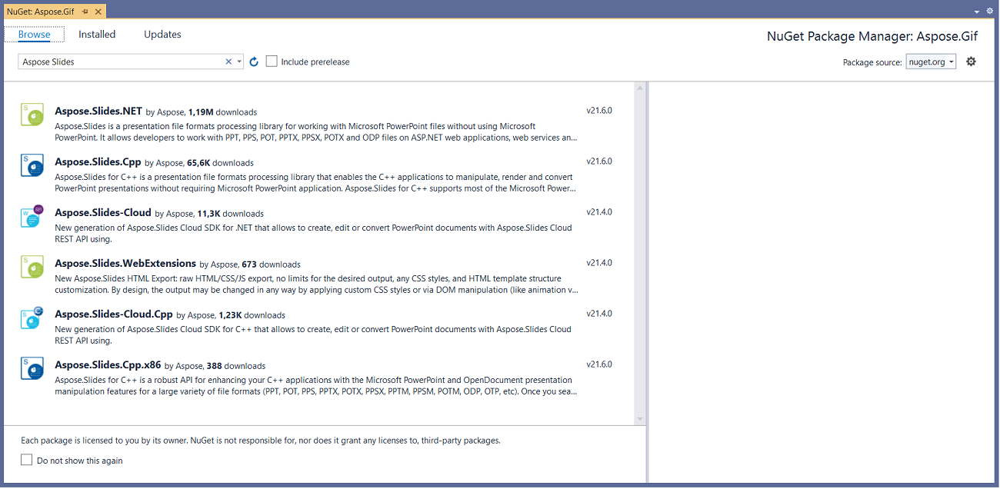
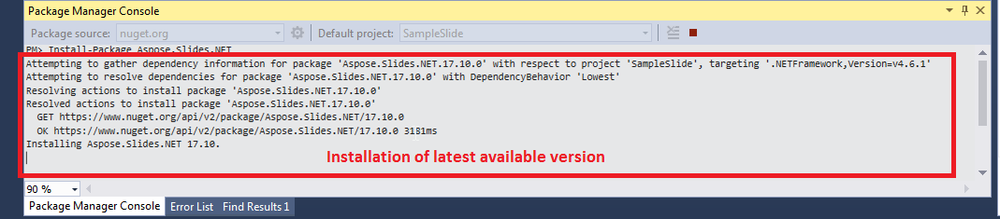

## **Installing Aspose.Slides for .NET through NuGet**
NuGet is the easiest way to download and install Aspose APIs for .NET. Open Microsoft Visual Studio and NuGet package manager. Search "aspose" to find the desired Aspose API. Click on "Install", the selected API will be downloaded and referenced in your project.

## **Install or Update Aspose.Slides using the Package Manager Console**
You can follow the steps below to reference the [Aspose.Slides API](https://www.nuget.org/packages/Aspose.Slides.NET/) using the package manager console:

1. Open your solution/project in Visual Studio.
1. Select Tools -> Library Package Manager -> Package Manager Console from the menu to open package manager console.

Type the command “**Install-Package Aspose.Slides.NET**” and press enter to install latest full release into your application. Alternatively you can add the "**-prerelease**" suffix to the command in order to specify that the latest release including hot fixes is to be installed as well.

You will see that the "Installing Aspose.Slides.NET" tip appears down the bottom of the window indicating that the download is process. 

Once downloaded you will see the following confirmation messages. If you are not familiar with the [Aspose EULA](http://www.aspose.com/corporate/purchase/end-user-license-agreement.aspx) then it is a good idea to read the license referenced in the URL. 

You should now find that Aspose.Slides has successfully been added and referenced in your application for you.

In the package manager console, you can also use the command “**Update-Package Aspose.Slides.NET**” and press enter to check for any updates to the Aspose.Slides package and install them if present. You can also add the "-prerelease" suffix to update latest release.
## **Considerations When Running on a Shared Server Environment**
All Aspose .NET components are recommended to run with Full Trust permission set. This is because Aspose .NET component sometimes need to access registry settings and files located in places other than the virtual directory e.g. for reading fonts etc. Furthermore, Aspose.NET components are based on core .NET system classes, some of which also require Full Trust permission to run in some cases.

Internet Service Providers hosting multiple applications from different companies mostly enforce Medium Trust security level. In the case of .NET 2.0, such a security level may set the following constraints which could affect the ability of Aspose.Words to perform properly.

- **RegistryPermission** is not available. This means you cannot access the registry, which is required to enumerate installed fonts when rendering documents.
- **FileIOPermission** is restricted. This means you can only access files in your application’s virtual directory hierarchy. This potentially means fonts cannot be read during export.

For these reasons specified above, it is recommended that Aspose.Slides is run on Full Trust permissions. You may find that some features of library will work when performing different tasks in Medium trust while some won't (rendering for example) which may due to calls to GDI+ image processing.
## **System Requirements**
Aspose.Slides for .NET does not need Microsoft PowerPoint installed, as Aspose.Slides itself is a Microsoft PowerPoint document creation, conversion, page layout and rendering engine.
### **Operating system**
- Microsoft Windows desktop (2000, 2003, XP, Vista, 7, 2008,2010)
- Linux
- Mac OS X
### **Supported Platforms**
Aspose.Slides for .NET supports

- Window forms
- Web forms
- Visual Studio 2005
- Visual Studio 2008
- Visual Studio 2010
- Visual Studio 2012
- Visual Studio 2013
- Visual Studio 2015
- Visual Studio 2017
- Visual Studio 2019
### **Supported Frameworks**
Aspose.Slides for .NET supports:

- .NET Framework version 2.0 or higher
- .NET Core
- COM Interop support (COM, C++, VBScript)
- MONO Support in MAC and UNiX platforms
