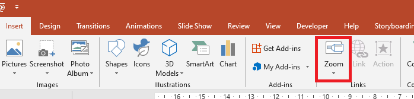

{} 

This page contains release notes for [Aspose.Slides for .NET 21.5](https://www.nuget.org/packages/Aspose.Slides.NET/)

{} 

|**Key**|**Summary**|**Category**|**Related Documentation**|
| :- | :- | :- | :- |
|SLIDESNET-40747|Support for reading autofit scale values|Feature|<https://docs.aspose.com/slides/net/shape-effective-properties/>
|SLIDESNET-42551|Custom PPT root directory entry object class GUID (CLSID)|Enhancement|<https://docs.aspose.com/slides/net/save-presentation/#save-presentation-to-file>
|SLIDESNET-42549|Size of the generated PDF in Aspose.Slides is much larger than in PowerPoint|Bug|<https://docs.aspose.com/slides/net/convert-powerpoint-ppt-and-pptx-to-pdf/>
|SLIDESNET-42546|Animation is broken after loading and saving PPT file|Bug|<https://docs.aspose.com/slides/net/save-presentation/ https://docs.aspose.com/slides/net/powerpoint-animation/>
|SLIDESNET-42543|Table borders are incorrect in cloned slide|Bug|<https://docs.aspose.com/slides/net/clone-slides/>
|SLIDESNET-42535|External URL from paragraph portion is incorrect|Bug|<https://docs.aspose.com/slides/net/manage-hyperlinks/>
|SLIDESNET-42525|Unknown load format for presentations|Bug|<https://docs.aspose.com/slides/net/presentation-format/>
|SLIDESNET-42523|The text is not displayed correctly when converting PPTX to SVG|Bug|<https://docs.aspose.com/slides/net/render-slide-as-svg-image/>
|SLIDESNET-42522|PPTX to PDF conversion fails in 3rd slide|Bug|<https://docs.aspose.com/slides/net/convert-powerpoint-ppt-and-pptx-to-pdf/>
|SLIDESNET-42510|Aspose.Slides giving false for two equal layout slides|Bug|<https://docs.aspose.com/slides/net/compare-slides/>
|SLIDESNET-42499|Converting PPT to PDF gets StackOverflowException|Bug|<https://docs.aspose.com/slides/net/convert-powerpoint-ppt-and-pptx-to-pdf/>
|SLIDESNET-42480|Aspose.Slides breaks OLE links in PPT files|Bug|<https://docs.aspose.com/slides/net/save-presentation/>
|SLIDESNET-42478|The time format is incorrect in a chart|Bug|<https://docs.aspose.com/slides/net/export-chart/>
|SLIDESNET-42470|OLE did not render image object on slide 2|Bug|<https://docs.aspose.com/slides/net/convert-slide/>
|SLIDESNET-42421|Font height of a text portion is wrong|Bug|<https://docs.aspose.com/slides/net/shape-effective-properties/>
|SLIDESNET-42419|PPT to PPT - The text is not displayed as expected in LibreOffice Impress|Bug|<https://docs.aspose.com/slides/net/save-presentation/>
|SLIDESNET-39958|Incorrect font size|Bug|<https://docs.aspose.com/slides/net/shape-effective-properties/>
|SLIDESNET-37268|Arabic text gets changed on rendering (one more case)|Bug|<https://docs.aspose.com/slides/net/convert-slide/>
|SLIDESNET-37172|Arabic Text rendered incorrectly in generated PDF|Bug|<https://docs.aspose.com/slides/net/convert-powerpoint-ppt-and-pptx-to-pdf/>
|SLIDESNET-36523|Wrong text wrapping in generated pdf|Bug|<https://docs.aspose.com/slides/net/convert-powerpoint-ppt-and-pptx-to-pdf/>

## Public API Changes ##

### .NETStandard 2.0 Support is obsolete ###

.NETStandard 2.0 Support is obsolete and will be replaced with .NETStandard 2.1 starting from 21.6 version of Aspose.Slides for .NET.

### Zoom support has been added ###

The main article about Zoom: [Manage Zoom](https://docs.aspose.com/slides/net/manage-zoom/)

When you create a zoom-in PowerPoint, you can jump to and from specific slides, sections, and portions of your presentation in an order you decide while you're presenting:



In Aspose.Slides, to provide the same Zoom object, enum [ZoomImageType](https://apireference.aspose.com/slides/net/aspose.slides/zoomimagetype), interface [IZoomFrame](https://apireference.aspose.com/slides/net/aspose.slides/izoomframe) and some additional new methods in [IShapeCollection ](https://apireference.aspose.com/slides/net/aspose.slides/ishapecollection) have been added.

== [ZoomImageType Enum](https://apireference.aspose.com/slides/net/aspose.slides/zoomimagetype) ==

The [ZoomImageType](https://apireference.aspose.com/slides/net/aspose.slides/zoomimagetype) determines whether the Zoom object is using the slide preview or a cover image.

Below is the definition of the [ZoomImageType](https://apireference.aspose.com/slides/net/aspose.slides/zoomimagetype) enum: 

``` csharp
public enum ZoomImageType
{
    /// <summary>
    /// Use the image of the slide or section.
    /// </summary>
    Preview = 1,

    /// <summary>
    /// Use a custom image.
    /// </summary>
    Cover = 2
}
``` csharp

#### [IZoomFrame Interface](https://apireference.aspose.com/slides/net/aspose.slides/izoomframe) ####

The [IZoomFrame](https://apireference.aspose.com/slides/net/aspose.slides/izoomframe) interface with the [ZoomFrame](https://apireference.aspose.com/slides/net/aspose.slides/zoomframe) implementation class has been added:

``` csharp
public interface IZoomFrame : IGraphicalObject
{
    /// <summary>
    /// Gets or sets the image type of a zoom object.
    /// Read/write <see cref="ZoomImageType"/>.
    /// Default value: Preview
    /// </summary>
    ZoomImageType ImageType { get; set; }

    /// <summary>
    /// Gets or sets the navigation behavior in slideshow.
    /// Read/write <see cref="bool"/>.
    /// Default value: false
    /// </summary>
    bool ReturnToParent { get; set; }

    /// <summary>
    /// Gets or sets the slide object that the Slide Zoom object links to.
    /// Read/write <see cref="ISlide"/>.
    /// </summary>
    ISlide TargetSlide { get; set; }

    /// <summary>
    /// Gets or sets value that specifies whether the Zoom will use the background of the destination slide.
    /// Read/write <see cref="bool"/>.
    /// Default value: true
    /// </summary>
    bool ShowBackground { get; set; }

    /// <summary>
    /// Gets or sets image for zoom object.
    /// Read/write <see cref="IPPImage"/>.
    /// </summary>
    IPPImage Image { get; set; }

    /// <summary>
    /// Gets or sets the duration of the transition between Zoom and slide.
    /// Read/write <see cref="float"/>.
    /// Default value: 1.0f
    /// </summary>
    float TransitionDuration { get; set; }
}
```

#### New methods in [IShapeCollection](https://apireference.aspose.com/slides/net/aspose.slides/ishapecollection) interface have been added ####

Next new methods create [ZoomFrame](https://apireference.aspose.com/slides/net/aspose.slides/izoomframe) objects:

``` csharp
/// <summary>
/// Adds a new Zoom object to the end of a collection.
/// </summary>
IZoomFrame AddZoomFrame(float x, float y, float width, float height, ISlide slide);

/// <summary>
/// Adds a new Zoom object to the end of a collection.
/// </summary>
IZoomFrame AddZoomFrame(float x, float y, float width, float height, ISlide slide, IPPImage image);

/// <summary>
/// Creates a new Zoom object and inserts it to a collection at the specified index.
/// </summary>
IZoomFrame InsertZoomFrame(int index, float x, float y, float width, float height, ISlide slide);

/// <summary>
/// Creates a new Zoom object and inserts it to a collection at the specified index.
/// </summary>
IZoomFrame InsertZoomFrame(int index, float x, float y, float width, float height, ISlide slide, IPPImage image);
```

#### Example ####

The example below demonstrates how to create [ZoomFrame](https://apireference.aspose.com/slides/net/aspose.slides/izoomframe) object with custom image and specified image frame:

``` csharp
using (Presentation pres = new Presentation())
{
    //Add a new slide to the presentation
    ISlide slide = pres.Slides.AddEmptySlide(pres.Slides[0].LayoutSlide);

    // Create a new image for zoom object
    IPPImage image = pres.Images.AddImage(Image.FromFile("image.png"));

    // Add ZoomFrame object
    IZoomFrame zoomFrame = pres.Slides[0].Shapes.AddZoomFrame(20, 20, 300, 200, slide, image);

    // Set zoom frame format
    zoomFrame.LineFormat.Width = 5;
    zoomFrame.LineFormat.FillFormat.FillType = FillType.Solid;
    zoomFrame.LineFormat.FillFormat.SolidFillColor.Color = Color.HotPink;
    zoomFrame.LineFormat.DashStyle = LineDashStyle.DashDot;

    // Save the presentation
    pres.Save("presentation.pptx", SaveFormat.Pptx);
}
```

### [IHyperlinkManager SetMacroHyperlinkClick](https://apireference.aspose.com/slides/net/aspose.slides/ihyperlinkmanager/methods/setmacrohyperlinkclick) method has been added ###

New method [SetMacroHyperlinkClick](https://apireference.aspose.com/slides/net/aspose.slides/ihyperlinkmanager/methods/setmacrohyperlinkclick) has been added to the [IHyperlinkManager](https://apireference.aspose.com/slides/net/aspose.slides/ihyperlinkmanager) interface and [HyperlinkManager](https://apireference.aspose.com/slides/net/aspose.slides/hyperlinkmanager) class.

The [SetMacroHyperlinkClick](https://apireference.aspose.com/slides/net/aspose.slides/ihyperlinkmanager/methods/setmacrohyperlinkclick) method is used to set macro hyperlink on a click for a shape.

Method declaration:

``` csharp
/// <summary>
/// Set Macro hyperlink on a click.
/// </summary>
/// <param name="macroName">Name of the macro</param>
/// <returns>Hyperlink object <see cref="IHyperlink"/></returns>
```

The code snippet below demonstrates how the [SetMacroHyperlinkClick](https://apireference.aspose.com/slides/net/aspose.slides/ihyperlinkmanager/methods/setmacrohyperlinkclick) method is used to set macro hyperlink click on a shape:

``` csharp
using (Presentation presentation = new Presentation())
{
    IAutoShape shape = presentation.Slides[0].Shapes.AddAutoShape(ShapeType.BlankButton, 20, 20, 80, 30);
    shape.HyperlinkManager.SetMacroHyperlinkClick("MacroName");
}
```

### [IPptOptions RootDirectoryClsid](https://apireference.aspose.com/slides/net/aspose.slides.export/ipptoptions/properties/rootdirectoryclsid) property has been added ###

New property [RootDirectoryClsid](https://apireference.aspose.com/slides/net/aspose.slides.export/ipptoptions/properties/rootdirectoryclsid) has been added to the [IPptOptions](https://apireference.aspose.com/slides/net/aspose.slides.export/ipptoptions) interface and [PptOptions](https://apireference.aspose.com/slides/net/aspose.slides.export/pptoptions) class.

The [RootDirectoryClsid](https://apireference.aspose.com/slides/net/aspose.slides.export/ipptoptions/properties/rootdirectoryclsid) property represents the object class GUID (CLSID) that is stored in the root directory entry. Can be used for COM activation of the document's application.

Property declaration:

``` csharp
/// <summary>
/// Represents the object class GUID (CLSID) that is stored in the root directory entry. Can be used for COM
/// activation of the document's application.
/// The default value is '64818D11-4F9B-11CF-86EA-00AA00B929E8' that corresponds to 'Microsoft Powerpoint.Slide.8'.
/// </summary>       
Guid RootDirectoryClsid { get; set; }
```

The code snippet below demonstrates how custom [RootDirectoryClsid](https://apireference.aspose.com/slides/net/aspose.slides.export/ipptoptions/properties/rootdirectoryclsid) can be set:

``` csharp
using (Presentation pres = new Presentation())
{
    PptOptions pptOptions = new PptOptions();
    
    // set CLSID to 'Microsoft Powerpoint.Show.8'
    pptOptions.RootDirectoryClsid = new Guid("64818D10-4F9B-11CF-86EA-00AA00B929E8");
    
    pres.Save("pres.ppt", SaveFormat.Ppt, pptOptions);
}
```