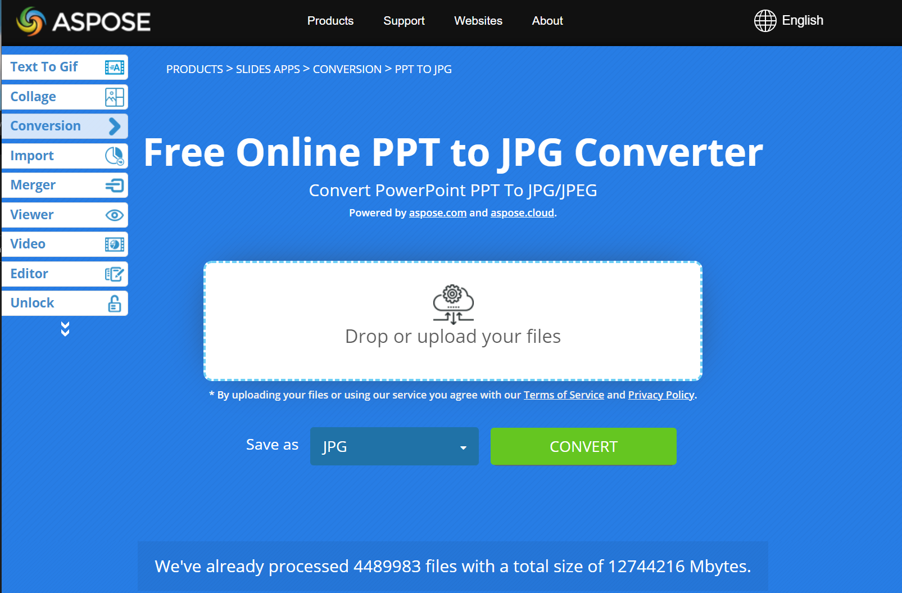

## **Inleiding**

Het omzetten van PowerPoint‑ en OpenDocument‑presentaties naar JPG‑afbeeldingen helpt bij het delen van dia’s, het optimaliseren van prestaties en het insluiten van inhoud in websites of applicaties. Aspose.Slides voor Android via Java stelt u in staat PPTX‑, PPT‑ en ODP‑bestanden om te zetten in JPEG‑afbeeldingen van hoge kwaliteit. Deze gids legt verschillende conversiemethoden uit.

Met deze functies is het eenvoudig om uw eigen presentatieweergave te implementeren en een miniatuur voor elke dia te maken. Dit kan handig zijn als u dia’s wilt beschermen tegen kopiëren of de presentatie in alleen‑lezen‑modus wilt tonen. Aspose.Slides stelt u in staat de volledige presentatie of een specifieke dia om te zetten naar afbeeldingsformaten.

## **Presentatiedia’s omzetten naar JPG‑afbeeldingen**

1. Maak een instantie van de [Presentation](https://reference.aspose.com/slides/nl/androidjava/com.aspose.slides/presentation/)-klasse aan.  
1. Haal het dia‑object van het type [ISlide](https://reference.aspose.com/slides/nl/androidjava/com.aspose.slides/islide/) op uit de collectie die wordt geretourneerd door de [Presentation.getSlides()](https://reference.aspose.com/slides/nl/androidjava/com.aspose.slides/presentation/#getSlides--)‑methode.  
1. Maak een afbeelding van de dia met behulp van de [ISlide.getImage(float,float)](https://reference.aspose.com/slides/nl/androidjava/com.aspose.slides/islide/#getImage-float-float-)-methode.  
1. Roep de [IImage.save(string,ImageFormat)](https://reference.aspose.com/slides/nl/androidjava/com.aspose.slides/iimage/#save-java.lang.String-int-)-methode aan op het afbeelding‑object. Geef de bestandsnaam van de uitvoer en het afbeeldingsformaat als argumenten door.  

{} 
**Opmerking:** Het converteren van PPT, PPTX of ODP naar JPG verschilt van conversie naar andere formaten in de Aspose.Slides Android via Java‑API. Voor andere formaten gebruikt u doorgaans de [IPresentation.save(String,SaveFormat,ISaveOptions)](https://reference.aspose.com/slides/nl/androidjava/com.aspose.slides/ipresentation/#save-java.lang.String-int-com.aspose.slides.ISaveOptions-)-methode. Voor JPG‑conversie moet u echter de [IImage.save(string,ImageFormat)](https://reference.aspose.com/slides/nl/androidjava/com.aspose.slides/iimage/#save-java.lang.String-int-)-methode gebruiken.  
{} 

```java
int scaleX = 1;
int scaleY = scaleX;

Presentation presentation = new Presentation("PowerPoint_Presentation.pptx");
try {
    for (ISlide slide : presentation.getSlides()) {
        // Maak een dia‑afbeelding met de opgegeven schaal.
        IImage slideImage = slide.getImage(scaleX, scaleY);

        try {
            // Sla de afbeelding op schijf op in JPEG‑formaat.
            String fileName = String.format("Slide_%d.jpg", slide.getSlideNumber());
            slideImage.save(fileName, ImageFormat.Jpeg);
        } finally {
            slideImage.dispose();
        }
    }
} finally {
    presentation.dispose();
}
```

## **Dia’s omzetten naar JPG met aangepaste afmetingen**

Om de afmetingen van de resulterende JPG‑afbeeldingen te wijzigen, kunt u de afbeeldingsgrootte instellen door deze door te geven aan de [ISlide.getImage(Size)](https://reference.aspose.com/slides/nl/androidjava/com.aspose.slides/islide/#getImage-com.aspose.slides.android.Size-)-methode. Hierdoor kunt u afbeeldingen genereren met specifieke breedte‑ en hoogte‑waarden, zodat de output voldoet aan uw eisen voor resolutie en beeldverhouding. Deze flexibiliteit is bijzonder nuttig bij het genereren van afbeeldingen voor webapplicaties, rapporten of documentatie, waarbij precieze afbeeldingsafmetingen vereist zijn.  

```java
Size imageSize = new Size(1200, 800);

Presentation presentation = new Presentation("PowerPoint_Presentation.pptx");
try {
    for (ISlide slide : presentation.getSlides()) {
        // Maak een dia‑afbeelding van de opgegeven grootte.
        IImage slideImage = slide.getImage(imageSize);

        try {
            // Sla de afbeelding op schijf op in JPEG‑formaat.
            String fileName = String.format("Slide_%d.jpg", slide.getSlideNumber());
            slideImage.save(fileName, ImageFormat.Jpeg);
        } finally {
            slideImage.dispose();
        }
    }
} finally {
    presentation.dispose();
}
```

## **Opmerkingen renderen bij het opslaan van dia’s als afbeeldingen**

Aspose.Slides voor Android via Java biedt een functie waarmee u opmerkingen op de dia’s van een presentatie kunt weergeven bij het omzetten naar JPG‑afbeeldingen. Deze functionaliteit is vooral handig om annotaties, feedback of discussies die door samenwerkers in PowerPoint‑presentaties zijn toegevoegd te behouden. Door deze optie in te schakelen, worden opmerkingen zichtbaar in de gegenereerde afbeeldingen, waardoor het eenvoudiger wordt om feedback te beoordelen en te delen zonder het oorspronkelijke presentatie‑bestand te openen.

Stel, we hebben een presentatiebestand "sample.pptx" met een dia die opmerkingen bevat:


De volgende Java‑code zet de dia om naar een JPG‑afbeelding terwijl de opmerkingen behouden blijven:

```java
int scaleX = 2;
int scaleY = scaleX;

Presentation presentation = new Presentation("sample.pptx");
try {
    NotesCommentsLayoutingOptions commentsOptions = new NotesCommentsLayoutingOptions();
    commentsOptions.setCommentsPosition(CommentsPositions.Right);
    commentsOptions.setCommentsAreaWidth(200);
    commentsOptions.setCommentsAreaColor(Color.rgb(255, 140, 0));

    IRenderingOptions options = new RenderingOptions();
    options.setSlidesLayoutOptions(commentsOptions);

    // Converteer de eerste dia naar een afbeelding.
    IImage slideImage = presentation.getSlides().get_Item(0).getImage(options, scaleX, scaleY);
    try {
        slideImage.save("Slide_1.jpg", ImageFormat.Jpeg);
    } finally {
        slideImage.dispose();
    }
} finally {
    presentation.dispose();
}
```

Het resultaat:


## **Zie ook**

- [PowerPoint omzetten naar GIF](/slides/nl/androidjava/convert-powerpoint-to-animated-gif/)
- [PowerPoint omzetten naar PNG](/slides/nl/androidjava/convert-powerpoint-to-png/)
- [PowerPoint omzetten naar TIFF](/slides/nl/androidjava/convert-powerpoint-to-tiff/)
- [PowerPoint omzetten naar SVG](/slides/nl/androidjava/render-a-slide-as-an-svg-image/)

{} 
Om te zien hoe Aspose.Slides PowerPoint‑presentaties naar JPG‑afbeeldingen converteert, probeer deze gratis online converters: PowerPoint [PPTX to JPG](https://products.aspose.app/slides/nl/conversion/pptx-to-jpg) en [PPT to JPG](https://products.aspose.app/slides/nl/conversion/ppt-to-jpg).  
{} 



{}

Aspose biedt een [GRATIS Collage‑webapp](https://products.aspose.app/slides/nl/collage). Met deze online dienst kunt u [JPG naar JPG](https://products.aspose.app/slides/nl/collage/jpg) of PNG naar PNG‑afbeeldingen samenvoegen, [foto‑rasters](https://products.aspose.app/slides/nl/collage/photo-grid) maken, enzovoort.  

Met dezelfde principes als in dit artikel kunt u afbeeldingen van het ene formaat naar het andere converteren. Voor meer informatie, zie deze pagina’s: converteer [afbeelding naar JPG](https://products.aspose.com/slides/nl/java/conversion/image-to-jpg/); converteer [JPG naar afbeelding](https://products.aspose.com/slides/nl/java/conversion/jpg-to-image/); converteer [JPG naar PNG](https://products.aspose.com/slides/nl/java/conversion/jpg-to-png/), converteer [PNG naar JPG](https://products.aspose.com/slides/nl/java/conversion/png-to-jpg/); converteer [PNG naar SVG](https://products.aspose.com/slides/nl/java/conversion/png-to-svg/), converteer [SVG naar PNG](https://products.aspose.com/slides/nl/java/conversion/svg-to-png/).  

{}

## **FAQ**

**Ondersteunt deze methode batch‑conversie?**  
Ja, Aspose.Slides ondersteunt batch‑conversie van meerdere dia’s naar JPG in één bewerking.

**Ondersteunt de conversie SmartArt, diagrammen en andere complexe objecten?**  
Ja, Aspose.Slides rendert alle inhoud, inclusief SmartArt, diagrammen, tabellen, vormen en meer. De rendernauwkeurigheid kan echter enigszins variëren ten opzichte van PowerPoint, vooral bij aangepaste of ontbrekende lettertypen.

**Zijn er beperkingen op het aantal dia’s dat verwerkt kan worden?**  
Aspose.Slides zelf legt geen strikte limieten op het aantal dia’s dat u kunt verwerken. U kunt echter een out‑of‑memory‑fout tegenkomen bij grote presentaties of afbeeldingen met hoge resolutie.