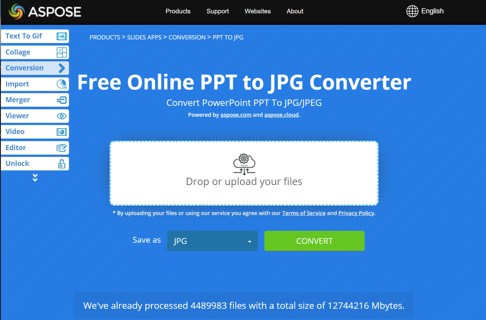

## **Inleiding**

Het converteren van PowerPoint- en OpenDocument‑presentaties naar JPG‑afbeeldingen helpt bij het delen van dia’s, het optimaliseren van de prestaties en het insluiten van inhoud in websites of applicaties. Aspose.Slides for Android via Java stelt u in staat om PPTX‑, PPT‑ en ODP‑bestanden om te zetten naar JPEG‑afbeeldingen van hoge kwaliteit. Deze gids legt verschillende methoden voor conversie uit.

Met deze functies is het eenvoudig om uw eigen presentatieweergave te implementeren en voor elke dia een miniatuur te maken. Dit kan nuttig zijn als u de dia’s wilt beschermen tegen kopiëren of de presentatie in alleen‑lezen‑modus wilt demonstreren. Aspose.Slides stelt u in staat om de volledige presentatie of een specifieke dia om te zetten naar afbeeldingsformaten.

## **Presentatiedia's converteren naar JPG‑afbeeldingen**

1. Maak een instantie van de [Presentation](https://reference.aspose.com/slides/nl/androidjava/com.aspose.slides/presentation/)‑klasse aan.  
1. Haal het dia‑object van het type [ISlide](https://reference.aspose.com/slides/nl/androidjava/com.aspose.slides/islide/) op uit de collectie die wordt geretourneerd door de methode [Presentation.getSlides()](https://reference.aspose.com/slides/nl/androidjava/com.aspose.slides/presentation/#getSlides--) .  
1. Maak een afbeelding van de dia met behulp van de methode [ISlide.getImage(float, float)](https://reference.aspose.com/slides/nl/androidjava/com.aspose.slides/islide/#getImage-float-float-) .  
1. Roep de methode [IImage.save(string, ImageFormat)](https://reference.aspose.com/slides/nl/androidjava/com.aspose.slides/iimage/#save-java.lang.String-int-) aan op het afbeeldingsobject. Geef de bestandsnaam voor de uitvoer en het afbeeldingsformaat door als argumenten.

{} 

**Opmerking:** Conversie van PPT, PPTX of ODP naar JPG verschilt van conversie naar andere formaten in de Aspose.Slides Android via Java‑API. Voor andere formaten gebruikt u doorgaans de methode [IPresentation.save(String, SaveFormat, ISaveOptions)](https://reference.aspose.com/slides/nl/androidjava/com.aspose.slides/ipresentation/#save-java.lang.String-int-com.aspose.slides.ISaveOptions-) . Voor JPG‑conversie moet u echter de methode [IImage.save(string, ImageFormat)](https://reference.aspose.com/slides/nl/androidjava/com.aspose.slides/iimage/#save-java.lang.String-int-) gebruiken.

{} 

```java
import com.aspose.slides.*;

int scaleX = 1;
int scaleY = scaleX;

Presentation presentation = new Presentation("PowerPoint_Presentation.pptx");
try {
    for (ISlide slide : presentation.getSlides()) {
        // Maak een dia‑afbeelding met de opgegeven schaal.
        IImage slideImage = slide.getImage(scaleX, scaleY);

        try {
            // Sla de afbeelding op schijf op in JPEG‑formaat.
            String fileName = String.format("Slide_%d.jpg", slide.getSlideNumber());
            slideImage.save(fileName, ImageFormat.Jpeg);
        } finally {
            slideImage.dispose();
        }
    }
} finally {
    presentation.dispose();
}
```

## **Dia's converteren naar JPG met aangepaste afmetingen**

Om de afmetingen van de gegenereerde JPG‑afbeeldingen te wijzigen, kunt u de afbeeldingsgrootte instellen door deze door te geven aan de methode [ISlide.getImage(Size)](https://reference.aspose.com/slides/nl/androidjava/com.aspose.slides/islide/#getImage-com.aspose.slides.android.Size-) . Hiermee kunt u afbeeldingen genereren met specifieke breedte‑ en hoogtewaarden, zodat de output voldoet aan uw eisen voor resolutie en beeldverhouding. Deze flexibiliteit is vooral nuttig bij het genereren van afbeeldingen voor webapplicaties, rapporten of documentatie, waar precieze afmetingen vereist zijn.

```java
import com.aspose.slides.*;
import com.aspose.slides.android.Size;

Size imageSize = new Size(1200, 800);

Presentation presentation = new Presentation("PowerPoint_Presentation.pptx");
try {
    for (ISlide slide : presentation.getSlides()) {
        // Maak een dia‑afbeelding met de opgegeven grootte.
        IImage slideImage = slide.getImage(imageSize);

        try {
            // Sla de afbeelding op schijf op in JPEG‑formaat.
            String fileName = String.format("Slide_%d.jpg", slide.getSlideNumber());
            slideImage.save(fileName, ImageFormat.Jpeg);
        } finally {
            slideImage.dispose();
        }
    }
} finally {
    presentation.dispose();
}
```

## **Opmerkingen renderen bij het opslaan van dia's als afbeeldingen**

Aspose.Slides for Android via Java biedt een functie waarmee u opmerkingen op de dia's van een presentatie kunt renderen bij het converteren naar JPG‑afbeeldingen. Deze functionaliteit is bijzonder handig om annotaties, feedback of discussies die door mede‑bewerkers aan PowerPoint‑presentaties zijn toegevoegd, te behouden. Door deze optie in te schakelen, worden opmerkingen zichtbaar in de gegenereerde afbeeldingen, waardoor het eenvoudiger wordt om feedback te beoordelen en te delen zonder het originele presentatie‑bestand te openen.

Stel dat we een presentatiebestand, "sample.pptx", hebben met een dia die opmerkingen bevat:


De volgende Java‑code zet de dia om naar een JPG‑afbeelding terwijl de opmerkingen behouden blijven:

```java
import com.aspose.slides.*;
import java.awt.Color;

int scaleX = 2;
int scaleY = scaleX;

Presentation presentation = new Presentation("sample.pptx");
try {
    NotesCommentsLayoutingOptions commentsOptions = new NotesCommentsLayoutingOptions();
    commentsOptions.setCommentsPosition(CommentsPositions.Right);
    commentsOptions.setCommentsAreaWidth(200);
    commentsOptions.setCommentsAreaColor(new Color(255, 140, 0));

    IRenderingOptions options = new RenderingOptions();
    options.setSlidesLayoutOptions(commentsOptions);

    // Converteer de eerste dia naar een afbeelding.
    IImage slideImage = presentation.getSlides().get_Item(0).getImage(options, scaleX, scaleY);
    try {
        slideImage.save("Slide_1.jpg", ImageFormat.Jpeg);
    } finally {
        slideImage.dispose();
    }
} finally {
    presentation.dispose();
}
```

Het resultaat:


## **Zie ook**

Bekijk andere opties om PPT, PPTX of ODP naar afbeeldingen te converteren, zoals:

- [PowerPoint converteren naar GIF](/slides/nl/androidjava/convert-powerpoint-to-animated-gif/)
- [PowerPoint converteren naar PNG](/slides/nl/androidjava/convert-powerpoint-to-png/)
- [PowerPoint converteren naar TIFF](/slides/nl/androidjava/convert-powerpoint-to-tiff/)
- [PowerPoint converteren naar SVG](/slides/nl/androidjava/render-a-slide-as-an-svg-image/)

{} 

Om te zien hoe Aspose.Slides PowerPoint‑presentaties naar JPG‑afbeeldingen converteert, probeer deze gratis online converters: PowerPoint [PPTX naar JPG](https://products.aspose.app/slides/nl/conversion/pptx-to-jpg) en [PPT naar JPG](https://products.aspose.app/slides/nl/conversion/ppt-to-jpg). 

{} 



{}

Aspose biedt een [GRATIS Collage‑webapp](https://products.aspose.app/slides/nl/collage). Met deze online service kunt u [JPG naar JPG](https://products.aspose.app/slides/nl/collage/jpg) of PNG naar PNG‑afbeeldingen samenvoegen, [fotogriepen](https://products.aspose.app/slides/nl/collage/photo-grid) maken, enzovoort. 

Met dezelfde principes die in dit artikel worden beschreven, kunt u afbeeldingen van het ene formaat naar het andere converteren. Zie voor meer informatie de volgende pagina's: converteer [afbeelding naar JPG](https://products.aspose.com/slides/nl/java/conversion/image-to-jpg/); converteer [JPG naar afbeelding](https://products.aspose.com/slides/nl/java/conversion/jpg-to-image/); converteer [JPG naar PNG](https://products.aspose.com/slides/nl/java/conversion/jpg-to-png/), converteer [PNG naar JPG](https://products.aspose.com/slides/nl/java/conversion/png-to-jpg/); converteer [PNG naar SVG](https://products.aspose.com/slides/nl/java/conversion/png-to-svg/), converteer [SVG naar PNG](https://products.aspose.com/slides/nl/java/conversion/svg-to-png/).

{}

## **FAQ**

### Ondersteunt deze methode batch‑conversie?

Ja, Aspose.Slides ondersteunt batch‑conversie van meerdere dia’s naar JPG in één bewerking.

### Ondersteunt de conversie SmartArt, diagrammen en andere complexe objecten?

Ja, Aspose.Slides rendert alle inhoud, inclusief SmartArt, diagrammen, tabellen, vormen en meer. De weergave‑nauwkeurigheid kan echter iets afwijken van PowerPoint, vooral bij het gebruik van aangepaste of ontbrekende lettertypen.

### Zijn er limieten voor het aantal dia's dat verwerkt kan worden?

Aspose.Slides zelf legt geen strikte limieten op aan het aantal dia’s dat u kunt verwerken. Het kan echter gebeuren dat u een out‑of‑memory‑fout krijgt bij het werken met grote presentaties of afbeeldingen met een hoge resolutie.