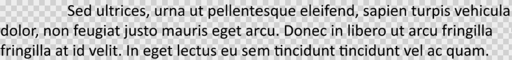

## **Overzicht**

Aspose.Slides voor Android via Java stelt tekst voor als een hiërarchie van tekstframes, alinea's en delen:

* [ITextFrame](https://reference.aspose.com/slides/androidjava/com.aspose.slides/itextframe/) vertegenwoordigt de tekstcontainer in een vorm en biedt toegang tot de alinea‑collectie.
* [IParagraph](https://reference.aspose.com/slides/androidjava/com.aspose.slides/iparagraph/) vertegenwoordigt één alinea in een tekstframe en biedt toegang tot de delen en de opmaak op alinea‑niveau.
* [IPortion](https://reference.aspose.com/slides/androidjava/com.aspose.slides/iportion/) vertegenwoordigt een tekstrun binnen een alinea. Elk deel kan zijn eigen tekst en teken‑niveau opmaak hebben.

Een alinea kan daarom tekst bevatten met verschillende lettertypen, kleuren, groottes en andere opmaak door meerdere delen te gebruiken.

## **Alinea's maken en opmaken**

### **Alinea's maken met meerdere delen**

De volgende stappen maken een tekstframe met drie alinea's, elk met drie delen:

1. Maak een instantie van de [Presentation](https://reference.aspose.com/slides/androidjava/com.aspose.slides/presentation/) klasse.
2. Toegang tot de relevante dia via de index.
3. Voeg een rechthoekige [IAutoShape](https://reference.aspose.com/slides/androidjava/com.aspose.slides/iautoshape/) toe aan de dia.
4. Toegang tot de [ITextFrame](https://reference.aspose.com/slides/androidjava/com.aspose.slides/itextframe/) van de vorm.
5. Gebruik de standaard alinea en voeg twee extra [IParagraph](https://reference.aspose.com/slides/androidjava/com.aspose.slides/iparagraph/) objecten toe aan het tekstframe.
6. Voeg voldoende [IPortion](https://reference.aspose.com/slides/androidjava/com.aspose.slides/iportion/) objecten toe zodat elke alinea drie delen bevat. De standaard alinea bevat al één leeg deel.
7. Stel de tekst van elk deel in.
8. Pas teken‑niveau opmaak toe via [IPortion.getPortionFormat](https://reference.aspose.com/slides/androidjava/com.aspose.slides/iportion/#getPortionFormat--).
9. Sla de gewijzigde presentatie op.

Dit Android‑via‑Java‑voorbeeld implementeert de stappen:

```java
import com.aspose.slides.*;
import android.graphics.Color;

Presentation presentation = new Presentation();
try {
    ISlide slide = presentation.getSlides().get_Item(0);
    IAutoShape shape = slide.getShapes().addAutoShape(ShapeType.Rectangle, 50, 150, 300, 150);
    ITextFrame textFrame = shape.getTextFrame();

    IParagraph firstParagraph = textFrame.getParagraphs().get_Item(0);
    firstParagraph.getPortions().add(new Portion());
    firstParagraph.getPortions().add(new Portion());

    IParagraph secondParagraph = new Paragraph();
    secondParagraph.getPortions().add(new Portion());
    secondParagraph.getPortions().add(new Portion());
    secondParagraph.getPortions().add(new Portion());
    textFrame.getParagraphs().add(secondParagraph);

    IParagraph thirdParagraph = new Paragraph();
    thirdParagraph.getPortions().add(new Portion());
    thirdParagraph.getPortions().add(new Portion());
    thirdParagraph.getPortions().add(new Portion());
    textFrame.getParagraphs().add(thirdParagraph);

    int paragraphCount = textFrame.getParagraphs().getCount();
    for (int paragraphIndex = 0; paragraphIndex < paragraphCount; paragraphIndex++) {
        IParagraph paragraph = textFrame.getParagraphs().get_Item(paragraphIndex);
        int portionCount = paragraph.getPortions().getCount();
        for (int portionIndex = 0; portionIndex < portionCount; portionIndex++) {
            IPortion portion = paragraph.getPortions().get_Item(portionIndex);
            portion.setText("Portion " + (paragraphIndex + 1) + "." + (portionIndex + 1));

            if (portionIndex == 0) {
                portion.getPortionFormat().getFillFormat().setFillType(FillType.Solid);
                portion.getPortionFormat().getFillFormat().getSolidFillColor().setColor(Color.RED);
                portion.getPortionFormat().setFontBold(NullableBool.True);
                portion.getPortionFormat().setFontHeight(15);
            } else if (portionIndex == 1) {
                portion.getPortionFormat().getFillFormat().setFillType(FillType.Solid);
                portion.getPortionFormat().getFillFormat().getSolidFillColor().setColor(Color.BLUE);
                portion.getPortionFormat().setFontItalic(NullableBool.True);
                portion.getPortionFormat().setFontHeight(18);
            }
        }
    }

    presentation.save("paragraphs_with_portions.pptx", SaveFormat.Pptx);
} finally {
    presentation.dispose();
}
```

## **Maken van opsommingstekens en genummerde lijsten**

### **Een opsomming of genummerde lijst maken**

Opsommingstekens en nummering maken verwante items gemakkelijker scanbaar. In Aspose.Slides worden lijstinstellingen gedefinieerd via [IBulletFormat](https://reference.aspose.com/slides/androidjava/com.aspose.slides/ibulletformat/).

1. Maak een instantie van de [Presentation](https://reference.aspose.com/slides/androidjava/com.aspose.slides/presentation/) klasse.
2. Toegang tot de relevante dia via de index.
3. Voeg een [IAutoShape](https://reference.aspose.com/slides/androidjava/com.aspose.slides/iautoshape/) toe aan de geselecteerde dia.
4. Toegang tot de [ITextFrame](https://reference.aspose.com/slides/androidjava/com.aspose.slides/itextframe/) van de vorm.
5. Verwijder de standaard alinea uit het tekstframe.
6. Maak een [Paragraph](https://reference.aspose.com/slides/androidjava/com.aspose.slides/paragraph/) voor een symbool‑opsommingsteken.
7. Stel [IBulletFormat.setType](https://reference.aspose.com/slides/androidjava/com.aspose.slides/ibulletformat/#setType-int-) in op [BulletType.Symbol](https://reference.aspose.com/slides/androidjava/com.aspose.slides/bullettype/) en geef het opsommingsteken‑karakter op.
8. Stel de alinea‑tekst, inspringing, opsommingsteken‑kleur en -hoogte in.
9. Voeg de alinea toe aan het tekstframe.
10. Maak een tweede alinea en stel [IBulletFormat.setType](https://reference.aspose.com/slides/androidjava/com.aspose.slides/ibulletformat/#setType-int-) in op [BulletType.Numbered](https://reference.aspose.com/slides/androidjava/com.aspose.slides/bullettype/).
11. Configureer de stijl van het genummerde opsommingsteken en voeg de alinea toe aan het tekstframe.
12. Sla de presentatie op.

Dit Android‑via‑Java‑voorbeeld maakt een symbool‑opsommingsteken en een genummerd opsommingsteken:

```java
import com.aspose.slides.*;
import android.graphics.Color;

Presentation presentation = new Presentation();
try {
    ISlide slide = presentation.getSlides().get_Item(0);
    IAutoShape shape = slide.getShapes().addAutoShape(ShapeType.Rectangle, 200, 200, 400, 200);
    ITextFrame textFrame = shape.getTextFrame();
    textFrame.getParagraphs().clear();

    Paragraph symbolParagraph = new Paragraph();
    symbolParagraph.setText("Welcome to Aspose.Slides");
    symbolParagraph.getParagraphFormat().getBullet().setType(BulletType.Symbol);
    symbolParagraph.getParagraphFormat().getBullet().setChar((char) 0x2022);
    symbolParagraph.getParagraphFormat().setIndent(25);
    symbolParagraph.getParagraphFormat().getBullet().getColor().setColorType(ColorType.RGB);
    symbolParagraph.getParagraphFormat().getBullet().getColor().setColor(Color.BLACK);
    symbolParagraph.getParagraphFormat().getBullet().setBulletHardColor(NullableBool.True);
    symbolParagraph.getParagraphFormat().getBullet().setHeight(100);
    textFrame.getParagraphs().add(symbolParagraph);

    Paragraph numberedParagraph = new Paragraph();
    numberedParagraph.setText("This is a numbered item");
    numberedParagraph.getParagraphFormat().getBullet().setType(BulletType.Numbered);
    numberedParagraph.getParagraphFormat().getBullet().setNumberedBulletStyle(NumberedBulletStyle.BulletCircleNumWDBlackPlain);
    numberedParagraph.getParagraphFormat().setIndent(25);
    numberedParagraph.getParagraphFormat().getBullet().getColor().setColorType(ColorType.RGB);
    numberedParagraph.getParagraphFormat().getBullet().getColor().setColor(Color.BLACK);
    numberedParagraph.getParagraphFormat().getBullet().setBulletHardColor(NullableBool.True);
    numberedParagraph.getParagraphFormat().getBullet().setHeight(100);
    textFrame.getParagraphs().add(numberedParagraph);

    presentation.save("bulleted_and_numbered_list.pptx", SaveFormat.Pptx);
} finally {
    presentation.dispose();
}
```

### **Afbeeldings‑opsommingstekens gebruiken**

Afbeeldings‑opsommingstekens laten u een aangepaste afbeelding gebruiken in plaats van een symbool of cijfer.

1. Maak een instantie van de [Presentation](https://reference.aspose.com/slides/androidjava/com.aspose.slides/presentation/) klasse.
2. Toegang tot de relevante dia via de index.
3. Voeg een [IAutoShape](https://reference.aspose.com/slides/androidjava/com.aspose.slides/iautoshape/) toe en krijg toegang tot de [ITextFrame](https://reference.aspose.com/slides/androidjava/com.aspose.slides/itextframe/).
4. Verwijder de standaard alinea uit het tekstframe.
5. Laad de opsommingsteken‑afbeelding en voeg deze toe aan de afbeeldingscollectie van de presentatie als een [IPPImage](https://reference.aspose.com/slides/androidjava/com.aspose.slides/ippimage/).
6. Maak een [Paragraph](https://reference.aspose.com/slides/androidjava/com.aspose.slides/paragraph/) en stel de tekst in.
7. Stel [IBulletFormat.setType](https://reference.aspose.com/slides/androidjava/com.aspose.slides/ibulletformat/#setType-int-) in op [BulletType.Picture](https://reference.aspose.com/slides/androidjava/com.aspose.slides/bullettype/).
8. Koppel de afbeelding via [IBulletFormat.getPicture](https://reference.aspose.com/slides/androidjava/com.aspose.slides/ibulletformat/#getPicture--) en stel de hoogte van het opsommingsteken in.
9. Voeg de alinea toe aan het tekstframe.
10. Sla de gewijzigde presentatie op.

Dit Android‑via‑Java‑voorbeeld maakt een afbeelding‑opsommingsteken:

```java
import com.aspose.slides.*;

Presentation presentation = new Presentation();
try {
    ISlide slide = presentation.getSlides().get_Item(0);

    IImage bulletImage = Images.fromFile("bullets.png");
    IPPImage presentationImage;
    try {
        presentationImage = presentation.getImages().addImage(bulletImage);
    } finally {
        bulletImage.dispose();
    }

    IAutoShape shape = slide.getShapes().addAutoShape(ShapeType.Rectangle, 200, 200, 400, 200);
    ITextFrame textFrame = shape.getTextFrame();
    textFrame.getParagraphs().clear();

    Paragraph paragraph = new Paragraph();
    paragraph.setText("Welcome to Aspose.Slides");
    paragraph.getParagraphFormat().getBullet().setType(BulletType.Picture);
    paragraph.getParagraphFormat().getBullet().getPicture().setImage(presentationImage);
    paragraph.getParagraphFormat().getBullet().setHeight(100);
    textFrame.getParagraphs().add(paragraph);

    presentation.save("picture_bullet.pptx", SaveFormat.Pptx);
    presentation.save("picture_bullet.ppt", SaveFormat.Ppt);
} finally {
    presentation.dispose();
}
```

### **Een meerlagige lijst maken**

Stel [IParagraphFormat.setDepth](https://reference.aspose.com/slides/androidjava/com.aspose.slides/iparagraphformat/#setDepth-short-) in om alinea's op verschillende niveaus van een lijst te plaatsen. Het hoogste niveau heeft een diepte van `0`.

1. Maak een [Presentation](https://reference.aspose.com/slides/androidjava/com.aspose.slides/presentation/) en krijg toegang tot een dia.
2. Voeg een [IAutoShape](https://reference.aspose.com/slides/androidjava/com.aspose.slides/iautoshape/) toe en verwijder de standaard alinea uit het tekstframe.
3. Maak vier alinea's en configureer hun opsommingsteken‑symbolen.
4. Stel hun [IParagraphFormat.setDepth](https://reference.aspose.com/slides/androidjava/com.aspose.slides/iparagraphformat/#setDepth-short-) waarden in op `0`, `1`, `2` en `3`.
5. Voeg de alinea's toe aan het tekstframe en sla de presentatie op.

Dit Android‑via‑Java‑voorbeeld maakt een vier‑niveau opsomminglijst:

```java
import com.aspose.slides.*;
import android.graphics.Color;

Presentation presentation = new Presentation();
try {
    ISlide slide = presentation.getSlides().get_Item(0);
    IAutoShape shape = slide.getShapes().addAutoShape(ShapeType.Rectangle, 200, 200, 400, 200);
    ITextFrame textFrame = shape.getTextFrame();
    textFrame.getParagraphs().clear();

    IParagraph firstParagraph = new Paragraph();
    firstParagraph.setText("Content");
    firstParagraph.getParagraphFormat().getBullet().setType(BulletType.Symbol);
    firstParagraph.getParagraphFormat().getBullet().setChar((char) 0x2022);
    firstParagraph.getParagraphFormat().getDefaultPortionFormat().getFillFormat().setFillType(FillType.Solid);
    firstParagraph.getParagraphFormat().getDefaultPortionFormat().getFillFormat().getSolidFillColor().setColor(Color.BLACK);
    firstParagraph.getParagraphFormat().setDepth((short) 0);

    IParagraph secondParagraph = new Paragraph();
    secondParagraph.setText("Second level");
    secondParagraph.getParagraphFormat().getBullet().setType(BulletType.Symbol);
    secondParagraph.getParagraphFormat().getBullet().setChar('-');
    secondParagraph.getParagraphFormat().getDefaultPortionFormat().getFillFormat().setFillType(FillType.Solid);
    secondParagraph.getParagraphFormat().getDefaultPortionFormat().getFillFormat().getSolidFillColor().setColor(Color.BLACK);
    secondParagraph.getParagraphFormat().setDepth((short) 1);

    IParagraph thirdParagraph = new Paragraph();
    thirdParagraph.setText("Third level");
    thirdParagraph.getParagraphFormat().getBullet().setType(BulletType.Symbol);
    thirdParagraph.getParagraphFormat().getBullet().setChar((char) 0x2022);
    thirdParagraph.getParagraphFormat().getDefaultPortionFormat().getFillFormat().setFillType(FillType.Solid);
    thirdParagraph.getParagraphFormat().getDefaultPortionFormat().getFillFormat().getSolidFillColor().setColor(Color.BLACK);
    thirdParagraph.getParagraphFormat().setDepth((short) 2);

    IParagraph fourthParagraph = new Paragraph();
    fourthParagraph.setText("Fourth level");
    fourthParagraph.getParagraphFormat().getBullet().setType(BulletType.Symbol);
    fourthParagraph.getParagraphFormat().getBullet().setChar('-');
    fourthParagraph.getParagraphFormat().getDefaultPortionFormat().getFillFormat().setFillType(FillType.Solid);
    fourthParagraph.getParagraphFormat().getDefaultPortionFormat().getFillFormat().getSolidFillColor().setColor(Color.BLACK);
    fourthParagraph.getParagraphFormat().setDepth((short) 3);

    textFrame.getParagraphs().add(firstParagraph);
    textFrame.getParagraphs().add(secondParagraph);
    textFrame.getParagraphs().add(thirdParagraph);
    textFrame.getParagraphs().add(fourthParagraph);

    presentation.save("multilevel_list.pptx", SaveFormat.Pptx);
} finally {
    presentation.dispose();
}
```

### **Genummerde lijstitems starten met aangepaste waarden**

Gebruik [IBulletFormat.setNumberedBulletStartWith](https://reference.aspose.com/slides/androidjava/com.aspose.slides/ibulletformat/#setNumberedBulletStartWith-short-) om het beginnummer in te stellen dat wordt weergegeven voor een genummerde alinea.

1. Maak een [Presentation](https://reference.aspose.com/slides/androidjava/com.aspose.slides/presentation/) en voeg een [IAutoShape](https://reference.aspose.com/slides/androidjava/com.aspose.slides/iautoshape/) toe aan een dia.
2. Verwijder de standaard alinea uit het tekstframe van de vorm.
3. Maak drie genummerde alinea's.
4. Stel [IBulletFormat.setNumberedBulletStartWith](https://reference.aspose.com/slides/androidjava/com.aspose.slides/ibulletformat/#setNumberedBulletStartWith-short-) in op `2`, `3` en `7` voor de respectieve alinea's.
5. Voeg de alinea's toe aan het tekstframe en sla de presentatie op.

Dit Android‑via‑Java‑voorbeeld kent een aangepast beginnummer toe aan elke alinea:

```java
import com.aspose.slides.*;

Presentation presentation = new Presentation();
try {
    ISlide slide = presentation.getSlides().get_Item(0);
    IAutoShape shape = slide.getShapes().addAutoShape(ShapeType.Rectangle, 200, 200, 400, 200);
    ITextFrame textFrame = shape.getTextFrame();
    textFrame.getParagraphs().clear();

    Paragraph firstParagraph = new Paragraph();
    firstParagraph.setText("Start at 2");
    firstParagraph.getParagraphFormat().getBullet().setType(BulletType.Numbered);
    firstParagraph.getParagraphFormat().getBullet().setNumberedBulletStartWith((short) 2);
    textFrame.getParagraphs().add(firstParagraph);

    Paragraph secondParagraph = new Paragraph();
    secondParagraph.setText("Start at 3");
    secondParagraph.getParagraphFormat().getBullet().setType(BulletType.Numbered);
    secondParagraph.getParagraphFormat().getBullet().setNumberedBulletStartWith((short) 3);
    textFrame.getParagraphs().add(secondParagraph);

    Paragraph thirdParagraph = new Paragraph();
    thirdParagraph.setText("Start at 7");
    thirdParagraph.getParagraphFormat().getBullet().setType(BulletType.Numbered);
    thirdParagraph.getParagraphFormat().getBullet().setNumberedBulletStartWith((short) 7);
    textFrame.getParagraphs().add(thirdParagraph);

    presentation.save("custom_numbered_list.pptx", SaveFormat.Pptx);
} finally {
    presentation.dispose();
}
```

## **Alinea‑indeling en eind‑eigenschappen beheren**

### **Eerste‑lijninsprong instellen**

Gebruik [IParagraphFormat.setIndent](https://reference.aspose.com/slides/androidjava/com.aspose.slides/iparagraphformat/#setIndent-float-) om de eerste‑lijninsprong van een alinea te regelen. Deze methode verplaatst alleen de eerste regel ten opzichte van de linkermarge van de alinea. Een positieve waarde verschuift de eerste regel naar rechts, terwijl de overige regels uitgelijnd blijven met de alinea‑inhoud.

Gebruik [IParagraphFormat.setMarginLeft](https://reference.aspose.com/slides/androidjava/com.aspose.slides/iparagraphformat/#setMarginLeft-float-) wanneer u de hele alinea moet verplaatsen. Gebruik [IParagraphFormat.setIndent](https://reference.aspose.com/slides/androidjava/com.aspose.slides/iparagraphformat/#setIndent-float-) wanneer u alleen de eerste regel moet verplaatsen.

Het onderstaande voorbeeld maakt meerdere alinea's en past verschillende [IParagraphFormat.setIndent](https://reference.aspose.com/slides/androidjava/com.aspose.slides/iparagraphformat/#setIndent-float-) waarden toe om te demonstreren hoe de eerste‑lijninsprong de alinea‑indeling beïnvloedt.

1. Maak een instantie van de [Presentation](https://reference.aspose.com/slides/androidjava/com.aspose.slides/presentation/) klasse.
2. Toegang tot de doel‑dia.
3. Voeg een rechthoekige [IAutoShape](https://reference.aspose.com/slides/androidjava/com.aspose.slides/iautoshape/) toe aan de dia.
4. Toegang tot de [ITextFrame](https://reference.aspose.com/slides/androidjava/com.aspose.slides/itextframe/) van de vorm en verwijder de standaard alinea.
5. Maak verschillende alinea's en stel verschillende [IParagraphFormat.setIndent](https://reference.aspose.com/slides/androidjava/com.aspose.slides/iparagraphformat/#setIndent-float-) waarden in voor hen.
6. Voeg de alinea's toe aan het tekstframe.
7. Sla de gewijzigde presentatie op.

Deze code toont hoe u een alinea‑insprong instelt:

```java
import com.aspose.slides.*;
import android.graphics.Color;

Presentation presentation = new Presentation();
try {
    ISlide slide = presentation.getSlides().get_Item(0);

    IAutoShape shape = slide.getShapes().addAutoShape(ShapeType.Rectangle, 50, 50, 420, 220);
    shape.getFillFormat().setFillType(FillType.NoFill);
    shape.getLineFormat().getFillFormat().setFillType(FillType.Solid);
    shape.getLineFormat().getFillFormat().getSolidFillColor().setColor(Color.GRAY);

    ITextFrame textFrame = shape.getTextFrame();
    textFrame.getTextFrameFormat().setAutofitType(TextAutofitType.Shape);
    textFrame.getParagraphs().clear();

    Paragraph firstParagraph = new Paragraph();
    firstParagraph.setText("No first-line indent. Wrapped lines start at the same position as the first line.");
    firstParagraph.getParagraphFormat().getDefaultPortionFormat().getFillFormat().setFillType(FillType.Solid);
    firstParagraph.getParagraphFormat().getDefaultPortionFormat().getFillFormat().getSolidFillColor().setColor(Color.BLACK);
    firstParagraph.getParagraphFormat().setMarginLeft(20f);
    firstParagraph.getParagraphFormat().setIndent(0f);

    Paragraph secondParagraph = new Paragraph();
    secondParagraph.setText("First-line indent of 20 points. The first line moves to the right, while wrapped lines remain aligned to the paragraph body.");
    secondParagraph.getParagraphFormat().getDefaultPortionFormat().getFillFormat().setFillType(FillType.Solid);
    secondParagraph.getParagraphFormat().getDefaultPortionFormat().getFillFormat().getSolidFillColor().setColor(Color.BLACK);
    secondParagraph.getParagraphFormat().setMarginLeft(20f);
    secondParagraph.getParagraphFormat().setIndent(20f);

    Paragraph thirdParagraph = new Paragraph();
    thirdParagraph.setText("First-line indent of 40 points. This paragraph shows a larger first-line offset to make the effect easier to see.");
    thirdParagraph.getParagraphFormat().getDefaultPortionFormat().getFillFormat().setFillType(FillType.Solid);
    thirdParagraph.getParagraphFormat().getDefaultPortionFormat().getFillFormat().getSolidFillColor().setColor(Color.BLACK);
    thirdParagraph.getParagraphFormat().setMarginLeft(20f);
    thirdParagraph.getParagraphFormat().setIndent(40f);

    textFrame.getParagraphs().add(firstParagraph);
    textFrame.getParagraphs().add(secondParagraph);
    textFrame.getParagraphs().add(thirdParagraph);

    presentation.save("paragraph_indent.pptx", SaveFormat.Pptx);
} finally {
    presentation.dispose();
}
```

Het resultaat:


### **Hangende insprong instellen**

Een hangende insprong is een alinea‑indeling waarbij de eerste regel links van de overige regels begint. In Aspose.Slides creëert u dit effect met [IParagraphFormat.setIndent](https://reference.aspose.com/slides/androidjava/com.aspose.slides/iparagraphformat/#setIndent-float-). Geef een negatieve waarde op om de eerste regel naar links te verplaatsen ten opzichte van de alinea‑inhoud.

In de praktijk definieert [IParagraphFormat.setMarginLeft](https://reference.aspose.com/slides/androidjava/com.aspose.slides/iparagraphformat/#setMarginLeft-float-) de linkerpositie van de alinea‑inhoud, en [IParagraphFormat.setIndent](https://reference.aspose.com/slides/androidjava/com.aspose.slides/iparagraphformat/#setIndent-float-) definieert de positie van de eerste regel ten opzichte van die marge. Om een hangende insprong te creëren, geeft u een positieve waarde aan `setMarginLeft` en een negatieve waarde aan `setIndent`.

Deze opmaak is nuttig voor bibliografieën, referenties, glosstermen en andere alinea's waarbij omgebroken regels moeten uitlijnen onder de alinea‑inhoud in plaats van onder het eerste teken van de eerste regel.

1. Maak een instantie van de [Presentation](https://reference.aspose.com/slides/androidjava/com.aspose.slides/presentation/) klasse.
2. Toegang tot de doel‑dia.
3. Voeg een rechthoekige [IAutoShape](https://reference.aspose.com/slides/androidjava/com.aspose.slides/iautoshape/) toe aan de dia.
4. Toegang tot de [ITextFrame](https://reference.aspose.com/slides/androidjava/com.aspose.slides/itextframe/) van de vorm en verwijder de standaard alinea.
5. Maak alinea's en geef een positieve waarde aan [IParagraphFormat.setMarginLeft](https://reference.aspose.com/slides/androidjava/com.aspose.slides/iparagraphformat/#setMarginLeft-float-) voor elke alinea.
6. Geef een negatieve waarde aan [IParagraphFormat.setIndent](https://reference.aspose.com/slides/androidjava/com.aspose.slides/iparagraphformat/#setIndent-float-) om het effect van een hangende insprong te verkrijgen.
7. Voeg de alinea's toe aan het tekstframe.
8. Sla de gewijzigde presentatie op.

Deze code toont hoe u een hangende insprong voor een alinea instelt:

```java
import com.aspose.slides.*;
import android.graphics.Color;

Presentation presentation = new Presentation();
try {
    ISlide slide = presentation.getSlides().get_Item(0);

    IAutoShape shape = slide.getShapes().addAutoShape(ShapeType.Rectangle, 50, 50, 420, 220);
    shape.getFillFormat().setFillType(FillType.NoFill);
    shape.getLineFormat().getFillFormat().setFillType(FillType.Solid);
    shape.getLineFormat().getFillFormat().getSolidFillColor().setColor(Color.GRAY);

    ITextFrame textFrame = shape.getTextFrame();
    textFrame.getTextFrameFormat().setAutofitType(TextAutofitType.Shape);
    textFrame.getParagraphs().clear();

    Paragraph firstParagraph = new Paragraph();
    firstParagraph.setText("A hanging indent is created by combining a positive left margin with a negative indent. The first line starts to the left, while wrapped lines align with the paragraph body.");
    firstParagraph.getParagraphFormat().getDefaultPortionFormat().getFillFormat().setFillType(FillType.Solid);
    firstParagraph.getParagraphFormat().getDefaultPortionFormat().getFillFormat().getSolidFillColor().setColor(Color.BLACK);
    firstParagraph.getParagraphFormat().setMarginLeft(40f);
    firstParagraph.getParagraphFormat().setIndent(-20f);

    Paragraph secondParagraph = new Paragraph();
    secondParagraph.setText("This second example uses a deeper hanging indent so the difference between the first line and the wrapped lines is easier to compare.");
    secondParagraph.getParagraphFormat().getDefaultPortionFormat().getFillFormat().setFillType(FillType.Solid);
    secondParagraph.getParagraphFormat().getDefaultPortionFormat().getFillFormat().getSolidFillColor().setColor(Color.BLACK);
    secondParagraph.getParagraphFormat().setMarginLeft(60f);
    secondParagraph.getParagraphFormat().setIndent(-30f);

    textFrame.getParagraphs().add(firstParagraph);
    textFrame.getParagraphs().add(secondParagraph);

    presentation.save("hanging_indent.pptx", SaveFormat.Pptx);
} finally {
    presentation.dispose();
}
```

Het resultaat:


### **Eind‑alinea‑run‑eigenschappen instellen**

[IParagraph.setEndParagraphPortionFormat](https://reference.aspose.com/slides/androidjava/com.aspose.slides/iparagraph/#setEndParagraphPortionFormat-com.aspose.slides.IPortionFormat-) beheert de opmaak van het alinea‑eindteken. Het volgende voorbeeld kent een lettergrootte en een Latijns lettertype toe aan het eindteken van de tweede alinea:

1. Laad een [Presentation](https://reference.aspose.com/slides/androidjava/com.aspose.slides/presentation/) en krijg toegang tot een dia.
2. Voeg een [IAutoShape](https://reference.aspose.com/slides/androidjava/com.aspose.slides/iautoshape/) toe en verwijder de standaard alinea.
3. Maak twee alinea's en voeg tekstdelen toe.
4. Maak een [PortionFormat](https://reference.aspose.com/slides/androidjava/com.aspose.slides/portionformat/) voor het eindteken van de tweede alinea.
5. Stel [IBasePortionFormat.setFontHeight](https://reference.aspose.com/slides/androidjava/com.aspose.slides/ibaseportionformat/#setFontHeight-float-) en [IBasePortionFormat.setLatinFont](https://reference.aspose.com/slides/androidjava/com.aspose.slides/ibaseportionformat/#setLatinFont-com.aspose.slides.IFontData-) in.
6. Ken het formaat toe met [IParagraph.setEndParagraphPortionFormat](https://reference.aspose.com/slides/androidjava/com.aspose.slides/iparagraph/#setEndParagraphPortionFormat-com.aspose.slides.IPortionFormat-) en sla de presentatie op.

```java
import com.aspose.slides.*;

Presentation presentation = new Presentation("Test.pptx");
try {
    ISlide slide = presentation.getSlides().get_Item(0);
    IAutoShape shape = slide.getShapes().addAutoShape(ShapeType.Rectangle, 10, 10, 200, 250);
    ITextFrame textFrame = shape.getTextFrame();
    textFrame.getParagraphs().clear();

    Paragraph firstParagraph = new Paragraph();
    firstParagraph.getPortions().add(new Portion("Sample text"));

    Paragraph secondParagraph = new Paragraph();
    secondParagraph.getPortions().add(new Portion("Sample text 2"));

    PortionFormat endParagraphFormat = new PortionFormat();
    endParagraphFormat.setFontHeight(48);
    endParagraphFormat.setLatinFont(new FontData("Times New Roman"));
    secondParagraph.setEndParagraphPortionFormat(endParagraphFormat);

    textFrame.getParagraphs().add(firstParagraph);
    textFrame.getParagraphs().add(secondParagraph);

    presentation.save("end_paragraph_format.pptx", SaveFormat.Pptx);
} finally {
    presentation.dispose();
}
```

## **Aantal weergegeven regels tellen**

Voor alinea‑regels die automatische regelafbreking en interpunctie aan het einde van regels beïnvloeden, zie [Control Line Breaking](/slides/nl/androidjava/text-formatting/#control-line-breaking) en [Control Hanging Punctuation](/slides/nl/androidjava/text-formatting/#control-hanging-punctuation).

Gebruik [IParagraph.getLinesCount](https://reference.aspose.com/slides/androidjava/com.aspose.slides/iparagraph/#getLinesCount--) om het aantal regels te tellen dat een alinea na tekstindeling inneemt, inclusief automatische regelafbreking. Dit is nuttig bij het controleren van tekengrootte en indeling in presentatiesjablonen.

Een alinea is één item in [ITextFrame.getParagraphs](https://reference.aspose.com/slides/androidjava/com.aspose.slides/itextframe/#getParagraphs--), en kan meerdere weergegeven regels innemen. Een expliciete regeleinde binnen een alinea forceert een nieuwe regel zonder een extra alinea te maken. Automatische regelafbreking creëert regels op basis van de beschikbare breedte zonder expliciete regeleinde‑tekens in de tekst in te voegen. Het tellen van alinea's of regeleinde‑tekens geeft dus niet het weergegeven aantal regels.

Het onderstaande voorbeeld maakt een tekstvorm, telt de regels, vernauwt de vorm en vervangt vervolgens de tekst door een kortere string. Regelafbreking is ingeschakeld en autofit is uitgeschakeld zodat de vormbreedte de afbreking regelt zonder de tekst automatisch te verkleinen of de vorm te schalen. Vormafmetingen zijn in points. Ten slotte voegt het voorbeeld een extra alinea toe en telt het totale aantal regels in het tekstframe.

```java
import com.aspose.slides.*;

Presentation presentation = new Presentation();
try {
    ISlide slide = presentation.getSlides().get_Item(0);

    IAutoShape shape = slide.getShapes().addAutoShape(ShapeType.Rectangle, 50, 50, 400, 200);
    ITextFrame textFrame = shape.getTextFrame();
    textFrame.getTextFrameFormat().setWrapText(NullableBool.True);
    textFrame.getTextFrameFormat().setAutofitType(TextAutofitType.None);

    IParagraph paragraph = textFrame.getParagraphs().get_Item(0);
    paragraph.getParagraphFormat().getDefaultPortionFormat().setFontHeight(20);
    paragraph.setText("This text demonstrates how automatic wrapping changes the number of rendered lines.");
    System.out.println("Original width: " + paragraph.getLinesCount());

    shape.setWidth(150);
    System.out.println("Narrower shape: " + paragraph.getLinesCount());

    paragraph.setText("Short text.");
    System.out.println("Shorter text: " + paragraph.getLinesCount());

    Paragraph secondParagraph = new Paragraph();
    secondParagraph.setText("Another paragraph.");
    secondParagraph.getParagraphFormat().getDefaultPortionFormat().setFontHeight(20);
    textFrame.getParagraphs().add(secondParagraph);

    int totalLineCount = 0;
    for (IParagraph currentParagraph : textFrame.getParagraphs()) {
        totalLineCount += currentParagraph.getLinesCount();
    }
    System.out.println("Total lines in the text frame: " + totalLineCount);
} finally {
    presentation.dispose();
}
```

Met deze tekst en afmetingen verhoogt het vernauwen van de vorm het aantal regels, terwijl het vervangen door de korte string het aantal verlaagt. De exacte aantallen kunnen variëren afhankelijk van de beschikbare lettertypen, substitutie, lettergrootte, marges, inspringing, afbreking en autofit‑instellingen. Gebruik de lettertypen en lay‑outinstellingen die bedoeld zijn voor de doelomgeving bij het controleren van een sjabloon.

Het aantal regels alleen bepaalt niet of tekst buiten zijn container stroomt. De beschikbare hoogte, regelhoogtes, alinea‑ en regelafstand, en autofit‑gedrag zijn eveneens van belang; zelfs een enkele regel kan de beschikbare breedte overschrijden wanneer afbreking is uitgeschakeld.

## **Paragraafinhoud importeren en exporteren**

### **HTML‑tekst importeren in alinea's**

Gebruik [ParagraphCollection.addFromHtml](https://reference.aspose.com/slides/androidjava/com.aspose.slides/paragraphcollection/#addFromHtml-java.lang.String-) om HTML‑opmaak te converteren naar alinea's en delen in een tekstframe.

1. Maak een instantie van de [Presentation](https://reference.aspose.com/slides/androidjava/com.aspose.slides/presentation/) klasse.
2. Toegang tot een dia en voeg een [IAutoShape](https://reference.aspose.com/slides/androidjava/com.aspose.slides/iautoshape/) toe.
3. Toegang tot de [ITextFrame](https://reference.aspose.com/slides/androidjava/com.aspose.slides/itextframe/) van de vorm en verwijder de standaard alinea.
4. Lees het bron‑HTML‑bestand.
5. Geef de HTML‑string door aan [ParagraphCollection.addFromHtml](https://reference.aspose.com/slides/androidjava/com.aspose.slides/paragraphcollection/#addFromHtml-java.lang.String-).
6. Sla de gewijzigde presentatie op.

Dit Android‑via‑Java‑voorbeeld importeert HTML in een tekstframe:

```java
import com.aspose.slides.*;
import java.io.IOException;
import java.nio.charset.StandardCharsets;
import java.nio.file.Files;
import java.nio.file.Paths;

Presentation presentation = new Presentation();
try {
    ISlide slide = presentation.getSlides().get_Item(0);
    float shapeWidth = (float) presentation.getSlideSize().getSize().getWidth() - 20;
    float shapeHeight = (float) presentation.getSlideSize().getSize().getHeight() - 20;
    IAutoShape shape = slide.getShapes().addAutoShape(ShapeType.Rectangle, 10, 10, shapeWidth, shapeHeight);
    shape.getFillFormat().setFillType(FillType.NoFill);
    shape.getTextFrame().getParagraphs().clear();

    try {
        byte[] htmlBytes = Files.readAllBytes(Paths.get("file.html"));
        String html = new String(htmlBytes, StandardCharsets.UTF_8);
        shape.getTextFrame().getParagraphs().addFromHtml(html);
        presentation.save("html_text.pptx", SaveFormat.Pptx);
    } catch (IOException exception) {
        System.out.println("The HTML file could not be read: " + exception.getMessage());
    }
} finally {
    presentation.dispose();
}
```

### **Alinea‑tekst exporteren naar HTML**

Gebruik [ParagraphCollection.exportToHtml](https://reference.aspose.com/slides/androidjava/com.aspose.slides/paragraphcollection/#exportToHtml-int-int-com.aspose.slides.ITextToHtmlConversionOptions-) om een geselecteerd bereik van alinea's als HTML te exporteren.

1. Maak een instantie van de [Presentation](https://reference.aspose.com/slides/androidjava/com.aspose.slides/presentation/) klasse en laad de gewenste presentatie.
2. Toegang tot de dia en vind de [IAutoShape](https://reference.aspose.com/slides/androidjava/com.aspose.slides/iautoshape/) die de tekst bevat.
3. Toegang tot de [ITextFrame](https://reference.aspose.com/slides/androidjava/com.aspose.slides/itextframe/).
4. Roep [ParagraphCollection.exportToHtml](https://reference.aspose.com/slides/androidjava/com.aspose.slides/paragraphcollection/#exportToHtml-int-int-com.aspose.slides.ITextToHtmlConversionOptions-) aan met de start‑alinea‑index en het aantal te exporteren alinea's.
5. Schrijf de geretourneerde HTML‑string naar een bestand.

Dit Android‑via‑Java‑voorbeeld exporteert alle alinea's van de eerste tekstvorm:

```java
import com.aspose.slides.*;
import java.io.IOException;
import java.nio.charset.StandardCharsets;
import java.nio.file.Files;
import java.nio.file.Paths;

Presentation presentation = new Presentation("ExportingHTMLText.pptx");
try {
    IShape shape = presentation.getSlides().get_Item(0).getShapes().get_Item(0);

    if (shape instanceof IAutoShape) {
        IAutoShape textShape = (IAutoShape) shape;
        ITextFrame textFrame = textShape.getTextFrame();
        if (textFrame != null) {
            IParagraphCollection paragraphs = textFrame.getParagraphs();
            String html = paragraphs.exportToHtml(0, paragraphs.getCount(), null);
            try {
                Files.write(Paths.get("paragraphs.html"), html.getBytes(StandardCharsets.UTF_8));
            } catch (IOException exception) {
                System.out.println("The HTML file could not be written: " + exception.getMessage());
            }
        } else {
            System.out.println("The first shape does not contain a text frame.");
        }
    } else {
        System.out.println("The first shape is not a text shape.");
    }
} finally {
    presentation.dispose();
}
```

### **Een alinea renderen als een afbeelding**

[IParagraph.getImage](https://reference.aspose.com/slides/androidjava/com.aspose.slides/iparagraph/#getImage--) rendert een individuele alinea direct en retourneert een [IImage](https://reference.aspose.com/slides/androidjava/com.aspose.slides/iimage/). Sla het resultaat op in een bestand of stream met [IImage.save](https://reference.aspose.com/slides/androidjava/com.aspose.slides/iimage/#save-java.lang.String-int-). U hoeft de omvattende vorm niet te renderen of handmatig een bitmap bij te snijden.

[IParagraph.getImage](https://reference.aspose.com/slides/androidjava/com.aspose.slides/iparagraph/#getImage--) kan `null` retourneren als de alinea niet gevonden wordt in de bovenliggende collectie, geen geldige render‑bounds heeft, of niet gerenderd kan worden. Controleer het resultaat voordat u het opslaat en maak de geretourneerde afbeelding na gebruik vrij.

#### **Een alinea renderen op de standaard schaal**

Stel dat we een presentatiebestand hebben genaamd sample.pptx met één dia, waarbij de eerste vorm een tekstvak is met drie alinea's.


Het onderstaande voorbeeld rendert de tweede alinea in een gewone tekstvorm op de standaard schaal en slaat de geretourneerde afbeelding op in PNG‑formaat. Het `finally`‑blok zorgt ervoor dat de afbeelding correct wordt vrijgegeven.

```java
import com.aspose.slides.*;

Presentation presentation = new Presentation("sample.pptx");
try {
    IShape shape = presentation.getSlides().get_Item(0).getShapes().get_Item(0);

    if (shape instanceof IAutoShape) {
        IAutoShape textShape = (IAutoShape) shape;
        ITextFrame textFrame = textShape.getTextFrame();
        if (textFrame != null && textFrame.getParagraphs().getCount() > 1) {
            IParagraph paragraph = textFrame.getParagraphs().get_Item(1);
            IImage paragraphImage = paragraph.getImage();

            if (paragraphImage != null) {
                try {
                    paragraphImage.save("paragraph.png", ImageFormat.Png);
                } finally {
                    paragraphImage.dispose();
                }
            } else {
                System.out.println("The paragraph could not be rendered.");
            }
        } else {
            System.out.println("The expected paragraph was not found.");
        }
    } else {
        System.out.println("The first shape is not a text shape.");
    }
} finally {
    presentation.dispose();
}
```

Het resultaat:



#### **Een alinea renderen in een tabelcel met schaling**

Gebruik de [IParagraph.getImage](https://reference.aspose.com/slides/androidjava/com.aspose.slides/iparagraph/#getImage-float-float-) overload die `float scaleX` en `float scaleY` accepteert om de horizontale en verticale schaalfactoren in te stellen. Het volgende voorbeeld maakt een tabel, rendert de alinea in de eerste cel op twee keer de standaard breedte en hoogte, en slaat het resultaat op als PNG‑afbeelding.

```java
import com.aspose.slides.*;

float scaleX = 2f;
float scaleY = 2f;

Presentation presentation = new Presentation();
try {
    ISlide slide = presentation.getSlides().get_Item(0);
    ITable table = slide.getShapes().addTable(50, 50, new double[] { 300 }, new double[] { 80 });
    IParagraph paragraph = table.get_Item(0, 0).getTextFrame().getParagraphs().get_Item(0);
    paragraph.setText("Text in a table cell");

    IImage paragraphImage = paragraph.getImage(scaleX, scaleY);
    if (paragraphImage != null) {
        try {
            paragraphImage.save("table_paragraph.png", ImageFormat.Png);
        } finally {
            paragraphImage.dispose();
        }
    } else {
        System.out.println("The paragraph could not be rendered.");
    }
} finally {
    presentation.dispose();
}
```

Een schaalfactor van `1` behoudt die as op de standaard pixelgrootte. Bijvoorbeeld, `2` voor beide factoren produceert een afbeelding waarvan breedte en hoogte ongeveer het dubbele zijn van de standaardafmetingen, waardoor het aantal pixels vier keer zo hoog is. Grotere factoren leveren over het algemeen scherper tekst voor zoom of hoge‑resolutie‑output, maar verhogen ook het geheugenverbruik en de bestandsgrootte. Factoren onder `1` produceren kleinere afbeeldingen met minder detail. Gebruik gelijke factoren om de aspectratio van de alinea te behouden; verschillende horizontale en verticale factoren rekken de output onafhankelijk uit.

Het renderen van een volledige vorm met [IShape.getImage](https://reference.aspose.com/slides/androidjava/com.aspose.slides/ishape/#getImage--) blijft nuttig wanneer de output de vulling, rand of andere visuele context van de vorm moet bevatten. Voor een alleen‑alinea‑afbeelding, gebruik [IParagraph.getImage](https://reference.aspose.com/slides/androidjava/com.aspose.slides/iparagraph/#getImage--).

## **Veelgestelde vragen**

**Kan ik regelafbreking volledig uitschakelen in een tekstframe?**

Ja. Stel [ITextFrameFormat.setWrapText](https://reference.aspose.com/slides/androidjava/com.aspose.slides/itextframeformat/#setWrapText-byte-) in om afbreking uit te schakelen zodat regels niet breken aan de randen van het tekstframe.

**Hoe krijg ik de exacte on‑slide‑grenzen van een specifieke alinea?**

Gebruik [IParagraph.getRect](https://reference.aspose.com/slides/androidjava/com.aspose.slides/iparagraph/#getRect--) om de begrenzende rechthoek van de alinea op te halen. [IPortion.getRect](https://reference.aspose.com/slides/androidjava/com.aspose.slides/iportion/#getRect--) levert de grenzen van een individueel deel.

**Waar wordt de alinea‑uitlijning (links, rechts, gecentreerd of uitvullen) geregeld?**

[IParagraphFormat.setAlignment](https://reference.aspose.com/slides/androidjava/com.aspose.slides/iparagraphformat/#setAlignment-int-) is een alinea‑niveau instelling en wordt toegepast op de hele alinea, ongeacht de opmaak van individuele delen.

Zie voor verticale uitlijning van verschillende lettergroottes binnen elke regel [Align Fonts Within a Line](/slides/nl/androidjava/text-formatting/#align-fonts-within-a-line).

**Kan ik de proefleestaal instellen voor een deel van een alinea?**

Ja. Stel [IBasePortionFormat.setLanguageId](https://reference.aspose.com/slides/androidjava/com.aspose.slides/ibaseportionformat/#setLanguageId-java.lang.String-) in voor individuele delen, zodat één alinea tekst in meerdere talen kan bevatten.