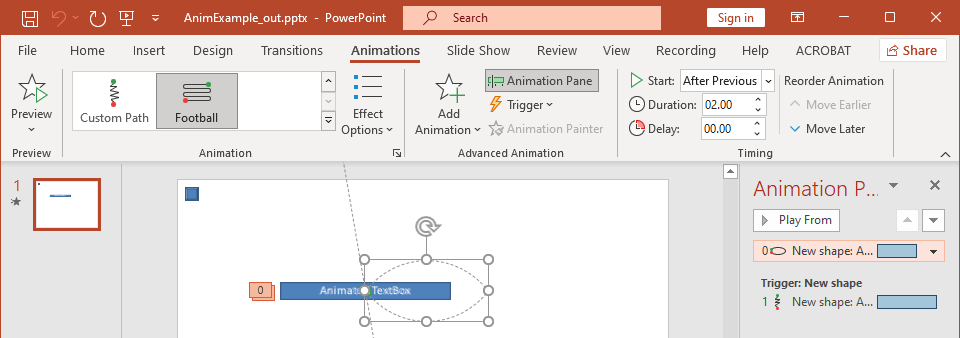

## **Introductie**

Animaties zijn visuele effecten die op tekst, afbeeldingen, vormen of [grafieken](https://docs.aspose.com/slides/nl/androidjava/animated-charts/) kunnen worden toegepast. Ze geven leven aan presentaties of hun onderdelen.

## **Waarom animaties gebruiken in presentaties?**

Met animaties kun je  

* de informatiestroom beheersen  
* belangrijke punten benadrukken  
* de interesse of deelname van het publiek vergroten  
* de inhoud makkelijker leesbaar, verteerbaar of verwerkbaar maken  
* de aandacht van lezers of kijkers richten op belangrijke delen van een presentatie  

PowerPoint biedt veel opties en hulpmiddelen voor animaties en animatie‑effecten in de categorieën **entrance**, **exit**, **emphasis** en **motion paths**.  

## **Animaties in Aspose.Slides**

* Aspose.Slides levert de klassen en types die je nodig hebt om met animaties te werken onder de namespace `Aspose.Slides.Animation`,  
* Aspose.Slides biedt meer dan **150 animatie‑effecten** onder de [EffectType](https://reference.aspose.com/slides/nl/androidjava/com.aspose.slides/effecttype) enumeratie. Deze effecten zijn in wezen dezelfde (of equivalente) effecten die in PowerPoint worden gebruikt.  

## **Animatie toepassen op een tekstvak**

Aspose.Slides for Android via Java stelt je in staat om animatie toe te passen op de tekst in een vorm.

1. Maak een instantie van de [Presentation](https://reference.aspose.com/slides/nl/androidjava/com.aspose.slides/Presentation) klasse.  
2. Verkrijg een dia‑referentie via de index.  
3. Voeg een `rectangle`‑[IAutoShape](https://reference.aspose.com/slides/nl/androidjava/com.aspose.slides/iautoshape) toe.  
4. Voeg tekst toe aan de [IAutoShape.TextFrame](https://reference.aspose.com/slides/nl/androidjava/com.aspose.slides/IAutoShape#addTextFrame-java.lang.String-).  
5. Haal de hoofdvolgorde van effecten op.  
6. Voeg een animatie‑effect toe aan de [IAutoShape](https://reference.aspose.com/slides/nl/androidjava/com.aspose.slides/iautoshape).  
7. Stel de eigenschap `TextAnimation.BuildType` in op de waarde uit de `BuildType`‑enumeratie.  
8. Schrijf de presentatie naar schijf als een PPTX‑bestand.  

```java
// Instantieert een presentatieklasse die een presentatiebestand vertegenwoordigt.
Presentation pres = new Presentation();
try {
    ISlide sld = pres.getSlides().get_Item(0);

    // Voegt een nieuwe AutoShape toe met tekst
    IAutoShape autoShape = sld.getShapes().addAutoShape(ShapeType.Rectangle, 20, 20, 150, 100);

    ITextFrame textFrame = autoShape.getTextFrame();
    textFrame.setText("First paragraph \nSecond paragraph \n Third paragraph");

    // Haalt de hoofdvolgorde van de dia op.
    ISequence sequence = sld.getTimeline().getMainSequence();

    // Voegt een Fade‑animatie‑effect toe aan de vorm
    IEffect effect = sequence.addEffect(autoShape, EffectType.Fade, EffectSubtype.None, EffectTriggerType.OnClick);

    // Animeert de vormtekst per alinea van het eerste niveau
    effect.getTextAnimation().setBuildType(BuildType.ByLevelParagraphs1);

    // Slaat het PPTX‑bestand op op schijf
    pres.save(path + "AnimText_out.pptx", SaveFormat.Pptx);
} finally {
    if (pres != null) pres.dispose();
}
```

{} 

Naast het toepassen van animaties op tekst, kun je ook animaties toepassen op een enkele [Paragraph](https://reference.aspose.com/slides/nl/androidjava/com.aspose.slides/iparagraph). Zie [**Animated Text**](/slides/nl/androidjava/animated-text/).  

{} 

## **Animatie toepassen op een PictureFrame**

1. Maak een instantie van de [Presentation](https://reference.aspose.com/slides/nl/androidjava/com.aspose.slides/Presentation) klasse.  
2. Verkrijg een dia‑referentie via de index.  
3. Voeg een [PictureFrame](https://reference.aspose.com/slides/nl/androidjava/com.aspose.slides/pictureframe) toe aan of haal deze op van de dia.  
4. Haal de hoofdvolgorde van effecten op.  
5. Voeg een animatie‑effect toe aan de [PictureFrame](https://reference.aspose.com/slides/nl/androidjava/com.aspose.slides/pictureframe).  
6. Schrijf de presentatie naar schijf als een PPTX‑bestand.  

```java
// Instantieert een presentatieklasse die een presentatiebestand vertegenwoordigt.
Presentation pres = new Presentation();
try {
    // Laadt afbeelding die moet worden toegevoegd aan de afbeeldingscollectie van de presentatie.
    IPPImage picture;
    IImage image = Images.fromFile("aspose-logo.jpg");
    try {
        picture = pres.getImages().addImage(image);
    } finally {
        if (image != null) image.dispose();
    }

    // Voegt een afbeeldingframe toe aan de dia.
    IPictureFrame picFrame = pres.getSlides().get_Item(0).getShapes().addPictureFrame(ShapeType.Rectangle, 50, 50, 100, 100, picture);

    // Haalt de hoofdvolgorde van de dia op.
    ISequence sequence = pres.getSlides().get_Item(0).getTimeline().getMainSequence();

    // Voegt een Fly from Left animatie‑effect toe aan het afbeeldingframe.
    IEffect effect = sequence.addEffect(picFrame, EffectType.Fly, EffectSubtype.Left, EffectTriggerType.OnClick);

    // Slaat het PPTX‑bestand op op schijf.
    pres.save(path + "AnimImage_out.pptx", SaveFormat.Pptx);
} catch(IOException e) {
} finally {
    if (pres != null) pres.dispose();
}
```

## **Animatie toepassen op een vorm**

1. Maak een instantie van de [Presentation](https://reference.aspose.com/slides/nl/androidjava/com.aspose.slides/Presentation) klasse.  
2. Verkrijg een dia‑referentie via de index.  
3. Voeg een `rectangle`‑[IAutoShape](https://reference.aspose.com/slides/nl/androidjava/com.aspose.slides/iautoshape) toe.  
4. Voeg een `Bevel`‑[IAutoShape](https://reference.aspose.com/slides/nl/androidjava/com.aspose.slides/iautoshape) toe (wanneer dit object wordt aangeklikt, wordt de animatie afgespeeld).  
5. Maak een reeks effecten op de bevel‑vorm.  
6. Maak een aangepaste `UserPath`.  
7. Voeg opdrachten toe om naar de `UserPath` te bewegen.  
8. Schrijf de presentatie naar schijf als een PPTX‑bestand.  

```java
// Instantieert een Presentation‑klasse die een PPTX‑bestand vertegenwoordigt.
Presentation pres = new Presentation();
try {
    ISlide sld = pres.getSlides().get_Item(0);

    // Creëert PathFootball‑effect voor bestaande vorm vanaf nul.
    IAutoShape ashp = sld.getShapes().addAutoShape(ShapeType.Rectangle, 150, 150, 250, 25);
    ashp.addTextFrame("Animated TextBox");

    // Voegt het PathFootBall‑animatie‑effect toe
    pres.getSlides().get_Item(0).getTimeline().getMainSequence().addEffect(ashp, EffectType.PathFootball,
            EffectSubtype.None, EffectTriggerType.AfterPrevious);

    // Creëert een soort “knop”.
    IShape shapeTrigger = pres.getSlides().get_Item(0).getShapes().addAutoShape(ShapeType.Bevel, 10, 10, 20, 20);

    // Creëert een reeks effecten voor deze knop.
    ISequence seqInter = pres.getSlides().get_Item(0).getTimeline().getInteractiveSequences().add(shapeTrigger);

     // Creëert een aangepast gebruikerspad. Ons object wordt alleen verplaatst nadat de knop is aangeklikt.
    IEffect fxUserPath = seqInter.addEffect(ashp, EffectType.PathUser, EffectSubtype.None, EffectTriggerType.OnClick);

     // Voegt opdrachten toe voor verplaatsing aangezien het aangemaakte pad leeg is.
    IMotionEffect motionBhv = ((IMotionEffect)fxUserPath.getBehaviors().get_Item(0));

    Point2D.Float[] pts = new Point2D.Float[1];
    pts[0] = new Point2D.Float(0.076f, 0.59f);
    motionBhv.getPath().add(MotionCommandPathType.LineTo, pts, MotionPathPointsType.Auto, true);
    pts[0] = new Point2D.Float(-0.076f, -0.59f);
    motionBhv.getPath().add(MotionCommandPathType.LineTo, pts, MotionPathPointsType.Auto, false);
    motionBhv.getPath().add(MotionCommandPathType.End, null, MotionPathPointsType.Auto, false);

     // Schrijft het PPTX‑bestand naar schijf
    pres.save("AnimExample_out.pptx", SaveFormat.Pptx);
} finally {
    if (pres != null) pres.dispose();
}
```

## **Animatie‑effecten ophalen die zijn toegepast op een vorm**

De volgende voorbeelden laten zien hoe je de methode `getEffectsByShape` van de [ISequence](https://reference.aspose.com/slides/nl/androidjava/com.aspose.slides/isequence/) interface gebruikt om alle animatie‑effecten op een vorm op te halen.

**Voorbeeld 1: Animatie‑effecten ophalen die zijn toegepast op een vorm op een gewone dia**

Eerder heb je geleerd hoe je animatie‑effecten toevoegt aan vormen in PowerPoint‑presentaties. De volgende voorbeeldcode laat zien hoe je de effecten ophaalt die zijn toegepast op de eerste vorm op de eerste gewone dia in de presentatie `AnimExample_out.pptx`.  

```java
Presentation presentation = new Presentation("AnimExample_out.pptx");
try {
    ISlide firstSlide = presentation.getSlides().get_Item(0);

    // Haalt de hoofdanimatie‑sequentie van de dia op.
    ISequence sequence = firstSlide.getTimeline().getMainSequence();

    // Haalt de eerste vorm op de eerste dia op.
    IShape shape = firstSlide.getShapes().get_Item(0);

    // Haalt de op de vorm toegepaste animatie‑effecten op.
    IEffect[] shapeEffects = sequence.getEffectsByShape(shape);

    if (shapeEffects.length > 0)
        System.out.println("The shape " + shape.getName() + " has " + shapeEffects.length + " animation effects.");
} finally {
    if (presentation != null) presentation.dispose();
}
```

**Voorbeeld 2: Alle animatie‑effecten ophalen, inclusief die geërfd van placeholders**

Als een vorm op een gewone dia placeholders heeft die op de lay‑out‑dia en/of master‑dia staan, en er zijn aan deze placeholders animatie‑effecten toegevoegd, dan worden tijdens de diavoorstelling alle effecten van de vorm afgespeeld, inclusief die geërfd van de placeholders.

Stel dat we een PowerPoint‑bestand `sample.pptx` hebben met één dia die alleen een voettekst‑vorm bevat met de tekst “Made with Aspose.Slides” en het **Random Bars**‑effect is toegepast op die vorm.


Stel bovendien dat het **Split**‑effect is toegepast op de voettekst‑placeholder op de **lay‑out**‑dia.


En tenslotte is het **Fly In**‑effect toegepast op de voettekst‑placeholder op de **master**‑dia.


De volgende voorbeeldcode laat zien hoe je de methode `getBasePlaceholder` van de [IShape](https://reference.aspose.com/slides/nl/androidjava/com.aspose.slides/ishape/) interface gebruikt om de shape‑placeholders te benaderen en de animatie‑effecten op te halen die op de voettekst‑vorm zijn toegepast, inclusief die geërfd van placeholders op lay‑out‑ en master‑dia’s.  

```java
Presentation presentation = new Presentation("sample.pptx");

ISlide slide = presentation.getSlides().get_Item(0);

// Haal animatie‑effecten van de vorm op de normale dia op.
IShape shape = slide.getShapes().get_Item(0);
IEffect[] shapeEffects = slide.getTimeline().getMainSequence().getEffectsByShape(shape);

// Haal animatie‑effecten van de placeholder op de lay‑outdia op.
IShape layoutShape = shape.getBasePlaceholder();
IEffect[] layoutShapeEffects = slide.getLayoutSlide().getTimeline().getMainSequence().getEffectsByShape(layoutShape);

// Haal animatie‑effecten van de placeholder op de master‑dia op.
IShape masterShape = layoutShape.getBasePlaceholder();
IEffect[] masterShapeEffects = slide.getLayoutSlide().getMasterSlide().getTimeline().getMainSequence().getEffectsByShape(masterShape);

System.out.println("Main sequence of shape effects:");
printEffects(masterShapeEffects);
printEffects(layoutShapeEffects);
printEffects(shapeEffects);

presentation.dispose();
```
```java
static void printEffects(IEffect[] effects)
{
    for (IEffect effect : effects)
    {
        String typeName = EffectType.getName(EffectType.class, effect.getType());
        String subtypeName = EffectSubtype.getName(EffectSubtype.class, effect.getSubtype());

        System.out.println(typeName + " " + subtypeName);
    }
}
```

Output:
```text
Main sequence of shape effects:
Fly Bottom
Split VerticalIn
RandomBars Horizontal
```

## **Timing‑eigenschappen van animatie‑effect wijzigen**

Aspose.Slides for Android via Java stelt je in staat de timing‑eigenschappen van een animatie‑effect te wijzigen.

Dit is het **Animation Timing**‑paneel in Microsoft PowerPoint:



Dit zijn de overeenkomsten tussen PowerPoint‑Timing en de eigenschappen van [Effect.Timing](https://reference.aspose.com/slides/nl/androidjava/com.aspose.slides/IEffect#getTiming--):

- De keuzelijst **Start** in PowerPoint komt overeen met de eigenschap [Effect.Timing.TriggerType](https://reference.aspose.com/slides/nl/androidjava/com.aspose.slides/ITiming#getTriggerType--) .
- **Duration** in PowerPoint komt overeen met de eigenschap [Effect.Timing.Duration](https://reference.aspose.com/slides/nl/androidjava/com.aspose.slides/ITiming#getDuration--) . De duur van een animatie (in seconden) is de totale tijd die nodig is om één cyclus te voltooien.  
- **Delay** in PowerPoint komt overeen met de eigenschap [Effect.Timing.TriggerDelayTime](https://reference.aspose.com/slides/nl/androidjava/com.aspose.slides/ITiming#getTriggerDelayTime--) .

Zo wijzig je de timing‑eigenschappen van een effect:

1. [Pas](#apply-animation-to-shape) het animatie‑effect toe of haal het op.  
2. Stel nieuwe waarden in voor de [Effect.Timing](https://reference.aspose.com/slides/nl/androidjava/com.aspose.slides/IEffect#getTiming--) eigenschappen die je nodig hebt.  
3. Sla het aangepaste PPTX‑bestand op.  

```java
// Instantieert een presentatieklasse die een presentatiebestand vertegenwoordigt.
Presentation pres = new Presentation("AnimExample_out.pptx");
try {
    // Haalt de hoofdvolgorde van de dia op.
    ISequence sequence = pres.getSlides().get_Item(0).getTimeline().getMainSequence();

    // Haalt het eerste effect van de hoofdvolgorde op.
    IEffect effect = sequence.get_Item(0);

    // Wijzigt de TriggerType van het effect zodat het start bij een klik
    effect.getTiming().setTriggerType(EffectTriggerType.OnClick);

    // Wijzigt de duur van het effect
    effect.getTiming().setDuration(3f);

    // Wijzigt de TriggerDelayTime van het effect
    effect.getTiming().setTriggerDelayTime(0.5f);

    // Slaat het PPTX-bestand op op schijf
    pres.save("AnimExample_changed.pptx", SaveFormat.Pptx);
} finally {
    if (pres != null) pres.dispose();
}
```

## **Geluid van animatie‑effect**

Aspose.Slides biedt de volgende eigenschappen om met geluiden in animatie‑effecten te werken:  

- [setSound(IAudio value)](https://reference.aspose.com/slides/nl/androidjava/com.aspose.slides/effect/#setSound-com.aspose.slides.IAudio-)  
- [setStopPreviousSound(boolean value)](https://reference.aspose.com/slides/nl/androidjava/com.aspose.slides/effect/#setStopPreviousSound-boolean-)  

### **Een geluid aan een animatie‑effect toevoegen**

Deze Java‑code laat zien hoe je een geluid aan een animatie‑effect toevoegt en stopt wanneer het volgende effect start:  

```java
Presentation pres = new Presentation("AnimExample_out.pptx");
try {
    // Voegt audio toe aan de audio-collectie van de presentatie
    IAudio effectSound = pres.getAudios().addAudio(Files.readAllBytes(Paths.get("sampleaudio.wav")));

    ISlide firstSlide = pres.getSlides().get_Item(0);

    // Haalt de hoofdvolgorde van de dia op.
    ISequence sequence = firstSlide.getTimeline().getMainSequence();

    // Haalt het eerste effect van de hoofdvolgorde op.
    IEffect firstEffect = sequence.get_Item(0);

    // Controleert of het effect geen geluid heeft
    if (!firstEffect.getStopPreviousSound() && firstEffect.getSound() == null)
    {
        // Voegt geluid toe aan het eerste effect
        firstEffect.setSound(effectSound);
    }

    // Haalt de eerste interactieve reeks van de dia op.
    ISequence interactiveSequence = firstSlide.getTimeline().getInteractiveSequences().get_Item(0);

    // Stelt de vlag “Stop previous sound” van het effect in
    interactiveSequence.get_Item(0).setStopPreviousSound(true);

    // Schrijft het PPTX-bestand naar schijf
    pres.save("AnimExample_Sound_out.pptx", SaveFormat.Pptx);
} finally {
    if (pres != null) pres.dispose();
}
```

### **Geluid van een animatie‑effect extraheren**

1. Maak een instantie van de [Presentation](https://reference.aspose.com/slides/nl/androidjava/com.aspose.slides/presentation/) klasse.  
2. Verkrijg een dia‑referentie via de index.  
3. Haal de hoofdvolgorde van effecten op.  
4. Extraheer het aan elk animatie‑effect gekoppelde [setSound(IAudio value)](https://reference.aspose.com/slides/nl/androidjava/com.aspose.slides/effect/#setSound-com.aspose.slides.IAudio-) geluid.  

```java
// Instantieert een presentatieklasse die een presentatiebestand vertegenwoordigt.
Presentation presentation = new Presentation("EffectSound.pptx");
try {
    ISlide slide = presentation.getSlides().get_Item(0);

    // Haalt de hoofdvolgorde van de dia op.
    ISequence sequence = slide.getTimeline().getMainSequence();

    for (IEffect effect : sequence)
    {
        if (effect.getSound() == null)
            continue;

        // Extraheert het effectgeluid als byte-array
        byte[] audio = effect.getSound().getBinaryData();
    }
} finally {
    if (presentation != null) presentation.dispose();
}
```

## **Na animatie**

Aspose.Slides for Android via Java maakt het mogelijk de **After animation**‑eigenschap van een animatie‑effect te wijzigen.

Dit is het **Animation Effect**‑paneel en het uitgebreide menu in Microsoft PowerPoint:


De keuzelijst **After animation** in PowerPoint komt overeen met de volgende eigenschappen:  

- Eigenschap [setAfterAnimationType(int value)](https://reference.aspose.com/slides/nl/androidjava/com.aspose.slides/ieffect/#setAfterAnimationType-int-) die het type **After animation** beschrijft:  
  * **More Colors** in PowerPoint correspondeert met het type [AfterAnimationType.Color](https://reference.aspose.com/slides/nl/androidjava/com.aspose.slides/afteranimationtype/#Color).  
  * **Don't Dim** in PowerPoint correspondeert met het type [AfterAnimationType.DoNotDim](https://reference.aspose.com/slides/nl/androidjava/com.aspose.slides/afteranimationtype/#DoNotDim) (standaard).  
  * **Hide After Animation** correspondeert met [AfterAnimationType.HideAfterAnimation](https://reference.aspose.com/slides/nl/androidjava/com.aspose.slides/afteranimationtype/#HideAfterAnimation).  
  * **Hide on Next Mouse Click** correspondeert met [AfterAnimationType.HideOnNextMouseClick](https://reference.aspose.com/slides/nl/androidjava/com.aspose.slides/afteranimationtype/#HideOnNextMouseClick).  
- Eigenschap [setAfterAnimationColor(IColorFormat value)](https://reference.aspose.com/slides/nl/androidjava/com.aspose.slides/ieffect/#setAfterAnimationColor-com.aspose.slides.IColorFormat-) die een kleurformaat voor **After animation** definieert. Deze eigenschap werkt samen met het type [AfterAnimationType.Color](https://reference.aspose.com/slides/nl/androidjava/com.aspose.slides/afteranimationtype/#Color). Als je het type verandert, wordt de kleur gewist.  

```java
// Instantieert een presentatieklasse die een presentatiebestand vertegenwoordigt
Presentation pres = new Presentation("AnimImage_out.pptx");
try {
    ISlide firstSlide = pres.getSlides().get_Item(0);

    // Haalt het eerste effect van de hoofdvolgorde op
    IEffect firstEffect = firstSlide.getTimeline().getMainSequence().get_Item(0);

    // Wijzigt het type na animatie naar Kleur
    firstEffect.setAfterAnimationType(AfterAnimationType.Color);

    // Stelt de dim‑kleur na animatie in
    firstEffect.getAfterAnimationColor().setColor(Color.BLUE);

    // Schrijft het PPTX‑bestand naar schijf
    pres.save("AnimImage_AfterAnimation.pptx", SaveFormat.Pptx);
} finally {
    if (pres != null) pres.dispose();
}
```

## **Tekst animeren**

Aspose.Slides biedt de volgende eigenschappen om met het **Animate text**‑blok van een animatie‑effect te werken:  

- [setAnimateTextType(int value)](https://reference.aspose.com/slides/nl/androidjava/com.aspose.slides/ieffect/#setAnimateTextType-int-) beschrijft het type **Animate text** van het effect. De tekst van de vorm kan op de volgende manieren geanimeerd worden:  
  - Alles tegelijk ([AnimateTextType.AllAtOnce](https://reference.aspose.com/slides/nl/androidjava/com.aspose.slides/animatetexttype/#AllAtOnce))  
  - Per woord ([AnimateTextType.ByWord](https://reference.aspose.com/slides/nl/androidjava/com.aspose.slides/animatetexttype/#ByWord))  
  - Per letter ([AnimateTextType.ByLetter](https://reference.aspose.com/slides/nl/androidjava/com.aspose.slides/animatetexttype/#ByLetter))  
- [setDelayBetweenTextParts(float value)](https://reference.aspose.com/slides/nl/androidjava/com.aspose.slides/ieffect/#setDelayBetweenTextParts-float-) stelt een vertraging in tussen de geanimeerde tekstonderdelen (woorden of letters). Een positieve waarde geeft een percentage van de effectduur aan; een negatieve waarde geeft een vertraging in seconden.  

Zo kun je de **Animate text**‑eigenschappen van een effect wijzigen:

1. [Pas](#apply-animation-to-shape) het animatie‑effect toe of haal het op.  
2. Stel de eigenschap [setBuildType(int value)](https://reference.aspose.com/slides/nl/androidjava/com.aspose.slides/itextanimation/#setBuildType-int-) in op de waarde [BuildType.AsOneObject](https://reference.aspose.com/slides/nl/androidjava/com.aspose.slides/buildtype/#AsOneObject) om de *By Paragraphs*‑modus uit te schakelen.  
3. Stel nieuwe waarden in voor de eigenschappen [setAnimateTextType(int value)](https://reference.aspose.com/slides/nl/androidjava/com.aspose.slides/ieffect/#setAnimateTextType-int-) en [setDelayBetweenTextParts(float value)](https://reference.aspose.com/slides/nl/androidjava/com.aspose.slides/ieffect/#setDelayBetweenTextParts-float-).  
4. Sla het aangepaste PPTX‑bestand op.  

```java
// Instantieert een presentatieklasse die een presentatiebestand vertegenwoordigt.
Presentation pres = new Presentation("AnimTextBox_out.pptx");
try {
    ISlide firstSlide = pres.getSlides().get_Item(0);

    // Haalt het eerste effect van de hoofdvolgorde op
    IEffect firstEffect = firstSlide.getTimeline().getMainSequence().get_Item(0);

    // Wijzigt het type tekstanimatie van het effect naar "As One Object"
    firstEffect.getTextAnimation().setBuildType(BuildType.AsOneObject);

    // Wijzigt het type “Animate text” van het effect naar "By word"
    firstEffect.setAnimateTextType(AnimateTextType.ByWord);

    // Stelt de vertraging tussen woorden in op 20% van de effectduur
    firstEffect.setDelayBetweenTextParts(20f);

    // Schrijft het PPTX-bestand naar schijf
    pres.save("AnimTextBox_AnimateText.pptx", SaveFormat.Pptx);
} finally {
    if (pres != null) pres.dispose();
}
```

## **FAQ**

**Hoe zorg ik ervoor dat animaties behouden blijven bij het publiceren van de presentatie naar het web?**  

[Export to HTML5](/slides/nl/androidjava/export-to-html5/) en schakel de [options](https://reference.aspose.com/slides/nl/androidjava/com.aspose.slides/html5options/) in die verantwoordelijk zijn voor het animeren van [shape](https://reference.aspose.com/slides/nl/androidjava/com.aspose.slides/html5options/#setAnimateShapes-boolean-) en [transition](https://reference.aspose.com/slides/nl/androidjava/com.aspose.slides/html5options/#setAnimateTransitions-boolean-) animaties. Platte HTML speelt geen dia‑animaties af, HTML5 wel.  

**Hoe beïnvloedt het wijzigen van de z‑order (laagvolgorde) van vormen de animatie?**  

Animatie‑ en tekenvolgorde zijn onafhankelijk: een effect bepaalt het moment en het type van verschijnen/verdwijnen, terwijl de [z-order](https://reference.aspose.com/slides/nl/androidjava/com.aspose.slides/shape/#getZOrderPosition--) bepaalt wat wat bedekt. Het zichtbare resultaat ontstaat door hun combinatie. (Dit is het algemene gedrag van PowerPoint; het Aspose.Slides‑model voor effecten‑en‑vormen volgt dezelfde logica.)  

**Zijn er beperkingen bij het converteren van animaties naar video voor bepaalde effecten?**  

In het algemeen worden [animaties ondersteund](/slides/nl/androidjava/convert-powerpoint-to-video/), maar zeldzame gevallen of specifieke effecten kunnen anders worden gerenderd. Het wordt aangeraden om te testen met de gebruikte effecten en de gebruikte versie van de bibliotheek.