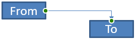

## **Inleiding**

Een PowerPoint‑connector is een speciale lijn die twee vormen met elkaar verbindt of koppelt en aan de vormen blijft bevestigd, zelfs wanneer ze worden verplaatst of opnieuw gepositioneerd op een bepaalde dia. 

Connectoren zijn doorgaans verbonden met *verbindingspunten* (groene puntjes), die standaard op alle vormen aanwezig zijn. Verbindingspunten verschijnen wanneer de cursor er dichtbij komt.

*Aanpassingspunten* (oranje puntjes), die alleen op bepaalde connectoren bestaan, worden gebruikt om de posities en vormen van connectoren aan te passen.

## **Typen connectoren**

In PowerPoint kun je rechte, hoekige (elbow) en gebogen connectoren gebruiken. 

Aspose.Slides levert deze connectoren:

| Connector                      | Afbeelding                                                    | Aantal aanpassingspunten |
| ------------------------------ | ------------------------------------------------------------ | ------------------------ |
| `ShapeType.Line`               |       | 0                        |
| `ShapeType.StraightConnector1` |  | 0                        |
| `ShapeType.BentConnector2`     |   | 0                        |
| `ShapeType.BentConnector3`     |     | 1                        |
| `ShapeType.BentConnector4`     |     | 2                        |
| `ShapeType.BentConnector5`     |     | 3                        |
| `ShapeType.CurvedConnector2`   |  | 0                        |
| `ShapeType.CurvedConnector3`   |  | 1                        |
| `ShapeType.CurvedConnector4`   |  | 2                        |
| `ShapeType.CurvedConnector5`   |  | 3                        |

## **Vormen verbinden met connectoren**

1. Maak een instantie aan van de [Presentation](https://apireference.aspose.com/slides/nl/androidjava/com.aspose.slides/Presentation) klasse.  
1. Haal een referentie naar een dia op via de index.  
1. Voeg twee [AutoShape](https://reference.aspose.com/slides/nl/androidjava/com.aspose.slides/AutoShape) toe aan de dia met behulp van de `addAutoShape`‑methode die beschikbaar wordt gesteld door het `Shapes`‑object.  
1. Voeg een connector toe met de `addConnector`‑methode die beschikbaar wordt gesteld door het `Shapes`‑object door het connector‑type te definiëren.  
1. Verbind de vormen met de connector.  
1. Roep de `reroute`‑methode aan om het kortste verbindingspad toe te passen.  
1. Sla de presentatie op.  

Deze Java‑code laat zien hoe je een connector (een gebogen connector) tussen twee vormen (een ellips en een rechthoek) kunt toevoegen:

```Java
// Instantieert een presentatie‑klasse die het PPTX‑bestand vertegenwoordigt
Presentation pres = new Presentation();
try {
    // Benadert de vormen‑collectie voor een specifieke dia
    IShapeCollection shapes = pres.getSlides().get_Item(0).getShapes();
    
    // Voegt een elips‑autoshape toe
    IAutoShape ellipse = shapes.addAutoShape(ShapeType.Ellipse, 0, 100, 100, 100);
    
    // Voegt een rechthoek‑autoshape toe
    IAutoShape rectangle = shapes.addAutoShape(ShapeType.Rectangle, 100, 300, 100, 100);
    
    // Voegt een connector‑vorm toe aan de vormen‑collectie van de dia
    IConnector connector = shapes.addConnector(ShapeType.BentConnector2, 0, 0, 10, 10);
    
    // Verbindt de vormen met de connector
    connector.setStartShapeConnectedTo(ellipse);
    connector.setEndShapeConnectedTo(rectangle);
    
    // Roept reroute aan dat het automatische kortste pad tussen vormen instelt
    connector.reroute();
    
    // Slaat de presentatie op
    pres.save("output.pptx", SaveFormat.Pptx);
} finally {
    if (pres != null) pres.dispose();
}
```

{} 

De `Connector.reroute`‑methode herleidt een connector en dwingt deze om het kortst mogelijke pad tussen vormen te volgen. Om dit te bereiken kan de methode de punten `setStartShapeConnectionSiteIndex` en `setEndShapeConnectionSiteIndex` aanpassen. 

{} 

## **Specificeer een verbindingspunt**

Als je een connector twee vormen wilt laten koppelen met specifieke punten op die vormen, moet je je voorkeurs‑verbindingspunten als volgt opgeven:

1. Maak een instantie aan van de [Presentation](https://reference.aspose.com/slides/nl/androidjava/com.aspose.slides/Presentation) klasse.  
1. Haal een referentie naar een dia op via de index.  
1. Voeg twee [AutoShape](https://reference.aspose.com/slides/nl/androidjava/com.aspose.slides/AutoShape) toe aan de dia met behulp van de `addAutoShape`‑methode die beschikbaar wordt gesteld door het `Shapes`‑object.  
1. Voeg een connector toe met de `addConnector`‑methode die beschikbaar wordt gesteld door het `Shapes`‑object door het connector‑type te definiëren.  
1. Verbind de vormen met de connector.  
1. Stel je voorkeurs‑verbindingspunten op de vormen in.  
1. Sla de presentatie op.  

Deze Java‑code demonstreert een bewerking waarbij een voorkeurs‑verbindingspunt wordt gespecificeerd:

```java
// Instantieert een presentatie‑klasse die een PPTX‑bestand vertegenwoordigt
Presentation pres = new Presentation();
try {
    // Benadert de vormen‑collectie voor een specifieke dia
    IShapeCollection shapes = pres.getSlides().get_Item(0).getShapes();

    // Voegt een ellips‑autoshape toe
    IAutoShape ellipse = shapes.addAutoShape(ShapeType.Ellipse, 0, 100, 100, 100);

    // Voegt een rechthoek‑autoshape toe
    IAutoShape rectangle = shapes.addAutoShape(ShapeType.Rectangle, 100, 300, 100, 100);

    // Voegt een connector‑vorm toe aan de vormen‑collectie van de dia
    IConnector connector = shapes.addConnector(ShapeType.BentConnector2, 0, 0, 10, 10);

    // Verbindt de vormen met de connector
    connector.setStartShapeConnectedTo(ellipse);
    connector.setEndShapeConnectedTo(rectangle);

    // Stelt de voorkeurs‑verbindingspunt‑index in op de ellips‑vorm
    int wantedIndex = 6;

    // Controleert of de voorkeurs‑index kleiner is dan het maximale aantal site‑indexen
    if (ellipse.getConnectionSiteCount() > wantedIndex) 
    {
        // Stelt het voorkeurs‑verbindingspunt in op de ellips‑autoshape
        connector.setStartShapeConnectionSiteIndex(wantedIndex);
    }

    // Slaat de presentatie op
    pres.save("output.pptx", SaveFormat.Pptx);
} finally {
    if (pres != null) pres.dispose();
}
```

## **Een connectorpunt aanpassen**

Je kunt een bestaande connector aanpassen via zijn aanpassingspunten. Alleen connectoren met aanpassingspunten kunnen op deze manier worden gewijzigd. Zie de tabel onder **[Typen connectoren.](/slides/nl/androidjava/connector/#types-of-connectors)**

### **Eenvoudig geval**

Beschouw een geval waarin een connector tussen twee vormen (A en B) door een derde vorm (C) loopt:


```java
Presentation pres = new Presentation();
try {

    ISlide sld = pres.getSlides().get_Item(0);
    IShape shape = sld.getShapes().addAutoShape(ShapeType.Rectangle, 300, 150, 150, 75);
    IShape shapeFrom = sld.getShapes().addAutoShape(ShapeType.Rectangle, 500, 400, 100, 50);
    IShape shapeTo = sld.getShapes().addAutoShape(ShapeType.Rectangle, 100, 100, 70, 30);

    IConnector connector = sld.getShapes().addConnector(ShapeType.BentConnector5, 20, 20, 400, 300);

    connector.getLineFormat().setEndArrowheadStyle(LineArrowheadStyle.Triangle);
    connector.getLineFormat().getFillFormat().setFillType(FillType.Solid);
    connector.getLineFormat().getFillFormat().getSolidFillColor().setColor(Color.BLACK);

    connector.setStartShapeConnectedTo(shapeFrom);
    connector.setEndShapeConnectedTo(shapeTo);
    connector.setStartShapeConnectionSiteIndex(2);
} finally {
    if (pres != null) pres.dispose();
}
```

Om de derde vorm te vermijden of er omheen te gaan, kunnen we de connector aanpassen door de verticale lijn naar links te verplaatsen:


```java
IAdjustValue adj2 = connector.getAdjustments().get_Item(1);
adj2.setRawValue(adj2.getRawValue() + 10000);
```

### **Complexe gevallen** 

Om meer gecompliceerde aanpassingen uit te voeren, moet je rekening houden met de volgende zaken:

* Het verstelbare punt van een connector is nauw verbonden met een formule die de positie berekent en bepaalt. Wijzigingen in de locatie van het punt kunnen de vorm van de connector wijzigen.  
* De aanpassingspunten van een connector worden in een strikte volgorde in een array gedefinieerd. De aanpassingspunten zijn genummerd vanaf het startpunt van de connector tot het eindpunt.  
* De waarden van de aanpassingspunten weerspiegelen het percentage van de breedte/hoogte van de connectorvorm.  
  * De vorm wordt begrensd door de start‑ en eindpunten van de connector, vermenigvuldigd met 1000.  
  * Het eerste punt, tweede punt en derde punt bepalen respectievelijk het percentage van de breedte, het percentage van de hoogte en nogmaals het percentage van de breedte.  
* Voor berekeningen die de coördinaten van de aanpassingspunten van een connector bepalen, moet je rekening houden met de rotatie van de connector en de spiegeling ervan. **Opmerking** dat de rotatiehoek voor alle connectoren die onder **[Typen connectoren](/slides/nl/androidjava/connector/#types-of-connectors)** worden getoond, 0 is.

#### **Case 1**

Beschouw een geval waarin twee tekstkader‑objecten via een connector aan elkaar gekoppeld zijn:


```java
// Instantieert een presentatie‑klasse die een PPTX‑bestand vertegenwoordigt
Presentation pres = new Presentation();
try {
    // Haalt de eerste dia van de presentatie op
    ISlide sld = pres.getSlides().get_Item(0);
    // Voegt vormen toe die via een connector aan elkaar worden gekoppeld
    IAutoShape shapeFrom = sld.getShapes().addAutoShape(ShapeType.Rectangle, 100, 100, 60, 25);
    shapeFrom.getTextFrame().setText("From");
    IAutoShape shapeTo = sld.getShapes().addAutoShape(ShapeType.Rectangle, 500, 100, 60, 25);
    shapeTo.getTextFrame().setText("To");
    // Voegt een connector toe
    IConnector connector = sld.getShapes().addConnector(ShapeType.BentConnector4, 20, 20, 400, 300);
    // Geeft de richting van de connector op
    connector.getLineFormat().setEndArrowheadStyle(LineArrowheadStyle.Triangle);
    // Geeft de kleur van de connector op
    connector.getLineFormat().getFillFormat().setFillType(FillType.Solid);
    connector.getLineFormat().getFillFormat().getSolidFillColor().setColor(Color.RED);
    // Geeft de dikte van de lijn van de connector op
    connector.getLineFormat().setWidth(3);
    
    // Koppelt de vormen met de connector aan elkaar
    connector.setStartShapeConnectedTo(shapeFrom);
    connector.setStartShapeConnectionSiteIndex(3);
    connector.setEndShapeConnectedTo(shapeTo);
    connector.setEndShapeConnectionSiteIndex(2);
    
    // Haalt de aanpassingspunten van de connector op
    IAdjustValue adjValue_0 = connector.getAdjustments().get_Item(0);
    IAdjustValue adjValue_1 = connector.getAdjustments().get_Item(1);

} finally {
    if (pres != null) pres.dispose();
}
```

**Aanpassing**

We kunnen de waarden van de aanpassingspunten van de connector wijzigen door respectievelijk het bijbehorende breedte‑ en hoogtepercentage met 20 % en 200 % te verhogen:

```java
// Wijzigt de waarden van de aanpassingspunten
adjValue_0.setRawValue(adjValue_0.getRawValue() + 20000);
adjValue_1.setRawValue(adjValue_1.getRawValue() + 200000);
```

Het resultaat:


Om een model te definiëren waarmee we de coördinaten en de vorm van individuele delen van de connector kunnen bepalen, laten we een vorm maken die overeenkomt met de horizontale component van de connector bij het punt `connector.getAdjustments().get_Item(0)`:

```java
// Teken het verticale component van de connector
float x = connector.getX() + connector.getWidth() * adjValue_0.getRawValue() / 100000;
float y = connector.getY();
float height = connector.getHeight() * adjValue_1.getRawValue() / 100000;
sld.getShapes().addAutoShape( ShapeType .Rectangle, x, y, 0, height);
```

Het resultaat:


#### **Case 2**

In **Case 1**, we demonstrated a simple connector adjustment operation using basic principles. In normal situations, you have to take the connector rotation and its display (which are set by the connector.getRotation(), connector.getFrame().getFlipH(), and connector.getFrame().getFlipV()) into account. We will now demonstrate the process.

Eerst voegen we een nieuw tekstkader‑object (**To 1**) toe aan de dia (voor verbindingsdoeleinden) en creëren we een nieuwe (groene) connector die deze verbindt met de objecten die we al hebben aangemaakt.

```java
// Creëert een nieuw bindingobject
IAutoShape shapeTo_1 = sld.getShapes().addAutoShape(ShapeType.Rectangle, 100, 400, 60, 25);
shapeTo_1.getTextFrame().setText("To 1");
// Creëert een nieuwe connector
connector = sld.getShapes().addConnector(ShapeType.BentConnector4, 20, 20, 400, 300);
connector.getLineFormat().setEndArrowheadStyle(LineArrowheadStyle.Triangle);
connector.getLineFormat().getFillFormat().setFillType(FillType.Solid);
connector.getLineFormat().getFillFormat().getSolidFillColor().setColor(Color.CYAN);
connector.getLineFormat().setWidth(3);
// Verbindt objecten met de nieuw aangemaakte connector
connector.setStartShapeConnectedTo(shapeFrom);
connector.setStartShapeConnectionSiteIndex(2);
connector.setEndShapeConnectedTo(shapeTo_1);
connector.setEndShapeConnectionSiteIndex(3);
// Haalt de aanpassingspunten van de connector op
adjValue_0 = connector.getAdjustments().get_Item(0);
adjValue_1 = connector.getAdjustments().get_Item(1);
// Wijzigt de waarden van de aanpassingspunten
adjValue_0.setRawValue(adjValue_0.getRawValue() + 20000);
adjValue_1.setRawValue(adjValue_1.getRawValue() + 200000);
```

Het resultaat:


Ten tweede, laten we een vorm maken die overeenkomt met de horizontale component van de connector die door het aanpassingspunt `connector.getAdjustments().get_Item(0)` van de nieuwe connector loopt. We gebruiken de waarden uit de connector‑data voor `connector.getRotation()`, `connector.getFrame().getFlipH()` en `connector.getFrame().getFlipV()` en passen de bekende coördinaten‑conversieformule voor rotatie rond een gegeven punt x0 toe:

X = (x — x0) * cos(alpha) — (y — y0) * sin(alpha) + x0;

Y = (x — x0) * sin(alpha) + (y — y0) * cos(alpha) + y0;

In ons geval is de rotatiehoek van het object 90 graden en wordt de connector verticaal weergegeven, dus dit is de bijbehorende code:

```java
// Slaat de coördinaten van de connector op
x = connector.getX();
y = connector.getY();
// Corrigeert de coördinaten van de connector indien nodig
if (connector.getFrame().getFlipH() == NullableBool.True)
{
    x += connector.getWidth();
}
if (connector.getFrame().getFlipV() == NullableBool.True)
{
    y += connector.getHeight();
}
// Gebruikt de waarde van het aanpassingspunt als coördinaat
x += connector.getWidth() * adjValue_0.getRawValue() / 100000;
//  Converteert de coördinaten aangezien Sin(90) = 1 en Cos(90) = 0
float xx = connector.getFrame().getCenterX() - y + connector.getFrame().getCenterY();
float yy = x - connector.getFrame().getCenterX() + connector.getFrame().getCenterY();
// Bepaalt de breedte van het horizontale component met behulp van de waarde van het tweede aanpassingspunt
float width = connector.getHeight() * adjValue_1.getRawValue() / 100000;
IAutoShape shape = sld.getShapes().addAutoShape(ShapeType.Rectangle, xx, yy, width, 0);
shape.getLineFormat().getFillFormat().setFillType(FillType.Solid);
shape.getLineFormat().getFillFormat().getSolidFillColor().setColor(Color.RED);
```

Het resultaat:


We hebben berekeningen gedemonstreerd die zowel eenvoudige aanpassingen als gecompliceerde aanpassingspunten (aanpassingspunten met rotatiehoeken) omvatten. Met de opgedane kennis kun je je eigen model ontwikkelen (of code schrijven) om een `GraphicsPath`‑object te verkrijgen of zelfs de waarden van de aanpassingspunten van een connector in te stellen op basis van specifieke dia‑coördinaten.

## **De hoek van connectorlijnen bepalen**

1. Maak een instantie aan van de klasse.  
1. Haal een referentie naar een dia op via de index.  
1. Toegang tot de connector‑lijntvorm.  
1. Gebruik de lijnbreedte, -hoogte, vormframe‑hoogte en vormframe‑breedte om de hoek te berekenen.  

Deze Java‑code demonstreert een bewerking waarbij we de hoek van een connector‑lijntvorm berekend hebben:

```java
Presentation pres = new Presentation("ConnectorLineAngle.pptx");
try {
    Slide slide = (Slide)pres.getSlides().get_Item(0);
    
    for (int i = 0; i < slide.getShapes().size(); i++)
    {
        double dir = 0.0;
        Shape shape = (Shape)slide.getShapes().get_Item(i);
        if (shape instanceof AutoShape)
        {
            AutoShape ashp = (AutoShape)shape;
            if (ashp.getShapeType() == ShapeType.Line)
            {
                dir = getDirection(ashp.getWidth(), ashp.getHeight(),
                        ashp.getFrame().getFlipH() > 0, ashp.getFrame().getFlipV() > 0);
            }
        }
        else if (shape instanceof Connector)
        {
            Connector ashp = (Connector)shape;
            dir = getDirection(ashp.getWidth(), ashp.getHeight(),
                    ashp.getFrame().getFlipH() > 0, ashp.getFrame().getFlipV() > 0);
        }

        System.out.println(dir);
    }
} finally {
    if (pres != null) pres.dispose();
}
```

```java
public static double getDirection(float w, float h, boolean flipH, boolean flipV)
{
    float endLineX = w * (flipH ? -1 : 1);
    float endLineY = h * (flipV ? -1 : 1);
    float endYAxisX = 0;
    float endYAxisY = h;
    double angle = (Math.atan2(endYAxisY, endYAxisX) - Math.atan2(endLineY, endLineX));
    if (angle < 0) angle += 2 * Math.PI;
    return angle * 180.0 / Math.PI;
}
```

## **FAQ**

**Hoe kan ik bepalen of een connector aan een specifieke vorm kan worden "gelijmd"?**

Controleer of de vorm [verbindingsplaatsen](https://reference.aspose.com/slides/nl/androidjava/com.aspose.slides/shape/#getConnectionSiteCount--) blootlegt. Als er geen zijn of het aantal nul is, is lijmen niet beschikbaar; gebruik dan vrije eindpunten en positioneer ze handmatig. Het is verstandig om het aantal sites te controleren voordat je koppelt.

**Wat gebeurt er met een connector als ik een van de gekoppelde vormen verwijder?**

De uiteinden worden losgekoppeld; de connector blijft op de dia staan als een gewone lijn met vrije start/eind. Je kunt hem verwijderen of de koppelingen opnieuw toewijzen en, indien nodig, [reroute](https://reference.aspose.com/slides/nl/androidjava/com.aspose.slides/connector/#reroute--).

**Worden connectorbindings behouden bij het kopiëren van een dia naar een andere presentatie?**

Over het algemeen ja, mits de doelvormen ook worden gekopieerd. Als de dia in een ander bestand wordt ingevoegd zonder de gekoppelde vormen, worden de uiteinden vrij en moet je ze opnieuw koppelen.