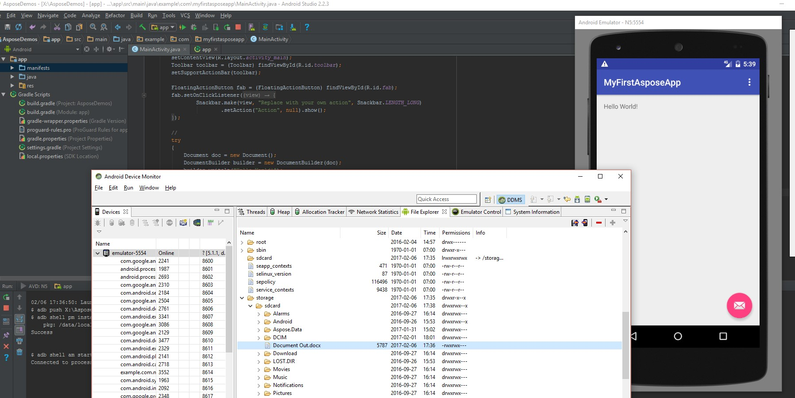

## **Overzicht**

Dit artikel legt uit hoe je Aspose.Slides voor Android via Java kunt installeren en toevoegen aan een Android‑project. Het beschrijft twee installatiemogelijkheden: handmatig het Aspose.Slides‑JAR‑bestand aan het project toevoegen en de bibliotheek uit de Maven‑repository installeren.

Het artikel bevat bovendien een stap‑voor‑stap‑voorbeeld dat laat zien hoe je een nieuwe Android‑applicatie maakt in Android Studio, een referentie naar de Aspose.Slides‑bibliotheek toevoegt, programmatisch een PowerPoint‑presentatie aanmaakt en deze opslaat in PPTX‑formaat. Ook worden opmerkingen over versiebeheer gegeven en worden veelgestelde vragen beantwoord over het verifiëren van de integratie, het beheer van geheugengebruik en het verkleinen van de uiteindelijke JAR‑grootte.

## **Installatie**
Voorheen werd Aspose.Slides voor Android via Java verspreid als één ZIP‑bestand met het JAR‑bestand, demo’s en de productdocumentatie.

1. Als je een versie ouder dan Aspose.Words voor Android via Java 18.9 wilt gebruiken, moet je die versie van Aspose.Slides.Android.zip uitpakken naar een map naar keuze.  
1. Voeg het uitgepakte JAR‑bestand toe aan je toepassing via de Build‑Path‑configuratie.  

### **Een referentie toevoegen aan Aspose.Slides voor Android via Java JAR**
1. Download de nieuwste versie van [Aspose.Slides voor Android via Java](https://downloads.aspose.com/slides/nl/androidjava)  
1. Kopieer aspose-slides-18.9-android.via.java.jar naar de *libs/*‑map van je project  


### **Aspose.Slides voor Android via Java installeren vanuit de Maven‑repository**
1. Voeg de Maven‑repository toe aan je build.gradle.  
1. Voeg het [Aspose.Slides voor Android via Java](https://releases.aspose.com/java/repo/com/aspose/aspose-slides/) JAR‑bestand toe als dependency.  

``` java

 // 1. Voeg de maven-repository toe aan je build.gradle 

repositories {

    mavenCentral()

    maven { url "https://releases.aspose.com/java/repo/" }

}

// 2. Voeg de 'Aspose.Slides for Android via Java' JAR toe als dependency

dependencies {

    ...

    ...

    compile (group: 'com.aspose', name: 'aspose-slides', version: 'XX.XX', classifier: 'android.via.java')

}

```
## **Uw eerste toepassing met Aspose.Slides voor Android via Java**
In dit gedeelte leer je hoe je aan de slag gaat met Aspose.Slides voor Android via Java. We laten zien hoe je een nieuw Android‑project vanaf nul opzet, een referentie naar het Aspose.Slides‑JAR‑bestand toevoegt en een nieuwe PowerPoint‑presentatie maakt die wordt opgeslagen op schijf in PPTX‑formaat. Het voorbeeld maakt gebruik van [Android Studio](https://developer.android.com/studio/index.html) voor de ontwikkeling en de toepassing wordt uitgevoerd op de Android Emulator. Volg deze stap‑voor‑stap‑handleiding om een app te maken die Aspose.Slides voor Android via Java gebruikt:

1. Download en installeer [Android Studio](https://developer.android.com/studio/index.html) op een locatie naar keuze.  
1. Start Android Studio.  
1. Maak een nieuw Android‑applicatie‑project aan.  


1. Kopieer aspose-slides-XX.XX-android.via.java.jar naar de *libs/*‑map van je project  


1. Open **Project**‑sectie (via het menu **File**) en ga naar het tabblad **Dependencies**.  
   1. Klik op de “+”‑knop en kies **File Dependency**.  
   1. Selecteer de Aspose.Slides‑bibliotheek in de *libs*‑map en klik op **OK**.  


1. Synchroniseer het project met de Gradle‑bestanden indien nodig.  


1. Om toegang tot de SD‑kaart te krijgen, moeten speciale permissies worden toegevoegd. Open **AndroidManifest.xml**, schakel over naar **XML view** en voeg de volgende regel toe: `<uses-permission android:name="android.permission.WRITE_EXTERNAL_STORAGE" />`  


1. Ga terug naar de code‑sectie van de app en voeg de volgende imports toe:  

``` java

 import java.io.File;

import com.aspose.slides.IAutoShape;

import com.aspose.slides.IParagraph;

import com.aspose.slides.IPortion;

import com.aspose.slides.ISlide;

import com.aspose.slides.ITextFrame;

import com.aspose.slides.Presentation;

import com.aspose.slides.SaveFormat;

import com.aspose.slides.ShapeType;

import android.os.Environment; 

```

Plaats nu deze code in de body van de `onCreate`‑methode om een nieuwe **Presentation** van nul af aan te maken met Aspose.Slides en deze op de SD‑kaart op te slaan in PPTX‑formaat.

``` java

 try

{

    // Instantieer de Presentation-klasse die een PPTX vertegenwoordigt
    Presentation pres = new Presentation();


    // Toegang tot de eerste dia
    ISlide sld = pres.getSlides().get_Item(0);


    // Voeg een AutoShape van het type Rectangle toe
    IAutoShape ashp = sld.getShapes().addAutoShape(ShapeType.Rectangle, 150, 75, 150, 50);


    // Voeg een TextFrame toe aan de rechthoek
    ashp.addTextFrame(" ");


    // Benader het tekstframe
    ITextFrame txtFrame = ashp.getTextFrame();


    // Maak het Paragraph-object voor het tekstframe
    IParagraph para = txtFrame.getParagraphs().get_Item(0);


    // Maak een Portion-object voor de paragraaf
    IPortion portion = para.getPortions().get_Item(0);


    // Stel tekst in
    portion.setText("Aspose TextBox");


    // Sla de PPTX op naar de kaart
    String sdCardPath = Environment.getExternalStorageDirectory().getPath() + File.separator;
    pres.save(sdCardPath + "Textbox.pptx",SaveFormat.Pptx);
}

catch (Exception e)

{
   e.printStackTrace();
}
```

De volledige code ziet er als volgt uit:


1. Voer de toepassing opnieuw uit. Deze keer wordt de Aspose.Slides‑code op de achtergrond uitgevoerd en wordt een document gegenereerd dat op de SD‑kaart wordt opgeslagen.  


1. Om het aangemaakte document te bekijken, ga naar het menu **Tools**, kies **Android** en vervolgens **Android Device Monitor**.  




## **Versiebeheer**
Sinds 2018 volgt het versiebeheer van Aspose.Slides voor Android via Java dezelfde afspraken als Aspose.Slides voor Java.  

## **FAQ**

**Hoe kan ik controleren of Aspose.Slides correct is geïntegreerd?**

Bouw je project, maak een lege [Presentation](https://reference.aspose.com/slides/nl/androidjava/com.aspose.slides/presentation/) en sla deze op onder een nieuwe naam. Als het bestand wordt aangemaakt zonder uitzonderingen, is de bibliotheek succesvol geïntegreerd.

**Hoe kan ik het geheugengebruik beperken bij het verwerken van grote presentaties?**

Verhoog de JVM‑geheugenlimieten alleen zo hoog als nodig is, en sluit elke [Presentation](https://reference.aspose.com/slides/nl/androidjava/com.aspose.slides/presentation/)‑instantie in een `finally`‑blok om de cache direct vrij te geven. Dit voorkomt out‑of‑memory‑fouten en houdt het totale geheugengebruik voorspelbaar tijdens batch‑verwerkingen.

**Kan ik ongewenste exportformaten uitschakelen om de uiteindelijke JAR‑grootte te verkleinen?**

De huidige releases van Aspose.Slides worden geleverd als één monolithische bibliotheek, dus kun je specifieke exporters zoals PDF of SVG niet uitschakelen tijdens het bouwen.  