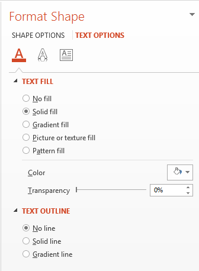

## **Overzicht**

WordArt‑effecten stellen u in staat om visueel aantrekkelijke, gestileerde tekst toe te voegen aan uw PowerPoint‑presentaties. Met Aspose.Slides kunnen ontwikkelaars programmatic WordArt maken, aanpassen en beheren, net zoals in Microsoft PowerPoint—zonder dat Office geïnstalleerd hoeft te zijn. Dit artikel geeft een overzicht van het werken met WordArt, inclusief hoe u teksttransformaties, vulstijlen, contouren, schaduwen en andere opmaakopties kunt toepassen om uw presentatiewaarde meer expressief en boeiend te maken. Met WordArt kunt u tekst behandelen als een grafisch object. Het bestaat uit effecten of speciale aanpassingen die op tekst worden toegepast om deze aantrekkelijker of opvallender te maken.

## **Maak een eenvoudige WordArt‑sjabloon en pas deze toe op tekst**

**Met Aspose.Slides** 

Eerst maken we een eenvoudige tekst met deze C++‑code: 

``` cpp 
#include <DOM/IAutoShape.h>
#include <DOM/IParagraph.h>
#include <DOM/IParagraphCollection.h>
#include <DOM/IPortion.h>
#include <DOM/IPortionCollection.h>
#include <DOM/IShapeCollection.h>
#include <DOM/ISlide.h>
#include <DOM/ISlideCollection.h>
#include <DOM/ITextFrame.h>
#include <DOM/Presentation.h>
#include <DOM/ShapeType.h>
using namespace Aspose::Slides;

auto pres = System::MakeObject<Presentation>();
auto slide = pres->get_Slides()->idx_get(0);
auto autoShape = slide->get_Shapes()->AddAutoShape(ShapeType::Rectangle, 200.0f, 200.0f, 400.0f, 200.0f);
auto textFrame = autoShape->get_TextFrame();

auto portion = textFrame->get_Paragraphs()->idx_get(0)->get_Portions()->idx_get(0);
portion->set_Text(u"Aspose.Slides");
```

Nu stellen we de letterhoogte van de tekst in op een grotere waarde om het effect beter zichtbaar te maken met deze code:

``` cpp 
#include <DOM/Fonts/FontData.h>
#include <DOM/IAutoShape.h>
#include <DOM/IParagraph.h>
#include <DOM/IParagraphCollection.h>
#include <DOM/IPortion.h>
#include <DOM/IPortionCollection.h>
#include <DOM/IPortionFormat.h>
#include <DOM/IShapeCollection.h>
#include <DOM/ISlide.h>
#include <DOM/ISlideCollection.h>
#include <DOM/ITextFrame.h>
#include <DOM/Presentation.h>
#include <DOM/ShapeType.h>
using namespace Aspose::Slides;

auto pres = System::MakeObject<Presentation>();
auto slide = pres->get_Slides()->idx_get(0);
auto autoShape = slide->get_Shapes()->AddAutoShape(ShapeType::Rectangle, 200.0f, 200.0f, 400.0f, 200.0f);
auto textFrame = autoShape->get_TextFrame();
auto portion = textFrame->get_Paragraphs()->idx_get(0)->get_Portions()->idx_get(0);
portion->set_Text(u"Aspose.Slides");

auto fontData = System::MakeObject<FontData>(u"Arial Black");
portion->get_PortionFormat()->set_LatinFont(fontData);
portion->get_PortionFormat()->set_FontHeight(36.0f);
```

**Met Microsoft PowerPoint**

Ga naar het WordArt‑effectenmenu in Microsoft PowerPoint:


In het menu aan de rechterkant kunt u een vooraf gedefinieerd WordArt‑effect kiezen. In het menu aan de linkerkant kunt u de instellingen voor een nieuw WordArt specificeren. 

Dit zijn enkele van de beschikbare parameters of opties:



**Met Aspose.Slides**

Hier passen we de SmallGrid‑patroonkleur toe op de tekst en voegen we een zwarte tekstrand van 1‑punt breed toe met deze code:

``` cpp 
#include <DOM/FillType.h>
#include <DOM/IAutoShape.h>
#include <DOM/IColorFormat.h>
#include <DOM/IFillFormat.h>
#include <DOM/ILineFillFormat.h>
#include <DOM/ILineFormat.h>
#include <DOM/IParagraph.h>
#include <DOM/IParagraphCollection.h>
#include <DOM/IPortion.h>
#include <DOM/IPortionCollection.h>
#include <DOM/IPortionFormat.h>
#include <DOM/IShapeCollection.h>
#include <DOM/ISlide.h>
#include <DOM/ISlideCollection.h>
#include <DOM/ITextFrame.h>
#include <DOM/IPatternFormat.h>
#include <DOM/PatternStyle.h>
#include <DOM/Presentation.h>
#include <DOM/ShapeType.h>
#include <drawing/color.h>
using namespace Aspose::Slides;
using namespace System::Drawing;

auto pres = System::MakeObject<Presentation>();
auto slide = pres->get_Slides()->idx_get(0);
auto autoShape = slide->get_Shapes()->AddAutoShape(ShapeType::Rectangle, 200.0f, 200.0f, 400.0f, 200.0f);
auto textFrame = autoShape->get_TextFrame();
auto portion = textFrame->get_Paragraphs()->idx_get(0)->get_Portions()->idx_get(0);
portion->set_Text(u"Aspose.Slides");

auto fillFormat = portion->get_PortionFormat()->get_FillFormat();
fillFormat->set_FillType(FillType::Pattern);
fillFormat->get_PatternFormat()->get_ForeColor()->set_Color(Color::get_DarkOrange());
fillFormat->get_PatternFormat()->get_BackColor()->set_Color(Color::get_White());
fillFormat->get_PatternFormat()->set_PatternStyle(PatternStyle::SmallGrid);

auto lineFillFormat = portion->get_PortionFormat()->get_LineFormat()->get_FillFormat();
lineFillFormat->set_FillType(FillType::Solid);
lineFillFormat->get_SolidFillColor()->set_Color(Color::get_Black());
```

De resulterende tekst:


## **Pas andere WordArt‑effecten toe**

**Met Microsoft PowerPoint**

Via de interface van het programma kunt u deze effecten toepassen op een tekst, tekstblok, vorm of een soortgelijk element:


Bijvoorbeeld, Schaduw‑, Reflectie‑ en Gloei‑effecten kunnen op een tekst worden toegepast; 3D‑Formaat‑ en 3D‑Rotatie‑effecten kunnen op een tekstblok worden toegepast; de eigenschap Zachte randen kan op een Vorm‑object worden toegepast (het heeft nog steeds effect wanneer er geen 3D‑Formaat‑eigenschap is ingesteld). 

### **Schaduw‑effecten toepassen op tekst**

Hier willen we alleen de eigenschappen voor tekst instellen. We passen het schaduweffect toe op een tekst met deze C++‑code:

``` cpp 
#include <DOM/ColorTransformOperation.h>
#include <DOM/Effects/IOuterShadow.h>
#include <DOM/IAutoShape.h>
#include <DOM/IColorFormat.h>
#include <DOM/IColorOperationCollection.h>
#include <DOM/IEffectFormat.h>
#include <DOM/IParagraph.h>
#include <DOM/IParagraphCollection.h>
#include <DOM/IPortion.h>
#include <DOM/IPortionCollection.h>
#include <DOM/IPortionFormat.h>
#include <DOM/IShapeCollection.h>
#include <DOM/ISlide.h>
#include <DOM/ISlideCollection.h>
#include <DOM/ITextFrame.h>
#include <DOM/Presentation.h>
#include <DOM/ShapeType.h>
#include <drawing/color.h>
using namespace Aspose::Slides;
using namespace System::Drawing;

auto pres = System::MakeObject<Presentation>();
auto slide = pres->get_Slides()->idx_get(0);
auto autoShape = slide->get_Shapes()->AddAutoShape(ShapeType::Rectangle, 200.0f, 200.0f, 400.0f, 200.0f);
auto textFrame = autoShape->get_TextFrame();
auto portion = textFrame->get_Paragraphs()->idx_get(0)->get_Portions()->idx_get(0);
portion->set_Text(u"Aspose.Slides");

auto effectFormat = portion->get_PortionFormat()->get_EffectFormat();
effectFormat->EnableOuterShadowEffect();

auto outerShadowEffect = effectFormat->get_OuterShadowEffect();
outerShadowEffect->get_ShadowColor()->set_Color(Color::get_Black());
outerShadowEffect->set_ScaleHorizontal(100);
outerShadowEffect->set_ScaleVertical(65);
outerShadowEffect->set_BlurRadius(4.73);
outerShadowEffect->set_Direction(230.0f);
outerShadowEffect->set_Distance(2);
outerShadowEffect->set_SkewHorizontal(30);
outerShadowEffect->set_SkewVertical(0);
outerShadowEffect->get_ShadowColor()->get_ColorTransform()->Add(ColorTransformOperation::SetAlpha, 0.32f);
```

De Aspose.Slides‑API ondersteunt drie soorten schaduwen: OuterShadow, InnerShadow en PresetShadow. 

 Met PresetShadow kunt u een schaduw op een tekst toepassen (met vooraf ingestelde waarden). 

**Met Microsoft PowerPoint**

In PowerPoint kunt u één type schaduw gebruiken. Hier is een voorbeeld:


**Met Aspose.Slides**

Aspose.Slides maakt het mogelijk om twee soorten schaduwen gelijktijdig toe te passen: InnerShadow en PresetShadow.

**Notes:**

- Wanneer OuterShadow en PresetShadow samen worden gebruikt, wordt alleen het OuterShadow‑effect toegepast. 
- Als OuterShadow en InnerShadow gelijktijdig worden gebruikt, hangt het resulterende of toegepaste effect af van de PowerPoint‑versie. Bijvoorbeeld, in PowerPoint 2013 wordt het effect verdubbeld. In PowerPoint 2007 wordt het OuterShadow‑effect toegepast. 

### **Reflectie‑effecten toepassen**

We voegen een reflectie toe aan de tekst met dit C++‑codevoorbeeld:

``` cpp 
#include <DOM/Effects/IReflection.h>
#include <DOM/IAutoShape.h>
#include <DOM/IEffectFormat.h>
#include <DOM/IParagraph.h>
#include <DOM/IParagraphCollection.h>
#include <DOM/IPortion.h>
#include <DOM/IPortionCollection.h>
#include <DOM/IPortionFormat.h>
#include <DOM/IShapeCollection.h>
#include <DOM/ISlide.h>
#include <DOM/ISlideCollection.h>
#include <DOM/ITextFrame.h>
#include <DOM/Presentation.h>
#include <DOM/RectangleAlignment.h>
#include <DOM/ShapeType.h>
using namespace Aspose::Slides;

auto pres = System::MakeObject<Presentation>();
auto slide = pres->get_Slides()->idx_get(0);
auto autoShape = slide->get_Shapes()->AddAutoShape(ShapeType::Rectangle, 200.0f, 200.0f, 400.0f, 200.0f);
auto textFrame = autoShape->get_TextFrame();
auto portion = textFrame->get_Paragraphs()->idx_get(0)->get_Portions()->idx_get(0);
portion->set_Text(u"Aspose.Slides");

auto effectFormat = portion->get_PortionFormat()->get_EffectFormat();
effectFormat->EnableReflectionEffect();

auto reflectionEffect = effectFormat->get_ReflectionEffect();
reflectionEffect->set_BlurRadius(0.5);
reflectionEffect->set_Distance(4.72);
reflectionEffect->set_StartPosAlpha(0.f);
reflectionEffect->set_EndPosAlpha(60.f);
reflectionEffect->set_Direction(90.0f);
reflectionEffect->set_ScaleHorizontal(100);
reflectionEffect->set_ScaleVertical(-100);
reflectionEffect->set_StartReflectionOpacity(60.f);
reflectionEffect->set_EndReflectionOpacity(0.9f);
reflectionEffect->set_RectangleAlign(RectangleAlignment::BottomLeft);
```

### **Gloei‑effecten toepassen**

We passen het gloei‑effect toe op de tekst om deze te laten schitteren of uit te laten springen met deze code:

``` cpp 
#include <DOM/ColorTransformOperation.h>
#include <DOM/Effects/IGlow.h>
#include <DOM/IAutoShape.h>
#include <DOM/IColorFormat.h>
#include <DOM/IColorOperationCollection.h>
#include <DOM/IEffectFormat.h>
#include <DOM/IParagraph.h>
#include <DOM/IParagraphCollection.h>
#include <DOM/IPortion.h>
#include <DOM/IPortionCollection.h>
#include <DOM/IPortionFormat.h>
#include <DOM/IShapeCollection.h>
#include <DOM/ISlide.h>
#include <DOM/ISlideCollection.h>
#include <DOM/ITextFrame.h>
#include <DOM/Presentation.h>
#include <DOM/ShapeType.h>
using namespace Aspose::Slides;

auto pres = System::MakeObject<Presentation>();
auto slide = pres->get_Slides()->idx_get(0);
auto autoShape = slide->get_Shapes()->AddAutoShape(ShapeType::Rectangle, 200.0f, 200.0f, 400.0f, 200.0f);
auto textFrame = autoShape->get_TextFrame();
auto portion = textFrame->get_Paragraphs()->idx_get(0)->get_Portions()->idx_get(0);
portion->set_Text(u"Aspose.Slides");

auto effectFormat = portion->get_PortionFormat()->get_EffectFormat();
effectFormat->EnableGlowEffect();

auto glowEffect = effectFormat->get_GlowEffect();
glowEffect->get_Color()->set_R(255);
glowEffect->get_Color()->get_ColorTransform()->Add(ColorTransformOperation::SetAlpha, 0.54f);
glowEffect->set_Radius(7);
```

Het resultaat van de bewerking:


{} 
U kunt de parameters voor schaduw, weergave en gloei wijzigen. De eigenschappen van de effecten worden voor elk deel van de tekst afzonderlijk ingesteld. 
{} 

### **Transformaties gebruiken in WordArt**

We gebruiken de set_Transform‑methode (van toepassing op het gehele tekstblok) met deze code:

``` cpp 
#include <DOM/IAutoShape.h>
#include <DOM/IShapeCollection.h>
#include <DOM/ISlide.h>
#include <DOM/ISlideCollection.h>
#include <DOM/ITextFrame.h>
#include <DOM/ITextFrameFormat.h>
#include <DOM/Presentation.h>
#include <DOM/ShapeType.h>
#include <DOM/TextShapeType.h>
using namespace Aspose::Slides;

auto pres = System::MakeObject<Presentation>();
auto slide = pres->get_Slides()->idx_get(0);
auto autoShape = slide->get_Shapes()->AddAutoShape(ShapeType::Rectangle, 200.0f, 200.0f, 400.0f, 200.0f);
auto textFrame = autoShape->get_TextFrame();
textFrame->set_Text(u"Aspose.Slides");

textFrame->get_TextFrameFormat()->set_Transform(TextShapeType::ArchUpPour);
```

Het resultaat:


{} 
Zowel Microsoft PowerPoint als Aspose.Slides voor C++ bieden een aantal vooraf gedefinieerde transformatietypen. 
{} 

## **Met PowerPoint**

Om toegang te krijgen tot vooraf gedefinieerde transformatietypen, gaat u via: **Format** -> **TextEffect** -> **Transform**

## **Met Aspose.Slides**

Om een transformatietype te selecteren, gebruikt u de TextShapeType‑enum. 

### **3D‑effecten toepassen op tekst en vormen**

We stellen een 3D‑effect in voor een tekstvorm met deze voorbeeldcode:

``` cpp 
#include <DOM/BevelPresetType.h>
#include <DOM/CameraPresetType.h>
#include <DOM/IAutoShape.h>
#include <DOM/ICamera.h>
#include <DOM/IColorFormat.h>
#include <DOM/ILightRig.h>
#include <DOM/IShapeBevel.h>
#include <DOM/IShapeCollection.h>
#include <DOM/ISlide.h>
#include <DOM/ISlideCollection.h>
#include <DOM/ITextFrame.h>
#include <DOM/IThreeDFormat.h>
#include <DOM/LightRigPresetType.h>
#include <DOM/LightingDirection.h>
#include <DOM/MaterialPresetType.h>
#include <DOM/Presentation.h>
#include <DOM/ShapeType.h>
#include <drawing/color.h>
using namespace Aspose::Slides;
using namespace System::Drawing;

auto pres = System::MakeObject<Presentation>();
auto slide = pres->get_Slides()->idx_get(0);
auto autoShape = slide->get_Shapes()->AddAutoShape(ShapeType::Rectangle, 200.0f, 200.0f, 400.0f, 200.0f);
autoShape->get_TextFrame()->set_Text(u"Aspose.Slides");

auto threeDFormat = autoShape->get_ThreeDFormat();

threeDFormat->get_BevelBottom()->set_BevelType(BevelPresetType::Circle);
threeDFormat->get_BevelBottom()->set_Height(10.5);
threeDFormat->get_BevelBottom()->set_Width(10.5);

threeDFormat->get_BevelTop()->set_BevelType(BevelPresetType::Circle);
threeDFormat->get_BevelTop()->set_Height(12.5);
threeDFormat->get_BevelTop()->set_Width(11);

threeDFormat->get_ExtrusionColor()->set_Color(Color::get_Orange());
threeDFormat->set_ExtrusionHeight(6);

threeDFormat->get_ContourColor()->set_Color(Color::get_DarkRed());
threeDFormat->set_ContourWidth(1.5);

threeDFormat->set_Depth(3);

threeDFormat->set_Material(MaterialPresetType::Plastic);

threeDFormat->get_LightRig()->set_Direction(LightingDirection::Top);
threeDFormat->get_LightRig()->set_LightType(LightRigPresetType::Balanced);
threeDFormat->get_LightRig()->SetRotation(0.0f, 0.0f, 40.0f);

threeDFormat->get_Camera()->set_CameraType(CameraPresetType::PerspectiveContrastingRightFacing);
```

De resulterende tekst en bijbehorende vorm:


We passen een 3D‑effect toe op de tekst met deze C++‑code:

``` cpp 
#include <DOM/BevelPresetType.h>
#include <DOM/CameraPresetType.h>
#include <DOM/IAutoShape.h>
#include <DOM/ICamera.h>
#include <DOM/IColorFormat.h>
#include <DOM/ILightRig.h>
#include <DOM/IShapeBevel.h>
#include <DOM/IShapeCollection.h>
#include <DOM/ISlide.h>
#include <DOM/ISlideCollection.h>
#include <DOM/ITextFrame.h>
#include <DOM/ITextFrameFormat.h>
#include <DOM/IThreeDFormat.h>
#include <DOM/LightRigPresetType.h>
#include <DOM/LightingDirection.h>
#include <DOM/MaterialPresetType.h>
#include <DOM/Presentation.h>
#include <DOM/ShapeType.h>
#include <drawing/color.h>
using namespace Aspose::Slides;
using namespace System::Drawing;

auto pres = System::MakeObject<Presentation>();
auto slide = pres->get_Slides()->idx_get(0);
auto autoShape = slide->get_Shapes()->AddAutoShape(ShapeType::Rectangle, 200.0f, 200.0f, 400.0f, 200.0f);
auto textFrame = autoShape->get_TextFrame();
textFrame->set_Text(u"Aspose.Slides");

auto threeDFormat = textFrame->get_TextFrameFormat()->get_ThreeDFormat();

threeDFormat->get_BevelBottom()->set_BevelType(BevelPresetType::Circle);
threeDFormat->get_BevelBottom()->set_Height(3.5);
threeDFormat->get_BevelBottom()->set_Width(3.5);

threeDFormat->get_BevelTop()->set_BevelType(BevelPresetType::Circle);
threeDFormat->get_BevelTop()->set_Height(4);
threeDFormat->get_BevelTop()->set_Width(4);

threeDFormat->get_ExtrusionColor()->set_Color(Color::get_Orange());
threeDFormat->set_ExtrusionHeight(6);

threeDFormat->get_ContourColor()->set_Color(Color::get_DarkRed());
threeDFormat->set_ContourWidth(1.5);

threeDFormat->set_Depth(3);

threeDFormat->set_Material(MaterialPresetType::Plastic);

threeDFormat->get_LightRig()->set_Direction(LightingDirection::Top);
threeDFormat->get_LightRig()->set_LightType(LightRigPresetType::Balanced);
threeDFormat->get_LightRig()->SetRotation(0.0f, 0.0f, 40.0f);

threeDFormat->get_Camera()->set_CameraType(CameraPresetType::PerspectiveContrastingRightFacing);
```

Het resultaat van de bewerking:


{} 
De toepassing van 3D‑effecten op teksten of hun vormen en de interacties tussen effecten zijn gebaseerd op bepaalde regels. 

Beschouw een scène voor een tekst en de vorm die die tekst bevat. Het 3D‑effect bevat een 3D‑objectrepresentatie en de scène waarop het object is geplaatst. 

- Wanneer de scène is ingesteld voor zowel de vorm als de tekst, krijgt de vorm‑scène de hogere prioriteit — de tekst‑scène wordt genegeerd. 
- Wanneer de vorm geen eigen scène heeft maar wel een 3D‑representatie, wordt de tekst‑scène gebruikt. 
- Anders — wanneer de vorm oorspronkelijk geen 3D‑effect heeft — is de vorm vlak en wordt het 3D‑effect alleen op de tekst toegepast. 

Deze beschrijvingen zijn gekoppeld aan de methoden ThreeDFormat.getLightRig() en ThreeDFormat.getCamera(). 
{} 

## **Buitenste schaduweffecten toepassen op vormen**
Aspose.Slides for C++ biedt de klassen [**IOuterShadow**](https://reference.aspose.com/slides/nl/cpp/class/aspose.slides.effects.i_outer_shadow) en [**IInnerShadow**](https://reference.aspose.com/slides/nl/cpp/class/aspose.slides.effects.i_inner_shadow) waarmee u schaduweffecten kunt toepassen op tekst die zich in een TextFrame bevindt. Volg deze stappen:

1. Maak een instantie van de klasse [Presentation](https://reference.aspose.com/slides/nl/cpp/class/aspose.slides.presentation). 
2. Haal de referentie van een dia op met behulp van de index. 
3. Voeg een AutoShape van het type Rectangle toe aan de dia. 
4. Toegang tot het TextFrame dat bij de AutoShape hoort. 
5. Stel de FillType van de AutoShape in op NoFill. 
6. Instantieer de OuterShadow‑klasse 
7. Stel de BlurRadius van de schaduw in. 
8. Stel de Direction van de schaduw in. 
9. Stel de Distance van de schaduw in. 
10. Stel de RectanglelAlign in op TopLeft. 
11. Stel de PresetColor van de schaduw in op Black. 
12. Schrijf de presentatie naar een PPTX‑bestand. 

Deze voorbeeldcode in C++ — een implementatie van de bovenstaande stappen — laat zien hoe u het buitenste schaduweffect op tekst toepast:

``` cpp
#include <DOM/Effects/IOuterShadow.h>
#include <DOM/FillType.h>
#include <DOM/IAutoShape.h>
#include <DOM/IColorFormat.h>
#include <DOM/IEffectFormat.h>
#include <DOM/IFillFormat.h>
#include <DOM/IShapeCollection.h>
#include <DOM/ISlide.h>
#include <DOM/ISlideCollection.h>
#include <DOM/Presentation.h>
#include <DOM/PresetColor.h>
#include <DOM/RectangleAlignment.h>
#include <DOM/ShapeType.h>
#include <Export/SaveFormat.h>
using namespace Aspose::Slides;
using namespace Aspose::Slides::Effects;
using namespace Aspose::Slides::Export;

auto pres = System::MakeObject<Presentation>();
// Haal referentie van de dia op
auto sld = pres->get_Slides()->idx_get(0);

// Voeg een AutoShape van het type Rechthoek toe
auto ashp = sld->get_Shapes()->AddAutoShape(ShapeType::Rectangle, 150.0f, 75.0f, 150.0f, 50.0f);

// Voeg een TextFrame toe aan de rechthoek
ashp->AddTextFrame(u"Aspose TextBox");

// Schakel vormvulling uit voor het geval we een schaduw van de tekst willen
ashp->get_FillFormat()->set_FillType(FillType::NoFill);

// Voeg buitenste schaduw toe en stel alle benodigde parameters in
ashp->get_EffectFormat()->EnableOuterShadowEffect();
auto shadow = ashp->get_EffectFormat()->get_OuterShadowEffect();
shadow->set_BlurRadius(4.0);
shadow->set_Direction(45.0f);
shadow->set_Distance(3);
shadow->set_RectangleAlign(RectangleAlignment::TopLeft);
shadow->get_ShadowColor()->set_PresetColor(PresetColor::Black);

// Schrijf de presentatie naar schijf
pres->Save(u"pres_out.pptx", SaveFormat::Pptx);
```

## **Binnenste schaduweffecten toepassen op vormen**
Volg deze stappen:

1. Maak een instantie van de klasse [Presentation](https://reference.aspose.com/slides/nl/cpp/class/aspose.slides.presentation). 
2. Haal een referentie van de dia op. 
3. Voeg een AutoShape van het type Rectangle toe. 
4. Schakel InnerShadowEffect in. 
5. Stel alle benodigde parameters in. 
6. Stel de ColorType in op Scheme. 
7. Stel de Scheme‑kleur in. 
8. Schrijf de presentatie naar een [PPTX](https://docs.fileformat.com/presentation/pptx/) bestand. 

Deze voorbeeldcode (gebaseerd op de bovenstaande stappen) laat zien hoe u een connector tussen twee vormen toevoegt in C++:

``` cpp
#include <DOM/ColorType.h>
#include <DOM/Effects/IInnerShadow.h>
#include <DOM/FillType.h>
#include <DOM/IAutoShape.h>
#include <DOM/IColorFormat.h>
#include <DOM/IEffectFormat.h>
#include <DOM/IFillFormat.h>
#include <DOM/IParagraph.h>
#include <DOM/IParagraphCollection.h>
#include <DOM/IPortion.h>
#include <DOM/IPortionCollection.h>
#include <DOM/IPortionFormat.h>
#include <DOM/IShapeCollection.h>
#include <DOM/ISlide.h>
#include <DOM/ISlideCollection.h>
#include <DOM/ITextFrame.h>
#include <DOM/Presentation.h>
#include <DOM/SchemeColor.h>
#include <DOM/ShapeType.h>
#include <Export/SaveFormat.h>
using namespace Aspose::Slides;
using namespace Aspose::Slides::Export;

auto presentation = System::MakeObject<Presentation>();
// Haal referentie van de dia op
auto slide = presentation->get_Slides()->idx_get(0);

// Voeg een AutoShape van het type Rechthoek toe
auto ashp = slide->get_Shapes()->AddAutoShape(ShapeType::Rectangle, 150.0f, 75.0f, 400.0f, 300.0f);
ashp->get_FillFormat()->set_FillType(FillType::NoFill);

// Voeg een TextFrame toe aan de rechthoek
ashp->AddTextFrame(u"Aspose TextBox");
auto port = ashp->get_TextFrame()->get_Paragraphs()->idx_get(0)->get_Portions()->idx_get(0);
auto pf = port->get_PortionFormat();
pf->set_FontHeight(50.0f);

// Schakel InnerShadowEffect in    
auto ef = pf->get_EffectFormat();
ef->EnableInnerShadowEffect();

// Stel alle benodigde parameters in
auto shadow = ef->get_InnerShadowEffect();
shadow->set_BlurRadius(8.0);
shadow->set_Direction(90.0F);
shadow->set_Distance(6.0);
shadow->get_ShadowColor()->set_B(189);

// Stel ColorType in op Scheme
shadow->get_ShadowColor()->set_ColorType(ColorType::Scheme);

// Stel Scheme-kleur in
shadow->get_ShadowColor()->set_SchemeColor(SchemeColor::Accent1);

// Sla de presentatie op
presentation->Save(u"WordArt_out.pptx", SaveFormat::Pptx);
```

## **FAQ**

### Kan ik WordArt‑effecten gebruiken met verschillende lettertypen of scripts (bijv. Arabisch, Chinees)?

Ja, Aspose.Slides ondersteunt Unicode en werkt met alle gangbare lettertypen en scripts. WordArt‑effecten zoals schaduw, vulling en omtrek kunnen worden toegepast, ongeacht de taal, hoewel de beschikbaarheid van lettertypen en de weergave afhankelijk kunnen zijn van de systeemlettertypen.

### Kan ik WordArt‑effecten toepassen op elementen van de dia‑master?

Ja, u kunt WordArt‑effecten toepassen op vormen op master‑dia’s, inclusief titel‑placeholder‑objecten, voetteksten of achtergrondtekst. Wijzigingen in de master‑indeling worden doorgevoerd naar alle gekoppelde dia’s.

### Heeft het gebruik van WordArt‑effecten invloed op de bestandsgrootte van de presentatie?

Enigszins. WordArt‑effecten zoals schaduwen, gloeien en gradientvullingen kunnen de bestandsgrootte iets vergroten vanwege extra opmaak‑metadata, maar het verschil is doorgaans verwaarloosbaar.

### Kan ik het resultaat van WordArt‑effecten bekijken zonder de presentatie op te slaan?

Ja, u kunt dia’s met WordArt renderen naar afbeeldingen (bijv. PNG, JPEG) met behulp van de `GetImage`‑methode van de [IShape](https://reference.aspose.com/slides/nl/cpp/aspose.slides/ishape/) of [ISlide](https://reference.aspose.com/slides/nl/cpp/aspose.slides/islide/) interfaces. Hiermee kunt u het resultaat in‑memory of op het scherm bekijken voordat u de volledige presentatie opslaat of exporteert.