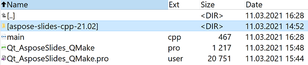
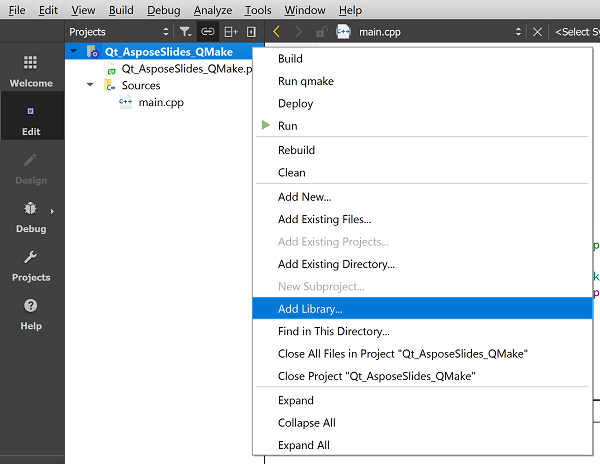

## **Inleiding**

Qt is een op C++ gebaseerd, cross‑platform framework voor applicatie‑ontwikkeling dat veel wordt gebruikt om een breed scala aan desktop‑, mobiele en embedded systeemapplicaties te ontwikkelen. Aspose.Slides for C++ kan in Qt worden geïntegreerd om PowerPoint‑documenten te maken en te bewerken in uw Qt‑applicaties.

## **Gebruik van Aspose.Slides for C++ binnen Qt Creator**

Om Aspose.Slides for C++ in uw Qt‑applicatie te gebruiken, downloadt u de nieuwste versie van de API via de [downloads](https://downloads.aspose.com/slides/nl/cpp) sectie. Nadat de API is gedownload, kunt u de C++‑bibliotheek integreren in Qt Creator of Visual Studio.

Om de Aspose.Slides for C++‑bibliotheek te integreren en te gebruiken binnen een Qt Console Application die in Qt Creator is ontwikkeld, volgt u de onderstaande stappen:

- Open Qt Creator en maak een nieuwe *Qt Console Application*.

- Selecteer de QMake‑optie in de *Build System* vervolgkeuzelijst.

- Kies de juiste kit en rond de wizard af.
- Kopieer de map `aspose-slides-cpp-21.02` uit het uitgepakte pakket van Aspose.Slides for C++ naar de root van het project.

- Om paden naar de lib‑ en include‑mappen toe te voegen, klik met de rechtermuisknop op het project in het linkerpaneel en selecteer *Add Library*.

- Kies de optie **External Library** en blader één voor één naar de include‑ en lib‑mappen.

- Na afloop bevat uw `.pro`‑projectbestand de volgende items:

- Bouw de applicatie en de integratie is voltooid.  

{}

Opmerking: zie het [full demo project](https://github.com/aspose-slides/Aspose.Slides-for-C/tree/master/QtDemos/QtCreator/Qt_AsposeSlides_QMake) voor meer informatie.

{}

## **Gebruik van Aspose.Slides for C++ in Qt‑applicaties binnen Visual Studio**

Om een Qt‑applicatie te ontwikkelen met Visual Studio, moet u [Qt Visual Studio Tools](https://marketplace.visualstudio.com/items?itemName=TheQtCompany.QtVisualStudioTools-19123) installeren. Nadat de installatie is voltooid, downloadt u de nieuwste versie van de API via de [downloads](https://downloads.aspose.com/slides/nl/cpp) sectie en volgt u de onderstaande stappen:

- Open Microsoft Visual Studio en maak een nieuwe *Qt Console Application*.

- Kies de juiste kit en rond de wizard af.
- Om de Aspose.Slides for C++‑bibliotheek te integreren en te gebruiken, klik met de rechtermuisknop op het project en selecteer *Manage NuGet Packages...*.

- Zoek en installeer het benodigde *Aspose.Slides.Cpp*‑pakket.

- Bouw het project en de integratie is voltooid.  

{}

Opmerking: zie het [full demo project](https://github.com/aspose-slides/Aspose.Slides-for-C/tree/master/QtDemos/Visual%20Studio/Qt_AsposeSlides_VS) voor meer informatie.

{}