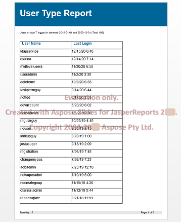

## **Welkom bij de Aspose.Slides for JasperReports!**

Aspose.Slides for JasperReports is een bibliotheek speciaal ontworpen en ontwikkeld voor ontwikkelaars die eenvoudig rapporten van JasperReports naar Microsoft PowerPoint Presentation (PPT) en Microsoft PowerPoint Show (PPS) formaten moeten exporteren in hun Java‑applicaties. Alle rapportfuncties worden met de hoogste precisie omgezet naar Microsoft PowerPoint‑presentaties. Aspose.Slides for JasperReports bevat ondersteuning voor JasperReports 5+.

## **Productbeschrijving**
JasperReports en JasperServer hebben geen ingebouwde mogelijkheden om rapporten te exporteren als Microsoft PowerPoint‑presentaties, maar Aspose.Slides for JasperReports geeft u toegang tot twee aanvullende exportformaten:

- PPT – PowerPoint Presentation via Aspose.Slides
- PPS – PowerPoint Show via Aspose.Slides
- PPTX – PowerPoint Presentation via Aspose.Slides
- PPSX – PowerPoint Show via Aspose.Slides

Aspose.Slides for JasperReports maakt intern gebruik van onze 100 % pure Java‑bibliotheken Aspose.Slides for Java en Aspose.Metafiles for Java, wereldklasse bibliotheken voor server‑side presentaties en metafile‑verwerking.

Aspose.Slides for JasperReports maakt het mogelijk om elk rapport te exporteren in PPT‑ of PPS‑formaat.

### **Voorbeeld van de uitvoer**
De ASPptExporter‑klasse erft van de ASAbstractExporter‑klasse, zodat hij op dezelfde manier kan worden gebruikt als alle andere standaard exporters. Dit korte voorbeeld toont typische code en een screenshot van een rapport bekeken in MS PowerPoint. Gedetailleerde voorbeelden zijn te vinden in de meegeleverde demo‑rapporten.

``` java
File sourceFile = new File(fileName); 
JasperPrint jasperPrint = (JasperPrint)JRLoader.loadObject(sourceFile);
File destFile = new File(sourceFile.getParent(), jasperPrint.getName() + ".ppt");
ASPptExporter exporter = new ASPptExporter();
exporter.setParameter(JRExporterParameter.JASER_PRINT, jasperPrint);
exporter.setParameter(JRExporterParameter.OUTPUT_FILE_NAME, destFile.toString());
exporter.exportReport();
```

**Presentatie gegenereerd met JasperReports xmldatasource demo**

