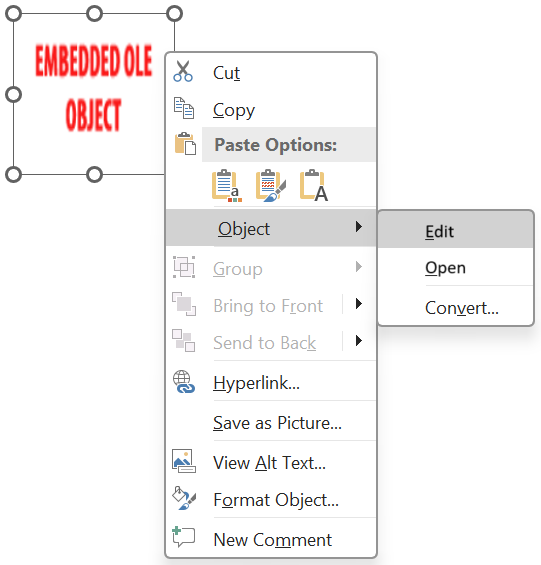

## **Introductie**

Met Aspose.Slides voor Java, wanneer je een [OleObjectFrame](https://reference.aspose.com/slides/nl/java/com.aspose.slides/oleobjectframe/) toevoegt aan een dia, wordt een "EMBEDDED OLE OBJECT" bericht getoond op de uitvoer‑dia. Dit bericht is opzettelijk en NIET een fout.

Voor meer informatie over het werken met OLE‑objecten, zie [Manage OLE](/slides/nl/java/manage-ole/).

## **Uitleg en Oplossing**

Aspose.Slides toont het "EMBEDDED OLE OBJECT" bericht om u te laten weten dat het OLE‑object is gewijzigd en dat de voorbeeldafbeelding moet worden bijgewerkt.

Bijvoorbeeld, als je een Microsoft Excel‑grafiek toevoegt als een [OleObjectFrame](https://reference.aspose.com/slides/nl/java/com.aspose.slides/oleobjectframe/) aan een dia (voor meer details, zie het artikel "Manage OLE") en vervolgens de presentatie opent in Microsoft PowerPoint, zie je deze afbeelding op de dia:


Als je wilt controleren en bevestigen dat jouw OLE‑object aan de dia is toegevoegd, moet je dubbelklikken op het "EMBEDDED OLE OBJECT" bericht, of je kunt er met de rechtermuisknop op klikken en via de optie **Object > Bewerken** gaan.



PowerPoint opent dan het ingebedde OLE‑object.


De dia kan het "EMBEDDED OLE OBJECT" bericht behouden. Zodra je op het OLE‑object klikt, wordt de dia‑preview bijgewerkt en wordt het "EMBEDDED OLE OBJECT" bericht vervangen door de eigenlijke afbeelding van het OLE‑object.


Nu wil je mogelijk de presentatie opslaan om ervoor te zorgen dat de afbeelding voor het OLE‑object correct wordt bijgewerkt. Op die manier zie je na het opslaan en opnieuw openen van de presentatie het "EMBEDDED OLE OBJECT" bericht NIET meer.

## **Andere Oplossing**

Als je het "EMBEDDED OLE OBJECT" bericht niet wilt verwijderen door de presentatie in PowerPoint te openen en vervolgens op te slaan, kun je het bericht vervangen door je gewenste voorbeeldafbeelding. Deze code‑regels demonstreren het proces. Ze gaan ervan uit dat de eerste vorm op de eerste dia van *embeddedOLE.pptx* het OLE‑object‑frame is en dat *myImage.png* de afbeelding bevat die moet worden weergegeven, en ze slaan het resultaat op als *embeddedOLE-newImage.pptx*:

```java
import com.aspose.slides.*;

Presentation presentation = new Presentation("embeddedOLE.pptx");
try {
    ISlide slide = presentation.getSlides().get_Item(0);
    IOleObjectFrame oleFrame = (IOleObjectFrame) slide.getShapes().get_Item(0);

    // Voeg een afbeelding toe aan de presentatieresources.
    IImage image = Images.fromFile("myImage.png");
    IPPImage oleImage = presentation.getImages().addImage(image);
    image.dispose();

    // Stel de afbeelding in voor de OLE-objectvoorbeeld.
    oleFrame.getSubstitutePictureFormat().getPicture().setImage(oleImage);
    oleFrame.setObjectIcon(false);

    presentation.save("embeddedOLE-newImage.pptx", SaveFormat.Pptx);
} finally {
    presentation.dispose();
}
```

De dia met de `OleObjectFrame` verandert dan in dit:

