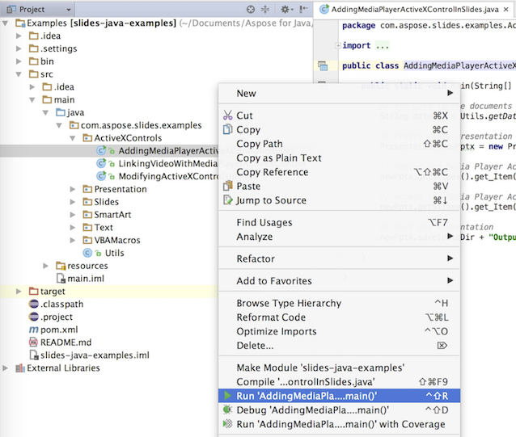

## **Download Aspose.Slides van GitHub**
Alle voorbeelden van Aspose.Slides voor Java worden gehost op [Github](https://github.com/aspose-slides/Aspose.Slides-for-Java). U kunt de repository klonen met uw favoriete Github‑client of het ZIP‑bestand downloaden van [hier](https://codeload.github.com/aspose-slides/Aspose.Slides-for-Java/zip/master).

Pak de inhoud van het ZIP‑bestand uit naar een willekeurige map op uw computer. Alle voorbeelden staan in de **Examples** map.


## **Importeer voorbeelden in de IDE**
Het project gebruikt het Maven‑build‑systeem. Elke moderne IDE kan het project en de afhankelijkheden eenvoudig openen of importeren. Hieronder laten we zien hoe u populaire IDE's kunt gebruiken om de voorbeelden te bouwen en uit te voeren.

### **IntelliJ IDEA**
Klik op het menu **File** en kies **Open**. Blader naar de projectmap en selecteer het **pom.xml**‑bestand.


Het zal het project openen en de afhankelijkheden automatisch downloaden. Vanuit het Project‑tabblad kunt u de voorbeelden in de map **src/main/java** bekijken. Om een voorbeeld uit te voeren, klikt u met de rechtermuisknop op het bestand en kiest u “Run ..”, waarna het voorbeeld wordt uitgevoerd en de output wordt weergegeven in het ingebouwde console‑outputvenster.



### **Eclipse**
Klik op het menu **File** en kies **Import**. Selecteer **Maven** - Existing Maven Projects.


Blader naar de map die u van GitHub heeft gekloond of gedownload en selecteer het **pom.xml**‑bestand. Het zal het project openen en de afhankelijkheden automatisch downloaden. Vanuit het tabblad Package Explorer kunt u de voorbeelden in de map **src/main/java** bekijken. Om een voorbeeld uit te voeren, klikt u met de rechtermuisknop op het bestand en kiest u **Run As** - **Java Application**, waarna het voorbeeld wordt uitgevoerd en de output wordt weergegeven in het ingebouwde console‑outputvenster.


### **NetBeans**
Klik op het menu **File** en kies **Open Project**. Blader naar de map die u van GitHub heeft gekloond of gedownload. Het pictogram van de **Examples**‑map geeft aan dat het een Maven‑project is. Selecteer Examples en open het.


Het zal het project openen en de afhankelijkheden automatisch downloaden. Vanuit het tabblad Projects kunt u de voorbeelden in **source packages** bekijken. Om een voorbeeld uit te voeren, klikt u met de rechtermuisknop op het bestand en kiest u **Run File**, waarna het voorbeeld wordt uitgevoerd en de output wordt weergegeven in het ingebouwde console‑outputvenster.


## **Voeg Aspose.Slides‑bibliotheek toe aan de Maven‑lokale repository**
Wanneer u het project **Aspose.Slides Examples** in een IDE importeert, downloadt Maven automatisch het aspose.slides‑JAR‑bestand van de [Aspose Maven Repository](https://releases.aspose.com/java/repo/com/aspose/). Als u geen internettoegang heeft, kunt u het JAR‑bestand handmatig aan uw lokale repository toevoegen.

### **mvn install**
Download de [aspose.slides](https://releases.aspose.com/java/repo/com/aspose/aspose-slides/), pak deze uit en kopieer het aspose.slides‑versie.jar naar een andere locatie, bijvoorbeeld de C‑schijf. Voer het volgende commando uit:

```
mvn install:install-file
    - Dfile=c:\aspose.slides-version.jar
    - DgroupId=com.aspose
    - DartifactId=aspose-slides
    - Dversion={version}
    - Dpackaging=jar
```

Nu is het **aspose.slides**‑JAR gekopieerd naar uw Maven‑lokale repository.

### **pom.xml**
Na installatie hoeft u alleen de **aspose.slides**‑coördinate in pom.xml te declareren. Voeg de volgende repository toe in het tabblad repositories en de afhankelijkheid in het tabblad dependencies.

``` xml
<repository>
    <id>AsposeJavaAPI</id>
    <name>Aspose Java API</name>
    <url>https://releases.aspose.com/java/repo/</url>
</repository>

<dependency>
    <groupId>com.aspose</groupId>
    <artifactId>aspose-slides</artifactId>
    <version>26.10</version>
    <classifier>jdk8</classifier>
</dependency>
```

### **Klaar**
Bouw het, nu kan het **aspose.slides**‑JAR‑bestand worden opgehaald uit uw Maven‑lokale repository.

## **Bijdragen**
Als u een voorbeeld wilt toevoegen of verbeteren, moedigen we u aan bij te dragen aan het project. Alle voorbeelden en showcase‑projecten in deze repository zijn open source en kunnen vrij worden gebruikt in uw eigen toepassingen.

Om bij te dragen, kunt u de repository forken, de broncode bewerken en een Pull Request indienen. We zullen de wijzigingen beoordelen en opnemen in de repository indien ze nuttig zijn.