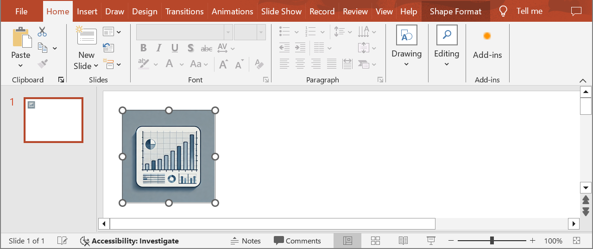

## **Inleiding**

Met Aspose.Slides voor .NET, wanneer je een [OleObjectFrame](https://reference.aspose.com/slides/nl/net/aspose.slides/oleobjectframe) aan een dia toevoegt, wordt een bericht "EMBEDDED OLE OBJECT" getoond op de uitvoer‑dia. Dit bericht is opzettelijk en GEEN fout.

Voor meer informatie over het werken met OLE‑objecten, zie [Manage OLE](/slides/nl/net/manage-ole/).

## **Uitleg en Oplossing**

Aspose.Slides toont het bericht "EMBEDDED OLE OBJECT" om je te laten weten dat het OLE‑object is gewijzigd en dat de voorbeeldafbeelding moet worden bijgewerkt.

Bijvoorbeeld, als je een Microsoft Excel‑grafiek als een [OleObjectFrame](https://reference.aspose.com/slides/nl/net/aspose.slides/oleobjectframe) aan een dia toevoegt (voor meer details, zie het artikel "Manage OLE") en vervolgens de presentatie opent in Microsoft PowerPoint, zie je deze afbeelding op de dia:


Als je wilt controleren en bevestigen dat je OLE‑object aan de dia is toegevoegd, moet je dubbelklikken op het bericht "EMBEDDED OLE OBJECT", of er met de rechtermuisknop op klikken en kiezen voor **Object > Edit**.


PowerPoint opent dan het ingebedde OLE‑object.


De dia kan het bericht "EMBEDDED OLE OBJECT" behouden. Zodra je op het OLE‑object klikt, wordt de dia‑preview bijgewerkt en wordt het bericht "EMBEDDED OLE OBJECT" vervangen door de werkelijke afbeelding van het OLE‑object.


Nu wil je de presentatie misschien opslaan om ervoor te zorgen dat de afbeelding van het OLE‑object correct wordt bijgewerkt. Op deze manier zie je na het opslaan van de presentatie, en bij het opnieuw openen, GEEN bericht "EMBEDDED OLE OBJECT" meer.

## **Andere Oplossingen**

### **Oplossing 1: Het bericht “Embedded OLE Object” vervangen door een afbeelding**

Als je het bericht "EMBEDDED OLE OBJECT" niet wilt verwijderen door de presentatie in PowerPoint te openen en vervolgens op te slaan, kun je het bericht vervangen door de door jou gewenste voorbeeldafbeelding. Deze code‑fragmenten tonen het proces:

```cs
using var presentation = new Presentation("embeddedOLE.pptx");

var slide = presentation.Slides[0];
var oleFrame = (IOleObjectFrame)slide.Shapes[0];

// Add an image to presentation resources.
using var imageStream = File.OpenRead("myImage.png");
var oleImage = presentation.Images.AddImage(imageStream);

// Set a title and the image for the OLE object preview.
oleFrame.SubstitutePictureTitle = "My title";
oleFrame.SubstitutePictureFormat.Picture.Image = oleImage;
oleFrame.IsObjectIcon = false;

presentation.Save("embeddedOLE-newImage.pptx", SaveFormat.Pptx);
```

De dia die de `OleObjectFrame` bevat, verandert vervolgens in dit:



### **Oplossing 2: Een add‑on voor PowerPoint maken**

Je kunt ook een add‑on voor Microsoft PowerPoint maken die alle OLE‑objecten bijwerkt wanneer je presentaties in het programma opent.