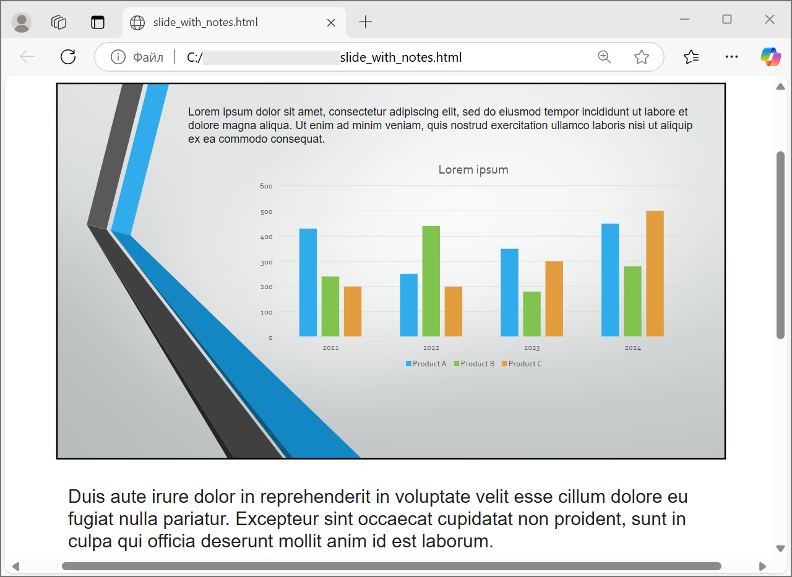

## **Overzicht**

Aspose.Slides voor .NET kan PowerPoint‑presentaties opslaan als HTML zonder Microsoft PowerPoint. De basale conversie bestaat uit één [Presentation](https://reference.aspose.com/slides/nl/net/aspose.slides/presentation/) laden en een [Save](https://reference.aspose.com/slides/nl/net/aspose.slides/presentation/save/) aanroep met [SaveFormat](https://reference.aspose.com/slides/nl/net/aspose.slides.export/saveformat/). Gebruik [HtmlOptions](https://reference.aspose.com/slides/nl/net/aspose.slides.export/htmloptions/) wanneer je de geëxporteerde lay‑out, lettertypen, afbeeldingen, notities, opmerkingen, SVG‑uitvoer of gekoppelde bronnen moet beheersen.

Deze gids richt zich op praktische HTML‑exportscenario's:

- Exporteer een volledige presentatie of geselecteerde dia's.
- Genereer vaste lay‑out, responsieve of SVG‑gebaseerde HTML.
- Neem spreker‑notities en opmerkingen op.
- Beheer beeldkwaliteit en bijgesneden afbeeldingsgegevens.
- Integreer lettertypen of sla lettertypebestanden afzonderlijk op.
- Kies hoe externe bronnen en mediabestanden worden weggeschreven en gerefereerd.

Standaard produceert HTML‑export een zelf‑containend HTML‑document waarbij de meeste bronnen zijn ingebed. Dit is handig om één bestand te delen, maar kan de outputgrootte vergroten. Voor publicatie op het web, overweeg externe bronnen, een lagere DPI voor afbeeldingen, en alleen lettertypen in te sluiten die niet betrouwbaar beschikbaar zijn in de doelomgeving.

## **Converteer een presentatie naar HTML**

Om een presentatie naar HTML te exporteren, laad je deze met [Presentation](https://reference.aspose.com/slides/nl/net/aspose.slides/presentation/) en sla je hem op met [SaveFormat.Html](https://reference.aspose.com/slides/nl/net/aspose.slides.export/saveformat/).

```csharp
using var presentation = new Presentation("presentation.pptx");

presentation.Save("presentation.html", SaveFormat.Html);
```

Dit voorbeeld schrijft één HTML‑bestand. Het presentatiedobject wordt afgevoerd door de `using`‑verklaring, die bestands‑handles en render‑bronnen vrijgeeft na de export.

## **Gebruik HtmlOptions**

[HtmlOptions](https://reference.aspose.com/slides/nl/net/aspose.slides.export/htmloptions/) is de belangrijkste configuratieklasse voor HTML‑export. Veelvoorkomende instellingen omvatten:

- `SlidesLayoutOptions`: voegt notities, opmerkingen, hand‑outs of andere lay‑out‑informatie toe.
- `HtmlFormatter`: wijzigt de HTML‑documentstructuur of delegeert formattering aan een controller.
- `SlideImageFormat`: verandert hoe dia’s worden weergegeven, bijvoorbeeld als SVG.
- `PicturesCompression`: beheert de DPI van afbeeldingen en de outputgrootte.
- `DeletePicturesCroppedAreas`: behoudt of verwijdert bijgesneden afbeeldingsgegevens.
- `SvgResponsiveLayout`: zorgt ervoor dat geëxporteerde SVG‑inhoud zich aanpast aan de container.
- `ShowHiddenSlides`: neemt verborgen dia’s op wanneer vereist.

De volgende secties tonen de meest voorkomende opties afzonderlijk zodat je alleen die kunt combineren die jouw workflow nodig heeft.

## **Converteer geselecteerde dia's naar HTML**

De [Presentation.Save](https://reference.aspose.com/slides/nl/net/aspose.slides/presentation/save/) overload die diapositienummers accepteert, gebruikt 1‑gebaseerde dia‑posities. De onderstaande lus slaat elke dia op in een afzonderlijk HTML‑bestand.

```csharp
using var presentation = new Presentation("presentation.pptx");

var slideCount = presentation.Slides.Count;

for (var slideIndex = 0; slideIndex < slideCount; slideIndex++)
{
    var slideNumber = slideIndex + 1;
    var slideNumbers = new[] { slideNumber };
    var htmlFileName = $"slide-{slideNumber}.html";

    presentation.Save(htmlFileName, slideNumbers, SaveFormat.Html);
}
```

Gebruik dit patroon wanneer een website of applicatie één HTML‑pagina per dia nodig heeft. Als elke dia dezelfde lay‑out moet hebben, maak dan één [HtmlOptions](https://reference.aspose.com/slides/nl/net/aspose.slides.export/htmloptions/)‑instantie aan en geef deze door aan elke `Save`‑aanroep.

## **Maak responsieve HTML**

[ResponsiveHtmlController](https://reference.aspose.com/slides/nl/net/aspose.slides.export/responsivehtmlcontroller/) levert responsieve HTML‑output via [HtmlFormatter](https://reference.aspose.com/slides/nl/net/aspose.slides.export/htmlformatter/). Gebruik dit wanneer de geëxporteerde pagina zich beter aan de breedte van de browser moet aanpassen.

```csharp
using var presentation = new Presentation("presentation.pptx");

var controller = new ResponsiveHtmlController();
var formatter = HtmlFormatter.CreateCustomFormatter(controller);

var htmlOptions = new HtmlOptions
{
    HtmlFormatter = formatter
};

presentation.Save("presentation-responsive.html", SaveFormat.Html, htmlOptions);
```

Voor SVG‑gebaseerde responsieve lay‑out, zet `SvgResponsiveLayout` op [HtmlOptions](https://reference.aspose.com/slides/nl/net/aspose.slides.export/htmloptions/). Dit is nuttig wanneer de dia‑inhoud wordt geëxporteerd als schaalbare SVG‑markup.

```csharp
using var presentation = new Presentation("presentation.pptx");

var htmlOptions = new HtmlOptions
{
    SvgResponsiveLayout = true
};

presentation.Save("presentation-svg-responsive.html", SaveFormat.Html, htmlOptions);
```

## **Voeg spreker‑notities en opmerkingen toe**

Gebruik [NotesCommentsLayoutingOptions](https://reference.aspose.com/slides/nl/net/aspose.slides.export/notescommentslayoutingoptions/) via `HtmlOptions.SlidesLayoutOptions` om spreker‑notities of opmerkingen op te nemen. Notities en opmerkingen zijn standaard verborgen tenzij je hun posities kiest.

Stel dat de bronpresentatie spreker‑notities bevat:


De volgende code exporteert de dia‑inhoud met spreker‑notities onder de dia.

```csharp
using var presentation = new Presentation("presentation.pptx");

var layoutOptions = new NotesCommentsLayoutingOptions
{
    NotesPosition = NotesPositions.BottomFull
};

var htmlOptions = new HtmlOptions
{
    SlidesLayoutOptions = layoutOptions
};

presentation.Save("presentation-with-notes.html", SaveFormat.Html, htmlOptions);
```



Om opmerkingen te exporteren, stel `CommentsPosition` in, bijvoorbeeld op `CommentsPositions.Right` of `CommentsPositions.Bottom`. Als je alleen opmerkingen nodig hebt, laat `NotesPosition` weg. Als je zowel notities als opmerkingen nodig hebt, stel beide eigenschappen in.

## **Beheer beeldkwaliteit en bijgesneden gebieden**

HTML‑export kan dia‑afbeeldingen comprimeren om de outputgrootte te verkleinen. Stel `PicturesCompression` in op een waarde uit [PicturesCompression](https://reference.aspose.com/slides/nl/net/aspose.slides.export/picturescompression/) wanneer je hogere beeldkwaliteit nodig hebt.

```csharp
using var presentation = new Presentation("presentation.pptx");

var htmlOptions = new HtmlOptions
{
    PicturesCompression = PicturesCompression.Dpi150
};

presentation.Save("presentation-dpi-150.html", SaveFormat.Html, htmlOptions);
```

Standaard kunnen bijgesneden delen van afbeeldingen uit de geëxporteerde output worden verwijderd. Houd bijgesneden gegevens alleen bij wanneer gebruikers die verborgen afbeeldingdelen moeten kunnen herstellen of inspecteren. Het behouden ervan kan de HTML‑grootte verhogen.

```csharp
using var presentation = new Presentation("presentation.pptx");

var htmlOptions = new HtmlOptions
{
    DeletePicturesCroppedAreas = false
};

presentation.Save("presentation-with-cropped-areas.html", SaveFormat.Html, htmlOptions);
```

## **Voeg CSS toe**

Voor eenvoudige opmaak, geef een CSS‑string door aan [HtmlFormatter.CreateDocumentFormatter](https://reference.aspose.com/slides/nl/net/aspose.slides.export/htmlformatter/createdocumentformatter/). Dit wijzigt het omringende HTML‑document terwijl Aspose.Slides de dia‑inhoud blijft renderen.

```csharp
using var presentation = new Presentation("presentation.pptx");

var cssRules = "body { margin: 0; background: #f7f7f7; } .slide { margin: 24px auto; }";
var formatter = HtmlFormatter.CreateDocumentFormatter(cssRules, true);

var htmlOptions = new HtmlOptions
{
    HtmlFormatter = formatter
};

presentation.Save("presentation-styled.html", SaveFormat.Html, htmlOptions);
```

Voor een aangepast document‑header, een gekoppeld CSS‑bestand, of aangepaste markup rond dia’s en vormen, implementeer [IHtmlFormattingController](https://reference.aspose.com/slides/nl/net/aspose.slides.export/ihtmlformattingcontroller/) en geef deze door aan [HtmlFormatter](https://reference.aspose.com/slides/nl/net/aspose.slides.export/htmlformatter/) met `CreateCustomFormatter`.

## **Lettertypen insluiten**

Als de doelomgeving mogelijk niet de presentatiellettertypen geïnstalleerd heeft, sluit dan lettertypen in de HTML in met [EmbedAllFontsHtmlController](https://reference.aspose.com/slides/nl/net/aspose.slides.export/embedallfontshtmlcontroller/). Insluiten verbetert de visuele getrouwheid maar vergroot de outputgrootte.

```csharp
using var presentation = new Presentation("presentation.pptx");

string[] fontNamesToExclude = { "Arial", "Calibri" };
var fontController = new EmbedAllFontsHtmlController(fontNamesToExclude);
var formatter = HtmlFormatter.CreateCustomFormatter(fontController);

var htmlOptions = new HtmlOptions
{
    HtmlFormatter = formatter
};

presentation.Save("presentation-embedded-fonts.html", SaveFormat.Html, htmlOptions);
```

Sluit lettertypen uit alleen wanneer je er zeker van bent dat de doelbrowsers of -systemen ze al beschikbaar hebben. Voor merkletttypen of minder gangbare lettertypen is insluiten doorgaans veiliger.

## **Koppel lettertypebestanden in plaats van ze in te sluiten**

Om de HTML‑bestandsgrootte te verkleinen, kun je lettertypegegevens naar afzonderlijke WOFF‑bestanden schrijven en `@font-face`‑regels aan de HTML toevoegen. De helper hieronder breidt [EmbedAllFontsHtmlController](https://reference.aspose.com/slides/nl/net/aspose.slides.export/embedallfontshtmlcontroller/) uit en overschrijft `WriteFont`.

```cs
using var presentation = new Presentation("presentation.pptx");

var outputDirectory = Path.Combine(Environment.CurrentDirectory, "html-output");
var fontsDirectory = Path.Combine(outputDirectory, "fonts");
Directory.CreateDirectory(outputDirectory);

var fontController = new LinkedFontsHtmlController(fontsDirectory, "fonts");
var formatter = HtmlFormatter.CreateCustomFormatter(fontController);

var htmlOptions = new HtmlOptions
{
    HtmlFormatter = formatter
};

var htmlFilePath = Path.Combine(outputDirectory, "presentation.html");
presentation.Save(htmlFilePath, SaveFormat.Html, htmlOptions);
```
```cs
public sealed class LinkedFontsHtmlController : EmbedAllFontsHtmlController
{
    private readonly string _fontOutputDirectory;
    private readonly string _fontUrlPrefix;

    public LinkedFontsHtmlController(
        string fontOutputDirectory,
        string fontUrlPrefix)
        : base(Array.Empty<string>())
    {
        _fontOutputDirectory = fontOutputDirectory;
        _fontUrlPrefix = fontUrlPrefix.TrimEnd('/') + "/";

        Directory.CreateDirectory(_fontOutputDirectory);
    }

    public override void WriteFont(
        IHtmlGenerator generator,
        IFontData originalFont,
        IFontData substitutedFont,
        string fontStyle,
        string fontWeight,
        byte[] fontData)
    {
        var font = substitutedFont ?? originalFont;
        var safeFontName = MakeSafeFileName(font.FontName);
        var safeFontStyle = string.IsNullOrWhiteSpace(fontStyle) ? "normal" : fontStyle;
        var safeFontWeight = string.IsNullOrWhiteSpace(fontWeight) ? "normal" : fontWeight;
        var fontFileName = $"{safeFontName}-{safeFontStyle}-{safeFontWeight}.woff";
        var fontFilePath = Path.Combine(_fontOutputDirectory, fontFileName);

        File.WriteAllBytes(fontFilePath, fontData);

        var fontUrl = _fontUrlPrefix + Uri.EscapeDataString(fontFileName);
        var fontFamily = font.FontName.Replace("\\", "\\\\").Replace("'", "\\'");

        generator.AddHtml("<style>");
        generator.AddHtml("@font-face {");
        generator.AddHtml($"font-family: '{fontFamily}';");
        generator.AddHtml($"font-style: {safeFontStyle};");
        generator.AddHtml($"font-weight: {safeFontWeight};");
        generator.AddHtml($"src: url('{fontUrl}') format('woff');");
        generator.AddHtml("}");
        generator.AddHtml("</style>");
    }

    private static string MakeSafeFileName(string fileName)
    {
        var invalidCharacters = Path.GetInvalidFileNameChars();
        var safeCharacters = fileName.ToCharArray();

        for (var characterIndex = 0; characterIndex < safeCharacters.Length; characterIndex++)
        {
            if (Array.IndexOf(invalidCharacters, safeCharacters[characterIndex]) >= 0)
            {
                safeCharacters[characterIndex] = '_';
            }
        }

        return new string(safeCharacters);
    }
}
```

In dit voorbeeld worden lettertypebestanden opgeslagen in `html-output/fonts`, en de HTML verwijst ernaar met URL’s zoals `fonts/BrandFont-normal-400.woff`. Als het HTML‑bestand en de lettertypen naar een andere locatie worden gedeployd, kies dan `fontUrlPrefix` zodat het overeenkomt met het gedeployde URL‑pad.

## **Sla bronnen extern op**

Zelf‑containende HTML is gemakkelijk te verplaatsen, maar ingebedde Base64‑bronnen kunnen het bestand groot maken. Als je applicatie externe beeldbestanden nodig heeft, implementeer dan [ILinkEmbedController](https://reference.aspose.com/slides/nl/net/aspose.slides.export/ilinkembedcontroller/) en geef deze door aan de [HtmlOptions](https://reference.aspose.com/slides/nl/net/aspose.slides.export/htmloptions/htmloptions/)‑constructor.

Wanneer je bronnen extern maakt, kies je twee paden bewust:

- Het uitvoerpad op het bestandssysteem, waar je applicatie gegenereerde afbeeldingen, lettertypen, audio of video schrijft.
- Het URL‑pad, dat de browser gebruikt vanuit het HTML‑document om die bestanden te laden.

Voor een volledige afbeelding‑koppelingsimplementatie, zie [Export Presentations to HTML with Externally Linked Images](/slides/nl/net/exporting-presentations-to-html-with-externally-linked-images/).

## **Exporteer mediabestanden**

[VideoPlayerHtmlController](https://reference.aspose.com/slides/nl/net/aspose.slides.export/videoplayerhtmlcontroller/) exporteert video‑ en audiobestanden en schrijft HTML die ze in een browser kan afspelen. De constructor neemt:

- `path`: de map waarin gegenereerde mediabestanden worden weggeschreven.
- `fileName`: de naam van het gegenereerde HTML‑bestand.
- `baseUri`: het absolute URI‑voorvoegsel dat wordt gebruikt in de HTML‑links naar mediabestanden.

Als het HTML‑bestand `html-output/presentation.html` is en mediabestanden worden opgeslagen in `html-output/media`, moet `path` naar de mediamap op de schijf wijzen, terwijl `baseUri` naar dezelfde map moet wijzen vanuit het perspectief van de browser. Voor lokale preview kun je een `file:///`‑URI bouwen vanuit de mediamap. Voor een gedeployde applicatie, gebruik de absolute URL van de gepubliceerde mediamap.

```csharp
var outputDirectory = Path.Combine(Environment.CurrentDirectory, "html-output");
var mediaDirectory = Path.Combine(outputDirectory, "media");
Directory.CreateDirectory(outputDirectory);
Directory.CreateDirectory(mediaDirectory);

var htmlFileName = "presentation.html";
var mediaBaseUri = new Uri(mediaDirectory + Path.DirectorySeparatorChar).AbsoluteUri;

using var presentation = new Presentation();
using var videoStream = new FileStream("intro.mp4", FileMode.Open, FileAccess.Read);

var video = presentation.Videos.AddVideo(videoStream, LoadingStreamBehavior.ReadStreamAndRelease);
var slide = presentation.Slides[0];
slide.Shapes.AddVideoFrame(20, 20, 480, 270, video);

var controller = new VideoPlayerHtmlController(mediaDirectory, htmlFileName, mediaBaseUri);
var formatter = HtmlFormatter.CreateCustomFormatter(controller);
var svgOptions = new SVGOptions(controller);
var slideImageFormat = SlideImageFormat.Svg(svgOptions);

var htmlOptions = new HtmlOptions(controller)
{
    HtmlFormatter = formatter,
    SlideImageFormat = slideImageFormat
};

var htmlFilePath = Path.Combine(outputDirectory, htmlFileName);
presentation.Save(htmlFilePath, SaveFormat.Html, htmlOptions);
```

Gebruik output‑mappen die uniek zijn per exporttaak, vooral in serverapplicaties. Gedeelde output‑paden kunnen ervoor zorgen dat bestanden van verschillende conversies elkaar overschrijven.

## **Prestaties en bronnenbeheer**

HTML‑conversie is een render‑operatie, dus verwerkingstijd en geheugenverbruik hangen af van het aantal dia’s, beeldresolutie, lettertypen, effecten, grafieken en ingebedde media. Hogere DPI‑waarden voor `PicturesCompression`, ingesloten lettertypen, SVG‑output en bewaarde bijgesneden afbeeldingsgebieden kunnen de getrouwheid verbeteren maar meestal de outputgrootte verhogen.

Voor batch‑conversie:

- Verwijder elke [Presentation](https://reference.aspose.com/slides/nl/net/aspose.slides/presentation/)‑instantie direct.
- Gebruik afzonderlijke output‑mappen voor afzonderlijke taken.
- Vermijd het insluiten van algemene lettertypen tenzij getrouwheid het vereist.
- Verlaag de DPI van afbeeldingen wanneer de HTML bedoeld is voor preview of miniaturen.
- Bewaar de bronpresentatie, de gegenereerde HTML en externe bronnen samen tot de deploy‑paden definitief zijn.

## **FAQ**

**Worden hyperlinks behouden in de HTML-output?**

Ja. Presentatie‑hyperlinks worden geëxporteerd naar HTML en blijven klikbaar wanneer de doel‑URL geldig is.

**Kan ik presentaties parallel naar HTML converteren?**

Ja, maar deel geen enkele [Presentation](https://reference.aspose.com/slides/nl/net/aspose.slides/presentation/)‑instantie over threads heen. Verwerk verschillende bestanden met aparte presentatie‑instanties, aparte streams en aparte output‑mappen. Zie de [multithreading guidance](/slides/nl/net/multithreading/) voor details.

**Is een Presentation‑object thread‑veilig?**

Nee. Een enkele [Presentation](https://reference.aspose.com/slides/nl/net/aspose.slides/presentation/)‑instantie moet op één thread worden geladen, gewijzigd, opgeslagen en verwijderd. Voor parallel werk, maak een onafhankelijke instantie per thread of proces.

**Waarom is het gegenereerde HTML‑bestand groot?**

De standaardexport kan bronnen direct in de HTML insluiten. Ingesloten lettertypen, afbeeldingen met hoge DPI, media, SVG‑inhoud en bewaarde bijgesneden afbeeldingsgebieden vergroten ook de grootte. Gebruik externe bronnen, sluit algemene lettertypen uit van insluiten, en verlaag `PicturesCompression` wanneer een kleiner resultaat belangrijker is dan maximale getrouwheid.

**Waarom wordt een PowerPoint‑lettergrootte zoals 24 pt weergegeven als 17.999819 pt in HTML?**

Dit kan gebeuren omdat PowerPoint en HTML verschillende DPI‑modellen gebruiken. PowerPoint slaat tekstgroottes op in typografische punten gebaseerd op 72 DPI, terwijl HTML‑lay‑out is gebaseerd op CSS‑pixels in een 96 DPI‑model. Wanneer Aspose.Slides een presentatie naar HTML exporteert, wordt de lettergrootte tussen deze systemen vertaald, en kan de conversie kleine afrondingsverschillen introduceren.

Deze waarden geven geen echte visuele wijziging in de lettergrootte aan. Het zijn alleen een wiskundig neveneffect van het converteren van tekstmetriek tussen PowerPoint en HTML.

**Hoe moet ik baseUri kiezen voor media‑export?**

Kies `baseUri` vanuit het perspectief van de browser en geef het door als een absolute URI. Voor lokale preview kun je het afleiden van de output‑map met `new Uri(mediaDirectory + Path.DirectorySeparatorChar).AbsoluteUri`. Voor deployment gebruik je de absolute URL van de gepubliceerde mediamap. Het bestandssysteem‑`path` en de browser‑`baseUri` hoeven niet dezelfde tekenreeks te zijn, maar ze moeten dezelfde locatie van de bron beschrijven.

**Kan ik verborgen dia’s opnemen?**

Ja. Stel `ShowHiddenSlides = true` in op [HtmlOptions](https://reference.aspose.com/slides/nl/net/aspose.slides.export/htmloptions/) wanneer verborgen dia’s moeten worden geëxporteerd.