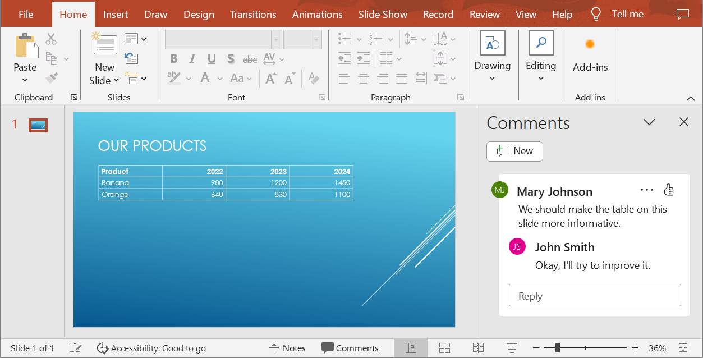

## **Overzicht**

Dit artikel legt uit hoe u PowerPoint‑presentaties kunt converteren naar HTML5 met Aspose.Slides. Het behandelt de basis‑HTML5‑export, evenals opties voor het regelen van vormanimaties en dia‑overgangen. Het artikel laat ook het standaard PowerPoint‑naar‑HTML‑exportproces zien, legt uit hoe u HTML5‑output genereert in slide‑view‑modus, en toont hoe u commentaren in het geëxporteerde document kunt opnemen door hun lay‑out te configureren.

## **PowerPoint exporteren naar HTML5**

Deze C#‑code laat zien hoe u een presentatie naar HTML5 exporteert:

```c#
using Aspose.Slides;
using Aspose.Slides.Export;

using (Presentation pres = new Presentation("pres.pptx"))
{
   pres.Save("pres.html", SaveFormat.Html5);
}
```

{} 
Naast het HTML‑document schrijft de export de ondersteunende bestanden die het gebruikt: `pres.css`, `master.css`, `animation.js`, `effects.js` en `navigation.js`. De gegenereerde pagina laadt ook jQuery en Anime.js van openbare CDN’s; zonder deze werken de slide‑navigatie en animaties niet. 
{}

U kunt instellingen voor vormanimaties en dia‑overgangen op deze manier opgeven:

```c#
using Aspose.Slides;
using Aspose.Slides.Export;

using (Presentation pres = new Presentation("pres.pptx"))
{
   pres.Save("pres5.html", SaveFormat.Html5, new Html5Options
   {
       AnimateShapes = false,
       AnimateTransitions = false
   });
}
```

## **PowerPoint exporteren naar HTML**

Deze C#‑code demonstreert het standaard PowerPoint‑naar‑HTML‑proces:

```c#
using Aspose.Slides;
using Aspose.Slides.Export;

using (Presentation pres = new Presentation("pres.pptx"))
{
   pres.Save("pres.html", SaveFormat.Html);
}
```

In dit geval wordt de presentatie‑inhoud via SVG weergegeven in een vorm zoals hieronder:

```html
<body>
<div class="slide" name="slide" id="slideslideIface1">
     <svg version="1.1">
         <g> THE SLIDE CONTENT GOES HERE </g>
     </svg>
</div>
</body>
```

{} 
Wanneer u deze methode gebruikt om PowerPoint naar HTML te exporteren, kunt u door de SVG‑rendering geen stijlen toepassen of specifieke elementen animeren. 
{}

## **PowerPoint exporteren naar HTML5‑slide‑view**

**Aspose.Slides** stelt u in staat om een PowerPoint‑presentatie om te zetten naar een HTML5‑document waarbij de dia’s worden weergegeven in een slide‑view‑modus. In dit geval ziet u, wanneer u het resulterende HTML5‑bestand in een browser opent, de presentatie in slide‑view‑modus op een webpagina. 

Deze C#‑code demonstreert het PowerPoint‑naar‑HTML5‑slide‑view‑exportproces:

```c#
using Aspose.Slides;
using Aspose.Slides.Export;

using (Presentation pres = new Presentation("pres.pptx"))
{
   pres.Save("HTML5-slide-view.html", SaveFormat.Html5, new Html5Options
   {
       AnimateShapes = true,
       AnimateTransitions = true
   });
}
```

## **Een presentatie omzetten naar een HTML5‑document met commentaren**

Commentaren in PowerPoint zijn een hulpmiddel waarmee gebruikers notities of feedback op presentatiedia’s kunnen achterlaten. Ze zijn bijzonder nuttig in samenwerkingsprojecten, waarbij meerdere personen hun suggesties of opmerkingen kunnen toevoegen aan specifieke diavoorwerpen zonder de hoofdinhoud te wijzigen. Elk commentaar toont de naam van de auteur, waardoor het eenvoudig is om te zien wie de opmerking heeft geplaatst.

Stel dat we de volgende PowerPoint‑presentatie hebben opgeslagen in het bestand "sample.pptx".



Wanneer u een PowerPoint‑presentatie naar een HTML5‑document converteert, kunt u eenvoudig opgeven of commentaren uit de presentatie moeten worden opgenomen in het uitvoer‑document. Hiervoor moet u de weergave‑parameters voor commentaren opgeven in de `NotesCommentsLayouting`‑eigenschap van de klasse [Html5Options](https://reference.aspose.com/slides/nl/net/aspose.slides.export/html5options/) .

De volgende code‑voorbeeld converteert een presentatie naar een HTML5‑document waarbij commentaren rechts van de dia's worden weergegeven.
```cs
using Aspose.Slides;
using Aspose.Slides.Export;

var html5Options = new Html5Options
{
    SlidesLayoutOptions = new NotesCommentsLayoutingOptions
    {
        CommentsPosition = CommentsPositions.Right
    }
};

using var presentation = new Presentation("sample.pptx");
presentation.Save("output.html", SaveFormat.Html5, html5Options);
```


## **FAQ**

### Kan ik regelen of objectanimaties en dia‑overgangen worden afgespeeld in HTML5?

Ja, HTML5 biedt aparte opties om [shape animations](https://reference.aspose.com/slides/nl/net/aspose.slides.export/html5options/animateshapes/) en [slide transitions](https://reference.aspose.com/slides/nl/net/aspose.slides.export/html5options/animatetransitions/) in of uit te schakelen.

### Wordt de weergave van commentaren ondersteund, en waar kunnen ze ten opzichte van de dia worden geplaatst?

Ja, commentaren kunnen in HTML5 worden toegevoegd en worden gepositioneerd (bijvoorbeeld rechts van de dia) via de [layout settings](https://reference.aspose.com/slides/nl/net/aspose.slides.export/html5options/notescommentslayouting/) voor notities en commentaren.

### Kan ik koppelingen die JavaScript oproepen overslaan om veiligheids‑ of CSP‑redenen?

Ja, er is een [setting](https://reference.aspose.com/slides/nl/net/aspose.slides.export/saveoptions/skipjavascriptlinks/) die u toelaat hyperlinks met JavaScript‑aanroepen over te slaan tijdens het opslaan. Dit helpt te voldoen aan strikte veiligheidsbeleid.