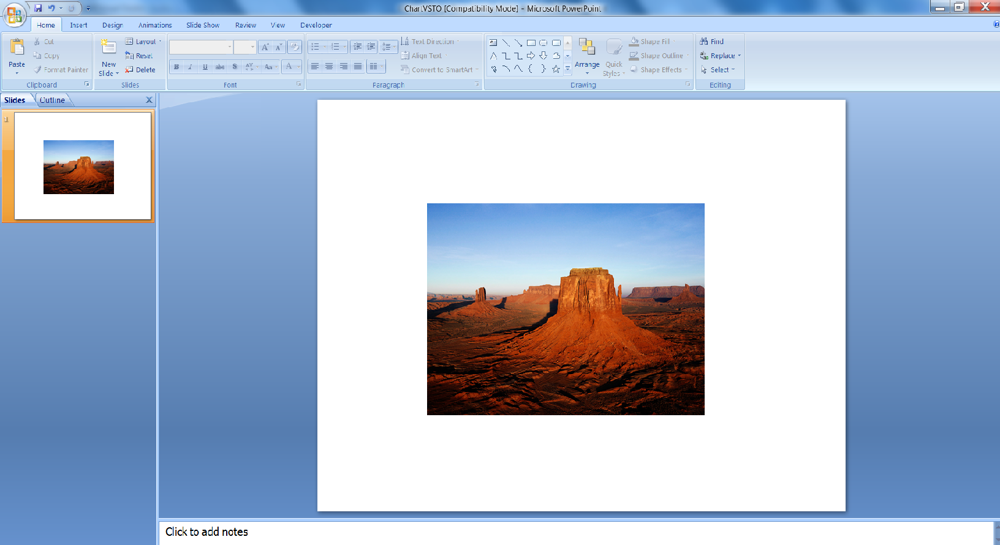

{} 

Beeldkaders worden toegepast op vormen of afbeeldingen in Microsoft PowerPoint om afbeeldingen in een presentatie in te kaderen. Dit artikel laat zien hoe u programmeermatig een beeldkader maakt en er animatie op toepast, eerst met [VSTO 2008](/slides/nl/net/adding-picture-frame-with-animation/) en vervolgens met [Aspose.Slides for .NET](/slides/nl/net/adding-picture-frame-with-animation/). Eerst tonen we hoe u een kader en animatie toepast met VSTO 2008. Daarna laten we zien hoe u dezelfde stappen uitvoert met Aspose.Slides for .NET.

{} 
## **Beeldkaders toevoegen met animatie**
De codevoorbeelden hieronder maken een presentatie met een dia, voegen een afbeelding met een beeldkader toe en passen er animatie op toe.
### **VSTO 2008‑voorbeeld**
Met VSTO 2008, volg de volgende stappen:

1. Maak een presentatie.
1. Voeg een lege dia toe.
1. Voeg een afbeeldingvorm toe aan de dia.
1. Pas animatie toe op de afbeelding.
1. Sla de presentatie op.

**De resulterende presentatie, gemaakt met VSTO** 




```c#
//Lege presentatie maken
PowerPoint.Presentation pres = Globals.ThisAddIn.Application.Presentations.Add(Microsoft.Office.Core.MsoTriState.msoFalse);

//Lege dia toevoegen
PowerPoint.Slide sld = pres.Slides.Add(1, PowerPoint.PpSlideLayout.ppLayoutBlank);

//Beeldkader toevoegen
PowerPoint.Shape PicFrame = sld.Shapes.AddPicture(@"D:\Aspose Data\Desert.jpg",
Microsoft.Office.Core.MsoTriState.msoTriStateMixed,
Microsoft.Office.Core.MsoTriState.msoTriStateMixed, 150, 100, 400, 300);

//Animatie toepassen op beeldkader
PicFrame.AnimationSettings.EntryEffect = Microsoft.Office.Interop.PowerPoint.PpEntryEffect.ppEffectBoxIn;

//Presentatie opslaan
pres.SaveAs("d:\\ VSTOAnim.ppt", PowerPoint.PpSaveAsFileType.ppSaveAsPresentation,
Microsoft.Office.Core.MsoTriState.msoFalse);
```


### **Aspose.Slides for .NET‑voorbeeld**
Met Aspose.Slides for .NET, voer de volgende stappen uit:

1. Maak een presentatie.
1. Open de eerste dia.
1. Voeg een afbeelding toe aan een picture collection.
1. Voeg een afbeeldingvorm toe aan de dia.
1. Pas animatie toe op de afbeelding.
1. Sla de presentatie op.

**De resulterende presentatie, gemaakt met Aspose.Slides** 


```c#
// Lege presentatie maken
using (Presentation pres = new Presentation())
{
    // Toegang tot de eerste dia
    ISlide slide = pres.Slides[0];

    // Een afbeelding toevoegen aan de afbeeldingcollectie van de presentatie
    IImage image = Images.FromFile("aspose.jpg");
    IPPImage ppImage = pres.Images.AddImage(image);
    image.Dispose();

    // Een beeldkader toevoegen waarvan de hoogte en breedte overeenkomen met de hoogte en breedte van de afbeelding
    IPictureFrame pictureFrame = slide.Shapes.AddPictureFrame(ShapeType.Rectangle, 50, 150, ppImage.Width, ppImage.Height, ppImage);

    // De hoofdanimatiesequentie van de dia ophalen
    ISequence sequence = pres.Slides[0].Timeline.MainSequence;

    // Het Fly from Left‑animatie‑effect toevoegen aan het beeldkader
    IEffect effect = sequence.AddEffect(pictureFrame, EffectType.Fly, EffectSubtype.Left, EffectTriggerType.OnClick);

    // De presentatie opslaan
    pres.Save("AsposeAnim.ppt", SaveFormat.Ppt);
}
```