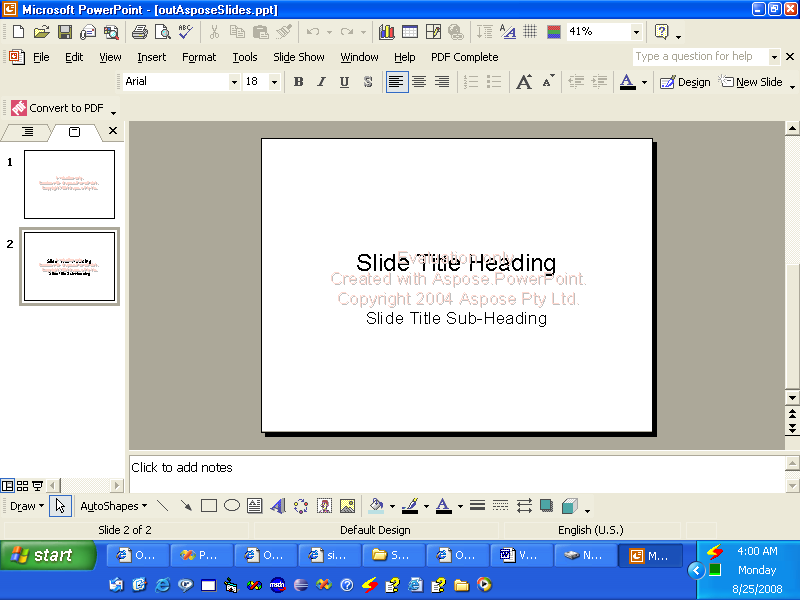

{}

VSTO werd ontwikkeld om ontwikkelaars toe te staan toepassingen te bouwen die binnen Microsoft Office kunnen draaien. VSTO is gebaseerd op COM, maar het is ingepakt in een .NET-object zodat het gebruikt kan worden in .NET-toepassingen. VSTO heeft ondersteuning voor het .NET-framework nodig, evenals de CLR-gebaseerde runtime van Microsoft Office. Hoewel het kan worden gebruikt voor het maken van Microsoft Office-add-ins, is het bijna onmogelijk om het als server-side component te gebruiken. Het heeft bovendien serieuze deployment-problemen.

Aspose.Slides voor .NET is een component die kan worden gebruikt om Microsoft PowerPoint-presentaties te manipuleren, net als VSTO, maar het biedt verschillende voordelen:

- Aspose.Slides bevat uitsluitend beheerde code en vereist geen Microsoft Office-runtime geïnstalleerd.
- Het kan worden gebruikt als client-side component of als server-side component.
- Deployen is eenvoudig omdat Aspose.Slides zich bevindt in één enkele DLL.

{}
## **Creating a Presentation**
Hieronder staan twee code-voorbeelden die illustreren hoe VSTO en Aspose.Slides voor .NET kunnen worden gebruikt om hetzelfde resultaat te behalen. Het eerste voorbeeld is [VSTO](/slides/nl/net/create-a-new-presentation/); [het tweede voorbeeld](/slides/nl/net/create-a-new-presentation/) gebruikt Aspose.Slides.
### **VSTO-voorbeeld**
**De VSTO-output**


```c#
//Opmerking: PowerPoint is een namespace die hierboven op deze manier is gedefinieerd
//using PowerPoint = Microsoft.Office.Interop.PowerPoint;

//Maak een presentatie
PowerPoint.Presentation pres = Globals.ThisAddIn.Application
	.Presentations.Add(Microsoft.Office.Core.MsoTriState.msoFalse);

//Get the title slide layout
PowerPoint.CustomLayout layout = pres.SlideMaster.
	CustomLayouts[PowerPoint.PpSlideLayout.ppLayoutTitle];

//Add a title slide.
PowerPoint.Slide slide = pres.Slides.AddSlide(1, layout);

//Set the title text
slide.Shapes.Title.TextFrame.TextRange.Text = "Slide Title Heading";

//Set the sub title text
slide.Shapes[2].TextFrame.TextRange.Text = "Slide Title Sub-Heading";

//Write the output to disk
pres.SaveAs("c:\\outVSTO.ppt",
	PowerPoint.PpSaveAsFileType.ppSaveAsPresentation,
	Microsoft.Office.Core.MsoTriState.msoFalse);
```


### **Aspose.Slides voor .NET-voorbeeld**
**De output van Aspose.Slides**




```c#
//Maak een presentatie
Presentation pres = new Presentation();

//Voeg de titeldia toe
ISlide slide = pres.Slides.AddEmptySlide(pres.LayoutSlides[0]);


//Stel de titeltekst in
((IAutoShape)slide.Shapes[0]).TextFrame.Text = "Slide Title Heading";

//Stel de subtiteltekst in
((IAutoShape)slide.Shapes[1]).TextFrame.Text = "Slide Title Sub-Heading";

//Schrijf de output naar schijf
pres.Save("c:\\data\\outAsposeSlides.pptx", SaveFormat.Ppt);
```