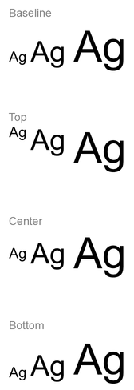

## **Overzicht**

Dit artikel laat zien hoe u tekst kunt opmaken in PowerPoint‑ en OpenDocument‑presentaties met Aspose.Slides voor .NET. Het behandelt achtergrondkleuren, transparantie, tekenafstand, lettertype‑eigenschappen, rotatie, alinea‑afstand, autofit‑gedrag, tekstverankering, tabstops en taalinstellingen.

Tenzij anders vermeld, gebruiken de voorbeelden [sample.pptx](sample.pptx). De eerste vorm op de eerste dia is een tekstvak en de eerste alinea bevat de hieronder getoonde tekst. Zowel dia‑ als vorm‑indexen zijn nul‑gebaseerd. Voorbeelden die vetgedrukte gedeelten selecteren gebruiken effectieve opmaak, inclusief geërfde vetopmaak:


Om letterlijke tekst of reguliere‑expressie‑overeenkomsten te zoeken en te markeren, zie [Zoeken en Vervangen van Tekst](/slides/nl/net/search-and-replace-text/).

## **Tekstachtergrondkleur instellen**

Gebruik [IParagraphFormat.DefaultPortionFormat](https://reference.aspose.com/slides/net/aspose.slides/iparagraphformat/defaultportionformat/) om de standaard markeerkleur voor een alinea in te stellen, of gebruik [IBasePortionFormat.HighlightColor](https://reference.aspose.com/slides/net/aspose.slides/ibaseportionformat/highlightcolor/) voor individuele tekstgedeelten.

Het volgende voorbeeld stelt een lichtgrijze markering in als standaard voor de eerste alinea. Expliciete markeerkleuren op individuele gedeelten hebben voorrang op deze standaard:

```cs
using System.Drawing;
using Aspose.Slides;
using Aspose.Slides.Export;

using var presentation = new Presentation("sample.pptx");
var slide = presentation.Slides[0];

var autoShape = (IAutoShape)slide.Shapes[0];
var paragraph = autoShape.TextFrame.Paragraphs[0];

// Stel de markeerkleur in voor de volledige alinea.
paragraph.ParagraphFormat.DefaultPortionFormat.HighlightColor.Color = Color.LightGray;

presentation.Save("gray_paragraph.pptx", SaveFormat.Pptx);
```

Resultaat:


De code‑voorbeeld hieronder toont hoe u de achtergrondkleur voor **tekstgedeelten met een vet lettertype** kunt instellen:

```cs
using System.Drawing;
using Aspose.Slides;
using Aspose.Slides.Export;

using var presentation = new Presentation("sample.pptx");
var slide = presentation.Slides[0];

var autoShape = (IAutoShape)slide.Shapes[0];
var paragraph = autoShape.TextFrame.Paragraphs[0];

foreach (var portion in paragraph.Portions)
{
    if (portion.PortionFormat.GetEffective().FontBold)
    {
        // Stel de markeerkleur in voor het tekstgedeelte.
        portion.PortionFormat.HighlightColor.Color = Color.LightGray;
    }
}

presentation.Save("gray_text_portions.pptx", SaveFormat.Pptx);
```

Resultaat:


## **Tekst‑alinea’s uitlijnen**

Gebruik [IParagraphFormat.Alignment](https://reference.aspose.com/slides/net/aspose.slides/iparagraphformat/alignment/) om de alinea‑uitlijning binnen een tekstraster te bepalen. De waarde kan gecentreerd, links‑uitgelijnd, rechts‑uitgelijnd, uitgevuld, enz. zijn.

Het volgende code‑voorbeeld laat zien hoe u de alinea naar het **midden** kunt uitlijnen:

```cs
using Aspose.Slides;
using Aspose.Slides.Export;

using var presentation = new Presentation("sample.pptx");
var slide = presentation.Slides[0];

var autoShape = (IAutoShape)slide.Shapes[0];
var paragraph = autoShape.TextFrame.Paragraphs[0];

// Stel de uitlijning van de alinea in op midden.
paragraph.ParagraphFormat.Alignment = TextAlignment.Center;

presentation.Save("aligned_paragraph.pptx", SaveFormat.Pptx);
```

Resultaat:


## **Lettertypen binnen een regel uitlijnen**

Gebruik [IParagraphFormat.FontAlignment](https://reference.aspose.com/slides/net/aspose.slides/iparagraphformat/fontalignment/) om tekstgedeelten met verschillende lettergrootten verticaal binnen een regel uit te lijnen. Deze instelling geldt voor de volledige alinea en regelt de uitlijning binnen elke regel.

Het volgende zelf‑containende voorbeeld maakt vier gelabelde tekstvakken op één dia. Elke alinea bevat dezelfde tekst in 18, 36 en 54 punten, met een andere lettertype‑uitlijning. Het gebruikt Arial, schakelt autofit en woordomslag uit, en houdt de tekstvakken groot genoeg voor één regel.

```cs
using System.Drawing;
using Aspose.Slides;
using Aspose.Slides.Export;

using var presentation = new Presentation();
var slide = presentation.Slides[0];

var alignments = new[] { FontAlignment.Baseline, FontAlignment.Top, FontAlignment.Center, FontAlignment.Bottom };
var fontSizes = new[] { 18f, 36f, 54f };

for (var i = 0; i < alignments.Length; i++)
{
    var shape = slide.Shapes.AddAutoShape(ShapeType.Rectangle, 30, 20 + i * 130, 660, 120);
    shape.FillFormat.FillType = FillType.NoFill;
    shape.LineFormat.FillFormat.FillType = FillType.NoFill;

    var textFrame = shape.TextFrame;
    textFrame.TextFrameFormat.AnchoringType = TextAnchorType.Top;
    textFrame.TextFrameFormat.AutofitType = TextAutofitType.None;
    textFrame.TextFrameFormat.WrapText = NullableBool.False;

    var label = textFrame.Paragraphs[0];
    label.Text = alignments[i].ToString();
    label.ParagraphFormat.Alignment = TextAlignment.Left;
    label.ParagraphFormat.DefaultPortionFormat.FontHeight = 14;
    label.ParagraphFormat.DefaultPortionFormat.LatinFont = new FontData("Arial");
    label.ParagraphFormat.DefaultPortionFormat.FillFormat.FillType = FillType.Solid;
    label.ParagraphFormat.DefaultPortionFormat.FillFormat.SolidFillColor.Color = Color.Gray;

    var paragraph = new Paragraph();
    paragraph.ParagraphFormat.FontAlignment = alignments[i];
    paragraph.ParagraphFormat.Alignment = TextAlignment.Left;
    paragraph.ParagraphFormat.DefaultPortionFormat.LatinFont = new FontData("Arial");
    paragraph.ParagraphFormat.DefaultPortionFormat.FillFormat.FillType = FillType.Solid;
    paragraph.ParagraphFormat.DefaultPortionFormat.FillFormat.SolidFillColor.Color = Color.Black;

    foreach (var fontSize in fontSizes)
    {
        var portion = new Portion("Ag ");
        portion.PortionFormat.FontHeight = fontSize;
        paragraph.Portions.Add(portion);
    }

    textFrame.Paragraphs.Add(paragraph);
}

presentation.Save("font_alignment.pptx", SaveFormat.Pptx);
```

Resultaat:



Lettertype‑uitlijning gebruikt lettertype‑metriek, zodat de zichtbare randen van individuele letters niet noodzakelijk exact op één lijn liggen. Het voorbeeld bevat zowel een hoofdletter als een aflopende letter om het verschil tussen baseline‑ en bottom‑uitlijning te laten zien. De beschikbaarheid van lettertypen en vervanging, de gebruikte tekens, en het verschil in lettergroottes beïnvloeden het resultaat. Frame‑afmetingen, marges, regelafstand, woordomslag en autofit hebben eveneens invloed op de layout; gebruik dezelfde lettertypen en layout‑instellingen bij het vergelijken van modi.

Deze instelling verschilt van [IParagraphFormat.Alignment](https://reference.aspose.com/slides/net/aspose.slides/iparagraphformat/alignment/), die de horizontale alinea‑uitlijning regelt, en van [ITextFrameFormat.AnchoringType](https://reference.aspose.com/slides/net/aspose.slides/itextframeformat/anchoringtype/), die het tekstblok verticaal binnen de vorm positioneert. Superscript‑ en subscript‑opmaak via [IBasePortionFormat.Escapement](https://reference.aspose.com/slides/net/aspose.slides/ibaseportionformat/escapement/) verschuift individuele gedeelten ten opzichte van de baseline in plaats van de lettertype‑uitlijning voor de regels van de alinea in te stellen.

## **Transparantie voor tekst instellen**

Tekst‑transparantie wordt gecontroleerd via het alfa‑onderdeel van de kleur die is toegewezen aan [IBasePortionFormat.FillFormat](https://reference.aspose.com/slides/net/aspose.slides/ibaseportionformat/fillformat/). In de onderstaande voorbeelden is `alpha = 50` een ARGB‑alfa‑kanaalwaarde op de 0‑255‑schaal, geen transparantiepercentage.

Het volgende code‑voorbeeld toont hoe u transparantie toepast op de **volledige alinea**:

```cs
using System.Drawing;
using Aspose.Slides;
using Aspose.Slides.Export;

var alpha = 50;

using var presentation = new Presentation("sample.pptx");
var slide = presentation.Slides[0];

var autoShape = (IAutoShape)slide.Shapes[0];
var paragraph = autoShape.TextFrame.Paragraphs[0];

// Stel een halftransparante zwarte vulling in voor de tekst.
paragraph.ParagraphFormat.DefaultPortionFormat.FillFormat.FillType = FillType.Solid;
paragraph.ParagraphFormat.DefaultPortionFormat.FillFormat.SolidFillColor.Color = Color.FromArgb(alpha, Color.Black);

presentation.Save("transparent_paragraph.pptx", SaveFormat.Pptx);
```

Resultaat:


Het volgende code‑voorbeeld toont hoe u transparantie toepast op **tekstgedeelten met een vet lettertype**:

```cs
using System.Drawing;
using Aspose.Slides;
using Aspose.Slides.Export;

var alpha = 50;

using var presentation = new Presentation("sample.pptx");
var slide = presentation.Slides[0];

var autoShape = (IAutoShape)slide.Shapes[0];
var paragraph = autoShape.TextFrame.Paragraphs[0];

foreach (var portion in paragraph.Portions)
{
    if (portion.PortionFormat.GetEffective().FontBold)
    {
        // Stel de transparantie van het tekstgedeelte in.
        portion.PortionFormat.FillFormat.FillType = FillType.Solid;
        portion.PortionFormat.FillFormat.SolidFillColor.Color = Color.FromArgb(alpha, Color.Black);
    }
}

presentation.Save("transparent_text_portions.pptx", SaveFormat.Pptx);
```

Resultaat:


## **Tekenafstand voor tekst instellen**

Gebruik [IBasePortionFormat.Spacing](https://reference.aspose.com/slides/net/aspose.slides/ibaseportionformat/spacing/) om de afstand tussen tekens in een tekstvak uit te breiden of in te krimpen. De voorbeelden voegen 3 punten toe; negatieve waarden krimpen de tekst.

De volgende C#‑code toont hoe u de tekenafstand uitbreidt in de **volledige alinea**:

```cs
using Aspose.Slides;
using Aspose.Slides.Export;

using var presentation = new Presentation("sample.pptx");
var slide = presentation.Slides[0];

var autoShape = (IAutoShape)slide.Shapes[0];
var paragraph = autoShape.TextFrame.Paragraphs[0];

// Opmerking: gebruik negatieve waarden om de tekenafstand te verkleinen.
paragraph.ParagraphFormat.DefaultPortionFormat.Spacing = 3;  // Vergroot de tekenafstand.

presentation.Save("character_spacing_in_paragraph.pptx", SaveFormat.Pptx);
```

Resultaat:


Het volgende code‑voorbeeld toont hoe u de tekenafstand uitbreidt in **tekstgedeelten met een vet lettertype**:

```cs
using Aspose.Slides;
using Aspose.Slides.Export;

using var presentation = new Presentation("sample.pptx");
var slide = presentation.Slides[0];

var autoShape = (IAutoShape)slide.Shapes[0];
var paragraph = autoShape.TextFrame.Paragraphs[0];

foreach (var portion in paragraph.Portions)
{
    if (portion.PortionFormat.GetEffective().FontBold)
    {
        // Opmerking: gebruik negatieve waarden om de tekenafstand te verkleinen.
        portion.PortionFormat.Spacing = 3;  // Vergroot de tekenafstand.
    }
}

presentation.Save("character_spacing_in_text_portions.pptx", SaveFormat.Pptx);
```

Resultaat:


### **Kerning voor specifieke lettertypen uitschakelen**

In sommige gevallen kan tekst die door Aspose.Slides wordt gerenderd er iets strakker uitzien dan dezelfde tekst in PowerPoint. Dit kan gebeuren omdat PowerPoint kerning‑gegevens voor bepaalde lettertypen negeert, zelfs wanneer het lettertype geldige kerning‑informatie bevat en kerning is ingeschakeld in de PowerPoint‑instellingen.

Om de gerenderde uitvoer dichter bij PowerPoint te laten komen, kunt u kerning uitschakelen voor tekstgedeelten die het betrokken lettertype gebruiken. Stel [IBasePortionFormat.KerningMinimalSize](https://reference.aspose.com/slides/net/aspose.slides/ibaseportionformat/kerningminimalsize/) in op een waarde groter dan de werkelijke lettergrootte. Dit voorbeeld vereist “presentation.pptx” met een tekstvak als eerste vorm op de eerste dia. Het controleert effectieve letternaamen, inclusief geërfde lettertypen, en stelt een drempel van 100 punten in voor gedeelten die Roboto gebruiken. Dit schakelt kerning uit voor overeenkomende gedeelten met een lettergrootte onder 100 punten:

```cs
using Aspose.Slides;
using Aspose.Slides.Export;

using var presentation = new Presentation("presentation.pptx");
var slide = presentation.Slides[0];

var autoShape = (IAutoShape)slide.Shapes[0];
var targetFont = "Roboto";

foreach (var paragraph in autoShape.TextFrame.Paragraphs)
{
    foreach (var portion in paragraph.Portions)
    {
        var textFormat = portion.PortionFormat.GetEffective();
        
        var usesTargetFont = textFormat.LatinFont?.FontName == targetFont || 
            textFormat.EastAsianFont?.FontName == targetFont || 
            textFormat.ComplexScriptFont?.FontName == targetFont;

        if (usesTargetFont)
        {
            portion.PortionFormat.KerningMinimalSize = 100;
        }
    }
}

presentation.Save("output.pptx", SaveFormat.Pptx);
```

Voor overeenkomende tekst onder de drempel voorkomt deze instelling kerning en kan helpen de weergave van Aspose.Slides beter af te stemmen op de visuele output van PowerPoint voor lettertypen die door dit PowerPoint‑specifieke gedrag worden beïnvloed.

## **Lettertype‑eigenschappen van tekst beheren**

Lettertype‑eigenschappen kunnen op alinea‑niveau worden ingesteld via [IParagraphFormat.DefaultPortionFormat](https://reference.aspose.com/slides/net/aspose.slides/iparagraphformat/defaultportionformat/) of op individuele gedeelten via [IPortionFormat](https://reference.aspose.com/slides/net/aspose.slides/iportionformat/).

Het volgende voorbeeld stelt het standaardlettertype van de eerste alinea in op 12‑punt Times New Roman met vet, cursief en gestippelde onderstreping. Expliciete opmaak op individuele gedeelten heeft voorrang op deze standaarden.

```cs
using Aspose.Slides;
using Aspose.Slides.Export;

using var presentation = new Presentation("sample.pptx");
var slide = presentation.Slides[0];

var autoShape = (IAutoShape)slide.Shapes[0];
var paragraph = autoShape.TextFrame.Paragraphs[0];

// Stel de lettertype‑eigenschappen in voor de alinea.
var portionFormat = paragraph.ParagraphFormat.DefaultPortionFormat;
portionFormat.FontHeight = 12;
portionFormat.FontBold = NullableBool.True;
portionFormat.FontItalic = NullableBool.True;
portionFormat.FontUnderline = TextUnderlineType.Dotted;
portionFormat.LatinFont = new FontData("Times New Roman");

presentation.Save("font_properties_for_paragraph.pptx", SaveFormat.Pptx);
```

Resultaat:


Het volgende voorbeeld past 13‑punt Times New Roman, cursieve opmaak en een gestippelde onderstreping toe op gedeelten waarvan de effectieve opmaak vet is:

```cs
using Aspose.Slides;
using Aspose.Slides.Export;

using var presentation = new Presentation("sample.pptx");
var slide = presentation.Slides[0];

var autoShape = (IAutoShape)slide.Shapes[0];
var paragraph = autoShape.TextFrame.Paragraphs[0];

foreach (var portion in paragraph.Portions)
{
    if (portion.PortionFormat.GetEffective().FontBold)
    {
            // Stel de lettertype‑eigenschappen in voor het tekstgedeelte.
            portion.PortionFormat.FontHeight = 13;
            portion.PortionFormat.FontItalic = NullableBool.True;
            portion.PortionFormat.FontUnderline = TextUnderlineType.Dotted;
            portion.PortionFormat.LatinFont = new FontData("Times New Roman");
    }
}

presentation.Save("font_properties_for_text_portions.pptx", SaveFormat.Pptx);
```

Resultaat:


## **Tekstrotatie instellen**

Gebruik [ITextFrameFormat.TextVerticalType](https://reference.aspose.com/slides/net/aspose.slides/itextframeformat/textverticaltype/) om een vooraf gedefinieerde tekstoriëntatie binnen een vorm in te stellen.

Het volgende code‑voorbeeld stelt de tekstoriëntatie in de vorm in op [TextVerticalType.Vertical270](https://reference.aspose.com/slides/net/aspose.slides/textverticaltype/), wat de tekst **90 graden tegen de klok in** roteert:

```cs
using Aspose.Slides;
using Aspose.Slides.Export;

using var presentation = new Presentation("sample.pptx");
var slide = presentation.Slides[0];

var autoShape = (IAutoShape)slide.Shapes[0];
autoShape.TextFrame.TextFrameFormat.TextVerticalType = TextVerticalType.Vertical270;

presentation.Save("text_rotation.pptx", SaveFormat.Pptx);
```

Resultaat:


## **Aangepaste rotatie voor tekstframes instellen**

Gebruik [ITextFrameFormat.RotationAngle](https://reference.aspose.com/slides/net/aspose.slides/itextframeformat/rotationangle/) om een aangepaste rotatiehoek in te stellen voor een [ITextFrame](https://reference.aspose.com/slides/net/aspose.slides/itextframe/).

Het onderstaande code‑voorbeeld roteert het tekstframe met 3 graden met de klok mee binnen de vorm:

```cs
using Aspose.Slides;
using Aspose.Slides.Export;

using var presentation = new Presentation("sample.pptx");
var slide = presentation.Slides[0];

var autoShape = (IAutoShape)slide.Shapes[0];
autoShape.TextFrame.TextFrameFormat.RotationAngle = 3;

presentation.Save("custom_text_rotation.pptx", SaveFormat.Pptx);
```

Resultaat:


## **Regelafstand van alinea’s instellen**

Aspose.Slides biedt [IParagraphFormat.SpaceAfter](https://reference.aspose.com/slides/net/aspose.slides/iparagraphformat/spaceafter/), [IParagraphFormat.SpaceBefore](https://reference.aspose.com/slides/net/aspose.slides/iparagraphformat/spacebefore/) en [IParagraphFormat.SpaceWithin](https://reference.aspose.com/slides/net/aspose.slides/iparagraphformat/spacewithin/) om alinea‑afstand te regelen. Deze eigenschappen worden als volgt gebruikt:

* Gebruik een positieve waarde om de regelafstand als percentage van de regelhoogte op te geven.
* Gebruik een negatieve waarde om de regelafstand in punten op te geven.

Het volgende voorbeeld stelt de afstand binnen de eerste alinea in op 200 % van de regelhoogte (dubbele regelafstand):

```cs
using Aspose.Slides;
using Aspose.Slides.Export;

using var presentation = new Presentation("sample.pptx");
var slide = presentation.Slides[0];

var autoShape = (IAutoShape)slide.Shapes[0];
var paragraph = autoShape.TextFrame.Paragraphs[0];

paragraph.ParagraphFormat.SpaceWithin = 200;

presentation.Save("line_spacing.pptx", SaveFormat.Pptx);
```

Resultaat:


## **Regelafbreking beheren**

Regelafbrekingsregels voor alinea’s zijn nuttig in smalle tekstblokken en presentaties die Latijnse en Oost-Aziatische tekst combineren. De volgende eigenschappen behoren tot [IParagraphFormat](https://reference.aspose.com/slides/net/aspose.slides/iparagraphformat/), dus ze gelden voor een volledige alinea:

- [LatinLineBreak](https://reference.aspose.com/slides/net/aspose.slides/iparagraphformat/latinlinebreak/) regelt de regelafbrekingsregels voor Latijn. In gemengde tekst kan het wijzigen ervan ook beïnvloeden waar aangrenzende Oost‑Aziatische tekst en interpunctie afbreken.
- [EastAsianLineBreak](https://reference.aspose.com/slides/net/aspose.slides/iparagraphformat/eastasianlinebreak/) regelt de regelafbrekingsregels voor Oost‑Aziatisch, inclusief beperkingen voor tekens aan het begin en einde van een regel.

Deze regels vervangen niet [ITextFrameFormat.WrapText](https://reference.aspose.com/slides/net/aspose.slides/itextframeformat/wraptext/), die automatisch woordomslag binnen een tekstframe inschakelt. Ze beïnvloeden de lay‑out wanneer woordomslag plaatsvindt; ze voegen geen regeleindetekens in. Een expliciete regeleinde dwingt een nieuwe regel binnen de alinea, onafhankelijk van de beschikbare breedte.

Het volgende zelf‑containende voorbeeld maakt een smal tekstblok met Chinese en Latijnse tekst. Het stelt beide regelafbrekings‑eigenschappen expliciet in en slaat “line_breaking.pptx” op. Om een van de regels te testen, wijzigt u de waarde van die eigenschap terwijl u de andere instellingen ongewijzigd laat. Het voorbeeld gebruikt 24‑punt Arial en SimSun met een framebreedte van 160 punten en horizontale tekst‑frame‑marges van nul. [ITextFrameFormat.AutofitType](https://reference.aspose.com/slides/net/aspose.slides/itextframeformat/autofittype/) is ingesteld op [TextAutofitType.None](https://reference.aspose.com/slides/net/aspose.slides/textautofittype/) zodat tekstgrootte en frame‑afmetingen vast blijven.

```cs
using System.Drawing;
using Aspose.Slides;
using Aspose.Slides.Export;

using var presentation = new Presentation();
var slide = presentation.Slides[0];

var shape = slide.Shapes.AddAutoShape(ShapeType.Rectangle, 50, 50, 160, 300);
shape.FillFormat.FillType = FillType.NoFill;

var textFrame = shape.TextFrame;
textFrame.TextFrameFormat.WrapText = NullableBool.True;
textFrame.TextFrameFormat.AutofitType = TextAutofitType.None;
textFrame.TextFrameFormat.MarginLeft = 0;
textFrame.TextFrameFormat.MarginRight = 0;

var paragraph = textFrame.Paragraphs[0];
paragraph.Text = "中文排版测试，PowerPoint 中文演示。";

var format = paragraph.ParagraphFormat;
format.Alignment = TextAlignment.Left;
format.DefaultPortionFormat.FontHeight = 24;
format.DefaultPortionFormat.LatinFont = new FontData("Arial");
format.DefaultPortionFormat.EastAsianFont = new FontData("SimSun");
format.DefaultPortionFormat.FillFormat.FillType = FillType.Solid;
format.DefaultPortionFormat.FillFormat.SolidFillColor.Color = Color.Black;
format.LatinLineBreak = NullableBool.False;
format.EastAsianLineBreak = NullableBool.True;

presentation.Save("line_breaking.pptx", SaveFormat.Pptx);
```

## **Hangende interpunctie beheren**

[IParagraphFormat.HangingPunctuation](https://reference.aspose.com/slides/net/aspose.slides/iparagraphformat/hangingpunctuation/) laat in aanmerking komende interpunctie voorbij de rechterrand van de tekstregel uitsteken in plaats van de volgende regel in te nemen. Het geldt voor de volledige alinea en verschilt van een hangende inspringing.

Het volgende zelf‑containende voorbeeld schakelt hangende interpunctie in een 100‑punt breed tekstframe in en slaat “hanging_punctuation.pptx” op. Met 24‑punt Arial en horizontale tekst‑frame‑marges van nul blijft de eindpuntkomma achter “sentence” en strekt zich uit voorbij de rechterkant van de tekst. Stel de eigenschap in op [NullableBool.False](https://reference.aspose.com/slides/net/aspose.slides/nullablebool/) om te vergelijken: met deze instellingen neemt de puntkomma een eigen regel in. Woordomslag is ingeschakeld en autofit is uitgeschakeld om de beschikbare breedte vast te houden.

```cs
using System.Drawing;
using Aspose.Slides;
using Aspose.Slides.Export;

using var presentation = new Presentation();
var slide = presentation.Slides[0];

var shape = slide.Shapes.AddAutoShape(ShapeType.Rectangle, 50, 50, 100, 200);
shape.FillFormat.FillType = FillType.NoFill;

var textFrame = shape.TextFrame;
textFrame.TextFrameFormat.WrapText = NullableBool.True;
textFrame.TextFrameFormat.AutofitType = TextAutofitType.None;
textFrame.TextFrameFormat.MarginLeft = 0;
textFrame.TextFrameFormat.MarginRight = 0;

var paragraph = textFrame.Paragraphs[0];
paragraph.Text = "Simple text, next sentence.";

var format = paragraph.ParagraphFormat;
format.Alignment = TextAlignment.Left;
format.DefaultPortionFormat.FontHeight = 24;
format.DefaultPortionFormat.LatinFont = new FontData("Arial");
format.DefaultPortionFormat.FillFormat.FillType = FillType.Solid;
format.DefaultPortionFormat.FillFormat.SolidFillColor.Color = Color.Black;
format.HangingPunctuation = NullableBool.True;

presentation.Save("hanging_punctuation.pptx", SaveFormat.Pptx);
```

Niet elk leesteken kan hangen. De [lettertype‑ en layout‑condities beschreven hierboven](#control-line-breaking) zijn ook van toepassing op deze vergelijking: wijzigen van het lettertype, de beschikbare breedte, marges of autofit‑instellingen kan het zichtbare verschil wegnemen.

## **Autofit‑type voor tekstframes instellen**

[ITextFrameFormat.AutofitType](https://reference.aspose.com/slides/net/aspose.slides/itextframeformat/autofittype/) bepaalt hoe tekst zich gedraagt wanneer deze de grenzen van de container overschrijdt. Gebruik het om te regelen of de tekst krimpt, overloopt of de vorm automatisch schaalt. Het volgende voorbeeld configureert de vorm om te schalen zodat hij bij de tekst past en slaat het resultaat op in “autofit_type.pptx”.

```cs
using Aspose.Slides;
using Aspose.Slides.Export;

using var presentation = new Presentation("sample.pptx");
var slide = presentation.Slides[0];

var autoShape = (IAutoShape)slide.Shapes[0];
autoShape.TextFrame.TextFrameFormat.AutofitType = TextAutofitType.Shape;

presentation.Save("autofit_type.pptx", SaveFormat.Pptx);
```

Om het aantal regels na automatische woordomslag te tellen en te zien hoe tekst‑ of vormbreedte het resultaat verandert, zie [Aantal weergegeven regels tellen](/slides/nl/net/manage-paragraph/). Het aantal regels alleen geeft niet aan of tekst buiten de container overloopt.

## **Anker van tekstframes instellen**

[ITextFrameFormat.AnchoringType](https://reference.aspose.com/slides/net/aspose.slides/itextframeformat/anchoringtype/) bepaalt hoe tekst verticaal in een vorm wordt gepositioneerd, bijvoorbeeld bovenaan, in het midden of onderaan. Het volgende voorbeeld verankert de tekst aan de onderkant van de eerste vorm en slaat het resultaat op in “text_anchor.pptx”.

```cs
using Aspose.Slides;
using Aspose.Slides.Export;

using var presentation = new Presentation("sample.pptx");
var slide = presentation.Slides[0];

var autoShape = (IAutoShape)slide.Shapes[0];
autoShape.TextFrame.TextFrameFormat.AnchoringType = TextAnchorType.Bottom;

presentation.Save("text_anchor.pptx", SaveFormat.Pptx);
```

## **Tabulatie voor tekst instellen**

Gebruik [IParagraphFormat.DefaultTabSize](https://reference.aspose.com/slides/net/aspose.slides/iparagraphformat/defaulttabsize/) en [IParagraphFormat.Tabs](https://reference.aspose.com/slides/net/aspose.slides/iparagraphformat/tabs/) om tabstops in een alinea te configureren. Het volgende voorbeeld stelt de standaardtab‑afstand in op 100 punten en voegt een links‑uitgelijnde tabstop toe op 30 punten. Deze instellingen hebben invloed op tekst die tab‑tekens bevat.

```cs
using Aspose.Slides;
using Aspose.Slides.Export;

using var presentation = new Presentation("sample.pptx");
var slide = presentation.Slides[0];

var autoShape = (IAutoShape)slide.Shapes[0];
var paragraph = autoShape.TextFrame.Paragraphs[0];
paragraph.ParagraphFormat.DefaultTabSize = 100;
paragraph.ParagraphFormat.Tabs.Add(30, TabAlignment.Left);

presentation.Save("paragraph_tabs.pptx", SaveFormat.Pptx);
```

Resultaat:


## **Controleertaal instellen**

Aspose.Slides biedt [IBasePortionFormat.LanguageId](https://reference.aspose.com/slides/net/aspose.slides/ibaseportionformat/languageid/), waarmee u de controle‑taal voor een tekstgedeelte kunt instellen. De controle‑taal bepaalt welke taal wordt gebruikt voor spellings‑ en grammaticacontrole in PowerPoint.

Het volgende voorbeeld vereist “presentation.pptx” met een tekstvak als eerste vorm op de eerste dia en ten minste één alinea. Het vervangt de inhoud van de eerste alinea door “1。” , stelt SimSun in als lettertype en wijst de vereenvoudigde Chinese controle‑taal (`zh-CN`) toe. Het slaat het resultaat op in “proofing_language.pptx”:

```cs
using Aspose.Slides;
using Aspose.Slides.Export;

using var presentation = new Presentation("presentation.pptx");
var slide = presentation.Slides[0];

var autoShape = (IAutoShape)slide.Shapes[0];
var paragraph = autoShape.TextFrame.Paragraphs[0];
paragraph.Portions.Clear();

var font = new FontData("SimSun");

var textPortion = new Portion();
textPortion.PortionFormat.ComplexScriptFont = font;
textPortion.PortionFormat.EastAsianFont = font;
textPortion.PortionFormat.LatinFont = font;

// Stel de controletaal in op Vereenvoudigd Chinees.
textPortion.PortionFormat.LanguageId = "zh-CN";

textPortion.Text = "1。";
paragraph.Portions.Add(textPortion);

presentation.Save("proofing_language.pptx", SaveFormat.Pptx);
```

## **Standaardtaal instellen**

Gebruik [LoadOptions.DefaultTextLanguage](https://reference.aspose.com/slides/net/aspose.slides/loadoptions/defaulttextlanguage/) om de standaardtaal voor tekst te definiëren die wordt aangemaakt tijdens het laden of maken van een presentatie. Het volgende voorbeeld maakt een presentatie met Amerikaans‑Engels als standaardteksttaal, voegt een tekstvak toe en drukt `en-US` af voor het eerste tekstgedeelte.

```cs
using System;
using Aspose.Slides;

var loadOptions = new LoadOptions();
loadOptions.DefaultTextLanguage = "en-US";

using var presentation = new Presentation(loadOptions);
var slide = presentation.Slides[0];

// Voeg een nieuw rechthoekvorm met tekst toe.
var shape = slide.Shapes.AddAutoShape(ShapeType.Rectangle, 20, 20, 150, 50);
shape.TextFrame.Text = "Sample text";

// Controleer de taal van het eerste tekstgedeelte.
var portion = shape.TextFrame.Paragraphs[0].Portions[0];
Console.WriteLine(portion.PortionFormat.LanguageId);
```

## **Standaard‑tekststijl instellen**

Om standaard‑tekstopmaak op presentatieniveau toe te passen, gebruik [IPresentation.DefaultTextStyle](https://reference.aspose.com/slides/net/aspose.slides/ipresentation/defaulttextstyle/).

Het volgende voorbeeld stelt een 14‑punt vet lettertype in als standaard voor alinea’s op het hoogste niveau in een nieuwe presentatie en slaat deze op in “default_text_style.pptx”. Tekst kan deze standaard overerven tenzij specifiekere opmaak deze overschrijft.

```cs
using Aspose.Slides;
using Aspose.Slides.Export;

using var presentation = new Presentation();
// Haal het alinea‑formaat van het hoogste niveau op.
var paragraphFormat = presentation.DefaultTextStyle.GetLevel(0);

if (paragraphFormat != null)
{
    paragraphFormat.DefaultPortionFormat.FontHeight = 14;
    paragraphFormat.DefaultPortionFormat.FontBold = NullableBool.True;
}

presentation.Save("default_text_style.pptx", SaveFormat.Pptx);
```

## **Tekst extraheren met het Alles‑Hoofdletters‑effect**

In PowerPoint zorgen de **All Caps**‑lettertype‑effecten ervoor dat tekst in hoofdletters wordt weergegeven op de dia, zelfs wanneer deze oorspronkelijk in kleine letters is getypt. Wanneer u zo’n tekstgedeelte met Aspose.Slides ophaalt, retourneert de bibliotheek de tekst precies zoals ingevoerd. Om de weergegeven tekst te laten overeenkomen, controleer [TextCapType](https://reference.aspose.com/slides/net/aspose.slides/textcaptype/) en zet de geretourneerde string om naar hoofdletters wanneer de waarde `All` is.

Dit voorbeeld vereist “sample2.pptx” met een tekstvak als eerste vorm op de eerste dia. Het eerste tekstgedeelte van de eerste alinea bevat “Hello, Aspose!” met het All Caps‑effect toegepast, zoals hieronder weergegeven.


De code‑voorbeeld hieronder toont hoe u de tekst met het **All Caps**‑effect kunt extraheren:

```cs
using System;
using Aspose.Slides;

using var presentation = new Presentation("sample2.pptx");
var slide = presentation.Slides[0];

var autoShape = (IAutoShape)slide.Shapes[0];
var textPortion = autoShape.TextFrame.Paragraphs[0].Portions[0];

Console.WriteLine($"Original text: {textPortion.Text}");

var textFormat = textPortion.PortionFormat.GetEffective();
if (textFormat.TextCapType == TextCapType.All)
{
    var text = textPortion.Text.ToUpper();
    Console.WriteLine($"All-Caps effect: {text}");
}
```

Uitvoer:

```text
Original text: Hello, Aspose!
All-Caps effect: HELLO, ASPOSE!
```

## **FAQ**

**Hoe wijzig ik tekst in een tabel op een dia?**

Om tekst in een tabel op een dia te wijzigen, gebruikt u [ITable](https://reference.aspose.com/slides/net/aspose.slides/itable/). Doorloop de cellen en werk elke cel bij via [ICell.TextFrame](https://reference.aspose.com/slides/net/aspose.slides/icell/textframe/) en alinea‑opmaak via [IParagraph.ParagraphFormat](https://reference.aspose.com/slides/net/aspose.slides/iparagraph/paragraphformat/).

**Hoe pas ik een verloopkleur toe op tekst op een PowerPoint‑dia?**

Om een verloopkleur op tekst toe te passen, gebruikt u [IBasePortionFormat.FillFormat](https://reference.aspose.com/slides/net/aspose.slides/ibaseportionformat/fillformat/). Stel [IFillFormat.FillType](https://reference.aspose.com/slides/net/aspose.slides/ifillformat/filltype/) in op [FillType.Gradient](https://reference.aspose.com/slides/net/aspose.slides/filltype/) en configureer de verloopstops, richting en transparantie.